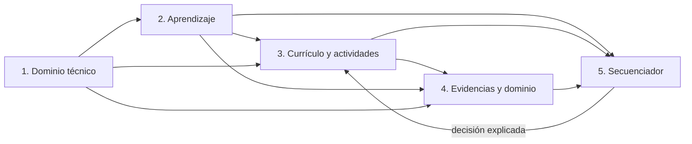

# Aprender — arquitectura pedagógica y de conocimiento

Estado: arquitectura base 0.6.0 ampliada y materializada transversalmente en Academia 0.7.0; pendiente de calibración con alumnado y revisión experta.  
Fecha de revisión: 2026-07-29.  
Alcance: arquitectura pedagógica, secuenciación, evaluación y presentación del conocimiento.  
Fuera de alcance de este documento: redactar el curso completo, copiar programas institucionales o certificar destrezas físicas. Este informe describe contratos que pueden materializarse en código, pero no sustituye su validación.

## 1. Decisión ejecutiva

La Academia debe dejar de tratar una ruta como una lista de páginas y actividades y pasar a tratarla como un sistema de aprendizaje verificable.

La decisión central es separar cinco grafos relacionados, pero con responsabilidades y autoridades distintas:

1. **grafo técnico del dominio**: qué piezas, relaciones, funciones, medidas y fuentes existen;
2. **grafo de aprendizaje**: qué conceptos y competencias debe construir una persona, con qué prerrequisitos y errores previsibles;
3. **grafo curricular y de actividades**: dónde se introduce, demuestra, practica, recupera, transfiere y evalúa cada conocimiento;
4. **grafo de evidencias del alumno**: qué ha hecho realmente, con qué ayuda, en qué momento y qué dominio permite inferir;
5. **secuenciador determinista**: qué conviene enseñar, practicar, remediar, revisar o transferir a continuación y por qué.

No se deben fusionar:

- una relación verdadera entre piezas no es un prerrequisito pedagógico;
- haber visitado una lección no demuestra un concepto;
- acertar una opción no demuestra una destreza de servicio;
- una recomendación del secuenciador no modifica la verdad técnica;
- una simulación 3D no certifica habilidad manual ni física validada.

La primera regla editorial y de runtime será:

> Ninguna actividad evaluable puede exigir un concepto que no haya sido previamente introducido, demostrado y practicado, salvo que se declare de forma explícita como diagnóstico sin calificación ni bloqueo.

La experiencia recomendada para una unidad nueva será:

```text
orientar y activar conocimientos previos
→ explicar
→ demostrar
→ practicar con guía
→ explicar con palabras propias
→ recuperar sin ayuda
→ aplicar o transferir
→ recibir feedback y remediación
→ programar una revisión posterior
```

No todas las pantallas tienen que representar una fase distinta, pero el contrato de contenido debe poder demostrar que las fases necesarias existen y aparecen en el orden correcto.

## 2. Auditoría del estado actual

### 2.1 Lo que ya es una base válida

Los Sistemas 0–4UX.3 proporcionan una base técnica considerable:

- contenido declarativo, versionado e instalable;
- rutas, módulos, lecciones, actividades, escenas, glosario y fuentes;
- prerrequisitos declarados en conceptos y lecciones;
- sesiones, eventos, evidencias y evaluación reproducible;
- estados de dominio `not_started`, `introduced`, `practising`, `demonstrated` y `retained`;
- restauración de escenas y ausencia de mutación silenciosa de `WatchProject`;
- modelos conceptuales separados de 2035 y 8215;
- movimiento coordinado por relaciones, no por animaciones aisladas;
- selección, aislamiento, transparencia, explosionado, pausa, timeline y movimiento reducido;
- alternativa textual y acciones sin depender únicamente del arrastre;
- persistencia local y funcionamiento sin conexión;
- procedencia y fidelidad G/K/P.

La corrección 4UX.3 también resolvió una parte del problema: una ruta nueva ya abre una explicación antes de la primera práctica y Taller mantiene la exploración libre separada. Esto era necesario, pero no suficiente.

### 2.2 Problemas pedagógicos observados

#### Granularidad insuficiente del conocimiento en la línea base auditada

La versión auditada antes de esta revisión utilizaba `concept.horology.functional-chain` como concepto prácticamente único para seis lecciones distintas de `horology-foundations`. Bajo ese nodo aparecían, entre otros contenidos:

- reloj completo frente a movimiento;
- caja, esfera y agujas;
- energía;
- control o regulación;
- transmisión;
- indicación;
- estructura;
- cadena mecánica;
- cadena de cuarzo;
- equivalencias;
- procedencia;
- predicción de fallos.

Es demasiado contenido para una sola unidad de conocimiento. El sistema no puede saber qué parte está comprendida, cuál falta ni qué explicación debe recuperar. El piloto `wplab.horology.functional-map@0.2.0` ya separa esta línea base en ocho conceptos y sirve para ensayar la migración; ocho nodos siguen siendo una primera descomposición, no la taxonomía definitiva descrita en la sección 13.

#### Sobrecarga en la primera lección

`block.horology.system` declara que no presupone vocabulario, pero introduce en una sola lectura el reloj completo, cinco roles funcionales, múltiples piezas, relaciones, calibre, platina, puente, transmisión y regulación. La explicación es técnicamente razonable; la carga inicial y la ausencia de escalones intermedios son el problema.

#### Evaluación más amplia que la evidencia

`activity.horology.classify-subsystems` produce evidencia para la competencia de identificar subsistemas funcionales, aunque el ítem visible pide clasificar únicamente el tren de ruedas entre tres opciones. Ese acierto demuestra reconocimiento de un caso, no clasificación general de los subsistemas.

La actividad se denomina `prediction`, pero su respuesta es una clasificación. Tipo de actividad, conducta observable, evidencia y competencia deben describir el mismo acto.

#### Pistas que pueden sustituir el aprendizaje

La actividad actual permite antes del primer intento:

- una pista que nombra el subsistema;
- otra que indica directamente que el tren pertenece a transmisión;
- una pista cercana a la respuesta.

Las pistas son útiles para aprender, pero una respuesta obtenida después de revelar la solución no puede sostener la misma inferencia de dominio que una respuesta independiente. La ayuda debe registrarse y conducir después a una recuperación equivalente sin ayuda.

#### Contextos visuales no alineados

La estrategia visual de la primera lección referencia el cuarzo conceptual mientras su actividad utiliza el movimiento mecánico conceptual. Ambos recursos son válidos, pero el cambio debe tener propósito comparativo explícito. Para una persona novel, un cambio silencioso de topología añade carga irrelevante.

#### Conocimiento previo supuesto

La lección «Lo que ya conoces por el ISA 8172» puede resultar útil para una persona con experiencia previa, pero no es un fundamento universal. Debe ser una conexión opcional detectada por el diagnóstico o elegida por el usuario, no un paso obligatorio de la ruta base.

#### Lenguaje técnico presentado como interfaz primaria

La terminología profesional debe conservarse, pero el primer nivel de la interfaz debe explicar la acción y el significado. Códigos internos, G/K/P, nombres de contratos y etiquetas de ingeniería pertenecen a una segunda capa consultable.

Ejemplo:

- primario: «Forma simplificada; las piezas giran de manera coordinada; no se simula la fricción»;
- detalle: `G1/K2/P0`.

#### El 3D todavía puede funcionar como objeto, no como explicación

Aunque las piezas ya contacten y reaccionen, una escena no enseña por el mero hecho de moverse. Debe dirigir la atención, fijar un punto de partida, mostrar causa y consecuencia, permitir controlar el ritmo, volver al conjunto y pedir una acción cognitiva relacionada con el objetivo.

### 2.3 Diagnóstico

El fallo no es falta de contenido en términos absolutos. Existe mucha información, pero está comprimida en nodos demasiado grandes y su presentación no siempre distingue:

- haber visto;
- reconocer;
- explicar;
- predecir;
- ejecutar una secuencia;
- diagnosticar;
- transferir a otro calibre;
- retener después de un intervalo.

La arquitectura debe hacer explícitas esas diferencias antes de ampliar el currículo.

### 2.4 Estado de materialización observado

Esta es una fotografía verificable del repositorio tras la migración pedagógica 0.2.0; no equivale a validar la eficacia educativa con alumnado:

| Área | Materializado en el worktree | Pendiente de calibración o revisión humana |
|---|---|---|
| Modelo de conocimiento | Los cuatro paquetes reales declaran 57 conceptos con tipo de conocimiento, prerrequisitos, lección puente y nivel objetivo de evidencia | Modelar formalmente las concepciones alternativas y revisar la granularidad con especialistas y personas noveles |
| Contrato de lección | Las 43 lecciones declaran entrada, conceptos introducidos/reforzados, puentes y función pedagógica; la lectura se divide en pasos controlados por la persona | Revisar editorialmente los valores inferidos durante la migración y probar longitud, lenguaje y carga cognitiva |
| Contrato de actividad | Las 96 actividades reales declaran propósito, intención evaluativa, ayuda, remediación, evidencia y límite físico | Sustituir gradualmente los ítems de elección simple por ejecución, explicación y transferencia donde la competencia lo exija |
| Validación | El linter comprueba ciclos, orden completo de ruta, enseñanza previa, evaluación prematura, selección única insuficiente y evidencia alcanzable | Añadir reglas de cobertura por concepto y mantener pruebas negativas al ampliar el esquema |
| Presentación | La lectura conserva progreso por segmento, divide también apartados extensos y muestra de forma visible si una actividad es formativa o puede aportar dominio | Verificar ventanas pequeñas, zoom, teclado, lector de pantalla y movimiento reducido con usuarios |
| Evidencia | Una respuesta correcta independiente conserva confianza 1; una correcta con pista queda limitada a 0,7 y registra incertidumbre 0,3 | Calibrar umbrales, recuperación independiente, contradicciones y caducidad con datos reales |
| Contenido migrado | `functional-map`, `quartz-miyota2035`, `mechanical-foundations` y `miyota8215` están en 0.2.0 y sus validaciones editoriales terminan sin diagnósticos | Revisión técnica y pedagógica de cada contrato; una migración consistente no sustituye una aprobación editorial |
| Secuenciador | La ruta abre explicación antes de práctica, conserva recuperación y usa prerrequisitos explícitos para justificar el punto de partida | Completar el algoritmo versionado de remediación, revisión espaciada y transferencia |

La verificación automatizada acredita coherencia estructural, no aprendizaje. Las reglas de dominio, los intervalos de repaso y la cantidad de ayuda continúan siendo hipótesis que deben calibrarse con principiantes, personas con experiencia y pruebas de accesibilidad.

## 3. Fuentes institucionales

Los programas consultados no se copian ni se presentan como equivalentes a la futura Academia. Se utilizan para contrastar dependencias y prácticas recurrentes.

### 3.1 WOSTEP

El programa público progresa desde Watch Technician a Customer Service Watchmaker y, finalmente, Watchmaker. Sus temas públicos incluyen historia, taller, herramientas, micromecánica, preparación de herramientas, conocimiento de movimientos, intervenciones externas e internas, análisis, movimientos mecánicos y electrónicos, servicio, escape, órgano regulador, cronógrafo, cronometría y fabricación.

WOSTEP afirma que la teoría se enseña a medida que avanza el trabajo de banco. No publica el orden diario, el reparto de horas por concepto ni sus rúbricas completas; no deben inventarse.

Fuentes:

- [Watchmaker Program](https://www.wostep.ch/en/training/watchmaker-program)
- [WOSTEP Watchmaker I+II+III, brochure pública](https://www.wostep.ch/sites/default/files/2025-12/P05-Watchmaker_brochure_en.pdf)
- [WOSTEP Customer Service Watchmaker I+II, brochure pública](https://www.wostep.ch/sites/default/files/2026-03/P04-CS-Watchmaker_brochure_en_0.pdf)

### 3.2 British Horological Institute

El Technician Grade público contiene doce lecciones y cinco hilos paralelos: conocimiento, destrezas de taller, servicio de relojes, servicio de relojes de pulsera y ejercicio práctico. La primera lección publicada empieza por historia y tipos de relojes, oscilación, divisiones básicas del movimiento, observación de un reloj sencillo, seguridad, herramientas y práctica. El servicio comienza más adelante.

Cada lección contiene preguntas y ejercicio práctico, con posibilidad de feedback de un tutor. El modelo apoya una arquitectura donde teoría, vocabulario, seguridad y aplicación progresan juntos.

Fuentes:

- [Distance Learning Course — Technician Grade](https://bhi.co.uk/courses/dlctg)
- [Introducción y lección 1 públicas](https://bhi.co.uk/wp-content/uploads/2023/01/Binder1-combined-intro-and-lesson-1.pdf)
- [Unidades de examen BHI/EAL](https://bhi.co.uk/examinations)

### 3.3 AWCI

La secuencia que AWCI recomienda como preparación de competencias para CW21 empieza por introducción y servicio básico, incorpora teoría, automático, caja y estanqueidad, cuarzo, cronógrafo, volante y marcha, escape, micromecánica y cronometría. AWCI advierte que una secuencia de cursos no sustituye práctica, mentoría ni comprobación de competencias.

Su curso inicial público combina nomenclatura, documentación técnica, limpieza, lubricación, juegos, regulación, marcha, esfera, agujas y encajado. Es una evidencia a favor de relacionar teoría con el reloj completo.

Fuente:

- [AWCI Course Catalog](https://www.awci.com/educationcareers/awci-course-catalog/)

### 3.4 SAWTA y North Seattle College

El programa público de North Seattle, basado en SAWTA, declara micromecánica, fabricación sencilla, servicio, escape, espiral y cronometría. Su progresión de movimientos empieza por cuerda manual y continúa con cuarzo, automático y cronógrafo automático. También incluye esfera, agujas, caja, estanqueidad, acabados, presupuestos y atención al cliente.

Fuentes:

- [Watch Technology Institute](https://northseattle.edu/programs/watch-technology-institute)
- [WTI FAQ](https://northseattle.edu/programs/watch-technology-institute/faq)

### 3.5 Paris Junior College

El catálogo 2026–2027 empieza por desmontaje, limpieza, montaje y nomenclatura de un reloj básico. Continúa con funciones comunes, caja, espiral, reparación, escape, rubíes, regulación, calendario y automático. Cronógrafos y sistemas electrónicos aparecen después.

Su posición del cuarzo difiere de BHI y North Seattle. Esta diferencia confirma que no existe una única secuencia institucional universal.

Fuente:

- [Paris Junior College Degree Catalog 2026–2027](https://www.parisjc.edu/academics/catalog/docs/PJC-DegreeCatalog26-27.pdf)

### 3.6 NAWCC

El taller introductorio de pulsera publicado en 2026 comienza con banco y herramientas, continúa con el funcionamiento del movimiento y después guía desmontaje, limpieza, montaje, lubricación y ajuste sobre un movimiento manual.

NAWCC ofrece actualmente talleres y recursos; sus páginas públicas no describen un currículo acreditado comparable a WOSTEP o BHI. No debe atribuirse a NAWCC una secuencia que no haya publicado.

Fuentes:

- [Introduction to Wristwatch Servicing](https://www.nawcc.org/event/introduction-to-wristwatch-servicing/)
- [NAWCC School of Horology](https://www.nawcc.org/education/)

### 3.7 Consenso y diferencias

Hay consenso institucional suficiente para adoptar:

- vocabulario, contexto y herramientas antes del diagnóstico especializado;
- mecanismos simples antes de automático, calendario y cronógrafo;
- teoría vinculada a demostración o práctica;
- repetición del ciclo de observar, desmontar, inspeccionar, montar y verificar con complejidad creciente;
- inclusión del reloj completo, no solo del movimiento;
- evaluación de conocimiento y ejecución, no solo asistencia.

No hay consenso suficiente para imponer como verdad universal:

- la posición exacta del cuarzo;
- cuánta historia debe preceder a la práctica;
- si micromecánica debe ser troncal para todas las personas;
- el reparto exacto entre teoría y banco;
- umbrales o duraciones concretas de dominio.

### 3.8 Libro técnico entregado

Se revisó el PDF privado `Horologia_completa_OCR_ligera_100MB.pdf` como fuente técnica de apoyo. Las secciones observadas cubren, entre otros temas, taller, ruedas y piñones, escapes, muelles reales y diseño de movimientos. Su profundidad lo hace útil para:

- contrastar vocabulario, relaciones y explicaciones técnicas;
- localizar conocimientos previos ocultos en una actividad;
- preparar claims que después deben vincularse a página, edición y alcance;
- detectar cuándo una representación educativa simplifica demasiado un mecanismo.

Su organización, orientada en buena parte a construcción y fabricación, no se adopta como orden inicial para una persona novel. Una fuente técnica y una secuencia pedagógica tienen funciones distintas.

El archivo es una fuente privada proporcionada para este proyecto. No se copiarán texto, tablas ni imágenes al contenido distribuible hasta registrar titularidad, licencia, edición, páginas utilizadas y permiso de almacenamiento o transformación. Las traducciones, ilustraciones derivadas y fragmentos OCR también requieren esa trazabilidad.

## 4. Ciencia del aprendizaje y consecuencias de diseño

Las fuentes de esta sección no son investigaciones específicas sobre Watch Prototype Lab. Justifican mecanismos generales; sus parámetros deben calibrarse con personas que aprendan relojería en esta aplicación.

| Hallazgo | Tipo de evidencia | Decisión implementable | Cautela |
|---|---|---|---|
| El conocimiento previo del dominio se relaciona con el aprendizaje posterior. [Simonsmeier et al., 2022](https://doi.org/10.1080/00461520.2021.1939700) | Metaanálisis | Diagnóstico inicial, prerrequisitos atómicos y rutas de entrada distintas | El diagnóstico no debe convertirse en examen de acceso |
| Un preentrenamiento en nombres, posiciones y funciones básicas puede facilitar la comprensión posterior de una explicación causal. [Mayer et al., 2002](https://doi.org/10.1037/1076-898X.8.3.147) | Estudios experimentales de preentrenamiento multimedia | Presentar pieza, término y papel antes de pedir que se siga el mecanismo completo | Preentrenar no significa adelantar toda la teoría ni evaluar vocabulario aislado como competencia final |
| La guía que ayuda a una persona novel puede volverse redundante para una experta. [Kalyuga, 2007](https://doi.org/10.1007/s10648-007-9054-3) | Revisión de evidencia sobre expertise reversal | Modos guiado, asistido y libre; posibilidad de demostrar prerrequisitos | No asumir nivel por tiempo de uso o autodeclaración |
| Los ejemplos resueltos y la retirada progresiva de ayuda pueden favorecer habilidades complejas iniciales. [Moreno, Reisslein y Ozogul, 2009](https://doi.org/10.1002/j.2168-9830.2009.tb01007.x) | Estudio experimental en ingeniería | Ejemplo completo → ejemplo parcial → ejecución independiente | El ritmo de retirada no debe ser fijo para toda persona |
| Alternar ejemplos resueltos con pasos que el alumno debe completar puede favorecer el aprendizaje frente a retirar toda la ayuda de golpe. [Atkinson, Renkl y Merrill, 2003](https://doi.org/10.1037/0022-0663.95.4.774) | Estudios experimentales sobre desvanecimiento de ejemplos | Hacer explícitos `guided`, `faded` e `independent` en la actividad | Completar un paso todavía es práctica asistida y no equivale a ejecución independiente |
| Recuperar información puede mejorar la retención a largo plazo frente a releer. [Roediger y Karpicke, 2006](https://doi.org/10.1111/j.1467-9280.2006.01693.x) | Dos experimentos | Comprobaciones de recuperación posteriores a la enseñanza | Una pregunta de primera exposición no es recuperación |
| Distribuir oportunidades de práctica beneficia la retención, pero el intervalo óptimo depende del intervalo de retención. [Cepeda et al., 2006](https://doi.org/10.1037/0033-2909.132.3.354) | Metaanálisis | Cola de revisiones y evidencia `retentionDueAt` | No fijar todavía un calendario universal |
| La autoexplicación ayuda a relacionar pasos con principios. [Chi et al., 1989](https://doi.org/10.1207/s15516709cog1302_1) | Estudio de protocolos y resolución | Pedir «por qué» y «qué relación lo demuestra» después de ejemplos | Una explicación libre puede necesitar revisión humana |
| El feedback formativo debe ser específico, oportuno y orientado a la tarea. [Shute, 2008](https://doi.org/10.3102/0034654307313795) | Revisión de investigación | Feedback por error, evidencia y siguiente acción | «Correcto/incorrecto» no basta; revelar demasiado pronto tampoco |
| Segmentar una animación y permitir controlar el ritmo puede mejorar la transferencia. [Mayer y Chandler, 2001](https://doi.org/10.1037/0022-0663.93.2.390) | Dos experimentos | Pausa, paso, scrub y segmentos con propósito | El control debe ser comprensible y no añadir complejidad innecesaria |
| La animación puede superar a una imagen estática especialmente cuando representa un proceso, pero no lo hace automáticamente. [Höffler y Leutner, 2007](https://doi.org/10.1016/j.learninstruc.2007.09.013) | Metaanálisis | Usar movimiento para cambio, contacto y causalidad; ofrecer estados estáticos | No usar animación como decoración ni sustituto de explicación |
| Una secuencia de diagramas estáticos puede ser superior a una animación cuando permite comparar estados sin depender de la memoria transitoria. [Estudio indexado en PubMed, PMID 16393035](https://pubmed.ncbi.nlm.nih.gov/16393035/) | Estudio comparativo | Ofrecer estados clave y esquema 2D junto al movimiento | No asumir que más movimiento implica más comprensión |
| La proximidad entre representación y explicación reduce búsqueda visual innecesaria. [Johnson y Mayer, 2012](https://doi.org/10.1037/a0026923) | Estudio con seguimiento ocular | Etiquetas y feedback junto a la pieza o relación relevante | Evitar saturar el viewport con etiquetas simultáneas |
| Los programas de mastery learning pueden mejorar resultados, pero pueden aumentar tiempo y reducir finalización en algunos contextos autoorganizados. [Kulik, Kulik y Bangert-Drowns, 1990](https://doi.org/10.3102/00346543060002265) | Metaanálisis | Dominio por evidencias y remediación, sin una nota total opaca | Vigilar abandono y no convertir cada detalle en bloqueo |
| La actividad constructiva e interactiva exige más procesamiento que mirar pasivamente. [Chi y Wylie, 2014](https://doi.org/10.1080/00461520.2014.965823) | Marco teórico respaldado por literatura | El 3D debe pedir predecir, seleccionar, ordenar, explicar o comparar | Mover la cámara o hacer clic no garantiza actividad cognitiva |

Como marco de diseño inclusivo se adopta [CAST Universal Design for Learning Guidelines 3.0](https://udlguidelines.cast.org/): activar o aportar conocimientos previos, aclarar vocabulario, representar mediante varios medios, graduar apoyos y hacer visible el progreso. UDL orienta opciones y barreras; no autoriza a rebajar el constructo que se evalúa.

### 4.1 Síntesis aplicada

La arquitectura adopta estas decisiones:

- detectar carencias antes de prescribir una actividad;
- enseñar antes de evaluar;
- mostrar un ejemplo antes de pedir una ejecución compleja;
- retirar ayuda de forma visible;
- recuperar conocimientos en otra ocasión;
- dar feedback sobre el modelo mental, no solo sobre la opción;
- usar 3D cuando aporta relaciones espaciales, cambio o causalidad;
- mantener vías equivalentes en texto y 2D;
- adaptar la guía al conocimiento demostrado, no a una etiqueta de «principiante» o «experto».

No adopta como hechos:

- una duración ideal de lección;
- un número ideal de pistas;
- una secuencia temporal fija de revisión;
- que 3D sea siempre mejor que 2D;
- que una puntuación única mida la competencia relojera.

## 5. Arquitectura de cinco grafos



Las flechas representan consulta o vinculación, no propiedad compartida.

### 5.1 Grafo 1 — dominio técnico

**Autoridad:** modelo canónico, ledgers, relaciones, fuentes y resultados técnicos vigentes.

**Nodos principales:**

- movimiento, familia y calibre;
- definición e instancia de pieza;
- subsistema;
- interfaz;
- dimensión, observación y medición;
- claim técnico;
- fuente y capa derivada.

**Relaciones principales:**

- `part-of`;
- `supports`;
- `pivots-in`;
- `meshes-with`;
- `drives`;
- `locks`;
- `releases`;
- `impulses`;
- `winds`;
- `sets`;
- `retains`;
- `covers`;
- `fastened-by`;
- `remove-before`;
- `inspect-before`;
- `supported-by-source`;
- `measured-on-instance`.

Cada nodo o relación conserva identidad, alcance, procedencia, limitaciones y G/K/P cuando corresponda.

**No contiene:**

- estado de dominio de un alumno;
- orden de una lección;
- dificultad pedagógica;
- puntos o premios;
- recomendaciones.

Una verdad técnica puede sostener varios enfoques pedagógicos sin duplicarse.

### 5.2 Grafo 2 — aprendizaje

**Autoridad:** definición pedagógica versionada.

**Nodos de conocimiento:**

- entidad o vocabulario;
- función;
- relación;
- mecanismo o proceso;
- principio;
- procedimiento;
- medición;
- seguridad;
- diagnóstico;
- discriminación entre conceptos;
- error o concepción alternativa.

Un nodo debe ser lo bastante pequeño para:

- explicarse con una idea central;
- comprobarse con evidencia específica;
- tener prerrequisitos identificables;
- remediarse sin repetir una ruta completa.

**Relaciones:**

- `requires`;
- `part-of-concept`;
- `contrasts-with`;
- `example-of`;
- `applies-to`;
- `explains-domain-relation`;
- `misconception-of`;
- `corrected-by`;
- `transfers-to`.

Solo `requires` forma el DAG estricto de prerrequisitos. Las relaciones semánticas pueden contener ciclos.

**Competencias:**

Las competencias viven vinculadas al grafo de aprendizaje como resultados observables, no como conceptos:

- reconocer;
- localizar;
- distinguir;
- ordenar;
- explicar;
- predecir;
- medir;
- ejecutar;
- diagnosticar;
- justificar;
- transferir.

Una competencia declara condiciones, calidad esperada y evidencias admisibles. «Comprender el reloj» no es una competencia verificable; «explicar la cadena mecánica señalando fuente, transmisión, regulación e indicación» sí puede serlo.

**No contiene:**

- páginas o pantallas;
- intentos de una persona;
- valores técnicos duplicados;
- decisiones dinámicas de navegación.

### 5.3 Grafo 3 — currículo y actividades

**Autoridad:** paquete de contenido y su versión fijada a la sesión.

**Nodos:**

- currículo;
- ruta;
- módulo;
- lección;
- bloque;
- escena;
- ejemplo resuelto;
- actividad guiada;
- práctica;
- evaluación;
- revisión;
- transferencia;
- pista;
- remediación.

**Relaciones obligatorias con el grafo de aprendizaje:**

- `activates`;
- `introduces`;
- `demonstrates`;
- `practises`;
- `retrieves`;
- `assesses`;
- `transfers`;
- `remediates`.

El linter debe poder responder:

- dónde se introduce por primera vez cada concepto;
- qué ejemplo lo demuestra;
- dónde se practica con ayuda;
- cuál es su primera recuperación independiente;
- qué actividad lo evalúa;
- qué actividad demuestra transferencia;
- qué remediación corresponde a cada error.

**Reglas:**

1. Una evaluación no introduce conceptos.
2. `assesses` exige que todos sus `requires` tengan una oportunidad previa de práctica.
3. Una lección no puede declarar como prerrequisito el mismo concepto que introduce.
4. Una competencia amplia requiere varias evidencias o una tarea que cubra todos sus criterios.
5. Una pista que contiene la respuesta no está disponible antes de un intento auténtico.
6. Una escena debe declarar el papel cognitivo del 3D.
7. Toda actividad visual dispone de alternativa textual y de movimiento reducido.
8. La exploración libre puede ignorar el orden recomendado, pero no concede dominio por visita.

### 5.4 Grafo 4 — evidencias, dominio y retención

**Autoridad:** eventos e `EvidenceRecord` inmutables asociados al perfil local.

**Nodos:**

- sesión;
- intento;
- evento;
- respuesta;
- observación;
- procedimiento;
- artefacto;
- revisión humana;
- resultado de evaluación;
- proyección de dominio;
- revisión programada.

**Relaciones:**

- evidencia una competencia;
- evidencia un concepto;
- procede de una actividad y versión;
- utilizó una pista o ayuda;
- se produjo en una sesión;
- respalda, contradice o resulta inconcluyente;
- sustituye una proyección anterior, sin borrar la evidencia;
- programa una recuperación posterior.

Los estados existentes siguen siendo:

- `not_started`;
- `introduced`;
- `practising`;
- `demonstrated`;
- `retained`.

`retentionDueAt` es una fecha de revisión de la proyección, no un sexto nivel de logro. Una revisión fallida añade evidencia contradictoria y puede modificar la confianza sin borrar la historia.

**Reglas de inferencia:**

- abrir una lección puede sostener `introduced`, nunca `demonstrated`;
- una opción múltiple sostiene reconocimiento del caso preguntado;
- una explicación requiere contenido causal mínimo o revisión;
- un procedimiento se evalúa con eventos, orden, comprobaciones y resultado;
- una competencia física exige evidencia física o humana;
- las adaptaciones de accesibilidad son contexto, no pistas;
- usar una pista cercana a la respuesta impide que ese mismo ítem sea evidencia independiente;
- `retained` exige otra ocasión y no una repetición inmediata idéntica;
- una evidencia de transferencia debe cambiar contexto, representación, movimiento o tipo de problema.

### 5.5 Grafo 5 — secuenciador determinista

**Autoridad:** algoritmo versionado. Recomienda; no cambia contenido ni verdad técnica.

**Entradas:**

- grafo de aprendizaje;
- currículo instalado;
- evidencias y dominio;
- sesiones recuperables;
- capacidades del dispositivo;
- idioma y preferencias de accesibilidad;
- contenido disponible sin conexión;
- objetivo elegido por el usuario.

**Salida mínima:**

```text
acción: enseñar | practicar | remediar | revisar | transferir | continuar | explorar
objetivo: concepto, competencia, lección o actividad
razones: reglas satisfechas o incumplidas
alternativas: otras acciones válidas
blocking: verdadero o falso
versión del algoritmo
```

**Prioridad recomendada:**

1. recuperar una sesión que la persona haya elegido continuar;
2. resolver un prerrequisito bloqueante;
3. remediar un error repetido o una concepción alternativa activa;
4. practicar un concepto solo introducido;
5. realizar una revisión vencida;
6. producir evidencia independiente para una competencia en práctica;
7. transferir una competencia demostrada;
8. continuar con la siguiente unidad curricular;
9. ofrecer exploración libre como alternativa, no como engaño curricular.

El secuenciador debe explicar «por qué aparece». Un futuro tutor contextual puede verbalizar esa razón, pero no sustituir la regla determinista.

## 6. Contratos pedagógicos

Los nombres siguientes son normativos en significado; la forma exacta del esquema puede adaptarse al versionado del contenido.

La materialización aditiva actual usa esta correspondencia:

| Decisión del informe | Campo actual |
|---|---|
| Tipo y meta del concepto | `knowledgeType`, `targetEvidenceLevel` |
| Prerrequisito bloqueante o recomendado | `prerequisiteIds`, `recommendedPrerequisiteIds` |
| Puente y error relacionado | `bridgeLessonId`, `misconceptionIds` |
| Función de la lección | `pedagogy.role`, `entryCheck`, `userPacedSegments` |
| Lo que la lección aporta | `introducesConceptIds`, `reinforcesConceptIds`, `bridgeConceptIds` |
| Función e intención de una actividad | `pedagogicalContract.purpose`, `assessmentIntent` |
| Lo requerido, enseñado, demostrado, practicado o evaluado | `requiresConceptIds`, `introducesConceptIds`, `demonstratesConceptIds`, `practicesConceptIds`, `assessesConceptIds` |
| Calidad de la evidencia y ayuda | `evidenceLevel`, `supportLevel` |
| Próxima ayuda específica | `remediation` |
| Límite de inferencia | `physicalBoundary` |

Este esquema es un mínimo ejecutable. No debe confundirse un valor generado automáticamente durante una migración con una decisión editorial revisada.

### 6.1 Contrato de concepto

| Campo | Requisito |
|---|---|
| `id`, `version` | Identidad estable y SemVer |
| `title` | Nombre comprensible en el idioma de la persona |
| `technicalTerms` | Equivalencias profesionales ES/EN y sinónimos |
| `kind` | Entidad, función, relación, mecanismo, principio, procedimiento, medida, seguridad, diagnóstico o discriminación |
| `plainDefinition` | Definición breve sin utilizar términos aún no introducidos |
| `scope` | Qué incluye |
| `nonExamples` | Casos parecidos que no pertenecen al concepto |
| `prerequisites` | Concepto y estado mínimo requerido |
| `domainRefs` | Selectores o relaciones del grafo técnico |
| `misconceptionIds` | Errores frecuentes explícitos |
| `sourceIds` | Fuentes y claims que lo sustentan |
| `fidelityScope` | Qué G/K/P basta para mostrarlo |
| `competencyIds` | Resultados observables asociados |

Un concepto no contiene progreso ni una definición técnica inventada por conveniencia pedagógica.

### 6.2 Contrato de concepción alternativa

Cada error recurrente debe declarar:

- afirmación o conducta observable;
- concepto correcto afectado;
- causa plausible sin atribuir intenciones;
- evidencia que permite detectarlo;
- contraejemplo o comparación útil;
- remediación;
- actividad de recuperación posterior.

Ejemplo:

- error: «si una pieza no gira, no participa en el funcionamiento»;
- detección: clasificar un puente como irrelevante;
- remediación: aislar un pivote, retirar visualmente su apoyo y observar la interrupción;
- recuperación: identificar en otro calibre una pieza estructural que condiciona el movimiento.

### 6.3 Contrato de competencia

Una competencia debe declarar:

- verbo observable;
- objeto y alcance;
- condiciones;
- tolerancia o criterio de calidad;
- nivel de ayuda permitido;
- tipos de evidencia admisibles;
- número de contextos o sesiones si procede;
- límite digital/físico;
- conceptos y competencias previas;
- actividad de transferencia.

No se utilizarán competencias como «conocer», «entender» o «familiarizarse» sin traducirlas a conducta observable.

### 6.4 Contrato de lección

Toda lección declara:

- audiencia y punto de entrada;
- `requires`;
- `activates`;
- `introduces`;
- `demonstrates`;
- `practises`;
- conceptos que solo menciona y no enseña;
- objetivo en lenguaje sencillo;
- ejemplo resuelto;
- estrategia visual y papel del 3D;
- explicación textual equivalente;
- comprobación de salida no punitiva;
- errores esperados y remediaciones;
- fuentes y alcance de fidelidad;
- siguiente conexión.

La lección no debe obligar a una única composición visual. Lectura, esquema, 3D y lista accesible son representaciones coordinadas del mismo objetivo.

### 6.5 Contrato de actividad

| Campo | Decisión |
|---|---|
| `purpose` | Diagnóstico, ejemplo guiado, práctica, evaluación, revisión o transferencia |
| `requires` | Prerrequisitos y estado mínimo |
| `practises` | Conceptos o competencias ejercitados |
| `assesses` | Alcance exacto de la inferencia; vacío si no evalúa |
| `introduces` | Permitido en diagnóstico guiado o práctica; vacío en evaluación |
| `responseModel` | Respuesta que corresponde a la conducta |
| `assistancePolicy` | Ayudas, disponibilidad y consecuencia sobre evidencia |
| `feedbackPolicy` | Feedback por error y siguiente acción |
| `evidencePolicy` | Eventos, datos, privacidad y revisión |
| `transferDistance` | Misma representación, variante cercana o contexto nuevo |
| `physicalBoundary` | Digital, procedimiento simulado o evidencia física necesaria |
| `accessibilityEquivalence` | Alternativas que evalúan la misma competencia |
| `restoration` | Estado recuperado al cancelar o terminar |

Una actividad no puede llamarse «predicción» si únicamente solicita reconocer una etiqueta.

### 6.6 Contrato de ayuda

Niveles recomendados:

1. recordar el objetivo;
2. dirigir la atención a una zona;
3. recordar una relación relevante;
4. mostrar un ejemplo análogo;
5. reducir opciones o completar parte del procedimiento;
6. explicar la solución después de un intento.

Reglas:

- los niveles no tienen que ser seis en todas las actividades;
- una pista cercana a la respuesta requiere al menos un intento;
- el alumno sabe qué efecto tendrá la ayuda sobre la evidencia;
- después de una solución explicada se programa un ítem equivalente independiente;
- una adaptación de acceso nunca se clasifica como ayuda.

## 7. Secuencia recomendada de conocimientos

Esta secuencia es el tronco común de la Academia. No reproduce un programa institucional y no sustituye el currículo editorial detallado.

### Nivel 0 — orientación

1. Qué puede enseñar la Academia y qué necesita práctica física.
2. Objetivo elegido: comprender, mantener, diagnosticar, diseñar o explorar.
3. Diagnóstico breve, opcional y sin nota.
4. Cómo leer fuentes, límites y fidelidad.

### Nivel 1 — reloj completo y lenguaje básico

1. Qué hace observable un reloj.
2. Reloj completo frente a movimiento.
3. Caja, cristal, corona, esfera, agujas y movimiento.
4. Pieza, conjunto, interfaz y subsistema.
5. Nombres sencillos primero; término profesional ES/EN como segunda capa.

### Nivel 2 — seguridad, herramientas y método

1. Banco, iluminación, aumento, postura y orden.
2. Manipulación y almacenamiento de piezas.
3. Función y mantenimiento básico de destornilladores, pinzas y soportes.
4. Riesgos de muelles, pilas, electricidad, productos y estanqueidad.
5. Documentar antes de actuar.

La práctica digital puede enseñar decisiones y consecuencias; no acredita destreza manual.

### Nivel 3 — mapa funcional

Cada función se introduce por separado y después se integra:

1. fuente o almacenamiento de energía;
2. control temporal o regulación;
3. transmisión;
4. indicación;
5. estructura y protección.

Después:

- ejemplos resueltos;
- contrastes;
- piezas con más de un papel;
- piezas inmóviles esenciales;
- clasificación guiada;
- recuperación independiente.

### Nivel 4 — piezas y relaciones de movimiento

1. rueda;
2. piñón;
3. árbol;
4. pivote;
5. rubí o apoyo;
6. platina y puente;
7. contacto y engrane;
8. conductor y conducido;
9. sentido de giro;
10. relación de dientes, velocidad y par en nivel conceptual;
11. piezas solidarias en un mismo árbol;
12. diferencia entre transmitir y regular.

### Nivel 5 — movimiento mecánico conceptual

1. muelle real y almacenamiento;
2. barrilete y entrega;
3. tren;
4. rueda de escape;
5. áncora;
6. volante y espiral;
7. bloqueo, liberación e impulso;
8. minutería e indicación;
9. puesta en hora como cadena distinta;
10. reloj ensamblado, sección y vista explosionada.

### Nivel 6 — movimiento de cuarzo conceptual

1. pila;
2. referencia de cuarzo y control;
3. circuito;
4. bobina;
5. rotor paso a paso;
6. tren;
7. indicación;
8. puesta en hora;
9. correspondencias y diferencias con el movimiento mecánico.

La comparación conceptual aparece pronto. El orden por defecto mecánico → cuarzo es una hipótesis inicial basada en visibilidad causal y en la progresión pública de North Seattle; debe calibrarse.

### Nivel 7 — observación, procedencia y medición

1. observar frente a inferir;
2. dato nominal oficial;
3. posición deducida;
4. reconstrucción estimada;
5. observación de una unidad;
6. medición de una unidad;
7. simulación educativa;
8. desconocido;
9. instrumento, resolución, incertidumbre y repetición;
10. G/K/P en lenguaje comprensible.

### Nivel 8 — ciclo de servicio

1. recepción y comprobación inicial;
2. identificación y documentación;
3. asegurar o descargar la energía;
4. plan de desmontaje;
5. herramientas y bandejas;
6. desmontaje;
7. inspección;
8. limpieza como proceso;
9. lubricación como mapa y límite;
10. montaje;
11. comprobaciones por subsistema;
12. esfera, agujas y encajado;
13. control final y estanqueidad;
14. expediente y trazabilidad.

### Nivel 9 — primera práctica integral

Un movimiento manual conceptual o de entrenamiento debe preceder a los módulos añadidos:

- ejemplo completo;
- desmontaje guiado;
- montaje con pasos parcialmente omitidos;
- montaje independiente;
- error controlado;
- transferencia a una variante.

### Nivel 10 — escape y marcha

1. secuencia del escape;
2. amplitud;
3. beat error;
4. marcha;
5. posiciones;
6. señales de fricción o energía insuficiente;
7. límites entre observación, analítica y física.

### Nivel 11 — MIYOTA 2035

1. identidad y documentación oficial;
2. arquitectura real frente al modelo conceptual;
3. pila, circuito, bobina, rotor, tren, minutería e indicación;
4. inspección y pruebas eléctricas conceptuales;
5. desmontaje y montaje permitidos por el nivel de reconstrucción;
6. síntomas, pruebas y evidencia;
7. límites R2/R3 y ausencia de R4.

### Nivel 12 — MIYOTA 8215

1. núcleo manual ya conocido;
2. automático;
3. calendario;
4. capas y puentes;
5. secuencia de servicio;
6. marcha;
7. diagnóstico;
8. comparación posterior con familia 82.

### Nivel 13 — diagnóstico

El bucle común será:

```text
síntoma
→ subsistema posible
→ hipótesis
→ evidencia necesaria
→ prueba segura
→ resultado
→ conclusión o nueva hipótesis
→ verificación final
```

No se enseña diagnóstico como adivinación visual. Primero debe conocerse el comportamiento correcto.

### Nivel 14 — especializaciones

- caja y estanqueidad;
- precisión avanzada;
- cronógrafos;
- complicaciones;
- micromecánica y fabricación;
- restauración y conservación;
- proyecto técnico;
- metrología avanzada.

## 8. Patrón de presentación

### 8.1 Una lección inicial

La primera experiencia con un concepto debe contener:

1. una pregunta de orientación que no puntúa;
2. un anclaje en el reloj completo;
3. una explicación breve;
4. una demostración controlable;
5. un ejemplo resuelto;
6. una manipulación guiada;
7. una explicación del alumno;
8. una comprobación independiente;
9. feedback;
10. conexión con lo siguiente.

### 8.2 Lenguaje

Reglas:

- español cotidiano en el primer nivel;
- término técnico junto a él, no en sustitución;
- una misma entidad conserva el mismo nombre;
- evitar «fixture», «selector», «claim», IDs o códigos internos en la interfaz de aprendizaje;
- explicar G/K/P antes de usar sus códigos;
- verbos de acción claros: observar, poner en marcha, pausar, mostrar contacto, comprobar, restaurar;
- una instrucción principal por paso;
- textos extensos en ancho legible, no en columnas estrechas.

### 8.3 Progresión de la guía

```text
ver cómo se hace
→ completar una parte
→ hacerlo con pista opcional
→ hacerlo sin ayuda
→ explicarlo
→ aplicarlo en otro contexto
```

Una persona que ya demuestre la competencia puede saltar la guía, pero su evidencia debe ser equivalente.

## 9. Evaluación y dominio

### 9.1 Capas de evaluación

| Capa | Ejemplo | Inferencia máxima |
|---|---|---|
| Diagnóstico | «¿Qué crees que inicia el movimiento?» | Punto de partida, no dominio |
| Comprobación formativa | Elegir la función del tren después del ejemplo | Reconocimiento inmediato |
| Recuperación | Explicar la función sin volver a la lección | Recuerdo y comprensión del caso |
| Aplicación | Seguir una cadena distinta | Uso en variante cercana |
| Transferencia | Localizar la misma función en otro calibre | Generalización |
| Procedimiento | Desmontar, verificar y restaurar en orden seguro | Ejecución virtual |
| Evidencia física | Manipulación o medición real revisada | Competencia física dentro del alcance observado |

### 9.2 Proporcionalidad

- Una pregunta sobre el tren no concede la competencia «clasificar todos los subsistemas».
- Reconocer un nombre no concede «explicar».
- Ordenar tarjetas no concede «montar físicamente».
- Seguir una flecha no concede «diagnosticar».
- Una simulación no concede «validar ingeniería».

### 9.3 Dominio

La evaluación continúa siendo determinista y versionada.

Requisitos mínimos de arquitectura:

- evidencia independiente;
- varias conductas cuando la competencia sea compuesta;
- otra sesión para `retained`;
- posibilidad de evidencia contradictoria;
- regla y explicación visibles;
- no utilizar una puntuación global como sustituto del perfil;
- no penalizar accesibilidad;
- no premiar velocidad salvo que sea una competencia profesional explícita y validada.

Los números concretos de evidencias, puntuación, sesiones e intervalo pertenecen a reglas versionadas y deben calibrarse.

### 9.4 Confianza

Cuando sea útil, una respuesta puede incluir confianza:

- seguro;
- bastante seguro;
- dudoso.

La confianza no cambia la corrección. Permite detectar:

- error con exceso de confianza;
- acierto inseguro;
- mejora de calibración.

No se mostrará como rasgo personal ni se utilizará para etiquetar al alumno.

### 9.5 Frontera entre simulación y destreza física

| Evidencia disponible | Inferencia permitida | Inferencia prohibida |
|---|---|---|
| Identificar una pieza en texto, esquema o 3D | Reconocimiento de esa identidad en esa representación | Reconocer cualquier variante física |
| Seguir una cadena animada | Reconocer su orden y relaciones declaradas | Comprender automáticamente su dinámica o física |
| Ordenar desmontaje o montaje en el fixture | Conocer el orden virtual y sus restricciones modeladas | Manipular sin daño una unidad real |
| Ejecutar un procedimiento virtual sin ayuda | Competencia de simulación en ese procedimiento y versión | Competencia profesional de banco |
| Interpretar una lectura sintética | Interpretación del caso simulado | Usar, calibrar o leer correctamente el instrumento real |
| Subir fotografías, notas o medidas | Existencia de una observación física declarada | Calidad del gesto, veracidad o tolerancia sin revisión |
| Revisión humana trazable de una práctica física | Competencia física dentro del alcance y condiciones observadas | Certificación general fuera de ese alcance |

El sistema debe mostrar esta frontera antes de la práctica y en el resultado, no esconderla en una advertencia legal. La promoción de `independent-simulation` a `physical-observation` exige nueva evidencia; nunca se deriva por puntuación, tiempo de uso ni realismo gráfico.

## 10. Feedback y remediación

El feedback debe responder:

1. **qué ocurrió**;
2. **qué evidencia lo muestra**;
3. **qué relación o principio explica el resultado**;
4. **qué acción conviene hacer ahora**.

Ejemplo:

> Elegiste «energía». El tren no almacena la energía: recibe giro del barrilete y lo entrega a otras etapas. Observa los contactos resaltados entre rueda y piñón y vuelve a decidir entre transmisión e indicación.

No:

> Incorrecto. La respuesta es transmisión.

### 10.1 Tipos de error

- término desconocido;
- confusión entre dos funciones;
- orden causal invertido;
- pieza correcta en subsistema incorrecto;
- relación ausente;
- procedimiento inseguro;
- evidencia insuficiente;
- inferencia que excede la fidelidad;
- error motor o de acceso, que no es error conceptual.

### 10.2 Remediación

La remediación más pequeña que resuelva el error tiene prioridad sobre repetir toda la lección:

- definición con contraste;
- estado 3D antes/después;
- ejemplo análogo;
- paso resuelto;
- comparación entre dos piezas;
- revisión del prerrequisito;
- actividad equivalente posterior.

La explicación completa de la solución enseña; no demuestra dominio. Después debe existir una recuperación independiente.

## 11. Reglas para 3D, animación y simulación

### 11.1 Papel cognitivo obligatorio

Cada escena declara uno o varios papeles:

- orientación espacial;
- identidad de piezas;
- relación estructural;
- causalidad;
- cambio temporal;
- procedimiento;
- comparación;
- diagnóstico;
- metrología.

Si una imagen 2D o una lista explican mejor el objetivo, no se fuerza 3D.

### 11.2 Orden visual

1. mostrar el reloj o movimiento ensamblado;
2. nombrar el objetivo;
3. identificar el origen de energía;
4. resaltar solo la relación relevante;
5. reproducir un segmento;
6. permitir pausa, paso y scrub;
7. aislar o seccionar si es necesario;
8. volver al conjunto;
9. pedir una explicación o predicción.

La vista explosionada es un estado didáctico, no la posición funcional del mecanismo.

### 11.3 Contacto y causalidad

- los elementos que engranan deben mostrar contacto o declarar que es estimado;
- la transmisión activa, bloqueada, separada o desconocida debe distinguirse sin depender solo del color;
- al separar un contacto debe detenerse la cadena posterior;
- el origen y el recorrido deben poder seguirse paso a paso;
- el usuario debe saber si está viendo movimiento coordinado, física aproximada o una simple animación.

### 11.4 Control y atención

- pausa siempre visible;
- reproducción por segmentos;
- velocidad comprensible;
- paso a paso para escape y montaje;
- cámara estable durante una explicación;
- órbita libre como opción, no obligación;
- etiquetas próximas a la pieza y no superpuestas;
- una meta visual principal por escena;
- estado restaurable;
- nada se mueve solo para «dar vida» a la pantalla.

### 11.5 Alternativas

Toda escena incluye:

- lista o árbol de entidades;
- relaciones expresadas como texto;
- estado actual;
- acciones equivalentes;
- descripción del cambio;
- alternativa de movimiento reducido;
- esquema 2D cuando ayude;
- selección por teclado o controles, no solo sobre la malla.

### 11.6 Fidelidad

La explicación primaria traduce G/K/P:

- qué forma se conoce;
- qué movimiento está coordinado;
- qué física se calcula;
- qué se estima;
- qué falta.

Los códigos técnicos permanecen disponibles en detalle. Nunca se usa la fluidez de una animación como prueba de validez física.

## 12. Accesibilidad

La interfaz debe cumplir [WCAG 2.2 AA](https://www.w3.org/TR/WCAG22/) y aplicar [WCAG2ICT](https://www.w3.org/TR/wcag2ict-22/) al escritorio.

Reglas pedagógicas:

- la alternativa accesible enseña y evalúa la misma relación, no un resumen inferior;
- el color nunca es el único código;
- toda animación se pausa y dispone de movimiento reducido;
- toda acción de arrastre tiene alternativa;
- foco, orden y lectura siguen la secuencia pedagógica;
- el tamaño de texto, zoom y ancho de línea no rompen actividades;
- términos y unidades tienen pronunciación y expansión textual;
- tablas y grafos disponen de lista equivalente;
- las instrucciones no dependen de posición visual como «pulsa lo de la derecha»;
- los límites de tiempo son evitables salvo necesidad real;
- una adaptación no reduce la calificación.

Accesibilidad cognitiva:

- objetivos visibles;
- pasos numerados;
- lenguaje consistente;
- glosario contextual;
- posibilidad de volver al conjunto;
- estado de progreso comprensible;
- una acción principal;
- confirmación de restauración;
- explicación de por qué aparece una recomendación.

## 13. Migración de la primera ruta

### 13.1 Estado de partida

`route.horology.orientation` contiene un módulo, seis lecciones y un concepto de conocimiento demasiado amplio. La primera lección enlaza directamente con una actividad de clasificación.

La migración debe conservar:

- IDs históricos;
- versiones instaladas;
- sesiones en curso;
- eventos y evidencias;
- progreso reconstruible;
- acceso libre a Taller;
- fixtures conceptuales y reales;
- fuentes y claims.

### 13.2 Nuevo grafo mínimo

Dividir `concept.horology.functional-chain` en nodos al menos equivalentes a:

```text
watch-purpose
watch-vs-movement
external-anatomy
part-assembly-interface
functional-role
energy-source
regulation-or-control
transmission
indication
structure
wheel-pinion-arbor-pivot
gear-contact-and-direction
mechanical-functional-chain
quartz-functional-chain
functional-equivalence
system-interruption
source-provenance
educational-fidelity
```

El concepto anterior puede mantenerse como nodo agregador legado que apunta a los nuevos nodos; no debe seguir siendo la única unidad evaluable.

### 13.3 Nueva secuencia de la ruta

#### Módulo A — orientarse

1. Qué hace un reloj.
2. Reloj completo y movimiento.
3. Capas externas e internas.
4. Fuentes, modelos y límites.

#### Módulo B — funciones

1. Energía.
2. Control o regulación.
3. Transmisión.
4. Indicación.
5. Estructura.
6. Ejemplos resueltos y clasificación guiada.

#### Módulo C — relaciones

1. Rueda, piñón, árbol, pivote, rubí y puente.
2. Contacto y sentido de giro.
3. Transmisión frente a regulación.

#### Módulo D — dos soluciones

1. Cadena mecánica conceptual.
2. Cadena de cuarzo conceptual.
3. Equivalencias y diferencias.
4. Predicción de una interrupción.

La conexión con ISA 8172 pasa a:

- puente opcional para experiencia previa;
- recomendación tras diagnóstico;
- módulo complementario, no prerrequisito universal.

### 13.4 Migración de la primera actividad

`activity.horology.classify-subsystems` conserva su intención, pero cambia su uso:

1. aparece un ejemplo resuelto con otra pieza;
2. se muestran las cinco funciones;
3. el alumno sigue la cadena del tren;
4. realiza una clasificación guiada que no concede dominio;
5. explica por qué no es energía ni indicación;
6. realiza después una recuperación independiente con otra representación;
7. la competencia general requiere varios subsistemas, no un único ítem.

La pista que contiene «transmisión» solo aparece después de un intento. Si se usa, el intento queda como práctica asistida y se programa otro caso.

### 13.5 Versionado

La reestructuración cambia significado, orden e inferencia de evaluación; debe tratarse como versión mayor del paquete o de los objetos afectados.

Reglas:

- no reescribir una versión publicada;
- una sesión histórica conserva paquete, actividad, rúbrica y algoritmo;
- nuevos alumnos usan la versión nueva;
- una sesión recuperable puede terminar en su versión original;
- las evidencias antiguas mantienen su significado original;
- una migración de mastery solo se realiza mediante reglas explícitas;
- un acierto antiguo del tren puede mapearse a reconocimiento de `transmission`, no a dominio completo de todos los subsistemas.

### 13.6 Fases de entrega

1. congelar línea base de contenido y métricas;
2. añadir campos y lints de forma aditiva;
3. construir el grafo atómico;
4. versionar y reorganizar la primera ruta;
5. incorporar el secuenciador determinista;
6. migrar reglas de evidencia sin borrar historia;
7. probar recorrido completo con perfiles de conocimiento distintos;
8. publicar primero como nueva versión local reversible;
9. retirar la ruta anterior de nuevas inscripciones cuando la validación sea suficiente.

## 14. Métricas de validación

### 14.1 Invariantes automatizables

Objetivos exigibles desde la primera implementación:

- cero IDs o referencias huérfanas;
- cero ciclos en `requires`;
- cero evaluaciones que introduzcan el concepto evaluado;
- cero usos evaluados de un término antes de su introducción;
- 100 % de competencias con conducta observable y evidencia admisible;
- 100 % de actividades evaluables con prerrequisitos resolubles;
- 100 % de pistas cercanas a respuesta bloqueadas hasta un intento;
- 100 % de escenas 3D con papel cognitivo, restauración, alternativa textual y movimiento reducido;
- 100 % de claims técnicos con procedencia y fidelidad;
- 100 % de decisiones del secuenciador con explicación y versión;
- reconstrucción determinista del dominio desde evidencias;
- conservación de sesiones y evidencias antiguas.

### 14.2 Métricas de aprendizaje

Se medirán por concepto y competencia, no solo por ruta:

- resultado diagnóstico inicial;
- ganancia entre diagnóstico y comprobación;
- recuperación diferida;
- transferencia a otra representación o calibre;
- recurrencia de cada concepción alternativa;
- ayuda necesaria;
- calibración entre confianza y corrección;
- número de intentos hasta una respuesta independiente;
- retención después de intervalo;
- capacidad de explicar causa, no solo señalar pieza;
- procedimiento correcto y comprobaciones omitidas;
- diagnóstico sustentado por evidencia.

### 14.3 Métricas de experiencia

- abandono por paso;
- regreso voluntario tras feedback;
- tiempo hasta la primera acción con sentido;
- errores de navegación separados de errores de conocimiento;
- éxito al iniciar, pausar, seguir y restaurar una animación;
- éxito con teclado y lista accesible;
- legibilidad con zoom y ventana estrecha;
- comprensión del límite G/K/P;
- comprensión de «por qué aparece» la siguiente actividad.

El tiempo total, los clics, las rachas y la mera finalización no se utilizarán como pruebas de aprendizaje.

### 14.4 Diseño de validación

Para la primera ruta:

1. prueba de usabilidad con personas sin conocimientos relojeros;
2. prueba con aficionados que ya reconozcan algunas piezas;
3. prueba con una persona técnicamente avanzada para detectar guía redundante;
4. formas alternas de diagnóstico, salida y retención;
5. observación de errores y razonamiento verbal;
6. revisión experta relojera de exactitud;
7. revisión pedagógica del mapeo concepto–actividad–evidencia;
8. revisión de accesibilidad manual y automatizada.

Las muestras pequeñas sirven para encontrar fallos de interacción y lenguaje, no para afirmar efectos de aprendizaje universales.

## 15. Decisiones implementables e hipótesis

### 15.1 Decisiones implementables

| Decisión | Estado |
|---|---|
| Separar los cinco grafos | Normativa |
| Atomizar conceptos y errores | Normativa |
| Enseñar y practicar antes de evaluar | Normativa |
| Distinguir diagnóstico, práctica, evaluación, revisión y transferencia | Normativa |
| Proporcionar ejemplo resuelto y retirada visible de guía | Normativa |
| Registrar ayudas y no penalizar accesibilidad | Normativa |
| Inferir solo la conducta realmente observada | Normativa |
| Mantener evaluación y secuenciador deterministas y versionados | Normativa |
| Exigir alternativa textual y movimiento reducido | Normativa |
| Traducir fidelidad al lenguaje común y conservar G/K/P en detalle | Normativa |
| Preservar versiones y evidencias antiguas | Normativa |
| Separar competencia digital de competencia física | Normativa |

### 15.2 Hipótesis a calibrar

| Hipótesis inicial | Cómo comprobarla |
|---|---|
| La mecánica conceptual antes del cuarzo facilita el mapa causal | Comparar comprensión y transferencia con orden alterno |
| Las unidades breves reducen sobrecarga sin fragmentar la comprensión | Probar distintas segmentaciones y medir mapa global |
| Un patrón ejemplo → parcial → independiente es adecuado para montaje | Medir errores, ayuda y transferencia |
| Una revisión aproximadamente a 1, 7 y 21 días es útil | Ajustar según retención y abandono; no fijar como verdad |
| Seis niveles de pistas son suficientes | Analizar uso real y errores no resueltos |
| La vista ensamblada como inicio reduce confusión espacial | Comparar con entrada explosionada |
| 3D interactivo mejora relaciones espaciales frente a 2D en este dominio | Usar tareas equivalentes y medida diferida |
| Pedir confianza mejora autorregulación | Medir calibración sin aumentar fricción |
| Permitir saltar contenido mediante demostración reduce abandono experto | Comparar finalización y transferencia |

Ninguna hipótesis debe endurecerse en el esquema de forma irreversible.

## 16. Deuda y límites

### Deuda de modelo

- Los contratos ya distinguen tipo de conocimiento, prerrequisitos, conceptos introducidos, reforzados, requeridos y evaluados, intención de evaluación y nivel de evidencia. Falta convertir las concepciones alternativas en una colección editorial de primer nivel con remediaciones específicas.
- `EvidenceRecord` continúa vinculado principalmente a competencias; la trazabilidad conceptual se declara en el contrato, pero conviene añadir una proyección persistida y consultable por concepto.
- El dominio no expresa por sí solo una revisión vencida; se necesita una proyección temporal separada para retención.
- `academyNextLearningUnit` respeta la enseñanza previa y explica el punto de partida, pero aún no implementa todo el secuenciador de remediación, espaciado y transferencia descrito aquí.

### Deuda editorial

- La primera ruta ya dispone de atomización inicial, lecciones segmentadas, ejemplo resuelto, errores habituales y explicación anterior a la práctica; debe validarse su granularidad con personas noveles.
- Las cuatro rutas tienen contratos pedagógicos completos, pero gran parte de los valores de las tres especializaciones procede de una migración sistemática y requiere revisión editorial individual.
- Faltan más actividades independientes de recuperación diferida y transferencia.
- Las concepciones alternativas todavía no forman una colección editorial consultable.
- Las actividades de elección simple se presentan como práctica formativa y no conceden dominio; deben sustituirse gradualmente por explicación, ejecución y transferencia cuando la competencia sea más amplia.
- La conexión ISA está declarada como experiencia previa recomendada, no como conocimiento universal; queda por probar la adaptación para perfiles sin esa experiencia.
- El lenguaje visible principal se ha traducido a expresiones cotidianas en las superficies revisadas; queda una revisión exhaustiva de contenido especializado y metadatos históricos.

### Deuda de evaluación

- Falta calibrar reglas con respuestas reales.
- La explicación libre requiere evaluación determinista limitada, revisión humana o tutor futuro sin autoridad final.
- No existe certificación de destreza física.
- No se ha validado transferencia entre conceptual, 2035 y 8215.

### Deuda visual

- La práctica inicial ya fija el origen de la energía, muestra contactos y transmisión coordinada, permite pausar y declara la tarea cognitiva; el mismo patrón debe revisarse actividad por actividad.
- Hace falta completar la paridad verificable entre 3D, esquema, texto y movimiento reducido en las 96 actividades.
- R3/R4 de calibres reales sigue limitado por activos, mediciones y licencias.
- El 3D educativo no debe sustituir fotografías o práctica física cuando sean necesarias.

### Deuda de investigación

- La evidencia de ciencia del aprendizaje no es específica de relojería digital.
- Los currículos completos de WOSTEP y SAWTA no son públicos.
- No existen datos propios de retención, transferencia ni abandono.
- La población objetivo puede mezclar noveles, aficionados, técnicos e ingenieros.

## 17. Criterios de aceptación antes de implementar el nuevo currículo

La arquitectura se considera lista para bloques de implementación cuando:

1. se aprueba la separación de los cinco grafos;
2. se aprueba la secuencia troncal de conocimientos;
3. concepto, competencia, lección y actividad tienen contratos claros;
4. evaluación y feedback respetan proporcionalidad de evidencia;
5. el secuenciador es determinista y explicable;
6. se decide la migración versionada de la primera ruta;
7. se aceptan las reglas de 3D y accesibilidad;
8. las hipótesis quedan parametrizadas y no presentadas como hechos;
9. se define una línea base de métricas;
10. no se atribuye a una institución contenido no publicado;
11. no se confunde simulación educativa con competencia física o ingeniería;
12. no se inicia la redacción masiva del curso hasta que el grafo de prerrequisitos pase validación.

## 18. Configuración recomendada completa

La configuración coherente recomendada es:

- una Academia con tronco común y especializaciones;
- diagnóstico sin calificación;
- visión del reloj completo antes de subsistemas;
- seguridad, herramientas y método antes del servicio;
- funciones antes de clasificación evaluada;
- piezas e interfaces antes de tren, escape y diagnóstico;
- mecánica conceptual y cuarzo conceptual antes de calibres reales;
- movimiento manual antes de automático y cronógrafo;
- 2035 antes de diagnóstico de cuarzo avanzado;
- núcleo mecánico antes de capas 8215;
- ejemplo resuelto y guía decreciente;
- recuperación espaciada y transferencia;
- mastery por evidencia, no por visita;
- feedback causal y remediación pequeña;
- 3D controlable, trazable y opcional cuando no sea el mejor medio;
- texto, esquema y acciones accesibles equivalentes;
- lenguaje cotidiano con terminología profesional en segunda capa;
- contenido, reglas, evidencias y secuenciador versionados;
- exploración libre siempre disponible, pero sin conceder dominio;
- tutor contextual futuro como explicador, nunca como autoridad técnica o evaluadora.

Esta configuración corrige el problema observado sin desechar la infraestructura construida: utiliza el modelo técnico y las capacidades visuales existentes, pero añade la arquitectura que permite convertirlas en aprendizaje acumulativo, comprensible y verificable.

## 19. Cierre de materialización 0.6.0

### 19.1 Alcance entregado

La versión 0.6.0 materializa la arquitectura de forma transversal:

- cuatro paquetes reales actualizados a 0.2.0;
- 57 conceptos con tipo, prerrequisitos, puente y nivel objetivo de evidencia;
- 43 lecciones con contrato pedagógico y lectura segmentada;
- 96 actividades con propósito, intención evaluativa, conocimientos requeridos, nivel de evidencia, ayuda, remediación y frontera física;
- validación de ciclos, orden de ruta, enseñanza anterior a evaluación, alcance de selección única y evidencia alcanzable;
- progreso de lectura por segmento persistente;
- una respuesta con pista limitada a confianza 0,7 e incertidumbre 0,3;
- lenguaje visible que distingue práctica con ayuda, práctica formativa, demostración y retención;
- explicación o puente de repaso accesible antes de cada práctica;
- primera práctica conectada a un modelo con punto de inicio, contactos visibles, transmisión coordinada, pausa, velocidad y alternativa textual.

### 19.2 Verificación automatizada

La entrega se cerró con:

- `npm run verify`: lint, 74 suites, 340 pruebas, generación de esquema, TypeScript y compilación de producción;
- validación editorial individual de los cuatro paquetes sin diagnósticos;
- pruebas negativas para ciclos, evaluación del concepto recién introducido, concepto no enseñado, selección única insuficiente y evidencia inalcanzable;
- pruebas de persistencia por segmento y proporcionalidad de evidencia con pistas;
- regeneración de los cuatro paquetes distribuibles.

### 19.3 Recorrido manual en la aplicación

Se comprobó en el frontend real, a 1280 × 720 y 1536 × 900:

1. el mapa muestra cuatro rutas y 96 prácticas sin solapamientos;
2. la primera ruta indica que continuará por una explicación;
3. la primera lección declara que se puede empezar desde cero y no exige adivinar;
4. la lección presenta ocho pasos, ejemplo resuelto, comprobación y resumen;
5. la práctica solo aparece en el último paso;
6. el segmento seleccionado persiste al abandonar y volver a la lección;
7. la ficha de actividad explica qué cuenta como evidencia, qué conocimientos exige y qué no acredita;
8. la preparación verifica contenido, recursos, controles y copia temporal del modelo;
9. el control «Poner en marcha» cambia a «Pausar mecanismo»;
10. la escena identifica el inicio de la energía y muestra contactos y transmisión;
11. no aparecieron errores de ejecución del frontend.

La carga fría en navegador de desarrollo superó el umbral interno de rendimiento y Three.js emitió un aviso de API obsoleta de `Clock`. No afectan a la lógica pedagógica ni a la compilación, pero quedan registrados como deuda técnica de rendimiento y mantenimiento.

### 19.4 Lo que esta entrega no afirma

La versión 0.6.0 demuestra coherencia estructural, funcionamiento del recorrido y proporcionalidad básica de evidencia. No demuestra todavía:

- eficacia de aprendizaje con alumnado real;
- validez psicométrica de umbrales o intervalos;
- dominio a partir de una actividad de elección simple;
- destreza manual sobre una unidad física;
- diagnóstico, lubricación, desgaste o validación de ingeniería;
- fidelidad R4 de calibres reales;
- equivalencia con una titulación o programa profesional externo.

Esas afirmaciones requieren pruebas de usabilidad, revisión relojera y pedagógica, tareas de transferencia, recuperación diferida y, para la destreza física, observación sobre banco real.

### 19.5 Artefacto de escritorio

La entrega de Windows se generó después de repetir la verificación completa:

- versión: 0.6.0;
- plataforma: Windows x64;
- instalador NSIS para el usuario actual;
- idiomas del instalador: español e inglés;
- Academia disponible sin conexión;
- sidecar CAD incluido;
- tamaño: 108.218.816 bytes;
- SHA-256: `f1b81ce648ee8dad52c8bf1f0411a4a847a20efe176cd1f72f0fc68fbaf8a921`;
- firma: `NotSigned`.

### 19.6 Ampliación 0.8 — estudio teórico antes del laboratorio

La arquitectura incorpora `LessonStudyContract` para las unidades en las que una introducción breve no basta. El contrato hace exigible y visible una fase de estudio anterior a la manipulación:

- `sequence: theory-first` fija el orden pedagógico;
- `minimumTheoryMinutes` y `minimumReadingWords` declaran una carga honesta de estudio;
- `requiredSegmentRoles` identifica qué secciones deben terminarse;
- `practiceUnlock: after-required-reading` impide usar la práctica como primera exposición;
- `labActivityIds` enlaza teoría y laboratorios concretos;
- `readinessCriteria` expresa qué debe poder explicar, calcular o predecir el alumno;
- `sourceReviewRequired` obliga a mantener visibles procedencia y límites;
- `notePrompt` promueve elaboración, no mera exposición.

La lectura densa se estructura en principios, formalización, ejemplo resuelto, vocabulario, errores, límites y comprobación. La Academia no mide aprendizaje por permanencia pasiva en pantalla: registra la terminación de segmentos y conserva la evaluación en actividades y evidencias posteriores.

Los seis primeros contratos se han materializado en fundamentos mecánicos —energía, tren, escape, oscilador, puesta en hora y carga automática— junto con seis laboratorios causales `G1/K2/P0`. La especificación completa y el registro de fuentes se encuentran en `docs/APRENDER-FUENTES-Y-LABORATORIOS-FUNDAMENTALES.md`.

La ausencia de firma comercial no afecta a la integridad comprobable mediante SHA-256, pero Windows SmartScreen puede mostrar «Editor desconocido». No debe presentarse el instalador como firmado hasta incorporar un certificado Authenticode válido.

## 20. Materialización transversal 0.7.0

Academia 0.7 convierte esta arquitectura en contratos y superficies ejecutables para las cuatro rutas reales:

- recorrido inicial canónico de diez hitos;
- secuencias de especialización declaradas;
- lenguaje común y técnico para los 57 conceptos;
- 14 errores conceptuales con remediación;
- feedback causal y tutor acotado para las 96 prácticas;
- explicación estructurada asociada a toda pregunta de reconocimiento;
- mapa calculado desde prerrequisitos reales;
- autodeclaración separada de evidencia;
- repaso independiente a 1, 7 y 21 días.

La especificación de la entrega, su compatibilidad y sus límites se encuentran en `docs/APRENDER-ACADEMIA-0.7.md`.
