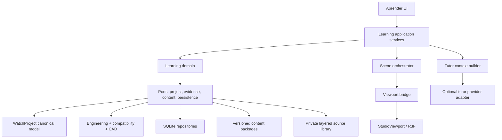

# Aprender — auditoría y arquitectura técnica

Estado: revisión para validación, no implementación ni inicio del Sistema 0.  
Convención: **Observado** describe código existente; **Propuesto** describe trabajo futuro.

## 1. Alcance de la auditoría

Se inspeccionaron la entrada de producción, `README.md`, todo `src/vnext`, los motores de `src/core`, la plataforma nativa, SQLite/Tauri, el sidecar OpenCascade y la suite de pruebas. No se utiliza como base la implementación antigua de `src/components`, `src/logic` ni `src/store`.

## 2. Arquitectura actual observada

### 2.1 Entrada y composición de la aplicación

**Observado.** `src/main.tsx:1-9` monta `src/App.tsx`. `App` importa `StudioSidebar`, `StudioInspector`, `StudioLibrary`, `StudioViewport` y `useStudioStore` desde `vnext` (`src/App.tsx:40-46`). La implementación de producción no importa la app antigua.

`Workspace` es una unión cerrada con seis áreas (`src/vnext/model.ts:35`); la navegación las materializa en `workspaceItems` (`src/App.tsx:59-66`). Por tanto, `Aprender` todavía no existe como ruta, estado ni composición de paneles.

La pantalla de trabajo ya tiene la forma adecuada como punto de partida: barra superior, panel izquierdo, escenario central, inspector derecho y barra de estado (`src/App.tsx:348-382`). El área inferior actual es solo `StatusBar`; no hay timeline, bandeja de diagnóstico ni controlador de sesión.

### 2.2 Modelo canónico

**Observado.** `WatchProject` v5 (`src/vnext/model.ts:423-448`) contiene reloj, montaje, ingeniería, apariencia y un movimiento discriminado de cuarzo o mecánico. `Dimension` (`src/vnext/model.ts:22-33`) ya lleva valor, tolerancia asimétrica, unidad, calidad, fuente, distribución, referencia, criticidad y bloqueo.

La taxonomía de datos actual (`src/vnext/model.ts:1-9`) distingue oficial completo/parcial, proveedor parcial, diseñado, medido por usuario, estimado, desconocido y solo visual. `qualityReliability()` reduce esa procedencia a fiabilidad (`src/vnext/model.ts:555-560`).

El modelo mecánico (`src/vnext/model.ts:299-394`) representa:

- una platina y un nivel de puentes;
- cinco roles de árbol fijos: barrilete, centro, tercera, cuarta y escape;
- volante, escape, motion works, muelle real y módulo automático opcional;
- procedencia por conjunto mediante `componentOrigins`;
- dimensiones de pivote, rubí, endshake y sideshake en cada árbol.

El cuarzo (`src/vnext/model.ts:248-268`) es una envolvente comercial con ajustes y niveles de agujas. No contiene motor paso a paso, bobina, circuito, rotor, tren o batería como entidades seleccionables.

**Limitación.** `WatchPartId` es una unión cerrada (`src/vnext/model.ts:39-71`), no un identificador de instancia. No modela tornillos individuales, múltiples puentes, ruedas arbitrarias, componentes duplicados, orientación de montaje, herramientas, superficies funcionales ni estados de servicio. Esta limitación impide prometer desmontaje completo de cualquier calibre con el esquema actual.

**Limitación.** `SourceReference` (`src/vnext/model.ts:15-20`) es suficiente para un localizador básico, pero no para una biblioteca: faltan edición, página/rango, idioma, licencia, hash del original, tipo de fuente, relación original–traducción y anotaciones.

### 2.3 Geometría y datums

**Observado.** `assemblyStack()` deriva los planos axiales principales (`src/vnext/geometry.ts:57-82`). `dialSurfaceZ`, `crystalInnerZAtRadius` y los perfiles radiales generan superficies compartidas. `buildHandSegments()` y `buildAssemblyPrimitives()` alimentan tanto visualización como validación aproximada.

`ScenePrimitive` (`src/vnext/geometry.ts:39-55`) proporciona una proyección renderizable simple y conserva `part: WatchPartId`, pero no declara interfaces, dependencias, herramienta, estado de montaje ni una referencia de instancia general.

**Reutilizable.** Los datums de stack, perfiles y primitivas son una buena fuente para escenas educativas de la geometría ya soportada.

**Limitación.** `StackGeometry` devuelve números desnudos. La procedencia se conserva en las `Dimension` de entrada, pero no viaja con cada valor derivado. Para overlays educativos se necesita un resultado derivado con entradas, método, alcance y fiabilidad.

### 2.4 Motor analítico

**Observado.** `evaluateProject()` (`src/vnext/engine.ts:136-628`) comprueba envolventes, stack, asientos, tija, dial, agujas y fittings; incorpora `calculateTrain()` para movimientos mecánicos. Cada `Finding` lleva severidad, piezas, fiabilidad, fuente y holgura (`src/vnext/model.ts:492-504`).

`calculateTrain()` (`src/vnext/mechanics.ts:163-697`) produce pares, ratios, velocidades, frecuencia, reserva, margen de platina, headroom e incidencias. Usa perfiles cicloidales o involuta y mantiene advertencias sobre depthing físico y escapes no soportados por completo.

`evaluateEngineeringProject()` (`src/core/engineering.ts:51-172`) agrega capas independientes:

- geometría;
- montaje/restricciones;
- cinemática;
- dinámica;
- tolerancias;
- fabricación.

Los módulos `src/core/dynamics.ts`, `automatic.ts`, `escapement.ts`, `tolerance.ts` y `constraints.ts` ya exponen datos útiles para energía, par, amplitud, reserva, fases del escape, sensibilidad y grados de libertad.

**Limitación.** El informe analítico y `CadAnalysis` exacto permanecen como resultados paralelos. `evaluateEngineeringProject()` no recibe el informe OpenCascade; su `backend` y confianza se derivan de ajustes del proyecto (`src/core/engineering.ts:80-160`). La academia debe construir un catálogo de evidencia que no confunda una capa marcada `exact` con un resultado exacto realmente ejecutado y vigente.

**Limitación.** La dinámica usa modelos concentrados e inputs estimados y lo declara (`src/core/dynamics.ts:151-169`). No calcula tribología, desgaste, choque, magnetismo ni fluido de lubricación. Es adecuada para enseñanza con etiqueta analítica/aproximada, no como banco físico de alta fidelidad.

### 2.5 Viewport 3D

**Observado.** `StudioViewport.tsx` es un archivo de 1.658 líneas con mallas, materiales, cámara, selección, edición, simulación y composición de escena. Consume directamente `useStudioStore` en muchos componentes.

Capacidades existentes reutilizables:

- selección por `WatchPartId`;
- aislamiento, explosionado y sección (`src/vnext/StudioViewport.tsx:1399-1447`, `1499-1502`);
- cámaras predefinidas y `OrbitControls`;
- engranajes cicloidales/involuta;
- representación de pivotes y rubíes;
- estado visual de errores y avisos;
- edición directa de árboles, volante, rotor y agujas;
- animación visual del tren, escape, volante y rotor.

**Limitación.** La animación usa `elapsedTime`, escalas visuales y funciones sinusoidales (`src/vnext/StudioViewport.tsx:812-820`, `947-951`, `1006-1008`, `1123-1128`). Solo existe el booleano `simulate`; no hay reloj de simulación, velocidad, scrubbing, paso a paso ni estado determinista restaurable.

**Limitación.** Aislamiento y explosionado se deciden con condicionales dentro del viewport y capas numéricas fijas. Añadir lecciones allí produciría el acoplamiento expresamente prohibido.

### 2.6 Donantes y metrología actual

**Observado.** `SavedPartPreset` conserva payload, proyecto origen e interfaces (`src/vnext/model.ts:450-490`). `movementComponentPresetFromProject()` extrae conjuntos mecánicos y su procedencia (`src/core/componentCompatibility.ts:123-233`).

`analyzeComponentCompatibility()` (`src/core/componentCompatibility.ts:295-362`) comprueba algunas envolventes e interfaces por tipo. Sus estados actuales son `compatible`, `conditional` e `incompatible` (`src/core/componentCompatibility.ts:20`). No existe `insufficient-data` y el forzado se realiza como bypass de UI, sin entidad persistente propia (`src/vnext/store.ts:1001-1014`).

`MovementBuilder` presenta una ficha de metrología por conjunto y permite importar un STEP. `importStepForComponent()` usa la envolvente OpenCascade para actualizar algunas dimensiones y registra `imported-step` (`src/vnext/store.ts:866-915`).

**Limitación.** La importación STEP no conserva en `WatchProject` una referencia persistente a la geometría exacta; aplica tamaño/envolvente a cotas seleccionadas. Orientación e interfaces siguen pendientes, como el propio texto del código declara.

**Limitación.** La ficha actual registra fabricante, calibre, referencia, confianza y notas, pero no observaciones repetidas, instrumento, calibración, resolución, método ni presupuesto de incertidumbre.

### 2.7 Biblioteca y fuentes

**Observado.** `StudioLibrary` reúne plantillas, registros MIYOTA, piezas y proyectos. `miyotaCatalog.ts` mantiene localizadores oficiales y `verifiedAt`. Los documentos se abren como URL (`src/vnext/Library.tsx:9-15`), de modo que la consulta requiere conexión salvo que el sistema operativo los haya almacenado por otra vía no implementada.

No existe repositorio genérico de fuentes, importación documental, hash de integridad, anotación, traducción ni relación contextual con nodos de conocimiento.

**Propuesto en la revisión privada/local.** La biblioteca no necesita una plataforma editorial pública. Sí necesita importar PDF/documentos locales, cachear una copia personal, ejecutar OCR local y enlazar páginas, figuras o regiones con conceptos, piezas, calibres y escenas. Original, OCR, traducción, explicación y anotación se almacenan como capas distintas. Los binarios privados viven en el asset store local y quedan fuera de exportaciones por defecto.

La resolución de autoridad sigue cuatro clases: documentación oficial MIYOTA para nominales del calibre; medición/observación propia para la unidad física; libro privado para teoría general; contenido derivado para pedagogía e interpretación. La autoridad se elige por predicado y ámbito, no por el mero orden de importación.

### 2.8 Estado y persistencia

**Observado.** `useStudioStore` concentra proyecto, UI, historial, bibliotecas, CAD, donantes y acciones en una sola interfaz (`src/vnext/store.ts:92-207`). `change()` clona el proyecto, agrupa ediciones durante 550 ms, limita historial a 80 y persiste el autoguardado en `localStorage` (`src/vnext/store.ts:392-414`).

`normalizeProject()` acepta esquemas 2–5 y rellena campos hasta v5 (`src/vnext/store.ts:209-310`). La validación de entrada es deliberadamente mínima y manual.

En Desktop, SQLite contiene dos tablas, `projects` y `parts`, con metadatos indexados y payload JSON (`src-tauri/src/lib.rs:66-91`). No hay tabla de migraciones, `PRAGMA user_version`, transacciones de dominio educativo ni almacén de adjuntos.

El paquete `.wplab` versión 1 contiene `project.json` y opcionalmente `reports/cad-analysis.json` (`src/platform/native.ts:238-280`). El decodificador ignora entradas ZIP adicionales, pero exige `packageVersion: 1` y esquema de proyecto 2–5.

### 2.9 OpenCascade

**Observado.** El protocolo del sidecar es versionado y soporta health, inspect-step, analyze, build y export (`cad-engine/watchlab_cad/protocol.py:12-82`). Los fallos geométricos se devuelven como `indeterminate`, no como pass (`cad-engine/watchlab_cad/analysis.py:57-84`).

El builder mecánico crea platina, árboles, rubíes, volante, puente y rotor a partir del modelo paramétrico (`cad-engine/watchlab_cad/builders.py:275-415`). El cuarzo es una envolvente redondeada con batería visual fusionada (`cad-engine/watchlab_cad/builders.py:416-425`). Las parejas de colisión exacta están enumeradas (`cad-engine/watchlab_cad/analysis.py:12-26`).

**Limitación.** `Exacto` describe operaciones B-Rep exactas sobre la geometría que el builder posee. No implica que la geometría paramétrica simplificada sea una reproducción exacta del calibre real.

### 2.10 Pruebas

**Observado.** La parte de producción cuenta con pruebas de engine, mechanics, catálogo, compatibilidad, engranajes, restricciones, dinámica, escape, automático, tolerancias, fabricación, ingeniería, empaquetado y sidecar CAD. Hay ocho pruebas Python del kernel. No hay pruebas de componentes React para `vnext`, render visual de escenas, base SQLite, migraciones Rust, accesibilidad integral ni validación de contenido declarativo.

## 3. Mapa de reutilización

| Sistema actual | Decisión | Uso en Aprender | Extensión necesaria |
|---|---|---|---|
| `WatchProject` / `Dimension` | Reutilizar | verdad técnica, cotas y tolerancias | identidad de entidad y claims derivados |
| `DataQuality`, `Reliability` | Reutilizar y ampliar por adaptación | etiquetas de evidencia | distinguir método/exactitud sin colapsarlo en calidad |
| `SourceReference` | Ampliar | enlace de fuente básico | páginas/regiones, hash, clase de uso, autoridad, idioma y capas |
| `assemblyStack`, perfiles | Reutilizar | datums, sección, medición | resultados derivados trazables |
| `ScenePrimitive` | Reutilizar como adapter | geometría v5 renderizable | selector de entidad y capacidades |
| `evaluateProject` | Reutilizar | findings y márgenes | normalización común de evidencia |
| `calculateTrain` | Reutilizar | ratios, velocidad, giro, reserva | topologías no fijas mediante adapter futuro |
| `engineering.ts` | Reutilizar | snapshot técnico del tutor/práctica | fusionar vigencia y evidencia CAD |
| `automatic`, `dynamics`, `escapement` | Reutilizar con etiqueta | overlays analíticos | contratos de alcance y calibración |
| `tolerance.ts` | Reutilizar | bandas, sensibilidad y ejercicios | vínculos de métricas a entidades/claims |
| `constraints.ts` | Reutilizar | grados de libertad y montaje | dependencias de extracción y contactos de servicio |
| `componentCompatibility.ts` | Ampliar | ejercicios de donantes | datos insuficientes, condiciones y trasplante forzado auditado |
| `StudioViewport` | Reutilizar infraestructura, desacoplar | Canvas, cámara, mallas e interacción | bridge de intención, overlays y timeline externo |
| `useStudioStore` | No ampliar monolíticamente | selector de proyecto/UI legado | stores de Aprender y servicios de sesión separados |
| SQLite/Tauri | Ampliar | progreso, sesiones, fuentes privadas, expedientes | migraciones, tablas, transacciones, adjuntos y exclusión de exportación |
| `.wplab` | Ampliar de forma aditiva | expediente portable opcional | entradas `learning/*` compatibles |
| OpenCascade | Reutilizar | validaciones exactas y metrología STEP | jobs educativos, evidencia vigente y referencias a assets |

## 4. Arquitectura técnica propuesta

### 4.1 Capas



Regla de dependencias: UI depende de servicios; servicios dependen de interfaces de dominio; adapters conocen `vnext`, SQLite, Tauri, R3F y futuros proveedores. El dominio educativo no importa componentes React ni Zustand.

### 4.2 Estructura de módulos sugerida

```text
src/
  learning/
    domain/
      knowledge/
      evidence/
      practice/
      assembly/
      diagnostics/
      metrology/
      progress/
      projects/
      tutor/
    application/
      LearningSessionService.ts
      PracticeRunner.ts
      TutorContextBuilder.ts
      MeasurementPromotionService.ts
    content/
      schemas/
      loader/
      validation/
    scene/
      SceneOrchestrator.ts
      selectors.ts
      timeline.ts
      overlays/
    adapters/
      project-v5/
      engineering/
      compatibility/
      cad/
      persistence/
      viewport/
    ui/
      LearnWorkspace.tsx
      panels/
      routes/
```

Los nombres son orientativos; las fronteras son la decisión importante.

### 4.3 Índice de entidades, no segundo modelo

**Propuesto.** `ProjectEntityIndex` es una proyección de solo lectura construida desde `WatchProject`. Resuelve referencias semánticas como `role:escape-wheel`, `subsystem:going-train` o `legacyPart:center` hacia entidades canónicas disponibles.

No contiene dimensiones propias. Devuelve referencias y capacidades:

```ts
interface ResolvedEntity {
  ref: CanonicalEntityRef
  legacyPartId?: WatchPartId
  capabilities: Array<'select' | 'hide' | 'explode' | 'measure' | 'remove' | 'simulate'>
  provenancePaths: string[]
}
```

Para v5, el adapter conoce la topología fija. Si un futuro esquema canónico añade instancias arbitrarias, se implementa otro adapter; los contenidos siguen usando roles/capacidades y no cambian.

### 4.3.1 Familias de movimiento y vistas progresivas

La prioridad MIYOTA se modela en datos de contenido y fixtures, no en el resolvedor canónico. `MovementReference` identifica fabricante, calibre, familia y variante; `CapabilityMatrix` expresa qué entidades, activos y claims existen. Los selectores continúan siendo semánticos y pueden resolver movimientos de cualquier marca.

Para el MIYOTA 8215, una escena inicial puede aplicar un `SubsystemPresentation` que oculte o desactive calendario, rotor y carga automática. Es una política visual/interactiva reversible: las instancias siguen presentes en el assembly graph y su omisión queda visible en las limitaciones de la escena. Así se evita crear varios modelos contradictorios del mismo calibre.

### 4.4 Sesión transaccional

**Propuesto.** Al entrar en una escena o práctica, `LearningSessionService` captura un `ViewportSnapshot` y crea un overlay de sesión:

- estado de cámara y herramientas;
- reloj de simulación;
- visibilidad y explosionado;
- selecciones;
- faltas educativas activas;
- piezas retiradas/colocadas;
- acciones y respuestas.

El proyecto técnico no se modifica salvo que una actividad de diseño lo solicite explícitamente. Al salir, la política puede restaurar, conservar solo UI o proponer aplicar cambios al proyecto mediante un comando revisable y con undo.

### 4.5 Bridge del viewport

`StudioViewport` no interpreta lecciones. Recibe una intención compilada:

```ts
interface ViewportIntent {
  entityStates: Record<string, EntityVisualState>
  camera: CameraIntent
  sectionPlanes: SectionIntent[]
  timeline: TimelineState
  overlays: OverlayIntent[]
  interactionPolicy: InteractionPolicy
}
```

El adapter traduce referencias a mallas/grupos actuales. Los componentes R3F publican eventos semánticos (`entity.selected`, `entity.moved`, `tool.applied`) al runner. Esto permite probar el orquestador sin WebGL y el viewport sin contenido educativo.

### 4.6 Evidence Hub

Todos los motores se adaptan a un contrato común `EvidenceClaim`, descrito en el modelo de datos. Un claim puede proceder de:

- una `Dimension` canónica;
- una derivación geométrica preview;
- un cálculo analítico;
- un informe exacto OpenCascade vigente;
- una medición;
- una fuente documental;
- una simulación educativa.

El overlay y el tutor consumen claims, no valores sueltos. Si dos claims discrepan, ambos permanecen visibles y el sistema puede crear una tarea de reconciliación.

### 4.7 Registro de proveedores de overlay

Cada overlay declara:

- capacidades y entidades requeridas;
- inputs mínimos;
- función de cálculo/adaptación;
- unidades;
- leyenda;
- método y exactitud;
- política cuando faltan datos.

Ejemplos de proveedores iniciales reutilizables:

- `rotation-direction` y `angular-speed` desde `TrainMetrics.speedsRph`;
- `gear-ratio` y `depthing` desde `GearPairMetrics`;
- `energy-budget` desde `DynamicsMetrics`;
- `escapement-phase` desde `EscapementAnalysis`;
- `clearance` y `collision` desde `ProjectEvaluation` y `CadAnalysis`;
- `tolerance-band` desde `ToleranceAnalysis`;
- `data-reliability` desde dimensiones y claims.

Presión de contacto, pérdidas locales, película de aceite y libertad real solo se activan cuando exista un proveedor defendible; de lo contrario se muestran como indeterminadas o no disponibles.

### 4.8 Tutor desacoplado

`TutorContextBuilder` crea un snapshot limitado y versionado. Un `TutorProvider` futuro puede ser local, remoto o determinista. El proveedor nunca accede directamente al store ni a archivos; recibe el contexto autorizado y devuelve actos estructurados, no mutaciones arbitrarias.

Actos permitidos: `explain`, `ask`, `hint`, `request-check`, `compare`, `evaluate-response`, `highlight`, `open-source`. Los comandos de proyecto pasan por los mismos servicios de revisión y undo que la UI.

### 4.9 Biblioteca privada y autoridad documental

`SourceRepository` separa metadatos de binarios direccionados por hash. `SourceLayerRepository` conserva OCR, traducción, explicación e interpretación como derivados versionados. `SourceLinkIndex` relaciona localizadores —incluidas regiones normalizadas de página— con conocimiento, entidades, calibres y escenas.

Un `SourceAuthorityResolver` aplica reglas explícitas:

- para nominales de un MIYOTA, prioriza un claim oficial específico de calibre/variante;
- para el ejemplar físico, prioriza la observación o medición propia y conserva el nominal para comparación;
- para teoría general, admite el libro privado con cita exacta;
- el contenido derivado nunca asciende automáticamente a fuente primaria.

El campo de uso es deliberadamente simple: `private-local`, `official-linked`, `official-cached`, `user-created`, `shareable` o `unknown`. Los exportadores aceptan por defecto referencias y metadatos, pero no binarios privados/cached/unknown. No se diseñan marketplace, roles editoriales obligatorios, firma general ni permisos territoriales en esta etapa.

## 5. Riesgos de acoplamiento y mitigaciones

| Riesgo | Evidencia actual | Mitigación propuesta |
|---|---|---|
| Lecciones dentro del viewport | Viewport ya concentra render y comportamiento | DSL + orquestador + bridge |
| Crecer el store monolítico | `StudioState` mezcla proyecto/UI/CAD/biblioteca | stores y servicios por dominio |
| Contenido atado a IDs fijos | `WatchPartId` y cinco árboles cerrados | selectores semánticos y resolvedor |
| Duplicar física en escenarios | faltas requieren cambios reversibles | deltas de sesión referidos al canon |
| Confundir exactitud con calidad | CAD e informe analítico están separados | Evidence Hub y vigencia por hash |
| Marcar compatible con datos faltantes | compatibilidad solo tiene tres estados | estado `insufficient-data` explícito |
| Romper `.wplab` | decoder limita package v1/esquema 2–5 | extensión ZIP aditiva y exportación compatible |
| Reescribir fuentes | no hay modelo documental aún | original inmutable + capas derivadas |
| Filtrar un libro privado al exportar | fuentes y paquetes compartirán asset store | clasificación de uso + deny-by-default para binarios |
| Acoplar el canon a MIYOTA | fixtures iniciales de una sola marca | fabricante/familia en datos; selectores y capacidades multimarca |
| Duplicar el 8215 por nivel | automático y calendario elevan complejidad inicial | una assembly canónica + vistas de subsistema reversibles |
| Contenido inválido sin recompilar | JSON externo puede referir piezas inexistentes | esquemas, linter semántico y matriz de movimientos |
| Mala accesibilidad 3D | Canvas no tiene equivalente semántico | árbol, transcripción, teclado y alternativa no visual |

## 6. Contradicciones y decisiones técnicas que no deben ocultarse

1. El README menciona `src/vnext/tolerance.ts`, pero la implementación está en `src/core/tolerance.ts`.
2. El modelo permite procedencia dimensional rica, pero no conserva el linaje de todos los resultados derivados.
3. El motor CAD hace operaciones exactas sobre builders paramétricos; no todos los sólidos representan piezas reales exactas.
4. La compatibilidad actual puede dar un estado nominal con checks parciales; aún no modela `datos insuficientes`.
5. El modo cuarzo no ofrece anatomía interna canónica, por lo que una ruta completa de servicio de cuarzo requiere ampliar el modelo/activos antes de publicarse.
6. El modelo mecánico actual permite un tren de referencia potente, pero no un desmontaje completo de topología arbitraria.
7. El autoguardado actual va a `localStorage`; SQLite se usa como biblioteca explícita. El progreso educativo de Desktop debe tener persistencia transaccional propia.
8. La web oficial MIYOTA aporta especificaciones, dibujos, instrucciones y listas/despieces, pero estos recursos no sustituyen geometría interna medida ni el estado de una unidad física.
9. El libro privado puede sostener teoría y explicación; no debe resolver nominales MIYOTA cuando exista una fuente oficial específica.

Estas limitaciones no invalidan la visión. Determinan las dependencias correctas y evitan vender una representación educativa como una réplica física.
