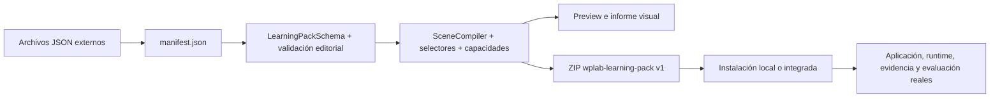

# Guía de autoría de contenido para Aprender

Estado: **Sistema 4A — kit de autoría y pipeline de contenido**.

Esta guía permite redactar fuera del código un curso original compatible con Watch Prototype Lab. No presupone conocimientos de TypeScript y no contiene currículo relojero, texto del libro privado ni contenido técnico MIYOTA.

## 1. Principio central

El autor trabaja con archivos JSON declarativos. El pipeline:

1. lee `manifest.json`;
2. carga los archivos que el manifiesto enumera;
3. materializa un `LearningPack` real;
4. aplica los esquemas de Sistemas 0–3;
5. comprueba referencias y calidad editorial;
6. compila las escenas contra el runtime real;
7. genera preview, informe visual y ZIP publicable.

No existe un formato de autoría alternativo. Se amplió de forma aditiva `learning-pack-v1` con colecciones y campos opcionales. Un paquete anterior sin currículo, rutas o metadatos visuales sigue siendo válido.



## 2. Workspace

La raíz recomendada es `learning-content/`:

```text
learning-content/
├── README.md
├── templates/
│   ├── minimal/
│   ├── complete/
│   └── PLANTILLAS-COMENTADAS.md
└── example/
    ├── manifest.json
    ├── curriculum/
    ├── routes/
    ├── modules/
    ├── concepts/
    ├── blocks/
    ├── lessons/
    ├── activities/
    ├── scenes/
    ├── competencies/
    ├── evidence/
    ├── rubrics/
    ├── glossary/
    ├── sources/
    ├── recommendations/
    ├── visual-resources/
    ├── assets/
    └── dist/
```

`dist/` es generado. No se edita a mano. Para iniciar otro curso, copia `example/` sin su `dist/`, cambia ID, versión y distribución y sustituye las entradas una a una.

## 3. Convenciones de IDs y versiones

Los IDs:

- usan minúsculas, números, punto, guion, guion bajo o dos puntos;
- no contienen texto traducido;
- no cambian al corregir una etiqueta;
- incluyen un prefijo semántico: `route.`, `lesson.`, `activity.`, `scene.`, `competency.`;
- son únicos en todo el paquete.

Ejemplos:

```text
route.foundations.energy-flow
module.foundations.power
lesson.foundations.mainspring-purpose
activity.foundations.predict-train
scene.foundations.predict-train
competency.explain-energy-transfer
```

La versión usa SemVer. Incrementa:

- patch para correcciones que no cambian significado ni evaluación;
- minor para contenido compatible añadido;
- major si cambia el significado evaluable, una regla o una referencia de forma incompatible.

Una sesión fija paquete, actividad, escena, rúbrica y versiones; nunca reescribas una versión publicada.

## 4. Manifiesto y formato físico

El manifiesto mínimo está en `learning-content/templates/minimal/package-manifest.json`. Los campos normativos son:

- `format: wplab-learning-pack`;
- `formatVersion: 1`;
- `schemaId: learning-pack-v1`;
- ID y versión;
- distribución `integrated` o `local-unsigned`;
- autores e idiomas;
- dependencias y capacidades;
- movimientos relacionados;
- activos con hash y procedencia;
- `entries`, que relaciona cada ID con una ruta segura;
- versión mínima/máxima de aplicación;
- fecha de creación.

El ZIP publicable contiene:

```text
manifest.json
curriculum/*.json
routes/*.json
modules/*.json
concepts/*.json
blocks/*.json
lessons/*.json
activities/*.json
scenes/*.json
competencies/*.json
evidence/*.json
rubrics/*.json
glossary/*.json
sources/*.json
recommendations/*.json
visual-resources/*.json
assets/*
```

Solo se incluyen archivos enumerados por el manifiesto. Las rutas absolutas, `..`, barras invertidas, HTML y JavaScript en Markdown son rechazados.

## 5. Crear un currículo, ruta y módulo

### Currículo

El currículo es la raíz editorial. Declara título, propósito, idiomas y rutas:

```json
{
  "id": "curriculum.example",
  "version": "1.0.0",
  "title": { "es": "Fundamentos", "en": "Foundations" },
  "purpose": {
    "es": "Propósito general observable.",
    "en": "Observable overall purpose."
  },
  "routeIds": ["route.example"],
  "languages": ["es-ES", "en-US"]
}
```

### Ruta

Una ruta agrupa módulos y declara propósito, prerrequisitos, competencias, movimientos, fuentes, recursos y dificultad. No obliga a una estructura estrictamente lineal.

Usa `prerequisiteConceptIds` solo cuando el concepto sea realmente necesario. Para una conexión informativa usa `relatedIds` en el concepto.

### Módulo

Un módulo agrupa lecciones con una razón pedagógica. Evita módulos que solo reproduzcan capítulos de una fuente: organiza por lo que el alumno debe comprender o hacer.

Las plantillas exactas están en:

- `templates/minimal/curriculum.json`;
- `templates/minimal/learning-path.json`;
- `templates/minimal/module.json`.

El ejemplo completo está en `learning-content/example/`.

## 6. Redactar una lección

Una lección separa:

- bloques editoriales: explicación, concepto, procedimiento, advertencia o ejercicio;
- actividades evaluables;
- metadatos de autoría;
- estrategia visual, si es necesaria.

Campos principales:

- `blockIds`: explicaciones y ejercicios;
- `activityIds`: actividades ejecutables;
- `authoring.title` y `purpose`: ES/EN;
- `objectives`: verbos observables;
- `prerequisiteConceptIds`;
- `conceptIds`;
- `sourceIds`;
- `visualResourceIds`;
- `visualStrategy`.

Un objetivo adecuado:

> “Explicar mediante qué interacción observable se transfiere energía entre dos subsistemas.”

Un objetivo inadecuado:

> “Comprender perfectamente el movimiento.”

El primero indica una conducta comprobable; el segundo no define evidencia.

## 7. Objetivos, prerrequisitos y conceptos

Cada objetivo debe poder vincularse a:

- una explicación o práctica;
- una competencia;
- una interacción o respuesta observable;
- una regla de evidencia;
- una rúbrica.

Un concepto del mapa declara:

- título y resumen ES/EN;
- tipo `concept`, `skill` o `subsystem`;
- prerrequisitos;
- relaciones no bloqueantes;
- competencias;
- movimientos y subsistema;
- rutas y actividades;
- fuentes;
- disponibilidad.

El validador rechaza referencias rotas. No uses el texto visible como referencia.

## 8. Bloques, explicaciones y ejercicios

Los bloques usan Markdown restringido. Tipos:

- `concept`;
- `procedure`;
- `warning`;
- `explanation`;
- `exercise`.

Una explicación puede contener `claims`. Una frase puramente pedagógica no necesita fingirse oficial. Una afirmación técnica sí debe declarar método, clasificación, fuentes, fidelidad y limitaciones.

Los términos se insertan con:

```text
{{term:term.example}}
```

`learning:lint` detecta un ID de término inexistente.

## 9. Crear una actividad

La parte ejecutable enlaza:

- escenas;
- competencias;
- plantillas/reglas de evidencia;
- rúbrica;
- referencia de proyecto o plantilla de solo lectura.

`authoring` añade:

- título y descripción ES/EN;
- lección;
- dificultad y duración;
- tipo;
- movimiento, familia y subsistema;
- capacidades;
- idiomas y offline;
- G/K/P;
- advertencias;
- fuentes;
- recursos visuales;
- patrón pedagógico opcional.

El preflight de la aplicación valida paquete, versión, dependencias, capacidades, prerrequisitos y proyecto antes de crear una sesión.

## 10. Patrón pedagógico visual

Una actividad interactiva puede declarar:

```json
{
  "pedagogicalPattern": {
    "enabled": true,
    "stages": [
      "observe",
      "predict",
      "manipulate",
      "execute-or-simulate",
      "compare",
      "explain",
      "relate-to-real-object",
      "check-understanding",
      "record-evidence"
    ]
  }
}
```

El ciclo recomendado es:

1. observar sin revelar inmediatamente la respuesta;
2. predecir un comportamiento o relación;
3. manipular una representación;
4. ejecutar o simular;
5. comparar predicción y resultado;
6. explicar lo ocurrido;
7. relacionarlo con una pieza o reloj real;
8. comprobar comprensión;
9. registrar evidencia.

No es obligatorio. Una explicación estática puede omitirlo; una práctica puede usar solo algunas fases.

## 11. Definir una escena

La escena usa el contrato `EducationalSceneSchema`. Puede declarar:

- requisitos de capacidad versionados;
- cámara;
- selección, visibilidad, ocultación y aislamiento;
- transparencia;
- resaltado;
- explosionado;
- sección;
- velocidad;
- timeline;
- flechas, etiquetas, resaltados y texto;
- pasos, preguntas y condiciones de éxito;
- storyboard;
- restauración obligatoria.

Operaciones de timeline:

```text
show, hide, select, isolate, explode, rotate, translate,
annotate, highlight, transparency, camera, section, overlay
```

Cada uso implica capacidades. El linter detecta una operación no declarada. El compilador comprueba además que los selectores resuelvan la cardinalidad prevista sobre el proyecto de prueba.

## 12. Selectores

Los selectores admitidos son exactamente los del runtime:

- instancia;
- definición;
- rol;
- subsistema;
- calibre;
- familia;
- variante;
- interfaz;
- etiqueta;
- tipo de pieza;
- ensamblaje;
- consulta;
- combinaciones `all`, `any` y `not`.

Ejemplo:

```json
{
  "selector": {
    "by": "role",
    "value": "case"
  },
  "cardinality": "exactly-one"
}
```

No uses posición de array, texto localizado ni un nombre visual como identidad.

## 13. Preguntas y pasos

Una pregunta vive dentro de un paso. Tipos:

- `single-choice`;
- `multiple-choice`;
- `entity-selection`;
- `short-text`.

Los pasos pueden exigir:

- una selección semántica;
- una respuesta con opciones esperadas;
- confirmación explícita.

La escena del ejemplo contiene una pregunta de predicción real, respuesta ES/EN y selección posterior. El workspace la presenta mediante controles accesibles y envía la respuesta al command bus.

## 14. Storyboard

El storyboard está dentro de la escena y puede entenderse sin código. Incluye:

- nombre y propósito;
- prerrequisitos;
- narrativa;
- encuadre inicial;
- protagonista y piezas secundarias;
- secuencia;
- pasos de escena asociados;
- índices del timeline;
- acciones esperadas;
- interacción;
- feedback;
- error esperado y pista;
- final y restauración;
- accesibilidad y reduced motion;
- evidencia;
- criterios técnicos;
- limitaciones.

`runtimeActions` documenta intención; `timeline` sigue siendo la autoridad ejecutable. `sceneStepId` debe coincidir con un paso real.

## 15. Contrato visual de una lección

`lesson.authoring.visualStrategy` admite:

- objetivo visual;
- concepto que se hará visible;
- modelo o movimiento;
- piezas/subsistemas mediante selectores;
- estado inicial;
- intención de cámara;
- visibles, ocultas y aisladas;
- explosionado;
- sección;
- transparencia;
- flujo de energía;
- sentidos de giro;
- etiquetas y flechas;
- animaciones;
- intención del timeline;
- interacción;
- pregunta de predicción;
- resultado observable;
- criterio de éxito;
- restauración;
- alternativa textual;
- alternativa de movimiento reducido;
- G/K/P;
- datos desconocidos;
- recursos aún necesarios.

No rellenes campos por inercia. Si no existe flujo de energía o sección, usa un array vacío u omite el campo opcional.

## 16. Fidelidad G/K/P

Los ejes son independientes:

- G0–G4: fidelidad geométrica;
- K0–K4: fidelidad cinemática;
- P0–P4: fidelidad física.

Siempre añade limitaciones. G4 no implica K4 ni P4. Una animación conceptual puede ser G1/K1/P0 y seguir siendo pedagógicamente válida si se declara.

La fidelidad educativa no concede autoridad de ingeniería.

## 17. Competencias, evidencia y rúbricas

### Competencia

Describe conducta observable, prerrequisitos, tipo de habilidad, subsistema, movimientos y fuentes.

### Evidencia

La plantilla conserva el contrato original y añade `extraction`:

- evento disparador;
- tipo persistente;
- competencia;
- estado mínimo de sesión;
- confianza;
- campos del payload.

### Rúbrica

`assessmentRule` usa el DSL determinista de Sistema 2:

- `all`, `any`, `not`;
- `exists`, `count`;
- comparación de confianza, sesiones o pistas;
- ventana temporal;
- secuencia;
- ponderación;
- evidencia mínima;
- evidencia posterior independiente.

Una competencia sin regla de evidencia o rúbrica ejecutable es un error.

## 18. Recomendaciones

Una recomendación declara:

- tipo;
- título y motivo ES/EN;
- regla/versionado;
- prioridad;
- destino;
- plantillas de evidencia relacionadas;
- si es obligatoria.

La definición no decide por sí sola cuándo aparecer. El motor de aplicación aplica el contexto y conserva la recomendación explicable.

## 19. Glosario ES/EN

Cada término puede declarar:

- término preferido ES/EN;
- sinónimos;
- términos desaconsejados;
- contexto;
- fuentes.

No publiques una traducción técnica automática sin revisión. Un idioma declarado en el manifiesto debe tener título, propósito y descripción en las entidades visibles.

## 20. Fuentes sin biblioteca PDF

Una referencia puede describir:

- ID;
- título;
- autor o fabricante;
- edición/revisión;
- año;
- tipo;
- URL o localizador;
- capítulo;
- página;
- figura/lámina;
- calibre/movimiento;
- fecha de consulta;
- uso privado;
- comentario editorial;
- afirmación respaldada;
- capa derivada y fuente original.

Tipos iniciales:

- `private-book`;
- `official-miyota-documentation`;
- `own-observation`;
- `own-measurement`;
- `original-educational-content`.

El libro privado se referencia como `private-local` y `privateUse: true`. El documento no se incluye en el paquete salvo autorización expresa; el pipeline no lo abre ni procesa.

La documentación oficial MIYOTA se referencia mediante URL, calibre/movimiento, revisión y fecha de consulta. Clasificar una afirmación como `official` exige una cita `official-miyota`.

## 21. Clasificar afirmaciones

`claimType` describe el método:

- `observation`;
- `source`;
- `calculation`;
- `inference`;
- `hypothesis`.

`classification` describe la autoridad editorial:

- `official`;
- `observed`;
- `measured`;
- `original-explanation`;
- `calculated`;
- `inferred`;
- `hypothesis`.

No conviertas una explicación original en afirmación oficial. Declara incertidumbre cuando haya valor, tolerancia o confianza y conserva fingerprint, fecha y versión de método.

## 22. Recursos visuales

Tipos disponibles:

- escena 3D sobre movimiento real;
- escena 3D conceptual;
- animación cinemática;
- vista explosionada;
- sección;
- esquema 2D;
- flujo de energía;
- comparación superpuesta;
- tabla visual;
- fotografía propia;
- ilustración original;
- pieza destacada;
- secuencia de desmontaje;
- simulación de error;
- instrumento virtual;
- alternativa textual.

Cada recurso declara ID, propósito, estado, fuentes, G/K/P, lecciones, movimientos, selectores, capacidades, datos, prioridad, dependencias, soporte del modelo actual e impacto sobre el viewport.

Estados:

- `planned`;
- `blocked`;
- `ready`;
- `approved`.

Un recurso crítico planificado bloquea validación; otros pendientes generan warning.

## 23. Informe automático de necesidades visuales

Ejecuta:

```powershell
npm run learning:visual-report
```

Para otro workspace:

```powershell
npm run learning:visual-report -- learning-content/mi-curso
```

Genera:

- `dist/visual-needs.json`;
- `dist/visual-needs.md`.

Incluye recurso, lección, tipo, movimiento, piezas/selectores, capacidades, datos, estado, prioridad, G/K/P, dependencias, soporte actual e impacto del viewport.

## 24. Validar

```powershell
npm run learning:validate
```

Comprueba:

- esquema y límites;
- IDs duplicados;
- referencias y fuentes;
- rutas seguras;
- Markdown;
- idiomas;
- términos;
- clasificación oficial;
- capacidades;
- selectores y compilación;
- rúbricas;
- alternativas textuales;
- reduced motion;
- evidencias;
- competencias evaluables;
- hashes y tamaños de assets.

Otro workspace:

```powershell
npm run learning:validate -- learning-content/mi-curso
```

## 25. Lint editorial

```powershell
npm run learning:lint
```

Presenta diagnósticos con código, severidad, ruta, mensaje y recuperación. Los warnings no impiden empaquetar; los errores sí.

## 26. Previsualizar

```powershell
npm run learning:preview
```

Genera `dist/preview.html`, el pack materializado y el informe visual. La preview muestra jerarquía, recursos y diagnósticos; no sustituye la ejecución 3D.

Abre el HTML en un navegador. Para validar interacción, instala o usa el paquete integrado en la aplicación.

## 27. Empaquetar

```powershell
npm run learning:pack
```

Genera:

- `dist/pack.json`, materialización exacta;
- `dist/<id>-<version>.wplab-learning.zip`;
- informe visual JSON/Markdown.

El ZIP es determinista. Los mismos archivos y metadatos producen los mismos bytes.

## 28. Publicar localmente

Para un paquete personal:

1. usa `distribution: local-unsigned`;
2. valida;
3. revisa warnings;
4. empaqueta;
5. abre Watch Prototype Lab;
6. entra en Aprender → Contenido;
7. selecciona el ZIP en “Importar paquete local”;
8. revisa ID, versión, hash, dependencias y capacidades;
9. abre la ruta desde Explorar.

Una versión fijada por sesiones no puede retirarse. Publicar una versión corregida requiere un nuevo SemVer.

## 29. Paquete de ejemplo

`wplab.example.authoring-course@1.0.0` enseña autoría, no relojería. Incluye:

- currículo, ruta y módulo;
- dos lecciones;
- concepto y glosario;
- explicación y ejercicio;
- actividad visual;
- escena de tres pasos;
- pregunta de predicción;
- selección;
- evidencia y rúbrica;
- recomendación;
- fuentes originales;
- alternativas de accesibilidad;
- recursos e informe visual.

Se instala junto al demo contractual, no lo sustituye. El catálogo y runtime consumen directamente `learning-content/example/dist/pack.json`.

## 30. Checklist antes de entregar contenido

- IDs estables y únicos.
- SemVer decidido.
- ES/EN completos para texto visible.
- Objetivos observables.
- Prerrequisitos explícitos.
- Fuentes y clasificación de claims.
- G/K/P y limitaciones.
- Recursos con estado y prioridad.
- Alternativa textual.
- Reduced motion.
- Capacidades declaradas.
- Selectores con cardinalidad.
- Restauración.
- Evidencia y rúbrica.
- Recomendación determinista.
- `learning:validate` correcto.
- Preview revisada.
- Informe visual aceptado.
- ZIP instalado y actividad completada en la aplicación.

## 31. Qué no hacer

- No copies texto del libro al paquete.
- No almacenes el PDF privado.
- No presentes una explicación original como MIYOTA oficial.
- No inventes dimensiones, piezas o comportamiento.
- No uses IDs traducidos.
- No introduzcas JavaScript.
- No hardcodees contenido en React o TypeScript.
- No guardes estado pedagógico en `WatchProject`.
- No uses simulación educativa como validación de ingeniería.
- No publiques con recursos críticos pendientes.

## 32. Autoría de teoría profunda y fuentes externas curadas

### 32.1 Contrato de estudio

Una lección que requiera estudio previo puede declarar `authoring.studyContract`:

```json
{
  "sequence": "theory-first",
  "minimumTheoryMinutes": 30,
  "minimumReadingWords": 1800,
  "requiredSegmentRoles": ["orient", "pretrain", "explain", "worked-example", "practice"],
  "practiceUnlock": "after-required-reading",
  "labActivityIds": ["activity.example.lab"],
  "readinessCriteria": [
    { "es": "Explicar la cadena causal con palabras propias.", "en": "Explain the causal chain in your own words." },
    { "es": "Resolver el ejemplo sin invertir entrada y salida.", "en": "Solve the example without swapping input and output." },
    { "es": "Predecir el efecto de una interrupción.", "en": "Predict the effect of an interruption." }
  ],
  "sourceReviewRequired": true,
  "notePrompt": {
    "es": "Resume el principio y anota una duda comprobable.",
    "en": "Summarize the principle and write down a testable question."
  }
}
```

Los IDs de `labActivityIds` deben existir en el mismo paquete. Los roles requeridos deben estar presentes en los bloques de la lección. El volumen declarado debe corresponder al contenido real: no se infla con navegación, etiquetas o texto auxiliar.

### 32.2 Forma editorial del bloque teórico

Para una unidad técnica densa se recomienda incluir, en este orden:

1. orientación y pregunta causal;
2. explicación extensa del principio;
3. vocabulario y relaciones formales;
4. ejemplo resuelto;
5. errores frecuentes y contraejemplos;
6. fidelidad y límites de la representación;
7. comprobación de preparación;
8. práctica o laboratorio asociado.

El visual ilustra, compara o permite comprobar. No debe introducir silenciosamente el concepto que la evaluación da por conocido.

### 32.3 Fuente externa

Las fuentes enlazadas pueden declarar `authorityTier`, `sourceClass`, `languages`, `topics`, `pedagogicalUses`, `availability`, `checkedAt`, `rights`, `offlineReady`, `validationPolicy` y `limitations`. Una fuente de nivel A solo puede usar la clase `official-primary`; una copia externa marcada como disponible sin conexión debe aportar hash.

La incorporación correcta es selectiva: se registra el recurso, se delimita la afirmación que respalda, se contrasta cuando procede y se redacta contenido propio. Añadir una URL a una lección no equivale a validarla ni a convertirla en material de estudio.

El registro inicial, las decisiones de clasificación y seis ejemplos completos se documentan en `docs/APRENDER-FUENTES-Y-LABORATORIOS-FUNDAMENTALES.md`.

### 32.4 Contrato de práctica deliberada

Toda actividad visible del currículo principal debe declarar `authoring.deliberatePractice`:

```json
{
  "focus": { "es": "Seguir la relación causal sin confundir pieza y función." },
  "workedExample": {
    "scenario": { "es": "La entrada está presente, pero la salida no cambia." },
    "steps": [
      { "es": "Identifica la entrada observable." },
      { "es": "Localiza la primera interfaz que puede interrumpirla." },
      { "es": "Compara el resultado esperado con el observado." }
    ],
    "conclusion": { "es": "La conclusión queda limitada a la interfaz comprobada." }
  },
  "attempts": [
    { "phase": "guided", "instruction": { "es": "Resuelve con la guía visible." }, "evidence": { "es": "Cadena causal anotada." } },
    { "phase": "faded", "instruction": { "es": "Repite con una sola pista." }, "evidence": { "es": "Segunda cadena sin copiar." } },
    { "phase": "independent", "instruction": { "es": "Restaura y resuelve sin ayuda." }, "evidence": { "es": "Intento independiente." } },
    { "phase": "transfer", "instruction": { "es": "Aplica el criterio a otra configuración." }, "evidence": { "es": "Comparación justificada." } }
  ],
  "successCriteria": [
    { "es": "Distingue observación de inferencia." },
    { "es": "Justifica cada salto causal." }
  ],
  "errorSignals": [{ "es": "Nombra una pieza sin explicar su interfaz." }],
  "independentRetry": {
    "required": true,
    "afterHint": true,
    "restoreBeforeRetry": true,
    "variant": { "es": "Cambia la interrupción o la configuración inicial." }
  },
  "transferPrompt": { "es": "¿Qué conservarías y qué volverías a comprobar en otro calibre?" }
}
```

La interfaz muestra las fases al estudiante y ofrece el ejemplo resuelto antes de entrar al laboratorio. Solicitar una pista no completa la actividad: exige restaurar y realizar después un intento independiente.

### 32.5 Auditoría de profundidad

`npm run learning:academy-p1-audit` examina todas las rutas visibles y genera informes Markdown y JSON en `docs/generated`. Una actividad debe superar diez controles: teoría suficiente, lectura obligatoria, ejemplo, práctica deliberada, retirada de ayuda, pregunta específica, respuesta activa, fuente y límite, feedback causal, y restauración accesible.

La auditoría comprueba estructura y cobertura editorial. No sustituye la revisión técnica experta, una prueba de usabilidad ni la medición de aprendizaje o retención.

## 33. Decisiones pendientes

Antes del primer curso relojero real deben aprobarse:

- convención editorial definitiva de IDs por curso;
- responsable de revisión ES/EN;
- política de cita y comentario para el libro privado;
- criterio de aprobación de una fuente MIYOTA;
- G/K/P mínimo por tipo de recurso;
- quién puede pasar un recurso de `ready` a `approved`;
- estrategia de versionado y retirada;
- proyecto/fixture con el que se validará cada familia de escenas;
- umbral de warnings permitido para publicar.

Estas decisiones no bloquean el kit, pero sí la publicación del primer contenido real.
