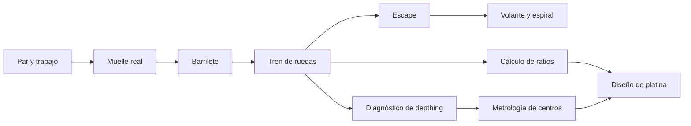
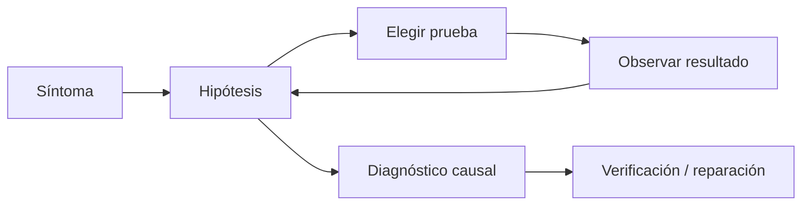

# Aprender — conocimiento, escenas, prácticas y tutor

Estado: contratos revisados para uso privado/local; pendiente de aprobación antes del Sistema 0.

## 1. Estrategia de contenido

El contenido se distribuye en paquetes versionados, validables y utilizables offline. Un paquete puede añadir conceptos, escenas, prácticas, averías, proyectos, glosario y fuentes sin recompilar el núcleo, siempre que use capacidades ya soportadas.

El runtime y los motores físicos permanecen en código. Un paquete no puede ejecutar JavaScript arbitrario ni definir fórmulas sin registrar. Solo instancia comandos, condiciones y evaluadores de un catálogo permitido.

La aplicación inicial es privada, local y personal. Los paquetes integrados se identifican como `integrated`; los creados por el usuario pueden ser `local-unsigned` y cargarse normalmente tras validar esquema, hashes, dependencias y seguridad. No se exige firma, marketplace ni revisión multiusuario.

El currículo y los fixtures iniciales priorizan MIYOTA, pero los selectores, capacidades y esquemas no codifican esa marca como caso exclusivo.

## 2. Taxonomía del mapa de conocimiento

### 2.1 Dominios previstos

El grafo completo debe reservar desde el principio los siguientes dominios:

1. fundamentos físicos y mecánicos;
2. cuarzo;
3. anatomía mecánica;
4. fuente de energía;
5. barrilete y muelle real;
6. tren de ruedas;
7. escape;
8. volante y espiral;
9. motion works;
10. cuerda y puesta en hora;
11. carga automática;
12. calendario;
13. desmontaje;
14. limpieza;
15. inspección;
16. lubricación;
17. montaje;
18. regulación;
19. diagnóstico;
20. metrología;
21. compatibilidad de donantes;
22. diseño de movimientos;
23. fabricación;
24. alta relojería;
25. cronógrafos;
26. tourbillones;
27. calendarios perpetuos;
28. repetición;
29. remontoir;
30. escapes avanzados;
31. ecuación del tiempo;
32. tiempo sideral.

Que el dominio exista no implica que ya haya un simulador defendible. Un nodo avanzado puede ser conceptual/documental hasta que el modelo tenga entidades y cálculos suficientes, y debe declarar esa limitación.

### 2.2 Tipos de nodo

- concepto;
- pieza/rol;
- subsistema;
- fenómeno;
- procedimiento;
- instrumento;
- habilidad;
- diagnóstico;
- principio de diseño;
- proceso de fabricación;
- complicación.

### 2.3 Relaciones

Además de prerrequisitos, el grafo usa relaciones tipadas: `parte de`, `transmite a`, `controla`, `mide`, `lubrica`, `falla como`, `contrasta con`, `se diseña mediante`, `se valida mediante` y `se documenta en`.

Ejemplo de camino no lineal:



### 2.4 Prerrequisitos y exploración libre

Una ruta recomendada exige dominio mínimo; la exploración libre solo advierte. Un nodo abierto sin prerrequisitos muestra:

- base necesaria;
- términos que pueden resultar desconocidos;
- qué partes de la escena siguen siendo comprensibles;
- enlace de retorno al punto previo.

### 2.5 Aplicabilidad

Cada nodo/actividad declara una expresión de capacidades, por ejemplo:

```json
{
  "all": [
    { "entity": "role:escape-wheel", "capability": "animate" },
    { "entity": "role:balance", "capability": "select" }
  ],
  "any": [
    { "engineClaim": "escapement.phase" },
    { "contentAsset": "illustrative-escapement-cycle" }
  ]
}
```

Si solo se cumple el asset ilustrativo, la actividad se etiqueta `ilustrativa`, no analítica.

### 2.6 Jerarquía de fuentes

Cada claim o explicación cita una fuente/localizador y declara su clase de autoridad:

1. **MIYOTA oficial:** nominales, dimensiones declaradas, funciones, referencias, planos, listas, despieces, frecuencia, rubíes, reserva y variantes.
2. **Observación/medición propia:** la unidad física concreta, su estado, medidas, imágenes, desgaste y modificaciones.
3. **Libro privado:** teoría, fabricación, herramientas, trenes, escapes, regulación, diagnóstico, alta relojería y complicaciones.
4. **Derivado educativo:** OCR, traducción, explicación, diagrama, escena, ejercicio, glosario e interpretación.

Una regla editorial no permite resolver una especificación MIYOTA desde el libro cuando haya documentación oficial aplicable. El libro solo actúa como manual exacto de calibre si lo trata expresamente. El derivado educativo nunca se autocita como fuente primaria.

### 2.7 Arco educativo inicial

1. Fundamentos, seguridad, herramientas, unidades y documentación.
2. Del ISA 8172 conocido por el usuario al MIYOTA 2035.
3. Funcionamiento completo del cuarzo MIYOTA 2035.
4. Fundamentos del reloj mecánico.
5. MIYOTA 8215 por subsistemas.
6. Desmontaje y montaje completo del MIYOTA 8215.
7. Inspección, lubricación, regulación y diagnóstico del 8215.
8. Comparación con 82S0 y 8N24.
9. Comparación entre serie 82 y serie 90.
10. MIYOTA 9015 y 9039.
11. Calendarios, reserva de marcha y movimientos MIYOTA más complejos.
12. Contenido avanzado del libro: escapes, cronógrafos, tourbillones, remontoir, repetición, calendarios perpetuos y diseño integral.
13. Componentes donantes y construcción de un movimiento híbrido.
14. Diseño y documentación de un reloj completo.

El 8215 se enseña progresivamente: una escena puede ocultar o desactivar rotor, automático y calendario para aislar el núcleo. Estas acciones solo cambian presentación/interacción; las entidades permanecen en el assembly canónico. Una etapa documental puede habilitarse antes que su simulación únicamente si declara la limitación de fidelidad.

## 3. Sistema declarativo de escenas

### 3.1 Objetivos

El DSL debe:

- ser serializable y validable;
- no importar React ni R3F;
- resolver entidades por rol/capacidad;
- componer comandos pequeños;
- tener timeline determinista;
- recibir eventos semánticos del viewport;
- evaluar condiciones sin código arbitrario;
- capturar y restaurar estado;
- declarar exactitud y limitaciones;
- permitir migración de schema.

### 3.2 Estado de escena

```ts
interface SceneStateDefinition {
  camera?: CameraDefinition
  visibility?: VisibilityDefinition
  isolate?: string[]
  explode?: ExplodeDefinition
  sections?: SectionDefinition[]
  animation?: AnimationDefinition
  overlays?: OverlayDefinition[]
  annotations?: AnnotationDefinition[]
  interaction?: InteractionPolicy
}
```

La cámara puede usar posición explícita o encuadre semántico. Se prefiere `fit: ['$barrel', '$center']` a coordenadas específicas.

### 3.3 Comandos permitidos

- `camera.set`, `camera.fit`, `camera.orbit`;
- `entity.show`, `entity.hide`, `entity.isolate`, `entity.highlight`, `entity.ghost`;
- `explode.set`, `explode.by-dependency`, `explode.reset`;
- `section.add`, `section.move`, `section.remove`;
- `timeline.play`, `timeline.pause`, `timeline.seek`, `timeline.rate`;
- `overlay.enable`, `overlay.disable`, `overlay.configure`;
- `annotation.show`, `annotation.hide`;
- `interaction.allow`, `interaction.require`, `interaction.lock`;
- `question.open`, `hint.offer`, `checkpoint.evaluate`;
- `session.restore`.

Cada comando tiene esquema, precondiciones y resultado. No puede ejecutar strings como código.

### 3.4 Pasos

```ts
interface SceneStep {
  id: string
  title: string
  narration?: LocalizedRichText
  enter: SceneCommand[]
  prompt?: PromptDefinition
  waitFor?: ConditionExpression
  success?: ConditionExpression
  onSuccess?: SceneCommand[]
  onFailure?: FailurePolicy
  hints?: HintDefinition[]
  evidence?: EvidenceRule[]
  exit?: SceneCommand[]
}
```

Las condiciones pueden observar selección, visibilidad, tiempo, orden de acciones, resultado de un engine, medición, respuesta, hipótesis o criterio compuesto.

### 3.5 Ejemplo de escena

```json
{
  "id": "mechanical.energy-flow.intro",
  "version": "1.0.0",
  "title": "Del barrilete al escape",
  "requires": {
    "all": [
      { "role": "barrel", "capability": "select" },
      { "subsystem": "going-train", "capability": "animate" }
    ]
  },
  "bindings": {
    "barrel": { "kind": "role", "role": "barrel" },
    "train": { "kind": "subsystem", "subsystem": "going-train" },
    "escapeWheel": { "kind": "role", "role": "escape-wheel" }
  },
  "initial": {
    "camera": { "fit": ["$train"], "preset": "isometric", "padding": 1.2 },
    "visibility": { "ghostAllExcept": ["$barrel", "$train", "$escapeWheel"] },
    "explode": { "amount": 0 },
    "animation": { "playing": false, "time": 0, "rate": 0.1 },
    "overlays": [
      {
        "id": "energy-path",
        "provider": "energy-flow",
        "subjects": ["$barrel", "$train", "$escapeWheel"],
        "missingData": "show-indeterminate"
      },
      {
        "id": "reliability",
        "provider": "data-reliability",
        "subjects": ["$train"]
      }
    ]
  },
  "steps": [
    {
      "id": "identify-source",
      "title": "Localiza la fuente de energía",
      "enter": [
        { "command": "entity.highlight", "targets": ["$train"], "style": "question" }
      ],
      "prompt": { "kind": "select-entity", "text": "Selecciona dónde se almacena la energía." },
      "success": { "event": "entity.selected", "target": "$barrel" },
      "hints": [
        { "afterAttempts": 1, "act": "explain-function-without-name" },
        { "afterAttempts": 2, "command": { "command": "camera.fit", "targets": ["$barrel"] } }
      ],
      "evidence": [
        { "when": "success", "objective": "identify-energy-source", "strength": 0.5 }
      ]
    },
    {
      "id": "follow-path",
      "title": "Sigue la transmisión",
      "enter": [
        { "command": "timeline.play" },
        { "command": "overlay.enable", "id": "energy-path" }
      ],
      "prompt": { "kind": "order-entities", "text": "Ordena los órganos por los que pasa la energía." },
      "success": { "orderedRoles": ["barrel", "center-wheel", "third-wheel", "fourth-wheel", "escape-wheel"] }
    }
  ],
  "exitPolicy": "restore-all",
  "sourceRefs": [
    { "sourceId": "daniels-horologia", "locator": { "section": "Wheels and pinions" } }
  ]
}
```

Este ejemplo usa roles; un calibre sin tercera rueda explícita no debe ser forzado a esa escena. Puede usar otra variante con una consulta de ruta del grafo cinemático.

### 3.6 Selectores y fallbacks

Una escena puede declarar variantes:

```ts
interface SceneVariant {
  when: CapabilityExpression
  patch: Partial<EducationalScene>
  label: string
}
```

No se permite que un fallback cambie el significado físico. Si falta un claim de par, el overlay puede mostrar ruta sin grosor cuantitativo, con estado `partial`; no puede inventar valores.

### 3.7 Restauración

El runner captura antes de entrar:

- workspace/submodo;
- cámara y target;
- selección;
- visibilidad;
- sección;
- explosionado;
- render mode;
- overlays;
- timeline;
- herramientas activas.

`restore-all` restaura ese snapshot aunque el intento termine con error. El stream de eventos permanece.

## 4. Visualizaciones funcionales

### 4.1 Contrato de overlay

```ts
interface OverlayDefinition {
  id: string
  provider: string
  subjects: string[]
  scale?: 'absolute' | 'normalized' | 'qualitative'
  missingData: 'hide' | 'show-indeterminate' | 'block-step'
  legend?: string
  parameters?: Record<string, number | string | boolean>
}
```

La salida del proveedor incluye geometría de overlay, leyenda y claims usados. La UI puede abrir el linaje de cualquier flecha o color.

### 4.2 Matriz de soporte inicial

| Fenómeno | Fuente actual reutilizable | Estado honesto inicial |
|---|---|---|
| Sentido de giro | orden del tren + alternancia | analítico; validar topología |
| Velocidad angular | `speedsRph` | analítico |
| Relación de engranajes | `GearPairMetrics.ratio` | analítico |
| Depthing | distancia objetivo/real | analítico, requiere prueba física |
| Flujo de energía | grafo de subsistemas + dinámica | ruta analítica/cualitativa |
| Transmisión de par | curva dinámica concentrada | aproximada y calibrable |
| Presión de contacto | no calculada | indeterminada |
| Libertad axial | endshake/datum cuando existan | parcial |
| Libertad radial | sideshake/clearance cuando existan | parcial |
| Colisión | preview y OpenCascade | distinguir aproximada/exacta |
| Tolerancia | `ToleranceAnalysis` | analítica/estadística |
| Amplitud | target + predicción dinámica | diseñada/aproximada |
| Frecuencia | tren y oscilador | analítica |
| Reserva | tren + muelle | analítica/aproximada |
| Impulso/bloqueo | `EscapementAnalysis` | paramétrica en Swiss lever, parcial en otros |
| Pérdidas | eficiencia agregada | aproximada; no local |
| Lubricación | sin motor actual | procedimental/visual-only |
| Fiabilidad | dimensiones/claims | alta, con linaje |

## 5. Diseño de prácticas y evaluación

### 5.1 Criterios observables

Un criterio no dice `comprende el tren`. Dice, por ejemplo:

- identifica correctamente cuatro roles sin pista;
- ordena la ruta de energía y explica dos conversiones;
- calcula ratio con unidades y tolerancia;
- selecciona una prueba que discrimina dos hipótesis;
- desmonta liberando energía antes de retirar el puente;
- toma tres medidas repetibles y justifica una exclusión;
- detecta que faltan datos antes de aceptar un donante.

### 5.2 Pistas graduadas

Niveles:

1. reformular objetivo;
2. recordar principio relacionado;
3. reducir espacio de búsqueda;
4. resaltar zona;
5. mostrar siguiente acción y explicar por qué.

El uso de pista queda en el intento, pero no convierte automáticamente la evidencia en fallo. Reduce independencia/fuerza según la rúbrica.

### 5.3 Explicaciones libres

Se evalúan con una rúbrica estructurada:

- entidades correctas;
- dirección causal;
- vocabulario;
- separación evidencia/hipótesis;
- mención de limitaciones;
- aplicación al proyecto activo.

Un evaluador determinista puede comprobar conceptos clave. Un futuro tutor propone una evaluación adicional con citas al contexto; si no hay suficiente confianza, marca `requiere revisión`.

### 5.4 Progreso

El agregador evita contar evidencias correlacionadas como independientes. Repetir el mismo quiz no equivale a demostrar transferencia. Se favorecen:

- recuperación espaciada;
- aplicación en otro movimiento;
- práctica sin pista;
- explicación causal;
- artefactos verificables;
- medición o montaje en contexto diferente.

## 6. Montaje y desmontaje

### 6.1 Grafo de dependencias

Las operaciones forman un DAG por configuración concreta, no una lista universal. Una condición puede depender de:

- pieza instalada/retirada;
- tornillo aflojado;
- energía liberada;
- herramienta disponible;
- orientación;
- ausencia de contaminación;
- endshake comprobado;
- estado de otra operación.

Cuando dos órdenes son válidos, ambos se aceptan. La evaluación penaliza riesgos y consecuencias, no divergencia de una secuencia única arbitraria.

### 6.2 Consecuencias educativas

Catálogo inicial:

- descarga insegura del muelle;
- pivote doblado o roto;
- espiral deformada;
- puente apretado con rueda mal asentada;
- tornillo incorrecto;
- contaminación;
- exceso o falta de aceite;
- escape bloqueado.

Cada consecuencia declara fidelidad. Por ejemplo, un pivote doblado puede alterar runout de forma visual y una regla de fricción; si no existe FEA, no se calcula una deformación material exacta.

### 6.3 Lubricación

Un punto de lubricación enlaza entidad, interfaz, producto, cantidad cualitativa/cuantitativa, herramienta, condición, fuente y riesgos. Hasta disponer de tribología calibrada, el overlay enseña procedimiento y distribución declarada, no presión o espesor de película calculados.

## 7. Laboratorio de averías

### 7.1 Familias iniciales

- pivote roto/doblado;
- diente dañado;
- rubí desplazado;
- endshake incorrecto;
- engrane profundo/superficial;
- rueda inclinada;
- áncora sin libertad;
- volante fuera de beat;
- espiral magnetizada;
- muelle real fatigado;
- lubricación incorrecta;
- tija incompatible;
- rotor en colisión;
- reserva reducida.

### 7.2 Bucle de diagnóstico



El escenario puede ocultar datos, pero el motor conserva el estado verdadero y la semilla. Una prueba revela una observación derivada de ese estado. El expediente registra pruebas innecesarias, riesgos y sesgos de confirmación.

### 7.3 Evaluación

Se puntúa:

- seguridad y orden de pruebas;
- poder discriminante;
- interpretación;
- actualización de hipótesis;
- diagnóstico;
- explicación causal;
- verificación posterior.

Acertar por azar con pruebas incoherentes no produce dominio alto.

## 8. Integración con metrología

Las prácticas de medición deben cubrir diámetro, espesor, altura, centros, pivotes, asiento, cañones, endshake, sideshake, concentricidad, profundidad de rubí y perfil de dientes.

Cada práctica enseña:

1. definición del mensurando;
2. datum y alineación;
3. instrumento adecuado;
4. lectura/resolución;
5. repetición;
6. fuentes de error;
7. incertidumbre;
8. comparación con fuente/modelo;
9. decisión de promoción.

El modo virtual puede simular lecturas con una distribución declarada para entrenar técnica; esas lecturas se etiquetan como simuladas y nunca se promueven al proyecto real.

## 9. Integración con donantes

Una práctica de donantes consume el informe actual mediante adapter y añade preguntas:

- ¿Qué checks se ejecutaron realmente?
- ¿Qué interfaces faltan?
- ¿Qué tolerancia domina?
- ¿La modificación cambia otra interfaz?
- ¿Qué medición reduciría más incertidumbre?
- ¿Qué riesgo acepta un trasplante forzado?

Después de aplicar una pieza, el usuario debe revisar informes geométricos, cinemáticos, dinámicos y de tolerancias. `Compatible` nunca significa listo para producción.

## 10. Biblioteca y glosario

### 10.1 Contextualidad

Una selección 3D puede abrir:

- definición bilingüe;
- sinónimos y términos históricos;
- páginas/figuras relevantes;
- conceptos relacionados;
- procedimientos;
- prácticas;
- advertencias de traducción.

La biblioteca privada puede registrar PDF local, documento oficial enlazado, documento oficial cacheado, página, región/figura, texto OCR, traducción, explicación y anotación. Cualquiera de esas capas puede relacionarse con concepto, entidad/pieza, calibre, escena y nivel de dificultad.

### 10.2 Integridad de fuentes

El original se guarda por referencia o asset con hash. OCR, traducción, explicación e interpretación crean capas independientes y versionadas; nunca reescriben el original ni se fusionan silenciosamente entre sí. La UI muestra fuente, autor cuando se conozca, versión, clase de autoridad y localizador de cada capa.

### 10.3 Uso privado y exportación

Cada fuente usa `private-local`, `official-linked`, `official-cached`, `user-created`, `shareable` o `unknown`. La procedencia es obligatoria por rigor, pero no existe una validación jurídica bloqueante para usar material privado local. Los binarios `private-local`, `official-cached` y `unknown` nunca entran por defecto en paquetes o proyectos exportados. El libro privado puede resolver citas dentro de la instalación local aunque el paquete solo conserve el `sourceId`, página/región y una explicación derivada.

## 11. Proyectos largos

Plantillas previstas:

- reconstrucción virtual de cuarzo;
- comparación cuarzo/mecánico;
- primer desmontaje;
- montaje completo;
- reparación de averías;
- caracterización de donante;
- trasplante;
- diseño de platina;
- movimiento híbrido;
- reloj completo.

Cada plantilla define hitos, pero permite decisiones diferentes. Los hitos generan artefactos: mapa de piezas, campaña de medición, informe de compatibilidad, cálculo de tren, validación, BOM, plan de montaje y reflexión final.

## 12. Tutor contextual

### 12.1 Construcción del contexto

El builder reúne:

- resumen del proyecto/movimiento;
- selección y entidades visibles;
- escena, paso, pregunta y modo;
- historial de errores relevante;
- progreso por objetivos;
- mediciones vigentes y propuestas;
- datos desconocidos;
- donantes y checks;
- informes con vigencia;
- claims y citas.

No envía el proyecto completo por defecto. Usa un presupuesto y registra omisiones.

### 12.2 Actos

```ts
type TutorAct =
  | { kind: 'explain'; subject: CanonicalEntityRef; depth: 'simple' | 'technical' }
  | { kind: 'compare'; subjects: [CanonicalEntityRef, CanonicalEntityRef]; criteria: string[] }
  | { kind: 'ask'; objectiveId: string; prompt: string }
  | { kind: 'hint'; level: 1 | 2 | 3 | 4 | 5 }
  | { kind: 'request-check'; testId: string; rationalePrompt?: string }
  | { kind: 'evaluate-response'; rubricId: string }
  | { kind: 'highlight'; targets: CanonicalEntityRef[] }
  | { kind: 'open-source'; citation: SourceCitation }
```

El tutor propone actos; `LearningSessionService` valida permisos. No puede cambiar cotas, aplicar donantes ni marcar dominio directamente.

### 12.3 Evidencia frente a hipótesis

Cada segmento de respuesta se clasifica. Ejemplo:

- `Evidencia`: el informe vigente muestra endshake de X.
- `Cálculo`: con las cotas declaradas, el margen analítico es Y.
- `Hipótesis`: suciedad en el pivote podría explicar la amplitud baja.
- `Dato faltante`: no hay medición de fricción ni lubricante.
- `Próxima comprobación`: medir amplitud en dos posiciones.

### 12.4 Sin proveedor de IA

El sistema sigue ofreciendo:

- explicaciones escritas del paquete;
- preguntas y pistas declarativas;
- comparación estructurada;
- evaluación determinista;
- enlaces contextuales;
- checklist de datos faltantes.

La IA mejora lenguaje y diálogo; no es un requisito funcional básico.

## 13. Pipeline personal de autoría y calidad

1. el usuario crea/edita contenido fuera del runtime o con una futura herramienta local;
2. esquema valida estructura;
3. linter valida IDs, grafo, selectores, fuentes y claims;
4. simulador headless ejecuta escenas con movimientos fixture;
5. matriz de aplicabilidad verifica variantes;
6. un checklist local valida causalidad, limitaciones, objetivos, rubricas e idiomas;
7. el paquete se marca `integrated` o `local-unsigned`;
8. runtime verifica integridad e instala de forma atómica.

Una modificación de contenido incrementa su versión. Los intentos guardan la versión exacta; una nueva rúbrica no reescribe resultados históricos.

Firma, roles obligatorios de autor/revisor/publicador, marketplace, publicación y políticas multiusuario quedan aplazados. Si el producto incorpora distribución pública, se añadirá un pipeline separado sin cambiar los objetos declarativos básicos.

### 13.1 Materialización del pipeline

Sistema 4A implementó este flujo en `learning-content/` y lo documenta en [`APRENDER-AUTORIA-CONTENIDO.md`](./APRENDER-AUTORIA-CONTENIDO.md). Rutas, módulos, conceptos, fuentes, recomendaciones y recursos visuales son colecciones opcionales del mismo `learning-pack-v1`; lecciones, actividades, escenas, competencias, evidencia, rúbricas y glosario recibieron metadatos opcionales de autoría.

Los comandos `learning:validate`, `learning:lint`, `learning:preview`, `learning:pack` y `learning:visual-report` materializan, validan, compilan y empaquetan esos objetos. Los paquetes anteriores siguen siendo válidos: las colecciones añadidas tienen default vacío y los campos ricos son opcionales.
