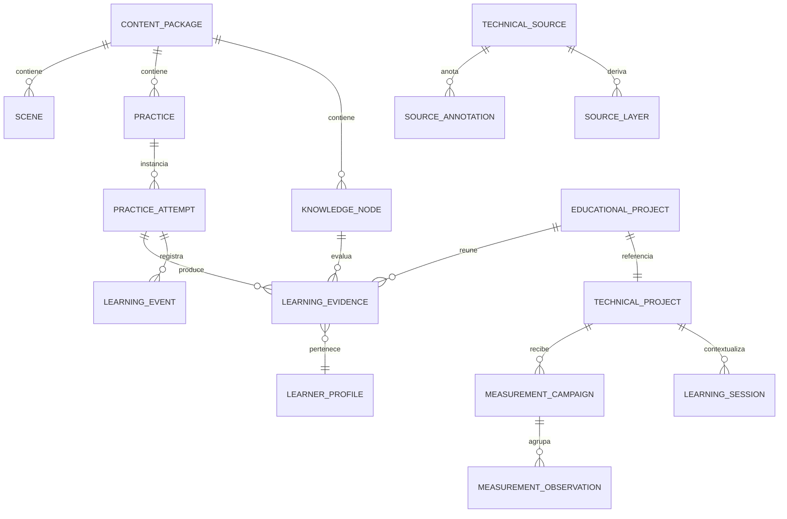

# Aprender — modelo de datos propuesto

Estado: diseño lógico revisado; pendiente de aprobación antes del Sistema 0.  
Regla central: ninguna entidad educativa duplica dimensiones o geometría del proyecto canónico.

## 1. Tres ámbitos de estado

| Ámbito | Contenido | Autoridad | Duración |
|---|---|---|---|
| Proyecto técnico | reloj, movimiento, cotas, tolerancias, procedencia, mates | `WatchProject` | permanente/portable |
| Sesión educativa | cámara, tiempo, escena, fallos simulados, acciones, respuesta actual | `LearningSession` | reversible y reanudable |
| Expediente de aprendizaje | intentos, evidencias, dominio, mediciones, proyectos | repositorios Aprender | permanente/portable opcional |

Un `LearningSession` referencia un `projectId` y un fingerprint de versión. No contiene un `WatchProject` copiado. Los snapshots transitorios usados para deshacer no se convierten en una segunda fuente de verdad.

## 2. Identidad y referencias canónicas

### 2.1 Referencia de entidad

```ts
type EntitySelector =
  | { kind: 'instance-id'; id: string }
  | { kind: 'legacy-part'; partId: WatchPartId }
  | { kind: 'role'; role: string; ordinal?: number }
  | { kind: 'subsystem'; subsystem: string }
  | { kind: 'tag-query'; all?: string[]; any?: string[] }

interface CanonicalEntityRef {
  projectId: string
  movementRef?: string
  selector: EntitySelector
  resolution: 'exactly-one' | 'one-or-more' | 'optional'
}

interface EntityResolution {
  state: 'resolved' | 'missing' | 'ambiguous' | 'unsupported'
  entities: ResolvedEntity[]
  reason?: string
  projectFingerprint: string
}
```

El contenido usa roles como `power-source`, `escape-wheel`, `setting-lever` o `upper-train-bridge`, no posiciones de un array. El adapter v5 puede resolver los roles disponibles a `WatchPartId`/`MechanicalArborId`. Una topología futura puede resolverlos a instancias sin cambiar el contenido.

### 2.2 Capacidades

Cada entidad resuelta declara capacidades. Una práctica que necesita `remove` no se ofrece si la entidad solo permite `select` y `hide`.

```ts
type EntityCapability =
  | 'select' | 'hide' | 'isolate' | 'explode' | 'section'
  | 'animate' | 'measure' | 'remove' | 'install'
  | 'lubricate' | 'inspect' | 'fault-target' | 'compare'
```

Esto evita asumir que toda geometría visible puede desmontarse o medirse con fidelidad.

### 2.3 Referencias de movimiento y presentación por subsistemas

```ts
interface MovementReference {
  id: string
  manufacturerId: string
  caliber: string
  familyId?: string
  variantOf?: string
  officialSourceIds: string[]
  capabilityProfileId: string
  canonicalTemplateId?: string
  tags: string[]
}

interface SubsystemPresentation {
  id: string
  movementRefId: string
  includedSubsystemSelectors: EntitySelector[]
  hiddenSubsystemSelectors: EntitySelector[]
  disabledInteractionSelectors: EntitySelector[]
  rationale: string
  limitations: string[]
}
```

Los fixtures y contenidos iniciales priorizan MIYOTA, pero `manufacturerId`/`familyId` son datos y no discriminantes cerrados del dominio. En el 8215, ocultar rotor, automático o calendario para una escena inicial no elimina instancias ni crea otra versión física: `SubsystemPresentation` solo compone visibilidad e interacción sobre el mismo assembly canónico.

## 3. Evidencia, procedencia y exactitud

### 3.1 Claim común

```ts
type EvidenceOrigin =
  | 'official' | 'supplier' | 'measured' | 'imported'
  | 'estimated' | 'designed' | 'unknown' | 'visual-only'

type MethodClass =
  | 'source-statement' | 'direct-measurement' | 'derived-geometry'
  | 'analytical-model' | 'exact-kernel' | 'educational-simulation'
  | 'user-observation' | 'tutor-inference'

type Exactness = 'exact' | 'analytical' | 'approximate' | 'partial' | 'indeterminate'

interface EvidenceClaim<T = unknown> {
  id: string
  subject: CanonicalEntityRef | { kind: 'project'; projectId: string }
  predicate: string
  value: T | null
  unit?: string
  origin: EvidenceOrigin
  method: MethodClass
  exactness: Exactness
  reliability: Reliability
  uncertainty?: UncertaintyStatement
  sourceRefs: string[]
  inputClaimIds: string[]
  generatedBy: { system: string; version: string }
  projectFingerprint?: string
  generatedAt: string
  limitations: string[]
}
```

`EvidenceOrigin` no sustituye `DataQuality`; es una vista normalizada para Aprender. Un adapter conserva el valor original. `method` y `exactness` son ejes independientes: una cota oficial puede ser parcial y un cálculo exacto puede operar sobre geometría estimada.

### 3.2 Incertidumbre

```ts
interface UncertaintyStatement {
  minus?: number
  plus?: number
  standardUncertainty?: number
  confidenceLevel?: number
  distribution?: UncertaintyDistribution
  contributors?: Array<{ label: string; value: number; unit: string }>
  statement: string
}
```

### 3.3 Vigencia

Los claims derivados incluyen `projectFingerprint`, hash de inputs y versión de motor. Un cambio de cota los marca `stale`; no se reutilizan como evidencia vigente. El CAD exacto necesita además hash del protocolo, builder y, cuando exista, asset geométrico.

## 4. Paquetes de contenido

```ts
interface LearningContentPackage {
  format: 'watchlab-learning-pack'
  schemaVersion: 1
  id: string
  version: string
  locale: string
  fallbackLocale?: string
  title: string
  origin: 'integrated' | 'local-unsigned'
  contributors?: Contributor[]
  appCompatibility: { minimum: string; maximumExclusive?: string }
  requiredCapabilities: string[]
  knowledgeNodes: KnowledgeNode[]
  scenes: EducationalScene[]
  practices: PracticeDefinition[]
  faultScenarios: FaultScenario[]
  projects: EducationalProjectTemplate[]
  sourceRefs: SourceDependency[]
  glossary: GlossaryEntry[]
  integrity: { algorithm: 'sha256'; digest: string; signature?: string }
}

interface SourceDependency {
  sourceId: string
  availability: 'required-local' | 'optional-local' | 'portable-reference'
  requiredLayerKinds?: Array<'original' | 'ocr' | 'translation' | 'plain-explanation'>
}
```

Los paquetes se validan al instalar/cargar. La firma es opcional y se reserva para una futura distribución; un paquete personal `local-unsigned` no requiere modo desarrollador. `SourceDependency` referencia la biblioteca por ID y nunca transporta rutas locales; una dependencia privada ausente degrada el contenido con un diagnóstico. Un fallo de contenido deshabilita la unidad afectada y no bloquea el proyecto técnico.

## 5. Grafo de conocimiento

```ts
type Difficulty = 1 | 2 | 3 | 4 | 5

interface KnowledgeNode {
  id: string
  slug: string
  names: Record<string, string>
  summary: Record<string, string>
  difficulty: Difficulty
  estimatedEffortMinutes?: number
  tags: string[]
  prerequisites: KnowledgeRequirement[]
  relations: KnowledgeEdge[]
  entitySelectors: EntitySelector[]
  subsystemSelectors: EntitySelector[]
  applicableWhen?: CapabilityExpression
  exampleMovementQueries: MovementQuery[]
  sceneIds: string[]
  practiceIds: string[]
  misconceptionIds: string[]
  glossaryIds: string[]
  sourceRefs: SourceCitation[]
  learningObjectives: LearningObjective[]
}

interface KnowledgeRequirement {
  nodeId: string
  minimumMastery: 'exposed' | 'practising' | 'demonstrated'
  reason: string
}

interface KnowledgeEdge {
  type: 'prerequisite' | 'part-of' | 'uses' | 'contrasts' | 'diagnoses' | 'measured-by' | 'designs'
  targetId: string
  strength?: number
}
```

El linter rechaza IDs duplicados, prerrequisitos inexistentes y ciclos de prerrequisito no justificados. Otras relaciones sí pueden formar ciclos.

## 6. Escenas educativas

El contrato completo aparece en `APRENDER-CONTENIDO.md`. En datos, una escena se compone de estado inicial, pasos, timeline, overlays, interacciones, condiciones y política de salida.

```ts
interface EducationalScene {
  id: string
  version: string
  title: string
  requires: CapabilityExpression
  bindings: Record<string, EntitySelector>
  initial: SceneStateDefinition
  steps: SceneStep[]
  exitPolicy: 'restore-all' | 'restore-view' | 'offer-apply-project-changes'
  sourceRefs: SourceCitation[]
}
```

Los `bindings` desacoplan el guion de un calibre. Un paso usa `$escapeWheel`; el resolvedor determina la entidad o declara la escena no aplicable.

## 7. Prácticas, intentos y eventos

```ts
type PracticeKind =
  | 'observe' | 'identify' | 'sequence' | 'calculate' | 'measure'
  | 'compare' | 'disassemble' | 'assemble' | 'diagnose'
  | 'design' | 'explain' | 'project-milestone'

interface PracticeDefinition {
  id: string
  version: string
  kind: PracticeKind
  title: string
  objectiveIds: string[]
  knowledgeNodeIds: string[]
  sceneId?: string
  setup: PracticeSetup
  allowedActions: string[]
  successCriteria: CriterionDefinition[]
  hints: HintDefinition[]
  evidenceRules: EvidenceRule[]
  scoringPolicy: ScoringPolicy
  restorePolicy: EducationalScene['exitPolicy']
}

interface PracticeAttempt {
  id: string
  practiceId: string
  practiceVersion: string
  profileId: string
  projectId: string
  projectFingerprint: string
  mode: 'guided' | 'assisted' | 'free' | 'assessment'
  startedAt: string
  endedAt?: string
  status: 'active' | 'submitted' | 'evaluated' | 'abandoned' | 'invalidated'
  seed?: number
  eventStreamId: string
  evaluation?: AttemptEvaluation
}

interface LearningEvent {
  id: string
  streamId: string
  sequence: number
  at: string
  type: string
  actor: 'learner' | 'system' | 'tutor'
  entityRefs: CanonicalEntityRef[]
  payload: unknown
  educationalSimulation: boolean
}
```

El event stream permite reconstruir orden, tiempos, herramientas, errores, pistas y recuperación. Los eventos se validan por esquema y son append-only; correcciones posteriores crean eventos compensatorios.

## 8. Montaje, herramientas y lubricación

```ts
interface AssemblyOperationDefinition {
  id: string
  action: 'remove' | 'install' | 'loosen' | 'tighten' | 'release-energy' | 'clean' | 'lubricate' | 'regulate'
  target: EntitySelector
  prerequisites: OperationCondition[]
  tools: ToolRequirement[]
  orientation?: OrientationConstraint
  forceEnvelope?: { minimum?: number; maximum?: number; unit: string; exactness: Exactness }
  risks: RiskDefinition[]
  consequences: ConsequenceDefinition[]
}

interface AssemblySessionState {
  installed: Record<string, boolean>
  fasteners: Record<string, FastenerState>
  orientations: Record<string, QuaternionLike>
  contamination: Record<string, ContaminationState>
  lubrication: Record<string, LubricationState>
  educationalDamage: Record<string, SimulatedDamageState>
}
```

Este estado es un delta educativo sobre entidades canónicas. No añade cotas físicas. Una consecuencia contiene `educationalSimulation: true`, causalidad, reversibilidad y fidelidad.

## 9. Averías y diagnóstico

```ts
interface FaultScenario {
  id: string
  version: string
  title: string
  requiredCapabilities: CapabilityExpression
  seedPolicy: 'fixed' | 'attempt-derived' | 'author-supplied'
  baseState: ScenarioBaseState
  injections: FaultInjection[]
  visibleSymptoms: ObservableDefinition[]
  availableData: DataDisclosure[]
  hiddenData: DataDisclosure[]
  tests: DiagnosticTestDefinition[]
  hypotheses: HypothesisDefinition[]
  expectedDiagnosis: CausalDiagnosis
  rubric: CriterionDefinition[]
}

interface FaultInjection {
  id: string
  target: EntitySelector
  kind: string
  parameters: Record<string, EvidenceClaim>
  fidelity: 'illustrative' | 'rule-based' | 'analytical' | 'kernel-backed'
  limitations: string[]
  educationalSimulation: true
}

interface DiagnosticRun {
  id: string
  scenarioId: string
  scenarioVersion: string
  attemptId: string
  seed: number
  selectedTests: string[]
  observations: DiagnosticObservation[]
  hypotheses: HypothesisAssessment[]
  submittedDiagnosis?: CausalDiagnosis
}
```

Una prueba puede tener coste en tiempo, riesgo, necesidad de desmontaje y poder discriminante. El evaluador valora tanto el resultado como la ruta de razonamiento.

## 10. Metrología

```ts
interface InstrumentRecord {
  id: string
  name: string
  kind: string
  manufacturer?: string
  model?: string
  serial?: string
  resolution: number
  unit: string
  calibrationDate?: string
  calibrationDue?: string
  calibrationSourceRef?: string
}

interface MeasurementCampaign {
  id: string
  projectId: string
  target: CanonicalEntityRef
  measurand: string
  procedureRef?: string
  datumRefs: CanonicalEntityRef[]
  instrumentIds: string[]
  environmentalNotes?: string
  observations: MeasurementObservation[]
  aggregation?: MeasurementResult
  status: 'draft' | 'reviewed' | 'promoted' | 'rejected'
}

interface MeasurementObservation {
  id: string
  value: number
  unit: string
  instrumentId: string
  operatorProfileId: string
  at: string
  repetition: number
  conditions?: Record<string, number | string>
  notes?: string
  excluded?: { reason: string; reviewedBy: string }
}

interface MeasurementResult {
  value: number
  unit: string
  repeatability: number
  expandedUncertainty: number
  coverageFactor?: number
  confidence: Reliability
  method: string
}

interface DimensionPromotionProposal {
  id: string
  campaignId: string
  targetPath: string
  before: Dimension
  after: Dimension
  status: 'pending' | 'applied' | 'rejected'
  reviewedAt?: string
}
```

El camino `observaciones → resultado → propuesta → Dimension` es explícito. Nunca se etiqueta una envolvente STEP como medición funcional de pivote, perfil o asiento.

## 11. Donantes

```ts
type ExtendedCompatibilityState =
  | 'compatible'
  | 'conditional'
  | 'incompatible'
  | 'insufficient-data'

interface CompatibilityAssessment {
  id: string
  donorPresetId: string
  targetProjectId: string
  targetFingerprint: string
  componentType: MechanicalComponentId
  state: ExtendedCompatibilityState
  checks: CompatibilityCheckEvidence[]
  requiredModifications: ModificationProposal[]
  missingData: MissingDataRequirement[]
  engineVersion: string
  generatedAt: string
}

interface TransplantDecision {
  id: string
  assessmentId: string
  decision: 'accepted' | 'accepted-with-conditions' | 'rejected' | 'forced'
  rationale: string
  acceptedRisks: string[]
  resultingProjectFingerprint?: string
  at: string
}
```

`forced` pertenece a la decisión. La evaluación original permanece inmutable.

## 12. Biblioteca técnica

```ts
type SourceAuthorityClass =
  | 'official-manufacturer'
  | 'own-observation'
  | 'private-horology-book'
  | 'educational-derived'

type SourceUsage =
  | 'private-local'
  | 'official-linked'
  | 'official-cached'
  | 'user-created'
  | 'shareable'
  | 'unknown'

interface SourceLocator {
  page?: string
  figure?: string
  section?: string
  timecode?: string
  region?: { x: number; y: number; width: number; height: number; coordinateSpace: 'normalized-page' }
}

interface TechnicalSource {
  id: string
  type: 'book' | 'manual' | 'drawing' | 'parts-list' | 'article' | 'image' | 'diagram' | 'dataset' | 'note' | 'pdf'
  title: string
  authors?: string[]
  publisher?: string
  edition?: string
  publicationDate?: string
  language: string
  authorityClass: SourceAuthorityClass
  usage: SourceUsage
  url?: string
  importedAt?: string
  retrievedAt?: string
  mediaType?: string
  localAssetId?: string
  integrity?: { algorithm: 'sha256'; digest: string }
  immutableOriginal: true
}

interface SourceLayer {
  id: string
  sourceId: string
  parentLayerId?: string
  kind: 'ocr' | 'translation' | 'plain-explanation' | 'technical-interpretation' | 'practical-application'
  locale: string
  contentAssetId: string
  author?: string
  version: string
  basedOnLocator: SourceLocator
  usage: SourceUsage
}

interface SourceCitation {
  sourceId: string
  locator?: SourceLocator
  layerId?: string
  note?: string
}

interface SourceAnnotation {
  id: string
  sourceId: string
  locator: SourceCitation['locator']
  body: string
  authorProfileId: string
  linkedKnowledgeNodeIds: string[]
  linkedEntityRefs: CanonicalEntityRef[]
  linkedCaliberRefs: string[]
  linkedSceneIds: string[]
  difficulty?: Difficulty
}
```

Los assets binarios se guardan por hash fuera de los payloads JSON. La base guarda metadata y relaciones. Un PDF local puede existir solo en la biblioteca; un paquete referencia su `sourceId` y localizador sin incrustar necesariamente el binario.

### 12.1 Reglas de autoridad

1. `official-manufacturer` es autoridad para especificaciones nominales, funciones, referencias, planos, listas/despieces, frecuencia, rubíes, reserva y variantes del calibre al que aplica.
2. `own-observation` es autoridad para una unidad física identificada: estado, medidas, fotografías, desgaste, modificaciones y desviaciones del nominal.
3. `private-horology-book` sostiene teoría general, fabricación, herramientas, mecánica, regulación, diagnóstico y complicaciones.
4. `educational-derived` explica o transforma las anteriores; no sustituye su autoridad.

El resolvedor selecciona por predicado, calibre/variante y ámbito. No infiere un nominal MIYOTA desde el libro si existe documentación oficial específica. Si una medición propia difiere del nominal, conserva ambos claims y expresa la diferencia.

### 12.2 Reglas privadas y exportación

- Se permiten importación local, caché personal, OCR, traducción, explicación y anotación sin flujo editorial público.
- `private-local`, `official-cached` y `unknown` no se incluyen por defecto en `.wplab` ni en paquetes exportados.
- `official-linked` exporta cita/URL, no el binario cacheado.
- `user-created` tampoco implica automáticamente `shareable`; incluirlo requiere selección expresa.
- Marketplace, territorios, firma obligatoria y roles de publicación quedan fuera del modelo inicial.

## 13. Progreso y evidencia de aprendizaje

```ts
type MasteryState = 'unseen' | 'exposed' | 'practising' | 'demonstrated' | 'retention-due'

interface LearningEvidence {
  id: string
  profileId: string
  kind: 'answer' | 'action' | 'identification' | 'measurement' | 'diagnosis' | 'assembly' | 'explanation' | 'project-artifact'
  attemptId?: string
  objectiveIds: string[]
  knowledgeNodeIds: string[]
  entityRefs: CanonicalEntityRef[]
  result: 'supports' | 'contradicts' | 'inconclusive'
  strength: number
  independenceKey?: string
  artifactRefs: string[]
  evaluator: { kind: 'deterministic' | 'rubric' | 'human' | 'tutor'; version: string }
  at: string
}

interface MasteryRecord {
  profileId: string
  knowledgeNodeId: string
  state: MasteryState
  confidence: number
  supportingEvidenceIds: string[]
  contradictionEvidenceIds: string[]
  lastPractisedAt?: string
  retentionDueAt?: string
  repeatedErrorCodes: Record<string, number>
}
```

El algoritmo de dominio debe ser determinista y versionado. La puntuación del tutor puede generar una propuesta de evidencia, pero no sustituir una evaluación determinista donde exista.

## 14. Proyectos educativos

```ts
interface EducationalProjectDossier {
  id: string
  profileId: string
  templateId: string
  title: string
  technicalProjectId: string
  objective: string
  status: 'planned' | 'active' | 'blocked' | 'review' | 'completed' | 'archived'
  milestoneIds: string[]
  entityRefs: CanonicalEntityRef[]
  donorPresetIds: string[]
  sourceCitations: SourceCitation[]
  measurementCampaignIds: string[]
  uncertaintyNotes: string[]
  decisions: DossierDecision[]
  errorEventIds: string[]
  validationClaimIds: string[]
  billOfMaterials: BillOfMaterialsItem[]
  assemblyPlan: AssemblyOperationDefinition[]
  artifactRefs: string[]
  resultSummary?: string
}
```

Completar un expediente requiere criterios por hito y evidencia. El campo `status` no se deriva de haber visitado páginas.

## 15. Contexto estructurado del tutor

```ts
interface TutorContextEnvelope {
  schemaVersion: 1
  generatedAt: string
  locale: string
  privacy: { externalTransmissionAllowed: boolean; redactions: string[] }
  activeProject: ProjectContextSummary
  activeMovement: MovementContextSummary
  selection: EntityContextSummary[]
  scene?: SceneContextSummary
  lesson?: KnowledgeContextSummary
  practice?: PracticeContextSummary
  learner: LearnerContextSummary
  measurements: MeasurementContextSummary[]
  missingData: MissingDataRequirement[]
  donorCandidates: DonorContextSummary[]
  engineering: EngineeringContextSummary
  evidenceClaims: EvidenceClaim[]
  availableTutorActs: string[]
  citations: SourceCitation[]
  contextBudget: { omittedSections: string[]; truncationPolicy: string }
}
```

El contexto incluye solo lo necesario para el acto pedido. Un proveedor externo recibe el contexto después de aplicar privacidad y redacción; el funcionamiento determinista básico no depende de él.

## 16. Relaciones principales



## 17. Reglas de integridad

1. Toda referencia de entidad se resuelve contra una versión concreta del proyecto.
2. Ningún contenido externo escribe directamente una `Dimension`.
3. Toda promoción de medición es revisable y deshacible.
4. Toda simulación educativa usa `resultKind: 'educational-simulation'` y `engineeringAuthority: false`; no se representa mediante una bandera de exactitud.
5. Todo resultado exacto tiene job, versión, fingerprint y estado exitoso.
6. Una fuente original es inmutable; OCR, traducciones, explicaciones e interpretaciones son capas distintas.
7. Los intentos enviados son append-only; una reevaluación crea una versión nueva.
8. El progreso puede bajar a `retention-due` o acumular evidencia contradictoria; no es una marca irreversible.
9. Un contenido no aplicable se explica; no se adapta silenciosamente a otra topología.
10. Los datos desconocidos nunca se sustituyen por cero sin registrar el fallback y su limitación.
11. Un claim nominal MIYOTA usa una fuente oficial específica cuando exista; el libro privado no la suplanta.
12. Ningún binario `private-local`, `official-cached` o `unknown` entra en una exportación por defecto.
13. Ocultar un subsistema en una escena no elimina ni modifica sus entidades canónicas.

### Contratos materializados en Sistema 0

Los nombres normativos y validadores implementados están en `src/learning`: `CanonicalAssembly`, `PartDefinition`, `PartInstance`, `AssemblyInterface`, `AssemblyDependency`, `MovementReference`, `ProjectEntityIndex`, `FidelityProfile`, `EvidenceClaim`, contratos de sesión/evaluación y manifiestos declarativos. `APRENDER-SISTEMA-0.md` documenta sus campos efectivos y las partes aún no persistidas. Ante diferencias de detalle entre ejemplos exploratorios de este documento y los esquemas runtime, prevalecen el ADR correspondiente y el validador versionado.
