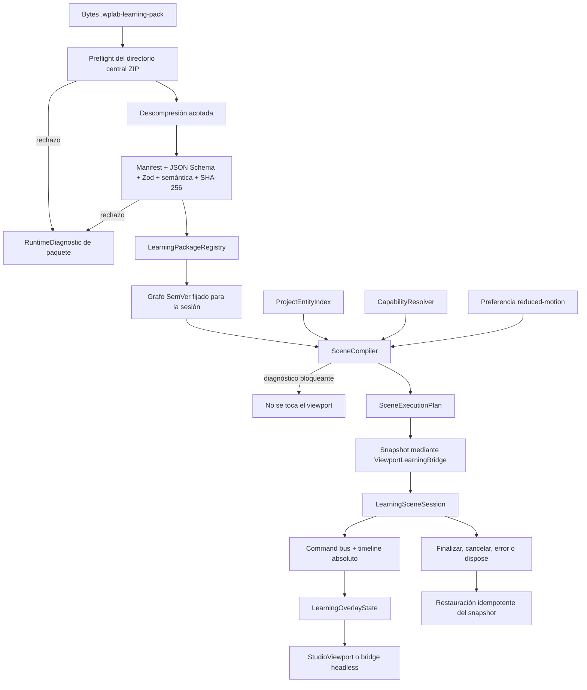

# Aprender — Sistema 1: runtime completo de escenas educativas

Estado: **implementado y verificado**. Fecha: 2026-07-22. Este documento cierra Sistema 1 y no inicia Sistema 2.

## 1. Objetivo y resultado

Sistema 1 convierte los contratos de Sistema 0 en un runtime general, determinista y ajeno a React. Un paquete `.wplab-learning-pack` puede cargarse desde bytes, validarse, registrarse con dependencias, compilar una escena contra un `ProjectEntityIndex`, aplicar un overlay visual reversible, ejecutar pasos y timeline, recibir comandos semánticos, emitir diagnósticos y eventos y restaurar la presentación anterior sin modificar `WatchProject`.

La escena declarativa nunca se ejecuta directamente. La frontera central es:

```text
bytes ZIP
  → preflight seguro
  → paquete materializado y validado
  → registro y grafo de versiones fijadas
  → compilación contra índice + capacidades
  → SceneExecutionPlan inmutable para la sesión
  → snapshot del viewport
  → overlay + timeline + comandos
  → restauración idempotente
```

## 2. Alcance implementado

- Carga real desde bytes de paquetes `integrated` y `local-unsigned`.
- Preinspección del directorio central ZIP antes de descomprimir.
- JSON Schema ejecutable con Ajv, contratos Zod y validación semántica.
- SHA-256 de activos y fingerprint SHA-256 del paquete.
- Registro multiversión, resolución SemVer, detección de colisiones, ausencias y ciclos.
- Compilador de escenas con capacidades, selectores, cardinalidad, conflictos y movimiento reducido.
- Selectores semánticos recursivos, limitados y deterministas.
- Overlay educativo completo, descartable y separado del proyecto.
- Timeline evaluable por tiempo absoluto y scheduler sustituible.
- Máquina de estados de sesión, command bus, eventos y diagnósticos estructurados.
- Bridge headless y bridge estrecho con `StudioViewport`.
- Arnés manual solo de desarrollo que usa el runtime real.
- Cuatro escenas contractuales y pruebas unitarias, de integración y regresión.

## 3. No objetivos respetados

No se han implementado navegación final de Aprender, mapa de conocimiento, progreso persistente, perfiles, SQLite o IndexedDB educativos, biblioteca PDF, OCR, traducción, tutor o IA, evaluación completa conectada, editor visual, desmontaje completo, averías, metrología, modelos internos MIYOTA, escritura general v6, sincronización, marketplace ni exportación pública de cursos.

Tampoco existe una biblioteca persistente de paquetes. `local-unsigned` requiere bytes suministrados explícitamente y desaparece al terminar el proceso. El arnés es una herramienta de desarrollo, no la interfaz de producto.

## 4. Arquitectura final

| Responsabilidad | Implementación | Límite de responsabilidad |
| --- | --- | --- |
| Carga y seguridad | `LearningPackageLoader` | bytes → paquete validado; no instala ni persiste |
| Registro | `LearningPackageRegistry` | versiones, colisiones y grafo SemVer fijado |
| Orquestación | `LearningRuntime` | carga, compilación y exclusión de sesiones activas |
| Compilación | `SceneCompiler` / `SceneExecutionPlan` | contenido declarativo → plan determinista |
| Selectores | `SemanticSelectorResolver` | `ProjectEntityIndex` → entidades explicables |
| Capacidades | `CapabilityResolver` | requisitos versionados → resolución explicada |
| Sesión | `LearningSceneSession` | estados, snapshot, ejecución y restauración |
| Presentación | `LearningOverlayState` | estado educativo visual, nunca técnico |
| Tiempo | `LearningTimelineController` | evaluación absoluta, play/pause/scrub/barriers |
| Intenciones | `LearningCommandBus` | comandos válidos según estado y eventos |
| Viewport | `ViewportLearningBridge` | snapshot, aplicar overlay y restaurar |
| Errores | `RuntimeDiagnostic` | fallo estructurado, recuperabilidad y bloqueo |
| Telemetría efímera | `RuntimeEvent` | eventos serializables sin persistencia |

El runtime vive bajo `src/learning/runtime`. No importa componentes React. React solo aparece en el adaptador de presentación y en el arnés de desarrollo.

## 5. Diagrama de flujo



## 6. Estados y transiciones

La sesión distingue `idle`, `loading`, `validating`, `compiling`, `ready`, `running`, `paused`, `awaiting-interaction`, `completed`, `cancelling`, `restoring`, `failed` y `disposed`.

`LearningRuntime` usa los estados de preparación; `LearningSceneSession` conserva los de ejecución. El command bus contiene una matriz explícita de comandos permitidos por estado. Una transición inválida devuelve `LR-COMMAND-REJECTED`, se registra como evento y no altera la sesión.

La restauración se activa al completar, cancelar/abortar, detener, fallar, disponer, sustituir la carga activa o reiniciar. La UI futura deberá llamar `dispose()` al desmontar o cambiar de proyecto. La restauración tolera llamadas repetidas y conserva un diagnóstico específico si el bridge falla.

## 7. Carga de paquetes

`LearningPackageLoader` ofrece dos entradas explícitas:

- `loadIntegrated(bytes)` para contenido distribuido con la aplicación;
- `loadLocalUnsigned(bytes)` para una elección local consciente, sin instalación ni persistencia.

El manifiesto debe coincidir con el origen usado. La carga valida estructura y versión de formato, `schemaId`, SemVer del paquete, versión mínima y máxima de la aplicación, IDs, idiomas, dependencias declaradas, capacidades, referencias internas, activos requeridos, tamaños y hashes. El resultado conserva el paquete lógico, los activos por ID, el origen, metadatos del ZIP y el fingerprint del contenedor.

Ajv 2020 ejecuta `learning-pack-v1.schema.json`; Zod valida la forma runtime y la fase semántica comprueba las relaciones profundas. Esta doble frontera es deliberada: JSON Schema es el contrato interoperable y Zod protege el código TypeScript.

### 7.1 Seguridad ZIP

Antes de llamar a `unzipSync`, el cargador lee el EOCD y todas las entradas del directorio central. Rechaza ZIP multidisco, cifrado, truncado, rutas absolutas, unidades Windows, barras inversas, segmentos `.`/`..`, nombres ambiguos sin distinguir mayúsculas, múltiples manifiestos y enlaces simbólicos Unix. No confía en los nombres producidos después de inflar.

Límites iniciales, configurables por instancia:

| Límite | Valor por defecto |
| --- | ---: |
| contenedor comprimido | 25 MiB |
| entradas | 1.000 |
| una entrada descomprimida | 8 MiB |
| total descomprimido | 64 MiB |
| ratio de compresión individual y agregado | 100:1 |
| profundidad de ruta | 16 segmentos |
| profundidad JSON | 32 niveles |
| longitud de ruta | 240 caracteres |

La librería `fflate` infla el contenedor en memoria, pero solo después del preflight y dentro de cuotas que acotan el peor caso. El loader no materializa archivos no declarados como contenido, aunque el preflight sí los contabiliza. Streaming real y firma criptográfica quedan fuera de Sistema 1.

## 8. Registro y dependencias

El registro identifica cada paquete por `(packageId, version)`. El mismo par solo puede registrarse de nuevo si su fingerprint coincide; una variante distinta produce colisión explícita. Varias versiones pueden coexistir.

La resolución:

1. parte de una versión raíz concreta o de la mayor versión disponible;
2. ordena versiones con SemVer y elige de forma determinista la mayor que satisface el rango;
3. detecta dependencia ausente, rango incompatible y ciclos;
4. devuelve un grafo fijado con las versiones exactas y sus diagnósticos.

La sesión conserva el paquete y versión del plan compilado. Registrar después una actualización no cambia el plan ya creado.

## 9. Compilación de escenas

`SceneCompiler` recibe paquete cargado, ID de escena, índice del proyecto, capacidades y preferencia de movimiento. Produce un plan únicamente si no hay diagnósticos bloqueantes.

La compilación comprueba existencia y referencias, requisitos de capacidad, selectores y cardinalidades, pasos, timeline, operaciones contradictorias y soporte visual. Ordena resultados, normaliza tiempos y conserva todas las resoluciones y advertencias. Ningún método del bridge se invoca durante esta fase; por ello una escena inválida no puede mutar la presentación.

Con movimiento reducido, las transiciones no esenciales pasan a duración cero, la cámara evita interpolaciones bruscas y el explosionado conserva el mismo resultado semántico como estado discreto. Las operaciones marcadas esenciales permanecen pausables.

## 10. Selectores semánticos

El resolver trabaja solo contra `ProjectEntityIndex`. Admite:

- instancia, definición, rol, subsistema, calibre, familia y variante;
- interfaz, etiqueta educativa, tipo de pieza y ensamblaje;
- composición acotada `all`, `any` y `not`;
- predicados `equals`, `in` y `exists` sobre una lista cerrada de campos;
- la consulta heredada limitada de Sistema 0.

No interpreta JavaScript, SQL, regex ni expresiones libres. Se aplican límites de profundidad, ramas y predicados. Cada resolución conserva selector original, entidades ordenadas, omitidas, ambigüedad, confianza, procedencia y diagnósticos. La cardinalidad puede ser `exactly-one`, `one-or-more`, `zero-or-more` o un número exacto.

Una definición que corresponde a dos tornillos devuelve dos instancias distintas; no colapsa piezas físicas repetidas.

## 11. Overlay y precedencia

`LearningOverlayState` representa selección, visible/oculto/aislado, transparencia, resaltado, explosionado, sección, cámara, labels, flechas, overlays, anotaciones, estado temporal, paso y pregunta activos, respuestas provisionales, errores simulados, filtros y velocidad.

No contiene `WatchProject`, no se escribe en el store, no altera validaciones y puede descartarse completo. La precedencia documentada, de menor a mayor, es:

1. estado técnico del proyecto;
2. preferencias normales del viewport;
3. overlay educativo;
4. interacción temporal del usuario.

La interacción temporal no se convierte en dato de la escena ni del proyecto. Al restaurar se recupera el snapshot presentacional anterior, no una reconstrucción parcial calculada a partir del overlay.

## 12. Bridge con `StudioViewport`

`ViewportLearningBridge` expone exclusivamente capacidades, snapshot, aplicación del overlay y restauración. `StudioViewportLearningBridge` publica el overlay mediante un external store pequeño y traduce IDs canónicos a los IDs visuales existentes. El viewport consume selección, visibilidad, aislamiento, resaltado, explosionado, sección, cámara y texto superpuesto; no conoce paquetes, lecciones, competencias, evaluación ni progreso.

Incompatibilidades reales encontradas:

- el viewport anterior agrupaba aislamiento, explosionado y sección en un único `viewMode`; el overlay ahora permite combinarlos sin escribir ese estado normal;
- selección y preferencias visuales viven en Zustand, mientras la cámara era estado local de React; el bridge captura una presentación educativa separada;
- el modelo visual v5 tiene IDs cerrados y no puede representar dos tornillos v6 arbitrarios como dos mallas si no existe geometría correspondiente;
- la sección actual usa un plano fijo;
- transparencia educativa por pieza y flechas no tienen infraestructura completa;
- no existe cámara ortográfica educativa.

Por ello el bridge anuncia transparencia como limitada, y flechas, transformaciones arbitrarias y cámara ortográfica como no disponibles; las etiquetas 2D simples sí están disponibles. Además, el compilador consulta si cada entidad resuelta tiene representación en el bridge: una instancia v6 sin malla bloquea antes del snapshot. Una escena obligatoria no compila; una capacidad limitada solo se acepta si el contenido lo declara expresamente. No se simula éxito.

## 13. Timeline determinista

`evaluateTimelineAt(plan, timeMs, interactions)` es una función pura. Reconstruye el overlay desde el estado base y aplica acciones ordenadas hasta el tiempo solicitado. Cámara, explosionado y transparencia se interpolan; el resto usa cambios deterministas. Ir directamente a un instante produce el mismo resultado que avanzar hasta él.

El controlador ofrece iniciar, pausar, reanudar, detener, reiniciar, scrub, velocidad y avance controlado. Los pasos añaden navegación siguiente, anterior y salto. Las barreras de interacción detienen la evaluación en `awaiting-interaction`; no se atraviesan hasta recibir la condición declarada. El scheduler es inyectable y las pruebas usan reloj falso, no esperas reales.

Cancelar y restaurar pertenecen a la sesión transaccional: el timeline se dispone antes de que el bridge restaure el snapshot.

## 14. Command bus

Los comandos son intenciones semánticas: iniciar, pausar, reanudar, detener, reiniciar, seleccionar entidad, confirmar, pedir pista, navegar pasos, hacer scrub, cambiar velocidad, responder, aislar subsistema, restaurar vista, cancelar y abortar.

No contienen coordenadas, teclas ni gestos. El bus valida el comando contra el estado, delega en la sesión, convierte errores en diagnósticos y emite aceptación/rechazo. Teclado, touch, SpaceMouse o un tutor futuro deberán traducir su entrada a este vocabulario.

## 15. Capacidades

Cada capacidad tiene ID, versión, estado (`available`, `unavailable`, `limited`, `unknown`) y explicación. Los requisitos de escena pueden ser una cadena compacta o un objeto declarativo que fija rango, opcionalidad y aceptación explícita de una implementación limitada. La resolución es previa a cualquier snapshot o mutación.

El runtime headless anuncia sus capacidades propias; cada bridge añade la matriz visual real. Entre las capacidades modeladas están `learning.content`, `learning.scene-runtime`, selección, visibilidad, aislamiento, explosionado, sección, cámara, overlays, scrub, movimiento reducido, entrada, CAD exacto y filesystem local.

`limited` no equivale automáticamente a disponible: el requisito decide si acepta la limitación. `unknown` nunca satisface una capacidad obligatoria.

## 16. Diagnósticos

`RuntimeDiagnostic` contiene código estable, categoría, severidad, mensaje, detalle técnico, fuente, paquete, escena, paso, selector, entidad, recuperación sugerida, bloqueo y seguridad de reintento.

Las categorías distinguen paquete, contenido, versión incompatible, capacidad ausente, selector vacío o ambiguo, estado inválido, bridge, restauración e interno. Los códigos usan el prefijo estable `LR-`. Las advertencias permanecen en el plan y los errores bloqueantes impiden iniciar.

Los fallos del bridge se convierten en `LR-BRIDGE-*`; un fallo de restauración no se oculta y deja la sesión en `failed`, con posibilidad de reintentar la restauración.

## 17. Eventos

`RuntimeEventEmitter` produce eventos v1 ordenados por secuencia, con timestamp, session ID y payload JSON serializable. Cubre paquete cargado/rechazado, escena compilada/iniciada/completada/cancelada, selector resuelto, paso mostrado, selección, comando rechazado, pista, respuesta, restauración y error.

No se persisten todavía y no incluyen copias completas del proyecto. Su forma estable permite que progreso, evaluación y tutor los consuman en Sistema 2 sin acoplarse al viewport.

## 18. Accesibilidad y movimiento reducido

El plan conserva descripción textual de escena, descripción de las entidades resueltas, orden lógico de pasos y labels accesibles de overlays. Toda acción esencial tiene un comando equivalente sin arrastre. Pausa y scrub son capacidades del núcleo, y no hay límites de tiempo por defecto.

La información visual admite texto y resaltado además del color. El modo de movimiento reducido cambia solo la presentación temporal: no cambia selectores, respuestas, criterios ni eventos evaluables.

## 19. Escenas contractuales

| Escena | Prueba contractual |
| --- | --- |
| A — v5 adaptado | carga, proyección v5→v6, selección, ocultación, aislamiento, restauración y proyecto intacto |
| B — ensamblaje v6 | dos tornillos físicos, selector por definición/rol, cardinalidad exacta, pasos, timeline y explosionado |
| C — MIYOTA 8215 | referencia documental, familia/variante respaldadas y ninguna invención de despiece interno |
| inválida | selector inexistente, capacidad ausente, compilación bloqueada y transición inválida |

El fixture de paquete también permite producir hash incorrecto y referencia rota para validar la frontera de carga.

## 20. Arnés de desarrollo

En desarrollo, `?learning-harness=1` carga de forma diferida `LearningRuntimeHarness`. No se añade a la navegación normal ni al bundle de ejecución de producción. Permite elegir fixture, paquete integrado o local sin firma, escena y bridge, alternar movimiento reducido, ver capacidades, plan, diagnósticos y eventos, y ejecutar iniciar/pausar/reanudar/siguiente/anterior/scrub/cancelar/fallo.

El objeto de automatización también está disponible en desarrollo como `window.__WPLAB_LEARNING_HARNESS__`. Tanto el panel como esa referencia usan `LearningDevelopmentHarness`, que a su vez instancia `LearningRuntime`; no existe un simulador paralelo.

## 21. Pruebas

Las pruebas nuevas cubren:

- preflight ZIP, manifiestos, traversal, rutas absolutas/Windows, duplicados, symlink, cuotas, ratio, profundidad, JSON Schema, hashes, activos y SemVer;
- registro multiversión, colisión, dependencia ausente, rangos, ciclos y fijación;
- todos los selectores, composición, predicados, cardinalidad, ambigüedad y orden;
- compilación válida/inválida, capacidades, conflictos, referencias y movimiento reducido antes de mutar;
- timeline puro, scrub, transición, barrera y scheduler falso;
- estados, comandos, play/pause/resume, pasos, cancelación, error, reintento, dispose y ejecución headless;
- restauración por completar/cancelar/error/desmontar, idempotencia, ausencia de persistencia y proyecto intacto;
- bridge, snapshot, restauración, limitaciones, errores y ausencia de responsabilidades pedagógicas;
- serialización, orden, session ID y privacidad de eventos;
- arnés real.

Resultado final: `npm run verify` terminó con código 0; ESLint no produjo errores ni advertencias, Vitest ejecutó 41 archivos y 148 pruebas —todas aprobadas— y `tsc -b && vite build` terminó correctamente. Vite mantuvo dos advertencias no bloqueantes ya visibles: un import dinámico ineficaz de `@tauri-apps/api/core.js` por existir imports estáticos y chunks superiores a 500 kB (`index`, 509,62 kB; `StudioViewport`, 1.049,62 kB). `npm audit --json` informó 0 vulnerabilidades. La prueba CAD se omitió porque no se modificó el sidecar ni un contrato consumido por él.

## 22. Archivos principales

```text
src/learning/runtime/
├── packageLoader.ts       ZIP, Schema, Zod, hashes y activos
├── packageRegistry.ts     versiones y dependencias
├── selectors.ts           resolución semántica
├── capabilities.ts        matriz y requisitos
├── compiler.ts            SceneExecutionPlan
├── overlay.ts             estado presentacional reversible
├── timeline.ts            evaluación temporal determinista
├── commands.ts            intenciones semánticas
├── bridge.ts              contrato y bridge headless
├── runtime.ts             orquestación y sesión transaccional
├── diagnostics.ts         errores estructurados
├── events.ts              eventos efímeros v1
└── developmentHarness.ts  API del arnés

src/learning/integrations/studioViewportBridge.ts
src/learning/dev/LearningRuntimeHarness.tsx
src/learning/fixtures/runtimeFixtures.ts
```

## 23. Limitaciones y deuda conocida

- `fflate` descomprime en memoria tras el preflight; no hay streaming por entrada.
- No hay firma del paquete, cadena de confianza, revocación ni sandbox de formatos activos. `local-unsigned` es explícito.
- El registro es de proceso y no instala ni desinstala paquetes.
- El bridge visual hereda la geometría y granularidad del viewport v5; entidades v6 sin malla no pueden dibujarse individualmente.
- Transparencia por pieza, flechas, labels anclados 3D, cámara ortográfica y planos de sección arbitrarios requieren ampliar el renderer.
- Las condiciones de espera son declarativas y acotadas; todavía no existe un motor de evaluación de actividades conectado.
- Los eventos no se persisten y no se convierten aún en evidencia.
- No existe recuperación automática si el propio viewport no puede restaurar; el diagnóstico permite reintento.
- No hay observador global de cambio de proyecto/capacidad: la futura UI debe cancelar o disponer la sesión mediante su ciclo de vida.
- La política de licencia, cuotas persistentes, caché, backups y migración de contenido corresponde a sistemas posteriores.

## 24. Criterios para Sistema 2

Sistema 2 debería conectar progreso y evaluación sin ensanchar el bridge visual. Antes de iniciarlo se debe aprobar un alcance que:

1. defina persistencia transaccional y migraciones de sesiones, progreso y eventos;
2. convierta solo eventos autorizados en evidencias versionadas mediante reglas deterministas;
3. mantenga paquete, actividad, rúbrica, proyecto y fingerprints fijados por sesión;
4. defina política de privacidad, retención, backup, exportación y borrado;
5. resuelva operación offline y actualización de paquetes sin alterar sesiones existentes;
6. mantenga separados proyecto técnico, simulación educativa, evidencia y validación de ingeniería;
7. añada pruebas de recuperación ante cierres y migraciones;
8. no convierta el arnés de Sistema 1 en UI final.

## 25. Integración posterior con Sistema 2

Sistema 2 consume `RuntimeEventEmitter` mediante una capa de coordinación externa y decide qué eventos persisten. Sistema 1 continúa sin imports de repositorios, perfiles, SQLite, IndexedDB, evidencia, evaluación o dominio. Se añadieron los eventos semánticos `selection-confirmed` y `barrier-resolved` porque son hitos pedagógicos reales del runtime; el resto de esta documentación y sus garantías permanecen vigentes.

Propuesta concreta: **Sistema 2 — sesiones, evidencia y progreso persistentes**, empezando por un repositorio local versionado y una canalización determinista `RuntimeEvent → EvidenceRecord → AssessmentResult`, sin tutor, biblioteca ni IA.
