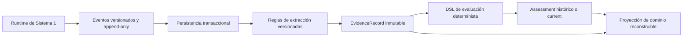
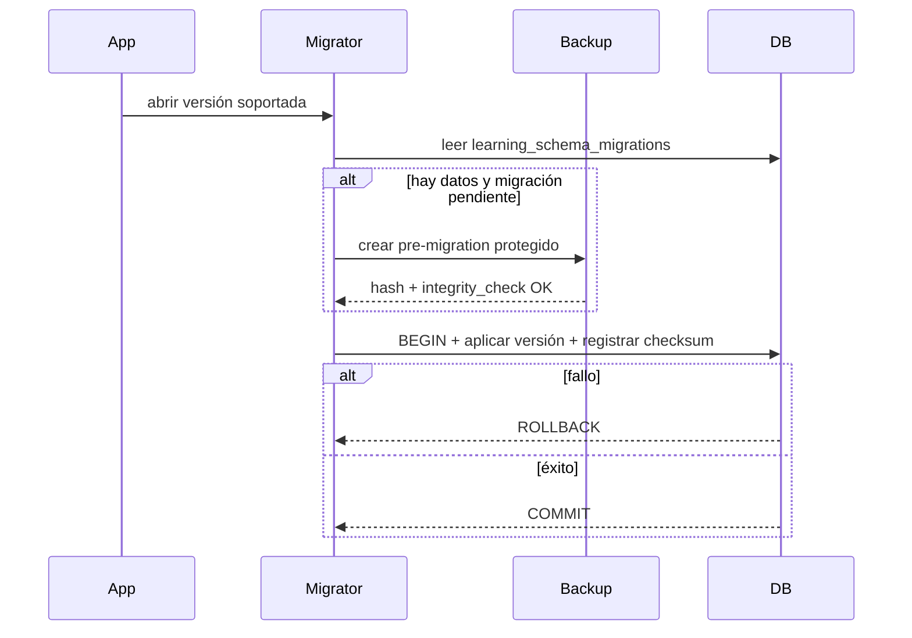
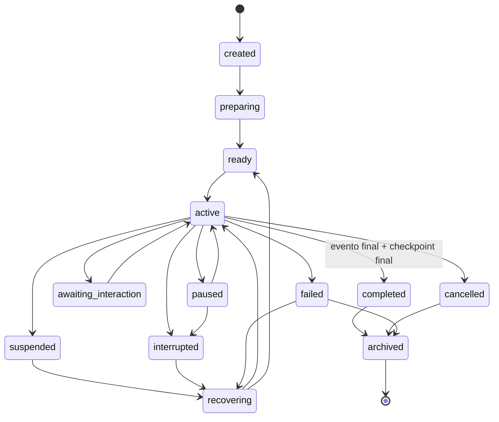
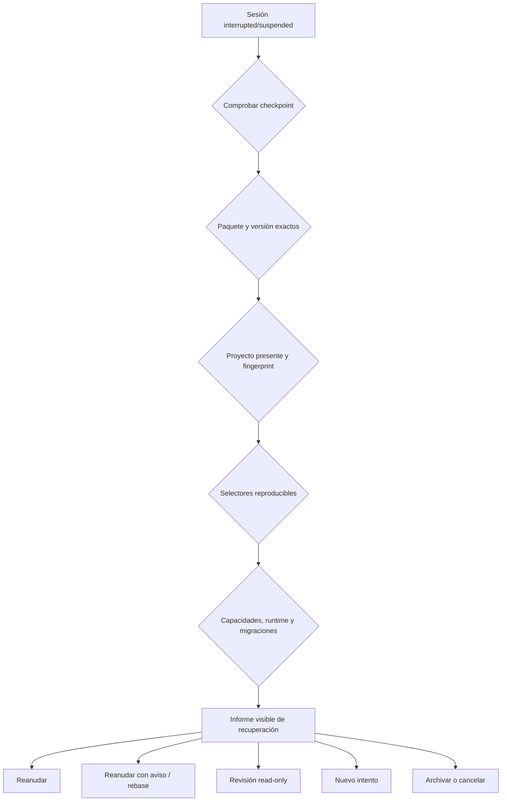
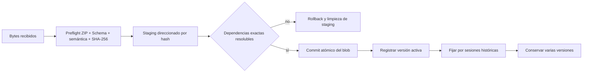
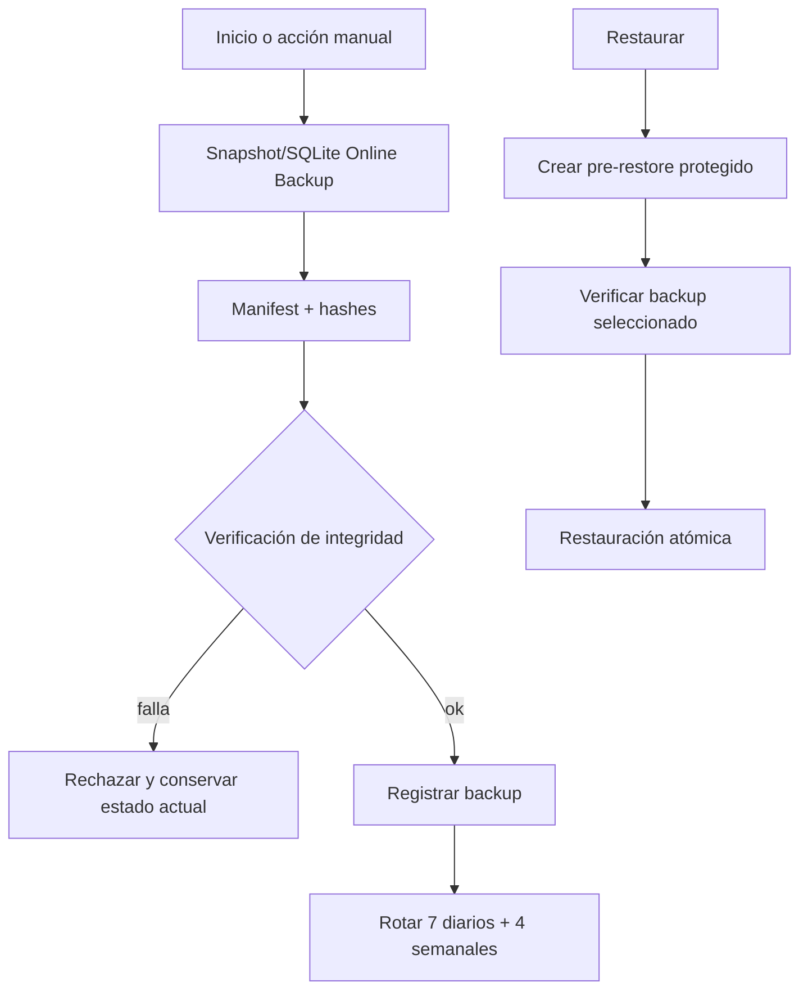

# Aprender — Sistema 2: sesiones, evidencia, evaluación y progreso persistentes

Estado: **implementado y verificado**. Fecha: 2026-07-23. Este documento cierra Sistema 2 y no inicia Sistema 3.

## 1. Objetivo y resultado

Sistema 2 convierte los eventos emitidos por el runtime de Sistema 1 en un historial local, durable, trazable y reconstruible. La autoridad Desktop es una base `learning.sqlite3` independiente de `watchlab.sqlite3`; la superficie web usa IndexedDB con el mismo contrato lógico. El dominio puede ejecutarse y probarse íntegramente en memoria, sin React, Tauri, SQLite ni IndexedDB.

El resultado persiste perfiles, sesiones, checkpoints, eventos append-only, evidencia inmutable, evaluaciones versionadas, proyecciones de dominio, paquetes instalados, migraciones, backups y operaciones de recuperación. `WatchProject`, `.wplab` y la base técnica existente no cambian.

## 2. Alcance

Se implementaron:

- repositorios `memory`, `indexeddb` y `sqlite`;
- perfiles locales pseudónimos y perfiles adicionales;
- ciclo completo de sesiones y checkpoints transaccionales;
- informe de recuperación previo a cualquier reanudación;
- ingestión ordenada e idempotente de eventos reales de Sistema 1;
- reglas versionadas de extracción de evidencia;
- DSL acotado de evaluación compuesta;
- reconstrucción de `not_started`, `introduced`, `practising`, `demonstrated` y `retained`;
- instalación atómica y multiversión de paquetes por SHA-256;
- migraciones numeradas y transaccionales;
- backups verificables y restauración con copia previa protegida;
- exportación/importación, archivo, borrado lógico y borrado definitivo explícito;
- superficie DEV accesible conectada al backend real mediante `?learning-system2=1`.

## 3. No objetivos

No se implementaron tutor, IA, PDF, OCR, traducción, cursos definitivos, mapa visual de conocimiento, MIYOTA 3D interno, metrología real, donantes, laboratorio de averías, sincronización, cuentas, marketplace, telemetría, gamificación ni certificados.

## 4. Inspección previa y contradicciones resueltas

Antes de implementar se revisaron los Sistemas 0 y 1, los siete ADR, assessment, portability, events, runtime, packages, Tauri, `src/platform/native.ts`, SQLite y las pruebas nativas.

Se encontraron tres tensiones:

1. La base existente solo contenía `projects` y `parts`, con DDL de arranque y sin tabla de migraciones. Se resolvió creando `learning.sqlite3`, con ciclo, migraciones y backups propios. Esto materializa la separación ya aprobada entre proyecto técnico y datos personales, sin migrar ni tocar `watchlab.sqlite3`.
2. El contrato histórico de Sistema 0 conserva IDs `fnv1a64` para compatibilidad. Sistema 2 no los usa para integridad: proyecto, canon, paquete, actividad, rúbrica, evidencia, evaluación, exportación y backup usan SHA-256.
3. SQLite e IndexedDB no comparten formato físico. Comparten los modelos Zod, las reglas del repositorio en memoria y una suite de contrato común. IndexedDB confirma todos sus object stores en una sola transacción; SQLite confirma un snapshot validado dentro de una transacción SQL.

No fue necesario modificar ADR: las decisiones implementadas ya estaban aprobadas. La base separada es una consecuencia directa de D05/D13, no una nueva dirección de producto.

## 5. Arquitectura

```text
Sistema 1                  Coordinación Sistema 2                 Persistencia
RuntimeEventEmitter ──> RuntimeEventIngestionService ──> LearningRepository
                                      │                  ├─ Memory
                                      ├─ Evidence        ├─ IndexedDB
                                      ├─ Assessment      └─ SQLite/Tauri
                                      └─ Mastery
```

Los módulos principales son:

- `LearningRepository` y sus interfaces especializadas;
- `MemoryLearningRepository`;
- `IndexedDbLearningRepository`;
- `SqliteLearningRepository`;
- `LearningProfileService`;
- `LearningSessionService`;
- `RuntimeEventIngestionService`;
- `EvidenceProjectionEngine`;
- `AssessmentEngine`;
- `MasteryProjectionEngine`;
- `LearningPackageInstallationService`;
- `LearningMigrationManager`;
- `LearningBackupManager` y `NativeLearningBackupManager`;
- `LearningRecoveryService`;
- `LearningExportService`;
- `LearningDeletionService`;
- `LearningPersistenceCoordinator`.

Sistema 1 no importa ningún módulo de persistencia. La dirección de dependencia es Sistema 2 → contratos/eventos de Sistema 1.

## 6. Flujo de verdad educativa



Los eventos y las evidencias son hechos históricos. Las evaluaciones son resultados reproducibles fijados a versiones. `learning_mastery` es una caché materializada que puede borrarse y reconstruirse.

## 7. Repositorios y equivalencia

El contrato común incluye inicialización, cierre, transacciones, snapshot/restore, perfiles, sesiones, eventos, evidencias, evaluaciones, dominio, paquetes, migraciones, backups y recovery log.

El repositorio en memoria es la implementación normativa de restricciones:

- serializa transacciones concurrentes;
- revierte todo el agregado ante un error;
- prohíbe secuencias e idempotency keys duplicadas;
- hace evidencia y evaluación inmutables;
- exige cascadas explícitas;
- impide eliminar paquetes fijados;
- ofrece paginación estable y errores tipados.

IndexedDB y SQLite cargan un snapshot validado, ejecutan la misma operación contra esa semántica y reemplazan el estado en una única transacción física. La suite contractual compara el resultado observable de los tres backends.

## 8. Modelo físico

| Tabla / store | Clave y restricciones principales | Contenido |
|---|---|---|
| `learning_profiles` | PK `id`; record version | identidad pseudónima, locale, accesibilidad, archivo y tombstone |
| `learning_sessions` | PK `id`; FK profile; índices profile/state/package | versiones exactas, fingerprints, estado y checkpoint |
| `learning_events` | PK `id`; FK session; unique `(session,sequence)` y `(session,idempotency)` | evento append-only y payload validado |
| `learning_evidence` | PK `id`; FK profile/session; índices competency/session/hash | evidencia, procedencia, revisión y SHA |
| `learning_assessments` | PK `id`; índices profile/competency/input hash | resultado, explicación, rúbrica y algoritmo |
| `learning_mastery` | PK `(profile,competency)` | proyección reconstruible |
| `learning_packages` | PK `(package,version)`; unique hash | manifest, blob referenciado, dependencias y pins |
| `learning_schema_migrations` | PK version | nombre, checksum, fecha y duración |
| `learning_backups` | PK `id`; índice fecha | manifest/hash/ruta/protección |
| `learning_recovery_log` | PK `id`; índice session/fecha | decisiones de recuperación, importación y borrado |

Los payloads completos se guardan como JSON validado junto a columnas explícitas para restricciones e índices. Los binarios viven fuera de las tablas en un almacén direccionado por hash.

## 9. SQLite Desktop

Tauri abre `learning.sqlite3` con `journal_mode=WAL`, `synchronous=FULL` y `foreign_keys=ON`. La migración inicial crea todas las tablas, índices y restricciones dentro de una transacción y registra su SHA-256. Una versión futura rechaza la apertura.

El adaptador React/TypeScript nunca recibe SQL. Tauri expone comandos limitados para información, snapshot, reemplazo transaccional, backup/restauración y blobs. Todas las inserciones usan parámetros; los nombres dinámicos de tabla solo pasan por una allowlist interna de lectura.

Los backups Desktop usan la API Online Backup de SQLite, ejecutan `integrity_check`, consolidan WAL, escriben manifest con hashes y vuelven a verificar al restaurar. Antes de restaurar se crea una copia `pre-restore` protegida.

## 10. IndexedDB

La base web contiene object stores físicos para perfiles, sesiones, eventos, evidencias, evaluaciones, dominio, paquetes, migraciones, backups y recovery log, además de `meta`. `mastery` y `packages` usan claves compuestas.

Una mutación:

1. abre el snapshot de todos los stores;
2. lo valida;
3. aplica la operación con la semántica común;
4. reemplaza todos los stores dentro de una transacción `readwrite`.

Por tanto no existe una ventana en que, por ejemplo, el evento esté confirmado pero su sesión no. Los blobs web usan otra base IndexedDB con stores `staging` y `content`; no se emulan rutas nativas.

## 11. Migraciones

`LearningMigrationManager` valida que la cadena sea contigua, calcula checksum SHA-256, rechaza versiones futuras, es idempotente y aplica cada versión dentro de una transacción. Si existen datos de usuario exige primero un backup `pre-migration` protegido.

SQLite mantiene además su migrador nativo porque el esquema debe existir antes de que TypeScript pueda abrir el repositorio. Se prueban base vacía, reapertura, idempotencia, rollback de SQL intermedio y foreign keys.



## 12. Perfiles, privacidad y accesibilidad

El primer uso crea `profile.local-default`, sin login ni datos identificativos obligatorios. Se admiten perfiles adicionales aislados. Nombre visible, locale, movimiento reducido, escala de texto, contraste, interacción, tiempo ampliado, lectura de etiquetas y adaptaciones se versionan.

Las adaptaciones activas quedan en la evidencia como contexto y nunca reducen confianza ni dominio. No se guardan diagnósticos médicos ni inferencias personales.

## 13. Sesiones



Las transiciones pertenecen al servicio de dominio, no a la UI. `completed` exige `scene-completed` ya persistido y un checkpoint final cuyo `lastPersistedSequence` coincida con el último evento.

Cada intento conserva perfil, paquete, actividad, rúbrica, proyecto, fingerprints, capacidades y runtime exactos. Reiniciar crea otra sesión con `originSessionId` e incrementa `attempt`.

## 14. Checkpoints y recuperación

Un checkpoint contiene paquete/versión, escena, paso, timeline, barreras, respuestas provisionales, pistas, estado educativo reversible, último sequence persistido, fingerprint, capacidades, runtime, fecha y marca de completitud. El servicio rechaza un checkpoint cuyo paquete no coincide con la sesión.

Al iniciar, las sesiones abiertas pueden marcarse `interrupted`. Nunca se reanudan solas.



El informe clasifica proyecto sin cambios, cambiado reproducible, cambiado incompatible o ausente. Faltas de paquete, checkpoint, migración o capacidades bloquean resume; una diferencia de major de runtime se diagnostica. No se aplica ningún cambio educativo al proyecto técnico.

## 15. Eventos

La política persistible está centralizada en `PERSISTED_RUNTIME_EVENT_TYPES`: escena iniciada, paso, selección, confirmación, pista, respuesta, barrera, escena completada/cancelada, restauración y error relevante. Selector resuelto, hover, frames, cámara continua y estado visual transitorio son efímeros.

La ingestión:

- ordena y valida el batch;
- asigna secuencia persistente densa;
- deriva una idempotency key del session ID de runtime, versión y secuencia originales;
- confirma insertados, duplicados y efímeros;
- conserva eventos futuros como `future-preserved`;
- rechaza estados de sesión incompatibles;
- solicita checkpoint para hitos definidos.

Los payloads excluyen cualquier copia de `WatchProject`.

## 16. Evidencia

`EvidenceProjectionEngine` incluye reglas reales para selección confirmada, respuesta escrita y secuencia completada. Cada regla fija ID/versión, competencia, evento disparador, campos admitidos y confianza.

El ID y hash se derivan de datos canónicos estables; reprocesar el mismo evento produce el mismo registro. Pistas y accesibilidad se conservan como contexto. Invalidar o sustituir crea un marcador inmutable con motivo y relación; el registro original permanece visible.

Tipos admitidos: identificación, clasificación, explicación, secuencia, diagnóstico, medición, selección, montaje, decisión, respuesta escrita, simulación y revisión humana futura.

## 17. Evaluación y rúbricas

El DSL Zod es recursivo pero acotado en profundidad práctica y número de componentes. No ejecuta código arbitrario. Implementa:

- `all`, `any`, `not`;
- `exists`, `count`, `compare`;
- `within`, `sequence`;
- componentes `weighted` explicables;
- `minimum-evidence`;
- `independent-later-evidence`.

Cada evaluación fija rule ID/version, algoritmo/version, evidence IDs, resultado, score, trazas satisfechas/no satisfechas, evidencia ignorada con motivo, recomendaciones, fecha, proyección `historical|current` y hash de entradas. Recalcular crea otro registro; no sobrescribe el histórico.

Ninguna IA participa ni puede conceder dominio.

## 18. Dominio y retención

`introduced` requiere exposición evidenciada; `practising` requiere un intento significativo o evaluación fallida; `demonstrated` exige evaluación superada; `retained` exige evidencia posterior independiente según intervalo/contexto.

Un fallo posterior mantiene las fechas históricas de demostración pero reduce la fuerza actual. Evidencia invalidada no cuenta. Un marcador `superseded` conserva historia y excluye la revisión anterior de la proyección actual.

`MasteryProjectionEngine.rebuild(profileId)` elimina únicamente la proyección de ese perfil y la reconstruye desde evidencia/evaluaciones. La prueba de reconstrucción compara resultados antes y después de borrar `learning_mastery`.

## 19. Paquetes instalados



Los paquetes se validan con el loader seguro de Sistema 1 antes de escribir el registro. El blob va a staging, se verifican dependencias, se confirma en `sha256/<digest>` y después se activa. Un fallo retira staging y cualquier registro provisional.

`refreshPins` deriva las sesiones que fijan cada versión. Una versión retenida no se puede desinstalar. Una actualización no modifica sesiones existentes.

## 20. Fingerprints

La serialización canónica:

- ordena claves Unicode normalizadas NFC;
- conserva el orden semántico de arrays;
- normaliza `-0` a `0`;
- usa representación JSON finita para números;
- rechaza `NaN` e infinito;
- omite solo rutas excluidas documentadas;
- normaliza strings NFC.

Se distinguen funciones para proyecto técnico, proyección canónica, bytes de paquete, actividad, rúbrica y entradas de evaluación. Las exclusiones de proyecto son `modifiedAt`, cámara transitoria y último viewport; `generatedAt` se excluye del canon. Hay vector dorado SHA-256 y pruebas de orden, Unicode, números, exclusiones y detección de cambios.

## 21. Backups

El manager portable crea un ZIP determinista con manifest, snapshot, hashes y, solo por opción explícita, paquetes locales no recuperables. Verifica todos los hashes antes de restaurar y repone los blobs por contenido.

Desktop añade backup físico SQLite con Online Backup e `integrity_check`. El arranque programado garantiza un bucket diario y semanal y rota a 7 diarios/4 semanales. Los registros protegidos nunca se recolectan.



Por defecto se excluyen cachés, documentos privados, paquetes oficiales recuperables y conversaciones futuras. Los blobs direccionados por hash no se duplican salvo selección explícita de un paquete local irrecuperable.

## 22. Exportación e importación

La exportación selecciona perfil, sesiones, eventos, evidencia, evaluaciones, dominio y registros de paquetes. El contenedor incluye manifest, versión, SHA-256 y advertencias de privacidad. No incluye PDFs privados ni caches.

La importación solo acepta formato v1 verificado. `merge` conserva IDs exactos y salta duplicados; `new-profile` remapea el perfil. Las colisiones no equivalentes remapean sesiones, eventos, evidencia y evaluaciones con propagación de referencias. Una evidencia remapeada conserva `originalHash` en `importTrace` y recibe un hash nuevo. La operación añade un recovery log con origen, destino, modo y mapa de IDs.

Versiones desconocidas se rechazan de forma explícita; no se interpretan silenciosamente.

## 23. Borrado, archivo y compactación

Perfil y sesión admiten:

- archivo reversible;
- tombstone/borrado lógico del perfil;
- borrado definitivo mediante previsualización y token SHA-256;
- cascada explícita de sesiones, eventos, evidencia, evaluaciones, dominio y recovery log.

El token incluye revisión, conteos, paquetes retenidos y backups protegidos; cualquier cambio posterior obliga a repetir la previsualización. No hay cascadas silenciosas.

No se compactan eventos ni evidencias educativas. Solo se pueden recolectar staging, cachés, proyecciones reconstruibles y backups programados fuera de retención. Un backup protegido prevalece sobre la recolección.

## 24. Interfaz mínima de gestión

En desarrollo, `?learning-system2=1` carga `LearningPersistenceHarness`:

- SQLite/Tauri en Desktop e IndexedDB en web;
- selección y creación de perfil;
- sesión desde fixture, pausa, interrupción, informe/recuperación y finalización contractual;
- inspección de eventos, evidencia, evaluaciones y dominio;
- instalación de versiones 1.0.0 y 1.1.0;
- backup/restauración;
- exportación;
- borrado de sesión con confirmación.

La superficie utiliza servicios y repositorios reales. No es la UI final de Aprender.

## 25. Compatibilidad

- `.wplab`, su encoder y sus versiones 2–5 no cambian.
- `watchlab.sqlite3`, proyectos y partes no cambian.
- Las sesiones guardan referencias y fingerprints, nunca otra copia persistente del proyecto.
- Eventos futuros se preservan como read-only; snapshots/exportaciones futuras se rechazan.
- Paquetes ausentes y rúbricas ausentes permanecen diagnosticables por sus IDs/versiones fijados.
- Una migración parcial revierte; una versión futura impide escritura.
- El contrato legado FNV sigue legible, pero no autoriza decisiones de integridad en Sistema 2.

## 26. Pruebas

Las pruebas cubren:

- contrato compartido y equivalencia memory/IndexedDB/SQLite;
- transacción, rollback, concurrencia, unicidad, paginación y reapertura;
- migraciones vacías, incrementales, rollback, backup previo, futuro e idempotencia;
- perfiles, archivo, tombstone y separación;
- ciclo de sesión, checkpoint, interrupción, recuperación y nuevo intento;
- orden, batch, retry, duplicado, futuro y efímero;
- evidencia determinista, inmutabilidad, procedencia, ayuda, accesibilidad, supersession e invalidación;
- DSL compuesto, all/any/not/sequence/weighted y recalculado histórico;
- todos los estados de dominio, retención, fallo posterior y reconstrucción;
- paquetes, dos versiones, dependencia, rollback y pin histórico;
- fingerprints y vectores dorados;
- backup, hash, corrupción, restauración, paquetes locales explícitos y rotación;
- export/import round-trip, privacidad, colisiones, remapeo y duplicados;
- siete pruebas Rust nativas de SQLite.

Resultado final:

- `npm run verify`: correcto;
- ESLint: correcto, 0 errores;
- Vitest: 49 archivos y 195 pruebas correctas;
- TypeScript y build Vite: correctos;
- Rust nativo: 7 pruebas correctas;
- smoke test en navegador: backend IndexedDB, sesión contractual, evidencia, evaluación y dominio correctos; 0 errores de consola.

Warnings no ocultados:

- Vite avisa de que el import dinámico de `@tauri-apps/api/core` no crea otro chunk porque plugins Tauri ya lo importan estáticamente;
- Vite avisa de chunks superiores a 500 kB;
- el viewport, durante el smoke test, avisa de `THREE.Clock` deprecado y precisión X4122 del shader.

Son avisos preexistentes/de empaquetado y no invalidan persistencia, pruebas ni build.

## 27. Archivos principales

Persistencia TypeScript:

- `src/learning/persistence/models.ts`
- `repository.ts`, `memoryRepository.ts`, `indexedDbRepository.ts`, `sqliteRepository.ts`
- `profileService.ts`, `sessionService.ts`, `recoveryService.ts`, `coordinator.ts`
- `ingestion.ts`, `evidenceEngine.ts`, `assessmentEngine.ts`, `masteryEngine.ts`
- `fingerprints.ts`, `binaryStorage.ts`, `packageInstallation.ts`
- `migrationManager.ts`, `backupManager.ts`, `backupScheduler.ts`, `nativeBackupManager.ts`
- `exportService.ts`, `deletionService.ts`

Nativo:

- `src-tauri/src/learning_db.rs`
- integración limitada en `src-tauri/src/lib.rs` y dependencias en `src-tauri/Cargo.toml`.

Gestión:

- `src/learning/dev/LearningPersistenceHarness.tsx`
- gate DEV en `src/App.tsx`.

## 28. Limitaciones y deuda

- La API ofrece paginación estable; el adaptador SQLite actual valida el agregado completo antes de aplicar cambios. Es correcto y atómico, pero para historiales muy grandes convendrá añadir lecturas SQL directas paginadas y operaciones incrementales sin cambiar el contrato.
- IndexedDB también prioriza equivalencia fuerte sobre escrituras parciales; el coste es O(n) por mutación.
- Las operaciones SQLite son cortas y síncronas; no se expone cancelación porque la capa usada no puede interrumpir con seguridad una transacción ya iniciada.
- El backup físico Desktop excluye blobs por defecto. La selección explícita de paquetes locales irrecuperables está en el manager portable; la UI DEV no ofrece todavía selector de activos.
- Solo existe el formato de exportación v1. Versiones futuras se rechazan hasta disponer de migrador explícito.
- No existen firma de paquetes ni confianza remota; `local-unsigned` siempre requiere importación explícita.
- La interfaz DEV no es diseño de producto.

Estas limitaciones no cambian la semántica ni la trazabilidad del Sistema 2.

## 29. Criterios para Sistema 3

Sistema 3 puede diseñar la experiencia visible de Aprender sobre estos contratos si:

1. no introduce otro origen de verdad para progreso;
2. consume informes de recuperación antes de reanudar;
3. conserva package/activity/rubric versions exactas;
4. presenta evidencia y explicaciones sin permitir que tutor o IA otorguen dominio;
5. utiliza la coordinación existente y no importa SQLite/IndexedDB desde componentes;
6. mantiene proyecto técnico, contenido y datos personales separados;
7. define UX de archivo, privacidad, almacenamiento y conflictos antes de ocultar complejidad al usuario.

No se ha iniciado ninguna implementación de Sistema 3.
