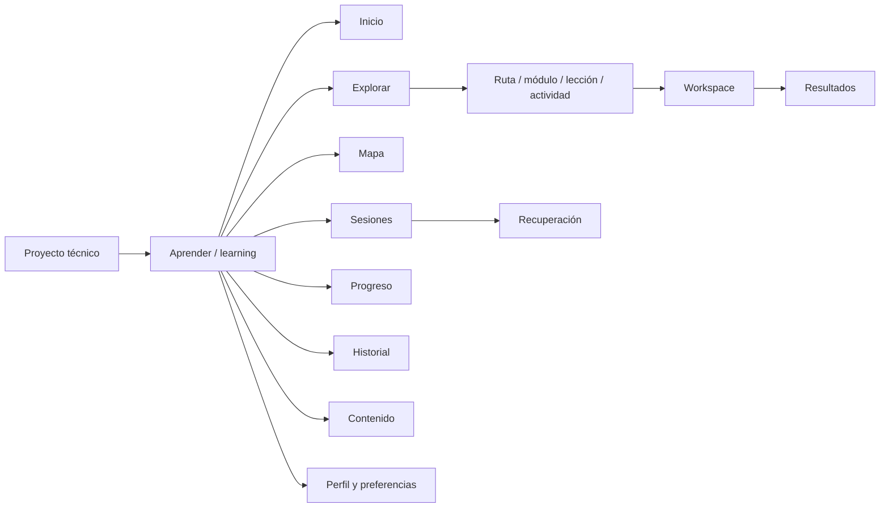
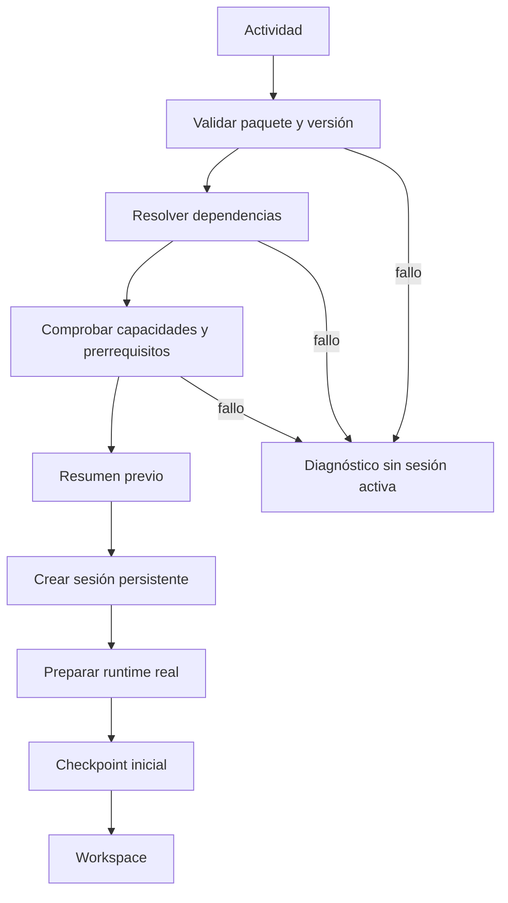
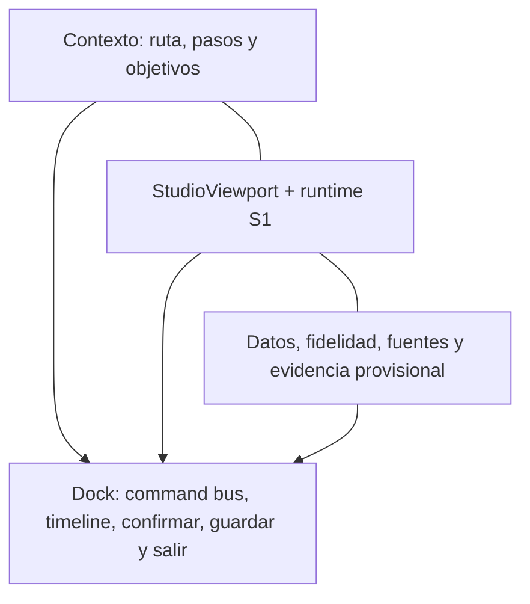
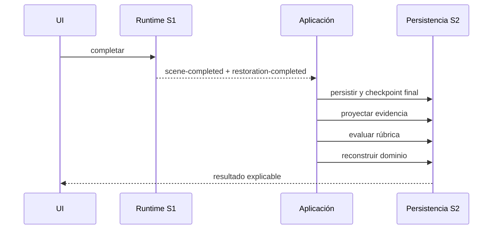
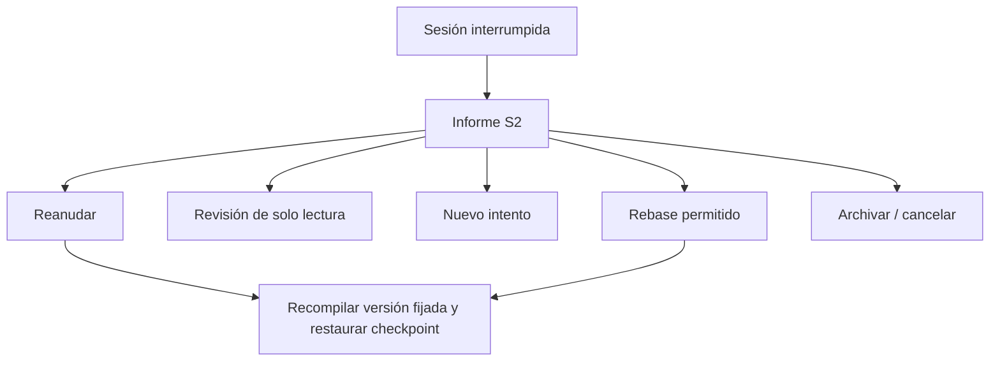
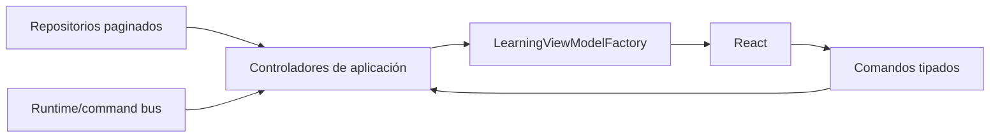
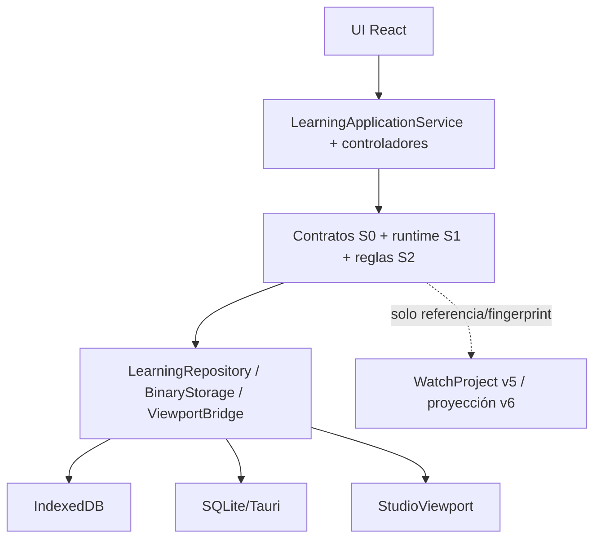

# Aprender — Sistema 3: experiencia de producto completa

Estado: **implementado y validado el 2026-07-23, con limitaciones declaradas**. La auditoría previa se cerró antes del primer cambio de código de producción.

## 1. Objetivo

Sistema 3 convierte los contratos del Sistema 0, el runtime reversible del Sistema 1 y la persistencia del Sistema 2 en el área de producto `learning`: navegación normal, perfiles, catálogo, mapa, rutas, sesiones, progreso, historial, contenido y un workspace que ejecuta una actividad real de extremo a extremo.

## 2. Auditoría previa y desviaciones documentadas

Se revisaron íntegramente `APRENDER-VISION.md`, `APRENDER-ARQUITECTURA.md`, `APRENDER-MODELO-DATOS.md`, `APRENDER-UX.md`, `APRENDER-CONTENIDO.md`, `APRENDER-IMPLEMENTACION.md`, `APRENDER-DECISIONES.md`, los documentos de Sistemas 0–2 y ADR-001–ADR-007. También se inspeccionaron `App`, el modelo/store `vnext`, sidebar, inspector, viewport, estilos responsive, persistencia nativa/web y los contratos materializados de paquete, lección, actividad, escena, competencia, sesión, recuperación, evidencia, evaluación, dominio, perfil, capacidad y evento.

### 2.1 Diseño que sigue siendo normativo

- identidad visible `Aprender`/`Learn` e identidad persistente `learning`;
- proyecto técnico único, con proyección v5→v6 de solo lectura;
- overlay de sesión reversible y separación de simulación educativa/validación técnica;
- fidelidad G/K/P sin puntuación global;
- paquetes declarativos, versionados, sin código arbitrario y con versiones fijadas;
- perfiles, sesiones, eventos, evidencias, evaluaciones y dominio separados;
- SQLite en Desktop e IndexedDB en web detrás del mismo repositorio;
- recuperación siempre mediada por informe;
- evaluación determinista y explicable;
- compatibilidad aditiva con `.wplab`;
- accesibilidad WCAG 2.2 AA y alternativa textual al 3D/grafo.

### 2.2 Desviaciones que deben resolverse en este sistema

1. **Numeración histórica.** `APRENDER-IMPLEMENTACION.md` denominaba Sistema 3 al orquestador y Sistema 4 al shell. La autorización vigente llama Sistema 3 a la experiencia completa. No se reimplementa el orquestador: se consume el runtime ya aprobado como Sistema 1.
2. **Navegación sin router.** Producción conserva el workspace en Zustand y no tiene router ni localización global. Aprender usará una navegación propia basada en `history`/URL, con IDs neutrales y restauración de filtros; no obliga a migrar las demás áreas.
3. **Store global.** `useStudioStore` mezcla proyecto y presentación técnica. Solo se amplía su unión de workspace; el estado de Aprender vive en controladores pequeños y un servicio de aplicación observable.
4. **Persistencia agregada O(n).** Los repositorios ya exponen páginas, aunque SQLite/IndexedDB validan internamente el agregado. La UI consumirá exclusivamente páginas y medirá consultas; una reescritura incremental queda fuera de alcance.
5. **Contenido contractual limitado en la entrega original.** Sistema 3 añadió un índice de producto derivado y versionado porque el esquema v1 no materializaba rutas/módulos ni metadatos editoriales ricos. Sistema 4A resolvió después esta desviación de forma aditiva dentro del mismo paquete físico v1; el índice actual se deriva del pack externo.
6. **Escena contractual no final.** El paquete integrado será demostrativo y lo declarará expresamente. Usa el proyecto v5 activo y una escena general soportada por el bridge; no se presenta como curso ni despiece MIYOTA.
7. **Recuperación del runtime.** Sistema 2 conserva checkpoint e informe, pero Sistema 1 no ofrece hidratación interna desde checkpoint. Reanudar recompila la versión fijada, inicia el runtime y repone paso/timeline mediante su command bus; una incompatibilidad conserva revisión de solo lectura.
8. **Backend web/nativo.** La selección del repositorio estaba en el arnés DEV. Se mueve a una factoría de aplicación lazy; ningún componente conoce SQLite, IndexedDB ni Tauri.
9. **i18n parcial del producto.** Producción contiene cadenas españolas directas. Sistema 3 localiza la entrada superior, el shell, la navegación y el contenido declarativo de Aprender, con español por defecto y fallback inglés/español seguro. Parte de la copia operativa de las superficies secundarias sigue en español y queda declarada como limitación; no se afirma una internacionalización completa ni de Aprender ni del resto del producto.
10. **Notificaciones.** Sistema 2 no contiene tabla específica. Las notificaciones de valor se derivan de sesiones, paquetes, backups y evaluaciones; el estado leído/deduplicado se conserva como preferencia educativa del perfil.
11. **Paneles redimensionables.** No existe primitiva compartida. Se implementa una frontera accesible propia con botones de ajuste por teclado y CSS variables persistidas por perfil; el drag de precisión no es obligatorio.
12. **Pruebas de componentes.** La suite usa Vitest en entorno Node y no incorpora infraestructura E2E. Las garantías se prueban en navegación, controladores, view models y render estático semántico, complementadas con smoke real de navegador y revisión manual.

Estas adaptaciones mantienen los ADR aceptados. No cambian `WatchProject`, el formato `.wplab`, el esquema físico del paquete ni la autoridad de las evidencias.

## 3. Alcance

El sistema entrega una experiencia navegable y conectada a los Sistemas 0–2:

- entrada de primer nivel desde la barra global y recuperación de deep links;
- shell propio con navegación lateral, estado activo, notificaciones y salida segura;
- Inicio, Explorar, Mapa, Rutas, Módulos, Lecciones, Actividades, Sesiones, Recuperación, Progreso, Historial, Contenido, Perfil y Preferencias;
- workspace educativo sobre el `StudioViewport` real y el command bus del runtime;
- instalación de un paquete declarativo integrado y ejecución real desde preflight hasta resultados;
- sesiones, checkpoints, eventos, evidencias, evaluaciones y proyecciones de dominio persistentes;
- selección automática de SQLite/Tauri en Desktop e IndexedDB en web;
- CRUD de perfil, exportación selectiva, backup, restauración, archivo y borrado con previsualización;
- paginación, medición de operaciones, estados vacíos, diagnóstico y recuperación;
- responsive, navegación por teclado, alternativa textual al 3D y al mapa;
- español como idioma inicial y una base funcional ES/EN para shell, navegación y contenido declarativo.

## 4. No objetivos

No forman parte de Sistema 3: tutor conversacional/IA, PDF/OCR, traducción automática publicable, currículo MIYOTA definitivo, desmontaje real completo, averías, metrología, donantes avanzados, autoría visual, marketplace, nube, cuentas remotas, certificados y gamificación. Tampoco se modifica el proyecto técnico al aprender, se eleva una actividad educativa a validación de ingeniería ni se inicia Sistema 4.

## 5. Arquitectura de interfaz

### 5.1 Composición

`App` solo conoce el identificador de workspace `learning` y carga `LearningArea` mediante `React.lazy`. `LearningArea` crea una única instancia de `LearningApplicationService`, inyecta navegación y backend y publica un snapshot inmutable mediante contexto. Las superficies React consumen ese snapshot y envían intenciones al servicio; no importan repositorios, SQL, IndexedDB, compiladores, rúbricas ni motores de evidencia.

El servicio coordina controladores existentes de perfiles, catálogo, sesión, recuperación y progreso. La factoría de producción carga de forma diferida:

- `SqliteLearningRepository` y almacenamiento binario nativo si existe Tauri;
- `IndexedDbLearningRepository` y almacenamiento binario IDB en navegador;
- el bridge de `StudioViewport` únicamente cuando se abre un workspace.

Las rutas, módulos, lecciones y metadatos editoriales se exponen mediante un índice de producto declarativo. Desde Sistema 4A el índice se deriva directamente de las colecciones del learning pack; la autoridad normativa sigue en los contratos de Sistemas 0–2.

### 5.2 Estado y autoridad

| Estado | Autoridad | Persistencia |
| --- | --- | --- |
| Proyecto técnico | store `vnext` / `WatchProject` v5 | `.wplab` existente |
| Navegación de Aprender | `LearningNavigationController` | URL + `history` |
| Perfil y preferencias | `LearningProfileController` | repositorio S2 |
| Sesión y checkpoint | `LearningSessionController` + runtime S1 | repositorio S2 |
| Eventos y evidencia | proyecciones deterministas S2 | repositorio S2 |
| Estado visual efímero | componentes/workspace | memoria o `sessionStorage` |
| Paquetes y binarios | catálogo + almacenamiento binario | SQLite/IDB según plataforma |

`LearningApplicationService` no sustituye estas autoridades: las orquesta, construye view models y mantiene una copia observable de la página actual.

### 5.3 Ciclo de vida

La inicialización es idempotente para tolerar `StrictMode`. El desmontaje usa una cancelación diferida: una remontada inmediata conserva el servicio y una salida real libera runtime, suscripciones y backend. Entrar por URL inicializa directamente el área; salir limpia la ubicación `learning` y vuelve al último workspace técnico.

## 6. Navegación

La URL canónica usa hash para ser compatible con Vite, Tauri y despliegues sin configuración del servidor:

- `#/learning/home`, `/explore`, `/map`, `/sessions`, `/progress`, `/history`, `/content`, `/profile` y `/preferences`;
- `#/learning/{route|module|lesson|activity|movement|competency|package|session|evidence|assessment|recovery|results}/{id}`;
- filtros de Explorar en query string, restaurados al recargar;
- `popstate` y `hashchange` soportan Atrás/Adelante;
- un interceptor de enlaces internos evita recargas y concentra los cambios en el controlador;
- una ruta desconocida produce un estado seguro y no ejecuta ninguna acción.

Los IDs permanecen neutros; solo cambian las etiquetas visibles. Los deep links no omiten preflight, recuperación ni selección de perfil.

### 6.1 Superficies entregadas

| Superficie | Función principal | Estados explícitos |
| --- | --- | --- |
| Inicio | recomendación, ruta activa, recuperación y evidencia reciente | vacío, disponible, acción necesaria |
| Explorar | búsqueda, orden y filtros combinables | 0 resultados, compatible, bloqueada, instalada |
| Mapa | grafo de conocimiento y lista jerárquica equivalente | prerrequisito, disponibilidad, dominio |
| Ruta/módulo/lección | estructura declarativa no lineal | progreso derivado y vínculos |
| Actividad | detalle, fuentes, fidelidad y preflight | lista, bloqueada, preparada |
| Workspace | pasos, viewport, contexto y comandos | activa, restaurando, error |
| Sesiones/Recuperación | historial operativo y decisión mediada | activa, suspendida, interrumpida, terminal |
| Progreso | dominio por competencia y explicación | cinco estados de dominio |
| Historial | sesiones, evidencias y evaluaciones paginadas | vacío, página, detalle |
| Contenido | paquetes instalados, importación y diagnóstico | activo, retenido, incompatible |
| Perfil/Preferencias | identidad local, accesibilidad, privacidad y datos | edición, backup, archivo, borrado |
| Resultados | evidencia, rúbrica, cambio de dominio y siguiente práctica | explicable y persistido |

## 7. Lanzamiento de una actividad

El preflight valida, en orden:

1. existencia y versión exacta del paquete;
2. estado del paquete y dependencias declaradas;
3. capacidades del bridge real;
4. prerrequisitos de competencia;
5. referencia al proyecto activo y fingerprint inicial;
6. fidelidad G/K/P declarada y fuentes.

Cada comprobación se muestra con resultado y explicación. Un error bloqueante impide crear la sesión. Los prerrequisitos de la demostración se presentan como advertencia pedagógica y no como incompatibilidad técnica.

Solo después de confirmar se crea un nuevo intento persistente, se compila la escena fijada, se inicia el runtime y se guarda el checkpoint inicial. El contador de intento se calcula a partir de las sesiones previas de la misma actividad y no se reutiliza al reiniciar.

## 8. Workspace

El layout de escritorio tiene tres paneles:

- izquierda: contexto, objetivos, pasos, estado y ayuda;
- centro: `StudioViewport`, alternativa textual y dock operativo;
- derecha: pieza seleccionada, semántica, fidelidad, fuentes y evidencia provisional.

Los paneles laterales pueden contraerse y ajustar su ancho mediante botones con nombre accesible; las preferencias visuales se conservan en `sessionStorage`. En ancho reducido desaparece el panel contextual derecho y el flujo principal permanece usable.

La UI no escribe directamente en el viewport. Selección, aislamiento, visibilidad, timeline, avance, confirmación, pista, finalización y cancelación viajan por el command bus de S1. El viewport sigue siendo la implementación técnica ya existente.

`Guardar y salir` registra checkpoint y suspende. `Cancelar` restaura el proyecto y deja una sesión terminal. `Completar` espera la restauración antes de proyectar resultados. Una salida no confirmada nunca se interpreta como dominio.

## 9. Finalización

La pantalla de resultados expone:

- qué se practicó;
- evidencia inmutable obtenida y eventos fuente;
- pistas y adaptaciones registradas;
- regla y versión de evaluación;
- criterios satisfechos, pendientes e ignorados;
- estado anterior y nuevo de dominio, con razones;
- recomendación siguiente con regla y evidencias usadas.

No se muestra una puntuación global. Las adaptaciones de accesibilidad se registran, pero nunca penalizan. Repetir crea otro intento; revisar una sesión terminal no reactiva el runtime.

## 10. Recuperación

No existe reanudación automática. Una sesión `suspended` o `interrupted` genera primero un informe de S2 con compatibilidad de paquete, proyecto, runtime y checkpoint. La UI solo ofrece las acciones autorizadas por ese informe.

Reanudar o rebasar recompila la versión fijada, inicia una sesión runtime nueva y repone paso, timeline y selección desde el checkpoint a través del command bus. Si no es seguro, permanecen la revisión de solo lectura, un nuevo intento, archivo o cancelación. La sesión original y sus evidencias no se sobrescriben.

## 11. Flujo de view models

Los snapshots incluyen ubicación, perfil, filtros, páginas de sesiones/evidencia/evaluaciones/dominio/paquetes, recuperación, preflight, workspace, resultados, recomendaciones, notificaciones, backups y muestras de rendimiento. Las superficies no reconstruyen reglas de negocio; como máximo filtran el catálogo ya autorizado para presentación.

Las notificaciones se derivan de estados reales —recuperación pendiente, incompatibilidad de paquete, backup o resultado— y se deduplican. Los IDs leídos se guardan en preferencias del perfil; no se añadió una tabla paralela.

## 12. Separación de capas

La relación con proyectos técnicos sigue siendo referencial. La actividad integrada apunta al proyecto activo, fija su fingerprint y opera con un overlay reversible. No duplica el proyecto, no migra el documento a v6, no guarda estado pedagógico dentro de `.wplab` y no presenta la simulación como validación de ingeniería.

## 13. Superficies, perfiles, paquetes y privacidad

### 13.1 Perfil local

Si el repositorio está vacío se crea un perfil local inicial. Desde la interfaz se puede:

- cambiar nombre e idioma;
- configurar alto contraste, movimiento reducido, tiempo ampliado y lectura de etiquetas;
- conservar preferencias pedagógicas y de retención;
- crear otro perfil y cambiar el activo;
- archivar un perfil;
- exportar una selección de categorías;
- crear y restaurar backups;
- previsualizar las consecuencias del borrado y confirmarlo con un token exacto.

La previsualización enumera sesiones, eventos, evidencias, evaluaciones, dominio y versiones de paquete retenidas. El borrado definitivo no está disponible sin esa previsualización actual.

### 13.2 Catálogo y paquetes

El contenido integrado se instala usando el mismo formato físico, loader, validador, catálogo y almacenamiento binario de S0–S2. La UI muestra ID, versión, origen, estado, hash, referencia de almacenamiento y sesiones que fijan una versión. La importación de un archivo pasa por el loader; React no interpreta JSON de paquete ni ejecuta código incluido.

Una versión utilizada por una sesión se retiene. Una incompatibilidad se muestra con diagnóstico y no se convierte silenciosamente. Sistema 3 no añade marketplace, descargas remotas ni autoría.

### 13.3 Paquete demostrativo

`wplab.demo.learning-foundations@1.0.0` aporta una ruta, un módulo, una lección y una actividad real. La actividad observa el proyecto técnico activo y practica identidad semántica y orientación. Declara explícitamente:

- que no es un currículo MIYOTA;
- que no representa un calibre ni un despiece real;
- que no valida ingeniería;
- la fidelidad G2/K1/P0;
- las capacidades requeridas, fuentes y reglas versionadas.

No se inventaron especificaciones del sitio MIYOTA ni se necesitó consulta externa para esta demostración.

### 13.4 Privacidad y operación offline

Perfiles, progreso, sesiones y binarios permanecen locales. En Desktop se usa la base SQLite nativa; en web, IndexedDB. La actividad integrada y sus fuentes textuales funcionan sin conexión una vez instalado el paquete. Las exportaciones son selectivas y excluyen binarios privados no solicitados, cachés y cualquier conversación futura de tutor.

## 14. Accesibilidad e internacionalización

### 14.1 Accesibilidad

La implementación incluye:

- landmarks, títulos jerárquicos y enlace de salto al contenido;
- navegación y controles con etiquetas accesibles y foco visible;
- live region para cambios operativos;
- estados que combinan icono, texto y color;
- alternativa en lista para el mapa y alternativa textual para el viewport;
- tablas evitadas cuando una lista semántica ofrece mejor lectura;
- paneles ajustables por controles de teclado;
- controles nativos para selectores, checkboxes, búsqueda y timeline;
- `prefers-reduced-motion` y preferencia de perfil;
- layout verificado a 900 × 700 sin impedir las acciones principales.

Se realizó inspección manual del árbol semántico y del flujo de teclado en navegador. La suite automática comprueba la estructura crítica, pero no incorpora todavía un motor axe ni una auditoría formal externa WCAG; esto queda como limitación verificable.

### 14.2 Internacionalización

Los identificadores son independientes del idioma. El perfil conserva `es-ES` o `en-US`; fechas y números usan `Intl`. Están localizados la entrada global, el shell, la navegación, los títulos/descriptores del paquete y las etiquetas principales. Español es el fallback seguro.

La copia operativa de varias superficies secundarias —diagnóstico, privacidad, historial y detalles técnicos— aún está escrita en español. Esta cobertura parcial es deuda de Sistema 3 y debe completarse antes de prometer soporte integral en inglés. No se oculta mediante traducción automática ni se confunde con contenido publicable.

## 15. Rendimiento, errores y pruebas

### 15.1 Rendimiento

- `LearningArea`, mapa, superficies, workspace, backends y viewport se cargan en chunks diferidos;
- listas de sesiones, eventos, evidencias y evaluaciones usan páginas de 40 elementos;
- la UI no solicita el stream completo de eventos al abrir un detalle;
- se conservan las 30 muestras más recientes;
- umbrales instrumentados: inicialización 800 ms, refresco agregado 250 ms y páginas 120 ms;
- un exceso se marca en la interfaz y emite aviso en desarrollo.

El build minificado confirma chunks separados para mapa (6,11 kB), workspace (12,67 kB), superficies (62,68 kB), área (293,90 kB), backends y bridge. Permanecen avisos por `index` (517,05 kB) y `StudioViewport` (1.049,46 kB); ambos son anteriores o compartidos con el producto técnico y se registran como deuda. El chunk de Aprender no se descarga al permanecer en el área técnica.

Con páginas máximas de 40 elementos no se añade virtualización prematura. Si una vista futura elimina la paginación o supera ese límite visible, la virtualización pasa a ser obligatoria.

### 15.2 Errores y diagnóstico

Se distinguen inicialización, ruta inexistente, paquete ausente/incompatible, dependencia, capacidad, prerrequisito, preparación runtime, persistencia, recuperación y ausencia de resultados en memoria. Los errores bloqueantes no crean una sesión. Las operaciones de recuperación conservan el informe y las alternativas seguras. Los detalles técnicos se muestran bajo `details` para no dominar el flujo principal.

### 15.3 Pruebas automatizadas

La validación final del 2026-07-23 produjo:

- `npm run lint`: correcto;
- `npm run test`: **53 archivos, 211 pruebas, 0 fallos**;
- `npm run build`: TypeScript y Vite correctos;
- `cargo test --manifest-path src-tauri/Cargo.toml`: **7 pruebas nativas/SQLite, 0 fallos**.

La cobertura existente y nueva incluye contratos, loader de paquete, runtime, reversibilidad, persistencia en memoria e IndexedDB, migraciones SQLite, backup/restore, navegación y deep links, servicio de aplicación, preflight, actividad integrada, finalización, recuperación, perfiles, reglas de evidencia/evaluación/dominio y contrato estructural de UI.

### 15.4 Smoke real

En navegador se verificó manualmente:

1. entrada desde la navegación de producción y deep link;
2. Inicio, Mapa en grafo/lista y navegación Atrás/Adelante;
3. filtros de Explorar reflejados en URL y restaurados tras recarga;
4. actividad integrada, preflight, creación de sesión y workspace real;
5. selección, pista, avance, confirmación, timeline y paneles;
6. finalización con restauración, dos evidencias, evaluación y cambio de dominio;
7. repetición como nuevo intento;
8. guardar/salir, informe de recuperación, reanudación y cancelación;
9. Perfil, cambio de idioma y responsive a 900 × 700.

No aparecieron errores React ni excepciones de aplicación. La consola conserva dos avisos técnicos conocidos de Three/WebGL: deprecación de `THREE.Clock` y precisión del shader. No se ejecutó una prueba interactiva de la ventana Tauri; su frontera nativa se validó con las siete pruebas Rust/SQLite.

## 16. Limitaciones, deuda y criterios para Sistema 4

### 16.1 Limitaciones conocidas

1. cobertura inglesa incompleta en copia operativa secundaria;
2. paquete de demostración deliberadamente genérico, sin currículo ni geometría MIYOTA;
3. auditoría accesible manual/estructural, sin axe ni certificación WCAG externa;
4. smoke interactivo realizado en navegador, no en ventana Tauri;
5. repositorios paginados validan internamente un agregado; la complejidad de persistencia no es todavía incremental;
6. resultados recientes viven también en memoria para la vista inmediata; una recarga obliga a revisarlos desde Historial;
7. notificaciones derivadas no sustituyen un registro de entrega si en el futuro existen canales remotos;
8. los paneles se ajustan con controles accesibles, no con drag de precisión.

### 16.2 Deuda aceptada

- completar el catálogo de mensajes ES/EN y añadir pruebas por locale;
- dividir el bundle histórico principal y optimizar/cargar aún más tarde `StudioViewport`;
- añadir axe/Playwright y smoke de Desktop a CI;
- evolucionar los repositorios a índices y escrituras incrementales si las métricas reales lo exigen;
- ofrecer una vista persistida de resultados por ID que no dependa del snapshot reciente;
- reutilizar una primitiva común de panel redimensionable cuando exista;
- sustituir el paquete demostrativo por contenido editorial aprobado, con licencias y procedencia verificadas.

### 16.3 Decisiones pendientes antes de Sistema 4

Sistema 3 no requiere cambiar los ADR aprobados. Antes de ampliar contenido conviene decidir:

- criterio editorial y licencias del primer currículo real;
- nivel mínimo de cobertura inglesa que bloqueará una publicación;
- umbrales de volumen para índices/virtualización;
- infraestructura E2E y matriz Desktop/web soportada;
- estrategia de partición del viewport y assets 3D;
- modelo persistente de resultados si se exige compartirlos o compararlos.

### 16.4 Criterios de entrada propuestos para Sistema 4

Sistema 4 solo debería comenzar cuando:

1. se aprueben estas limitaciones y la deuda explícita;
2. se elija el primer contenido real y se documenten fuentes/licencias;
3. el nuevo paquete pase el pipeline contractual sin cambiar la autoridad de S0–S2;
4. exista una prueba E2E repetible del recorrido crítico en la plataforma objetivo;
5. se defina si el inglés completo es requisito de publicación;
6. las métricas de uso indiquen dónde optimizar, sin anticipar una reescritura.

No se ha iniciado ninguna implementación de Sistema 4.
