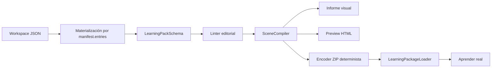

# Aprender — Sistema 4A: kit de autoría y pipeline de contenido

Estado: **implementado y validado**.

## 1. Objetivo

Permitir que un autor no técnico redacte fuera del código contenido original, bilingüe, trazable y ejecutable en Watch Prototype Lab. Sistema 4A no redacta el curso relojero ni incorpora libro, PDF, OCR, tutor, IA o contenido MIYOTA.

## 2. Auditoría contractual

Se revisaron los contratos reales de `LearningPack`, manifiesto, bloques, lecciones, actividades, escenas, preguntas, pasos, selectores, capacidades, fuentes, claims, G/K/P, competencias, extracción de evidencia, rúbricas compuestas, recomendaciones, runtime, loader, catálogo y producto de Sistema 3.

Hallazgo principal: el ZIP v1 ya era la autoridad para bloques, lecciones, actividades, escenas, competencias, evidencia, rúbricas y glosario, pero rutas, módulos, mapa y metadatos de producto del demo seguían en TypeScript. El kit los incorpora de forma aditiva al mismo `learning-pack-v1`.

No se crea un formato paralelo:

- las fuentes editoriales son objetos de los esquemas de producción;
- `manifest.entries` enumera sus rutas;
- el materializador produce `LearningPack`;
- loader, compilador, runtime, evidencia y evaluación consumen el mismo pack;
- los campos nuevos tienen default u opcionalidad para conservar paquetes v1 anteriores.

## 3. Colecciones añadidas al pack v1

- `curricula`;
- `routes`;
- `modules`;
- `concepts`;
- `sources`;
- `recommendations`;
- `visualResources`.

Se añadieron metadatos opcionales a:

- bloques: localización y ejercicio;
- lecciones: objetivos, conceptos, fuentes y contrato visual;
- actividades: catálogo, G/K/P, capacidades y patrón pedagógico;
- escenas: localización de preguntas y storyboard;
- competencias: clasificación editorial;
- evidencia: regla de extracción S2;
- rúbricas: regla compuesta S2;
- glosario: terminología ES/EN;
- fuentes: libro/MIYOTA/observación/medición/original y localizadores editoriales;
- claims: clasificación de autoridad.

## 4. Pipeline



Comandos:

```text
npm run learning:validate
npm run learning:lint
npm run learning:preview
npm run learning:pack
npm run learning:visual-report
```

Todos aceptan otro workspace mediante `-- learning-content/<directorio>`.

## 5. Validadores

El pipeline detecta:

- esquema, tamaño, profundidad, rutas y Markdown;
- IDs duplicados y referencias rotas;
- fuentes y términos ausentes;
- clasificación oficial sin fuente MIYOTA oficial;
- idiomas declarados sin contenido;
- capacidades usadas pero no declaradas;
- selectores o cardinalidades que no compilan;
- rúbricas y reglas de evidencia inválidas;
- competencia no evaluable;
- actividad sin evidencia ejecutable;
- falta de alternativa textual o de movimiento reducido;
- recursos visuales pendientes/bloqueados;
- hash o tamaño de asset incorrecto.

Los diagnósticos incluyen código, severidad, ruta, mensaje y recuperación.

## 6. Ejemplo ejecutable

`wplab.example.authoring-course@1.0.0` se materializa desde `learning-content/example/`, se empaqueta con el encoder real, se instala como contenido integrado adicional y se incorpora al índice de producto.

La actividad:

- muestra una intención de autoría;
- formula una predicción;
- resuelve un selector;
- registra una interacción;
- proyecta evidencia mediante la regla del pack;
- evalúa mediante la rúbrica del pack;
- actualiza dominio;
- restaura el proyecto.

No enseña ninguna propiedad relojera de la entidad usada como soporte neutral.

## 7. Compatibilidad

- el demo contractual de Sistema 3 se conserva;
- su evidencia y rúbrica también pasan a declararse en su pack;
- paquetes v1 anteriores reciben arrays nuevos vacíos mediante defaults;
- `.wplab` y `WatchProject` no cambian;
- el proyecto técnico sigue siendo de solo lectura para la actividad;
- no cambia el backend SQLite/IndexedDB.

## 8. Limitaciones

- la preview es editorial y no sustituye el runtime;
- el compilador CLI usa el fixture v5 contractual, no todas las familias futuras;
- no existe editor visual;
- no se resuelven ni muestran documentos privados;
- el pipeline no certifica derechos de autor: registra la política declarada;
- la revisión técnica y lingüística sigue siendo humana;
- los recursos visuales se inventarían si el autor los describe sin una revisión editorial, por lo que `approved` requiere una política externa.

## 9. Validación final

- `learning:validate` y `learning:lint`: sin diagnósticos editoriales;
- `learning:preview`, `learning:pack` y `learning:visual-report`: artefactos generados correctamente;
- empaquetado determinista verificado en dos ejecuciones con SHA-256 `A482CCD8EC04DD68F36B8059D2824734CF8244BE90AB37CC8CC8EBEA927CB9B4`;
- suite Vitest: 55 archivos y 216 pruebas superadas;
- backend Rust/SQLite: 7 pruebas superadas;
- ESLint y TypeScript: sin errores;
- build Vite de producción: correcto;
- prueba en navegador: paquete localizado en el catálogo, preflight correcto, sesión iniciada, pregunta contestada, selector resuelto, evidencia proyectada, rúbrica satisfecha, dominio actualizado y proyecto restaurado;
- continuidad dinámica verificada: resultados, repetición, ruta y botón de inicio apuntan al contenido declarativo del paquete externo;
- preview editorial comprobada en navegador con rutas, módulos, lecciones, recursos y estado de diagnósticos.

El aviso de Vite sobre chunks superiores a 500 kB y el aviso deprecado de `THREE.Clock` pertenecen a la aplicación existente y no bloquean el kit de autoría.

## 10. Decisiones pendientes

- responsables de revisión editorial, técnica y ES/EN;
- política de aprobación de fuentes y claims oficiales;
- fixtures de compilación por movimiento/familia;
- quién aprueba recursos visuales;
- convención de publicación y retirada;
- warnings que bloquean una versión publicable.

Sistema 4, contenido relojero real y cualquier capacidad de tutor permanecen fuera de alcance.
