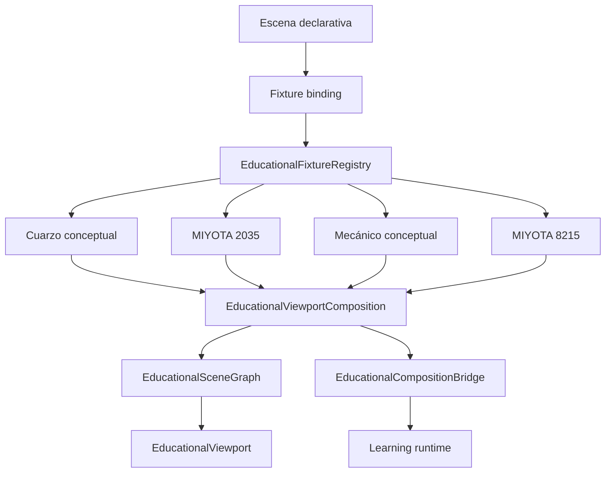
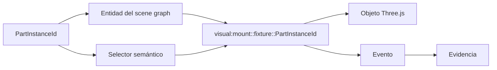
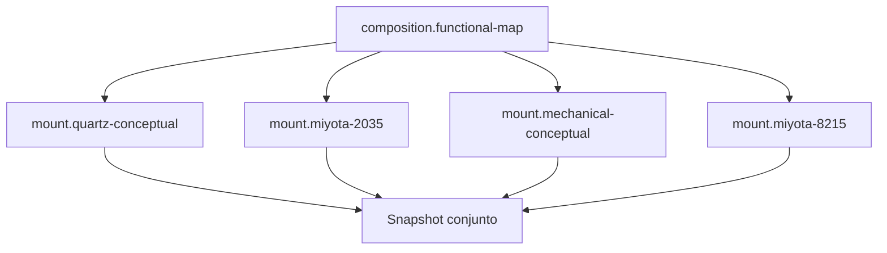
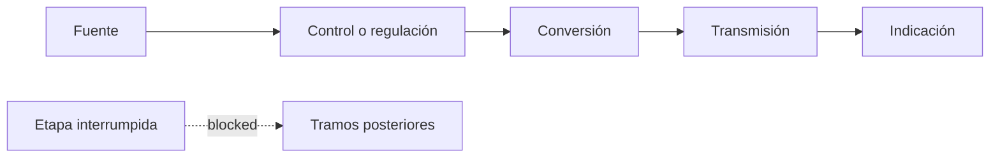
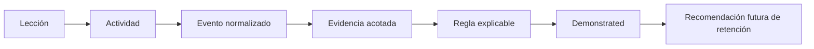
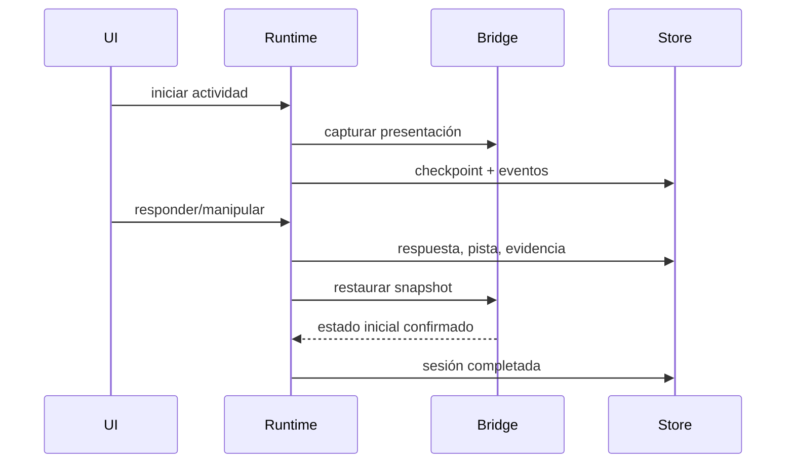

# Aprender · Sistema 4C

## Resumen

Sistema 4C incorpora dos entregas inseparables:

1. un motor visual educativo reutilizable para instancias canónicas v6 y composiciones de fixtures;
2. el paquete local `wplab.horology.functional-map@0.1.0`, titulado **Cómo funciona un reloj de principio a fin**.

El curso se ejecuta desde datos declarativos fuera de React, funciona sin conexión
después de su instalación local, produce evidencia persistente y evaluación
explicable, y no modifica `WatchProject`.

El paquete permanece `in-review`. Esta condición expresa revisión editorial, no
una carencia técnica oculta.

## Auditoría inicial

| Capacidad | Estado real antes de 4C | Implementación anterior | Limitación | Impacto | Solución adoptada | Prueba |
|---|---|---|---|---|---|---|
| Instancias v6 | Parcial | índice canónico y primitivas 4B | el viewport v5 colapsaba usos repetidos | tornillos y rubíes no eran seleccionables individualmente | `EducationalSceneGraph` y `VisualEntityId` por montura/fixture/instancia | `system4cVisual.test.ts` |
| Dos/cuatro fixtures | No disponible | un índice por escena | no había comparación real | bloqueaba escenas B, D, E y F | composición efímera con monturas lazy y namespace | pruebas de 2/4 monturas |
| Flechas espaciales | No disponible | contrato textual | sin anclaje geométrico | ruta no visible | renderer de línea, punta, anclajes y alternativa | pruebas de overlays |
| Sentidos de giro | No disponible | texto | sin eje ni sentido | no se podía explicar rotación | arco, flecha tangencial, eje, sentido y velocidad conceptual | pruebas normal/reduced motion |
| Ruta energética | Grafo consultable | relaciones 4B | no se dibujaba | cadena funcional incompleta | nodos, segmentos, estados y lista numerada | pruebas de ruta |
| Cámara educativa | Parcial | coordenadas directas | intención frágil | comparación difícil de reutilizar | intents, bookmarks, poses y transiciones deterministas | pruebas de cámara |
| Materiales/procedencia | Parcial | color básico | riesgo de confundir atractivo con fidelidad | lectura técnica ambigua | lenguaje visual por subsistema y clase de procedencia | pruebas de lenguaje visual |
| Restauración | Disponible para overlay v5 | snapshot del bridge | no incluía composición | riesgo de contaminar la siguiente escena | snapshot conjunto de monturas, estado, cámaras y fixture fingerprint | pruebas de restauración |
| Reduced motion | Parcial | duración cero | faltaba alternativa de overlays | pérdida de información | estados discretos, flechas estáticas y ruta numerada | compilación de las 6 escenas en ambos modos |
| Persistencia | Disponible | sesiones/checkpoints/eventos | respuestas incompletas y reglas no acotadas | evaluación no fiable | payload normalizado, snapshot de progreso y scope por paquete/actividad/template | pruebas de runtime y servicio |
| Contenido real | No ejecutable | blueprint y fixtures | no existían actividades/escenas/rúbricas publicables | no había curso | paquete declarativo de seis lecciones | `horologyContent.test.ts` |
| Escena A | Incompleta | movimiento conceptual sin envolvente | caja y esfera no individualizadas | no permitía separar reloj completo | caja, esfera y agujas conceptuales R1/G1 añadidas sin atribución a calibre | validación y fixture tests |

La auditoría comprobó 33 registros del 2035 y 56 registros/63 instancias del
8215. El nombre de una pieza no se aceptó como prueba de geometría utilizable:
el ledger, la geometría, la procedencia y el estado de reconstrucción se
inspeccionan por separado.

## Arquitectura

La lógica visual no se añadió a `StudioViewport.tsx`. Las actividades de proyecto
existentes continúan allí; las escenas con `fixtureBinding` usan la capa v6.

Responsabilidades:

- `registry.ts`: carga lazy, caché y referencias.
- `sceneGraph.ts`: identidad, jerarquía, geometría y procedencia.
- `composition.ts`: montaje, descarga, snapshot, restauración y rendimiento.
- `projection.ts`: proyección canónica efímera y selectores.
- `state.ts`: operaciones visuales, diagnóstico, undo y alternativas.
- `overlays.ts`: flechas, giros, rutas y etiquetas.
- `cameras.ts`: intents, bookmarks y transiciones.
- `visualLanguage.ts`: lenguaje por subsistema y procedencia.
- `bridge.ts`: traducción estable entre `PartInstanceId` y `VisualEntityId`.
- `EducationalViewport.tsx`: render genérico React Three Fiber.

## Render de instancias v6

Cada uso tiene identidad independiente. El instancing solo se permite cuando no
elimina selección, visibilidad, procedencia ni evidencia por instancia. Las
entidades eliminadas y las que carecen de geometría reciben tratamiento
explícito; no se inventa una malla.

## Composición

Se admiten una, dos o cuatro celdas, layout dividido y overlay. La escena E usa
tres modelos y reserva una cuarta celda deshabilitada: no carga ni duplica el
fixture. La proyección canónica solo contiene monturas cargadas.

No se fusionan proyectos técnicos ni se crea un `WatchProject` persistente.

## Operaciones y overlays

Las operaciones reutilizables son selección, resaltado, atenuación, visibilidad,
aislamiento, transparencia, explosionado, etiquetado, flecha, ruta, giro,
cámara, layout, procedencia, restauración y undo. Antes de ejecutarse se resuelve
su capacidad; un rechazo produce diagnóstico y alternativa textual.

Los estados son `hidden`, `available`, `active`, `dimmed`, `blocked`,
`incomplete` y `unknown`. Además del color se usan patrón, grosor, contorno,
icono, etiqueta y texto.

La ruta es una simulación educativa funcional G1–G2/K1–K2/P0. No representa
corriente, campo, par, rozamiento ni pérdidas físicas validadas.

## Cámaras

Existen intents de vista general, esfera, puentes, lateral, axial, primer plano,
comparación y split. Los bookmarks se resuelven desde bounds, no desde
coordenadas editoriales absolutas. En reduced motion la transición es
instantánea y nunca mueve automáticamente la cámara.

## Lenguaje visual

Se diferencian energía, regulación, transmisión, indicación, control electrónico,
estructura, puesta en hora, automático y calendario. El modo de procedencia
distingue oficial, medido, reconstruido, estimado, conceptual y desconocido.

Un acabado metálico o un brillo no cambia R, G, K ni P. Los contornos internos
de 2035 y 8215 siguen siendo reconstrucciones R2 normalizadas.

## Fixtures y fidelidad

- cuarzo conceptual: explicación funcional; no es ISA 8172 ni MIYOTA;
- MIYOTA 2035: un ensamblaje R2 con identidades oficiales y formas normalizadas;
- mecánico conceptual: claridad funcional, ahora con envolventes conceptuales de reloj completo;
- MIYOTA 8215: un ensamblaje R2; automático, calendario y rotor son vistas reversibles.

No se añadieron dimensiones, dientes, tolerancias, lubricación, desgaste,
choque ni orden de montaje no documentado.

## Paquete y contenido

Identidad:

- paquete: `wplab.horology.functional-map`;
- versión: `0.1.0`;
- distribución: `local-unsigned`;
- estado: `in-review`;
- idioma completo: `es-ES`;
- offline: sí, una vez instalado.

Lecciones exactas:

1. Un reloj no es una colección de ruedas.
2. La cadena del cuarzo.
3. Lo que ya conoces por el ISA 8172.
4. La cadena mecánica.
5. Cuarzo y mecánico: equivalencias funcionales.
6. Predicción de fallos.

El texto vive en `learning-content/horology-foundations`, no en React. El
blueprint permanece en su carpeta y no se modificó su intención.

## Escenas y actividades

Las seis escenas A–F son declarativas y compilables:

- capas funcionales;
- cadena del cuarzo;
- mapa de confianza ISA 8172;
- cadena mecánica;
- comparación funcional;
- interrupciones y diagnóstico.

Hay diez actividades: clasificación, dos ordenaciones, referencia temporal,
mapa de confianza, identificación del escape/oscilador, equivalencias,
predicción, subsistema afectado y justificación estructurada.

Se soportan single choice, multiple choice, entity selection, texto,
ordenación mediante botones y respuesta estructurada. La explicación abierta
queda como `pendingHumanReview`; no se evalúa mediante coincidencia exacta.

## Fuentes, claims y glosario

El paquete contiene diez referencias oficiales enlazadas: página, especificación,
plano, manual y despiece de cada calibre. También declara el libro privado a
nivel de capítulo y la fuente educativa original. No se importó el PDF privado
ni se inventó paginación.

Los claims embeben literalmente la fuente curada correspondiente. Las
explicaciones, inferencias y datos oficiales permanecen diferenciados.

El glosario incluye 36 términos con español, equivalencia inglesa, definición
sencilla y técnica, contexto, sinónimos y términos desaconsejados. Se prefiere
`espiral / balance spring`; no se alternan traducciones inconsistentes de
`hairspring`.

## Evidencia y evaluación

Existen once templates: clasificación, secuencia de cuarzo, secuencia mecánica,
selección, comparación, predicción, subsistema, justificación, pistas, fuentes
y confianza.

La proyección se acota por paquete, versión, actividad, template y regla. Una
respuesta incorrecta, incompleta o pendiente reduce confianza. Las seis
rúbricas solo pueden alcanzar `demonstrated`; ninguna concede `retained`.
Cada competencia registra una recomendación de evidencia independiente en una
sesión y contexto posteriores.

## Persistencia y restauración

El checkpoint conserva paso, timeline, respuestas, pistas, overlay y snapshot
de progreso. La recuperación requiere decisión explícita. Los fixtures y el
proyecto técnico se fingerprintan y no se mutan.

## Accesibilidad y reduced motion

Cada escena ofrece una alternativa funcional con entidades, relaciones, estado,
secuencia, cambios, resultado y acciones. La UI permite selección sin arrastre,
ordenación mediante botones, teclado, foco estable y texto escalable.

Reduced motion conserva información y evaluación: elimina cámara automática,
usa estados discretos, flechas estáticas, lista numerada y avance manual.

## Rendimiento

Los cuatro fixtures no se cargan al abrir Aprender. El registro monta bajo
demanda, reutiliza caché, contabiliza referencias y libera monturas. El informe
de desarrollo recoge duración de carga, objetos, geometrías, materiales,
overlays, draw calls lógicas y memoria estimada. Los límites evitan más de 80
overlays visibles y 40 etiquetas/nodos por capa.

No se sacrifica identidad por instancing.

## Preview y gates

La preview muestra jerarquía, texto, claims, fuentes, glosario, storyboards,
G/K/P, operaciones, competencias, evidencia, rúbricas, warnings y estado
editorial. Los gates rechazan referencias ausentes, divergencia de fuente,
escenas no compilables, selectores vacíos, falta de accesibilidad/restauración,
actividades sin evidencia y recursos pendientes.

Estado actual: validación y lint sin diagnósticos.

## Pruebas

Cobertura añadida:

- instancia única/repetida, identidad, selección, visibilidad y borrado;
- dos/cuatro monturas, namespace, carga/descarga y restauración;
- flechas, arcos, rutas, etiquetas, estados y reduced motion;
- seis escenas compiladas en modo normal y reducido;
- paquete, seis lecciones, fuentes, glosario, evidencias y rúbricas;
- flujo de servicio hasta evidencia, evaluación y `demonstrated`;
- ausencia de `retained` inmediato;
- integridad de `WatchProject` y fixtures.

### Resultados finales ejecutados

| Comando o recorrido | Resultado |
|---|---|
| `learning:validate` | correcto; sin diagnósticos editoriales |
| `learning:lint` | correcto; sin diagnósticos editoriales |
| `learning:preview` | `dist/preview.html` generado |
| `learning:visual-report` | `dist/visual-needs.md` generado |
| `learning:pack` | paquete local generado en `dist/` |
| `learning:fixture-report` | 4 fixtures; compilación correcta; 0 bloqueos visuales explícitos |
| pruebas focalizadas de aplicación, persistencia y paquete | 20/20 |
| `npm run verify` final | 59 archivos; 249/249 pruebas; ESLint, TypeScript y build correctos |
| `cargo test` | 7/7 pruebas; doc-tests sin casos |
| `npm run cad:test` | 8/8 pruebas en 261,71 s |
| smoke Web | recorrido real completado con pista, instancia v6, evidencia, evaluación, `demonstrated` y restauración |
| smoke Desktop | Vite y Rust compilaron; `watch-prototype-lab.exe` arrancó y se detuvo manualmente |

El primer `verify` completo bajo carga agotó el timeout de 5 s de un test Monte
Carlo y expuso una carrera entre el timeline y la selección del usuario en el
test del paquete de autoría. Se estabilizó la selección interactiva frente a
evaluaciones concurrentes del timeline; el `verify` final pasó íntegro. Durante
la regeneración del JSON con Vite abierto hubo errores HMR transitorios por
lectura de archivo a medio escribir y por el contrato antiguo del workspace.
Una carga limpia posterior no registró errores de consola.

El primer intento de smoke Desktop mostró que Vite escuchaba en `localhost`
mientras Tauri esperaba `127.0.0.1`. `vite.config.ts` fija ahora el mismo host
que `tauri.conf.json`; el segundo intento arrancó el ejecutable.

## Limitaciones

- 2035 y 8215 siguen en R2/G2/K2/P0; no son gemelos exactos.
- El explosionado es educativo y normalizado.
- La oclusión de flechas es aproximada; la alternativa textual es la autoridad accesible.
- No se implementa revisión humana remota: solo se marca su necesidad.
- No hay diagnóstico físico, lubricación, desgaste, choque ni metrología.
- El rendimiento WebGL real depende de GPU y se verifica mediante smoke; las métricas headless son lógicas.
- Three mantiene avisos de deprecación para `Clock` y `PCFSoftShadowMap`, y el
  driver WebGL informó pérdidas de precisión no bloqueantes durante el smoke.
- El build conserva dos avisos de importación dinámica ineficaz y tres chunks
  superiores a 500 kB; son deuda de particionado, no bloqueos funcionales.
- El linker Rust de Windows informa la creación de `.dll.lib` y `.exp`; las
  siete pruebas y el arranque Desktop finalizan correctamente.

## Deuda y criterio para el siguiente módulo

Antes de publicar localmente debe realizarse revisión editorial humana del
contenido `in-review`. Para un módulo posterior se exige reutilizar la misma
arquitectura, no añadir condiciones por lección al viewport, declarar fuentes y
fidelidad por recurso, proporcionar alternativa funcional y demostrar
restauración y evaluación acotada.

No se inicia ningún módulo posterior desde Sistema 4C.
