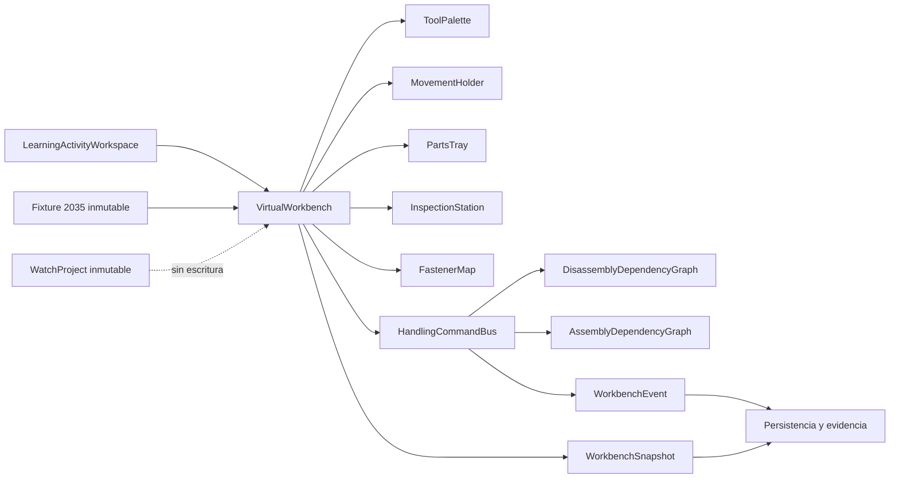
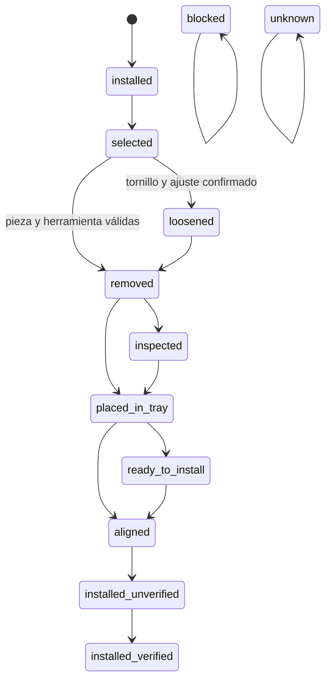
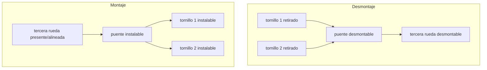
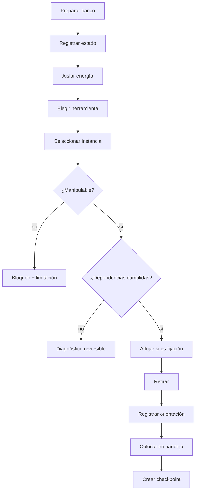
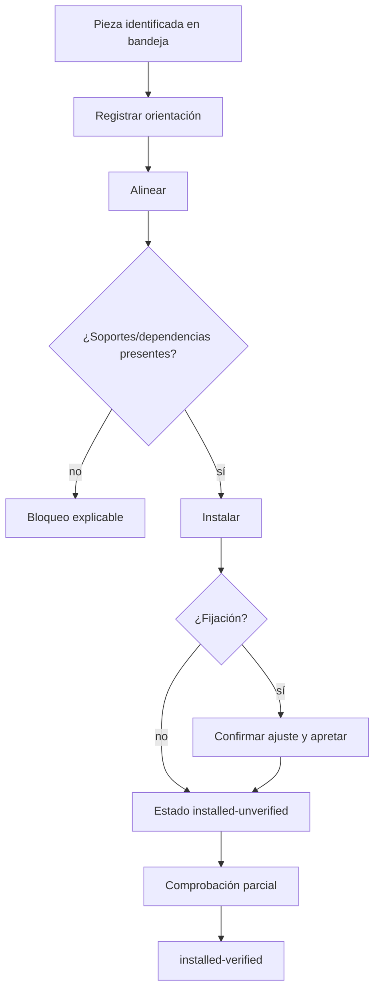
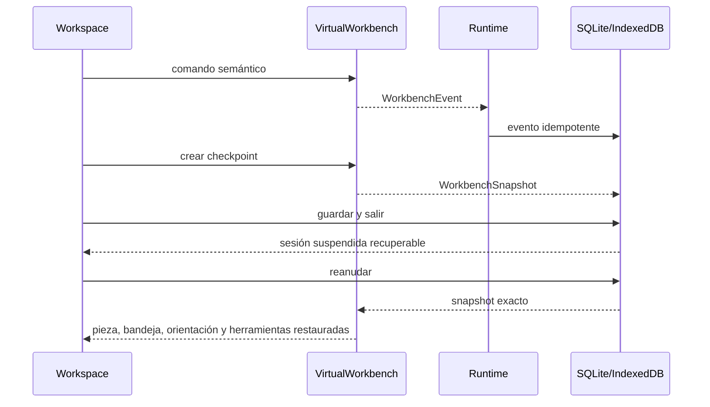
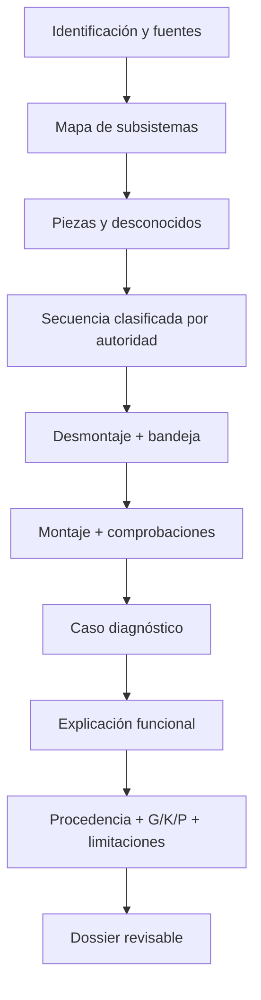

# Sistema 4D — Del ISA 8172 al MIYOTA 2035

Estado: implementado y validado.  
Estado editorial del paquete: `in-review`.  
Fecha de trabajo: 2026-07-27.

## 1. Alcance y autoridad

Sistema 4D construye la primera ruta práctica completa del área Aprender. Usa el fixture canónico `fixture.miyota.2035.structural@0.1.0`, el runtime declarativo y la persistencia de sesiones existentes. No inicia fundamentos mecánicos ni una ruta MIYOTA 8215.

La autoridad se mantiene en cuatro capas:

1. Documentación oficial MIYOTA para identidad, referencias, datos nominales y estructura documental del 2035.
2. Libro privado local para principios generales de taller y herramientas.
3. Recuerdo u observación del usuario para el ISA 8172, siempre clasificados como memoria, observación, fotografía o inferencia.
4. Contenido original de Watch Prototype Lab para explicaciones, actividades, banco y evaluación.

No se han incorporado pares, lubricantes, tolerancias, voltajes, resistencias, puntos de prueba, compatibilidades ni secuencias de servicio ausentes.

## 2. Protección previa y estado inicial

Al comenzar:

- el directorio era un repositorio Git válido sin commits;
- el contenido completo aparecía como no rastreado;
- no era posible crear un commit de seguridad sin autorización;
- se amplió `.gitignore` para excluir bases de datos, backups, paquetes privados, PDF, ZIP, `.wplab`, datos de usuario y copias locales de contenido;
- no se añadió el libro privado al repositorio;
- no se ejecutó `git add`, `git commit`, `git reset` ni otra operación destructiva.

Se creó antes del primer cambio de producción el checkpoint externo:

`<external-checkpoints>/system4c-approved-20260727.zip`

- tamaño: 1.187.194 bytes;
- SHA-256: `E50034A26A9D47330D5EA8DE2417BFE310E397016C0ED27A09144812DD98C396`;
- contiene fuentes, pruebas, documentación, contenido y configuración de Sistema 4C;
- excluye dependencias, builds, bases privadas y material fuente privado.

La falta de historial Git queda protegida, no resuelta: solo el propietario puede autorizar el primer commit.

## 3. Auditoría inicial del 2035

Los informes canónicos son:

- `learning-content/quartz-miyota2035/generated/miyota2035-audit.json`;
- `learning-content/quartz-miyota2035/generated/miyota2035-audit.md`.

Resultado:

| Concepto | Cantidad |
|---|---:|
| Registros de ledger | 33 |
| Instancias canónicas | 33 |
| Definiciones | 33 |
| Primitivas geométricas | 33 |
| Selectores contractuales | 11 |
| Relaciones funcionales | 19 |
| Dependencias bloqueantes de desmontaje | 3 |
| Dependencias bloqueantes de montaje | 3 |
| Listos | 18 |
| Utilizables con limitaciones | 10 |
| Solo documentales | 5 |

Cada fila registra identidad, ES/EN, referencia, subsistema, fuente, definición, instancias, geometría, transformación normalizada, interfaces, relaciones, selectores, cardinalidad, orden de capa, dependencias D/M, estado R, G/K/P, limitaciones y aptitud por operación.

Las cinco entradas solo documentales no se presentan como piezas físicas desmontables. Las coordenadas internas son estimaciones normalizadas. El fixture sigue siendo R2/G2/K2/P0.

La documentación disponible permite tres dependencias parciales:

- dos tornillos antes del puente de tren;
- el puente de tren antes de la tercera rueda.

Las tres se clasifican como relaciones inferidas de documentación, aunque tengan fuente y distinta confianza. No constituyen una secuencia de servicio completa.

## 4. Arquitectura del banco

El dominio vive en `src/learning/workbench/`. Sus piezas principales son:

- `VirtualWorkbench`: estado y coordinación.
- `WorkbenchTool`: herramienta genérica y capacidades permitidas.
- `WorkbenchZone` y `TrayZone`: orden visual y accesible.
- `WorkbenchPart`: overlay educativo por `PartInstanceId`.
- `WorkbenchDependencyGraph`: grafo por fase y diagnóstico de ciclos.
- `HandlingCommand`: intención semántica cancelable.
- `WorkbenchEvent`: resultado y contexto de evidencia.
- `WorkbenchSnapshot`: serialización completa y recuperación.
- `WorkbenchAccessibilityModel`: listas, orden y menús sin arrastre.

El banco se carga solo en actividades con `workbenchContract`. Los modos guiado, asistido y libre cambian ayudas y feedback, no el fixture ni el command bus.

## 5. Herramientas

El banco declara nueve herramientas genéricas:

| Herramienta | Capacidades principales | Límite |
|---|---|---|
| Soporte | `hold-movement` | sin presión física |
| Destornillador | `engage/loosen/tighten-fastener` | sin tamaño ni par prescrito |
| Pinzas | `pick/place/rotate-part` | sin fuerza ni material físico |
| Lupa | `inspect` | inspección educativa |
| Pera de aire | `remove-loose-dust` | defecto visual reversible |
| Palancas de agujas | `remove-hands` | sin compatibilidad dimensional |
| Colocador de agujas | `install-hands` | sin altura ni fuerza |
| Calibre | `measure-dimension` | no crea valores oficiales |
| Multímetro | `check-electrical-conceptually` | sin valores ni puntos inventados |

Una operación rechazada emite diagnóstico. Los tornillos exigen destornillador y confirmación de ajuste. La confirmación no prescribe anchura de hoja.

## 6. Piezas, tornillos y bandejas

Las 33 instancias conservan su `PartInstanceId`. Dos tornillos con la misma referencia siguen siendo entidades distintas y tienen nombres accesibles con contexto e identidad. No se agrupan por definición.

La bandeja contiene ocho zonas ordenadas. Cada pieza conserva:

- zona;
- secuencia de retirada;
- subsistema;
- orientación;
- nota;
- identidad canónica;
- estado;
- relación con el evento que la movió.

El orden accesible coincide con el visual. La fotografía es una referencia simulada dentro de una observación; no se crea una imagen que finja una unidad física.

## 7. Estados de pieza

`blocked` y `unknown` no se convierten mediante UI en geometría utilizable. Todos los estados pertenecen al overlay de la sesión.

## 8. Dependencias

Se usan grafos separados:

Los contratos admiten `remove-before`, `remove-after`, `requires-removed`, `requires-present`, `supports`, `covers`, `retains`, `fastened-by`, `align-before-install`, `inspect-before-close` y `verify-after-install`. En 0.1.0 solo se bloquean dependencias expresamente presentes. Los ciclos se diagnostican por fase.

Autoridades posibles:

- oficialmente documentada;
- estructural;
- educativa;
- inferida;
- no verificada.

## 9. Desmontaje

El desmontaje no es una animación. Cada paso cambia el estado solo cuando el comando es aceptado. Herramienta incorrecta, energía no aislada, pieza documental, fijación no aflojada o dependencia incumplida producen eventos rechazados.

## 10. Montaje

El montaje inverso solo se deriva donde existe una dependencia estructural explícita. El sistema no mide asiento, libertad de tren, altura de agujas ni par.

## 11. Recuperación

El checkpoint incluye las 33 identidades, herramientas, modo, energía, piezas retiradas, bandejas, orientación, observaciones, warnings, historial y siguiente secuencia. La prueba de integración guarda un tornillo en bandeja, cierra, recupera y verifica que los eventos de banco no se duplican.

## 12. Inspección y diagnóstico

La inspección admite entidad, cara conceptual, orientación, contorno, dientes, pivotes, contactos, procedencia y dimensiones conocidas o desconocidas. Los defectos son estados simbólicos reversibles:

- polvo o suciedad visible;
- diente simbólicamente ausente;
- contacto desplazado;
- rotor o tren bloqueado;
- orientación incorrecta;
- rayado u óxido simbólicos.

El diagnóstico registra síntoma, subsistema, hipótesis, comprobación y dato faltante. Nunca convierte un caso visual en certeza sobre una unidad física.

## 13. Contenido

Workspace: `learning-content/quartz-miyota2035/`.

Identidad:

- `wplab.horology.quartz-miyota2035@0.1.0`;
- `local-unsigned`;
- `in-review`;
- idioma completo: `es-ES`;
- dependencia: `wplab.horology.functional-map@^0.1.0`.

La ruta contiene:

1. El puesto de trabajo.
2. Herramientas fundamentales.
3. Observar antes de desmontar.
4. Del recuerdo del ISA 8172 a una observación trazable.
5. Cómo leer la documentación del MIYOTA 2035.
6. Anatomía completa del MIYOTA 2035.
7. Desmontaje virtual guiado.
8. Montaje virtual y comprobaciones.
9. Comprobación y diagnóstico básico.
10. Proyecto final MIYOTA 2035.

Incluye 10 lecciones, 20 actividades obligatorias, 13 competencias, 18 categorías de evidencia, 13 rúbricas, 13 recomendaciones de retención, 10 escenas y 10 recursos visuales.

## 14. Actividad, evidencia y evaluación

```mermaid
flowchart LR
  A["Actividad + workbenchContract"] --> B["HandlingCommand"]
  B --> C["WorkbenchEvent"]
  C --> D["Evento persistido"]
  D --> E["EvidenceExtractionRule"]
  E --> F["Evidencia con modo, ayudas, errores y límites"]
  F --> G["Rúbrica determinista"]
  G --> H["demonstrated"]
  H --> I["Recomendación posterior"]
  I --> J["otra sesión + ≥7 días + contexto distinto"]
  J --> K["candidato a retained"]
```

El tiempo no forma parte de la puntuación. Una adaptación accesible queda en contexto y no cuenta como pista. El proyecto final puede generar evidencia humana pendiente; no se transforma automáticamente en dominio profesional.

## 15. Proyecto final

El dossier puede completarse con geometría R2. Debe declarar qué no fue representable.

## 16. Fuentes

Se registran cinco fuentes oficiales MIYOTA 2035:

- página oficial;
- especificación;
- plano;
- manual;
- lista de piezas y vista explosionada.

El libro entregado se conserva fuera del repositorio:

`reference-library/originals/Horologia_completa_OCR_ligera_100MB.pdf`

Se verificaron visualmente:

- capítulo `Workshop and Equipment`, PDF pp. 26–31;
- capítulo `Hand Tools`, apartados de pinzas y destornilladores, PDF pp. 53–54.

Los registros contienen el localizador privado por capítulo y página, no una copia. No se reproduce texto largo ni se atribuye al libro una secuencia MIYOTA.

## 17. Accesibilidad

- toda acción tiene botón o menú y atajo declarado;
- no se requiere arrastre;
- zonas, herramientas y piezas siguen un orden único;
- bandeja accesible como lista;
- nombre único por instancia, incluidos tornillos repetidos;
- estado y diagnóstico anunciables en texto;
- color acompañado por texto, patrón o icono;
- reduced motion usa cambios discretos con idéntica evaluación.

## 18. Rendimiento

`learning-content/quartz-miyota2035/dist/workbench-performance.json` y `.md` contienen una muestra local headless:

| Métrica | Resultado aproximado |
|---|---:|
| Carga del banco | 0,998 ms |
| Preparación | 1,125 ms |
| Selección/cambio de paso | 0,049 ms |
| Tornillo a bandeja | 0,490 ms |
| Restauración | 0,245 ms |
| Reapertura | 0,765 ms |
| Reinstalación y verificación de un tornillo | 0,118 ms |
| Snapshot UTF-8 | 29.270 bytes |
| Objetos geométricos | 33 |
| Instancias manipulables | 23 |

Son muestras diagnósticas, no presupuestos. Draw calls y memoria GPU no se midieron en el runner headless. No se informa “montaje completo” porque el fixture no declara una secuencia completa; fingirla sería peor que declarar la carencia.

## 19. Preview, informes y paquete

Se generan:

- `dist/preview.html`;
- `dist/visual-needs.md`;
- `dist/visual-needs.json`;
- `dist/workbench-report.md`;
- `dist/workbench-performance.md`;
- `dist/workbench-performance.json`;
- `dist/pack.json`;
- `dist/wplab.horology.quartz-miyota2035-0.1.0.wplab-learning.zip`.

La preview muestra jerarquía, escenas, contrato de banco, modos, zonas, contexto de evidencia, rúbricas, fuentes, G/K/P y limitaciones.

Paquete final:

- tamaño: 170.688 bytes;
- SHA-256: `5E078CCBDD659155A6016D8511E5830313E2D92930FE89180119E5A3ACA2B9D5`.

## 20. Pruebas

Las pruebas nuevas cubren:

- creación, zonas, herramientas y bandejas;
- 33 identidades y tornillos repetidos;
- alternativa de teclado y reduced motion;
- herramienta incorrecta;
- aislamiento de energía;
- dependencia de desmontaje;
- retirada y bandeja;
- snapshot, serialización, restauración y reapertura;
- separación de grafos y ausencia de ciclos;
- guiado, asistido y libre sobre el mismo fixture;
- inmutabilidad de fixture y WatchProject;
- paquete de diez módulos;
- 20 actividades, 13 competencias, 18 evidencias y 13 rúbricas;
- fuentes privadas por capítulo;
- retención posterior;
- sesión integrada, evento persistido, checkpoint y recuperación sin duplicar eventos;
- evidencia real y dominio `demonstrated`, nunca `retained` en la sesión inicial.

Resultados finales:

- `learning:validate`, `learning:lint`, `learning:preview`, `learning:visual-report` y `learning:pack`: correctos y sin diagnósticos editoriales;
- `npm run verify`: 61 archivos y 263 pruebas Vitest correctas, ESLint correcto y build de producción correcto;
- Rust/Tauri: 7 pruebas correctas; permanece un aviso no bloqueante del enlazador de Windows;
- CAD: 8 pruebas correctas;
- smoke web: ruta de diez módulos cargada, preflight correcto y banco con 33 instancias, 9 herramientas y 8 zonas de bandeja;
- ciclo web real: preparación, aislamiento, selección del tornillo `934-440`, aflojado, retirada, bandeja, guardado y recuperación;
- recuperación web: mismo ID de sesión, 6 eventos, estado `placed-in-tray` y misma zona, sin duplicación;
- smoke Desktop: compilación de desarrollo correcta y ventana `Watch Prototype Lab` abierta y respondiendo.

## 21. Limitaciones y deuda

- Solo existen tres dependencias parciales bloqueantes.
- Diez registros son utilizables con limitaciones y cinco son solo documentales.
- No hay geometría R3/R4 ni medición de una unidad física.
- No hay secuencia completa de desmontaje o montaje.
- No se validan asiento, alineación física, libertad del tren, contactos eléctricos ni agujas.
- El multímetro es conceptual.
- Los defectos son simbólicos.
- Falta instrumentación GPU de draw calls y memoria.
- El paquete requiere revisión humana antes de publicar.
- El repositorio sigue sin un primer commit autorizado.

## 22. Propuesta del sistema siguiente

Propuesta: **Sistema 4E — revisión humana, validación física parcial y publicación controlada de la ruta 2035**.

Su alcance debería ser revisar dependencias una por una contra manual o unidad física identificada, capturar mediciones como R4 cuando proceda, instrumentar rendimiento GPU, cerrar gates editoriales y preparar una publicación firmada. No debería comenzar todavía fundamentos mecánicos ni el MIYOTA 8215.
