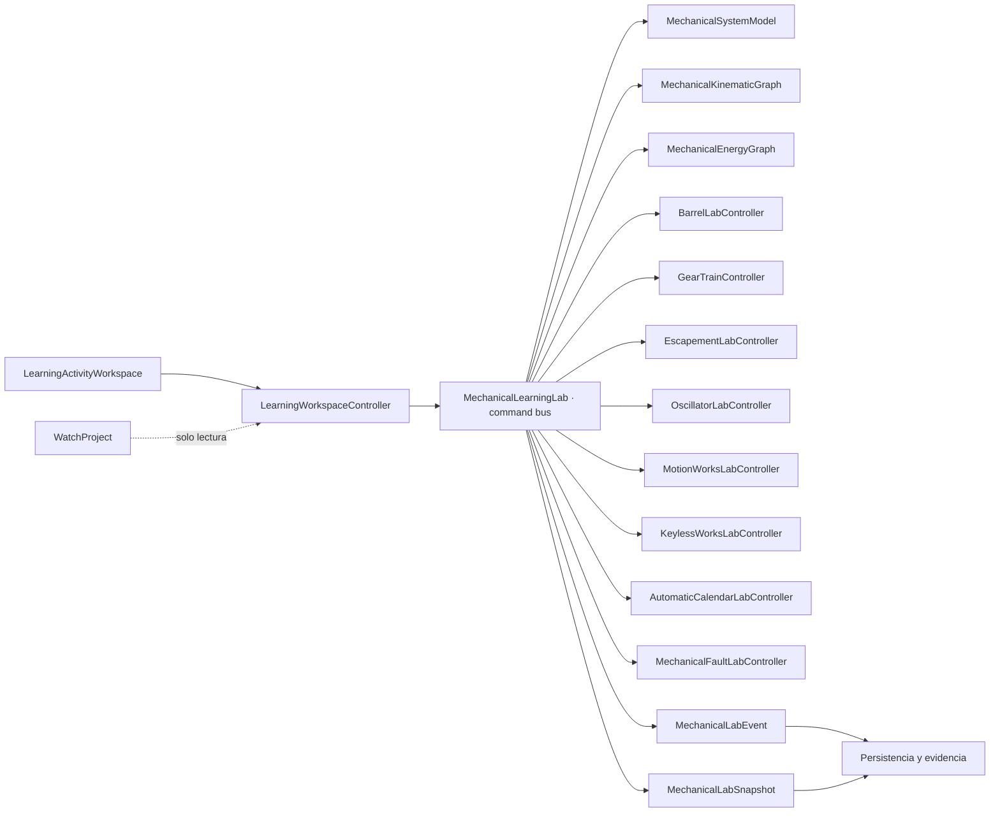
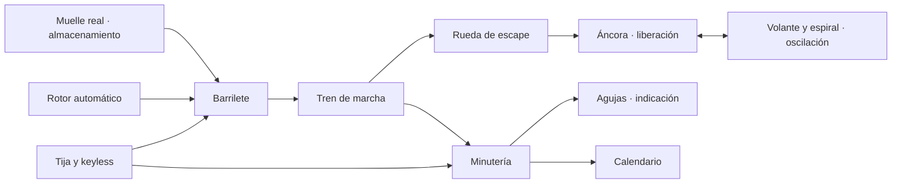
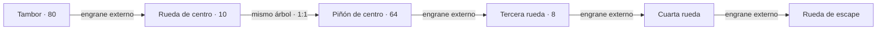
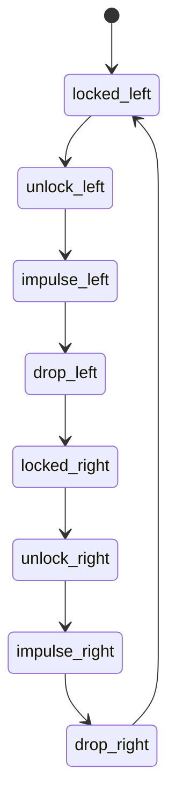
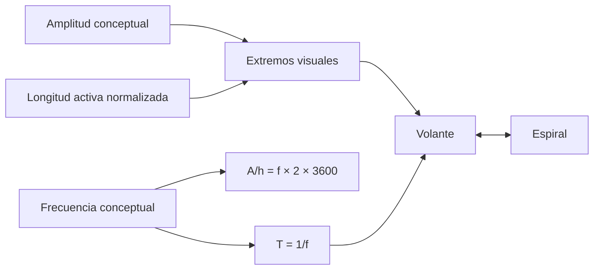
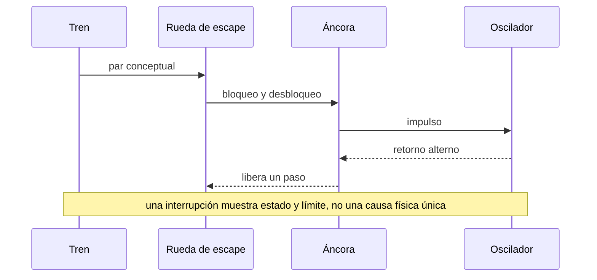
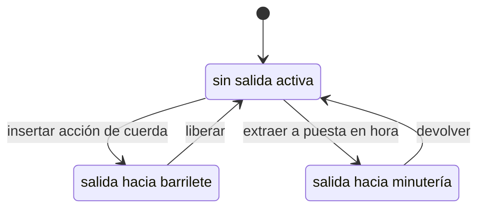
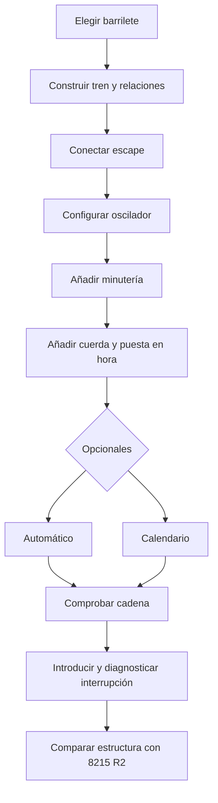
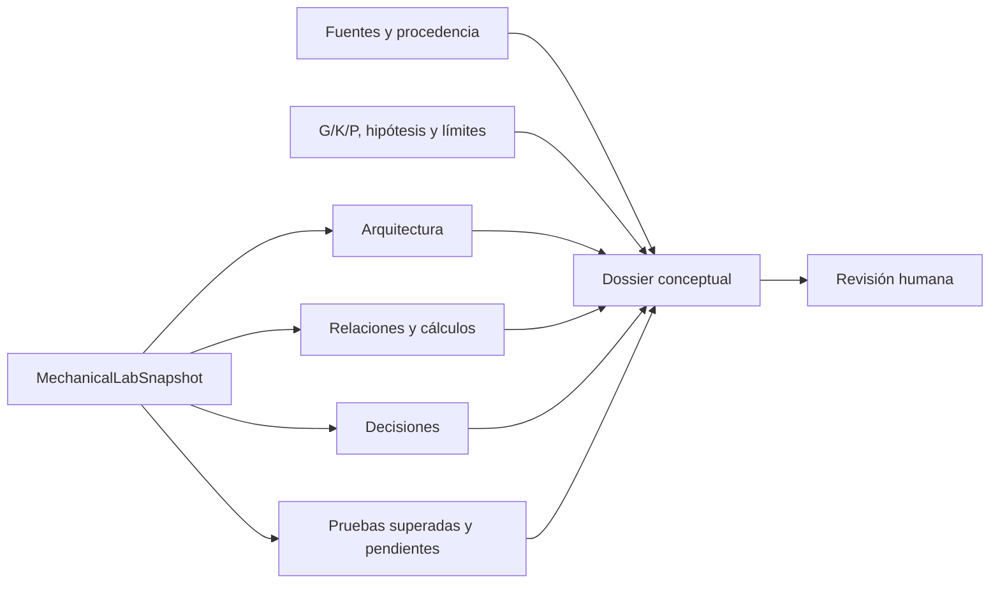

# Sistema 4E — Fundamentos mecánicos completos y laboratorio funcional

Estado técnico: implementado y validado.  
Estado editorial: `in-review`; pendiente de aprobación humana.  
Paquete: `wplab.horology.mechanical-foundations@0.1.0`.  
Ruta: **Fundamentos del reloj mecánico**.  
Fecha de trabajo: 2026-07-27.

## 1. Alcance, autoridad y protección inicial

Sistema 4E convierte el fixture mecánico conceptual de 4B/4C en una ruta local, manipulable, evaluable y recuperable. El MIYOTA 8215 solo interviene como comparación estructural R2; no se ha iniciado su desmontaje, montaje, lubricación, regulación ni servicio.

Antes del primer cambio se comprobó que:

- el repositorio era válido, pero todavía no tenía commits y todo el árbol aparecía como no rastreado;
- `.gitignore` excluía dependencias, builds, PDF, ZIP, bases SQLite, datos personales, sesiones y paquetes privados;
- los paquetes `learning-content/horology-foundations/` y `learning-content/quartz-miyota2035/` permanecían presentes;
- no se ejecutó `git add`, `git commit`, `git reset` ni otra mutación de historial;
- el PDF privado permanecía fuera del repositorio;
- existía y se verificó el checkpoint externo de 4D:
  `<external-checkpoints>/system4d-approved-20260727-src.zip`,
  46.040.526 bytes, SHA-256
  `9C42763E9704762C65836376368875FE874000819F8EB6F9DB47B778127A51F7`.

La autoridad se separa así:

1. El currículo maestro y las decisiones editoriales fijan la secuencia pedagógica.
2. El libro privado aporta teoría general, nunca texto copiado ni un activo del paquete.
3. La documentación oficial MIYOTA respalda únicamente identidades y estructura concreta del 8215.
4. El laboratorio, sus cálculos, actividades y feedback son contenido original o cálculo educativo declarado.

## 2. Auditoría inicial

Los resultados reproducibles están en:

- `learning-content/mechanical-foundations/generated/mechanical-fixture-audit.json`;
- `learning-content/mechanical-foundations/generated/mechanical-fixture-audit.md`.

El fixture previo `fixture.conceptual.mechanical-chain` contenía 14 registros conceptuales. Permitía selección, visibilidad, aislamiento, resaltado, explosionado y restauración, pero no tenía dientes editables, tren configurable, fases del escape, parámetros independientes del oscilador, estados keyless, automático, calendario o diagnóstico coordinado.

La capa de laboratorio de 4E añade:

| Elemento | Cantidad |
|---|---:|
| Entidades conceptuales | 30 |
| Relaciones cinemáticas | 12 |
| Tramos del grafo energético | 9 |
| Etapas iniciales del tren | 4 |
| Fases discretas del escape | 8 |
| Fallos reversibles | 16 |

La auditoría distingue instancias, primitivas, relaciones, selectores, anclajes, grados de libertad, operaciones representables, G/K/P y limitaciones. El fixture 8215 se audita aparte: puede ilustrar subsistemas documentados, pero no hereda dientes, movimiento, par, pérdidas o conclusiones del conceptual.

## 3. Identidad, prerrequisitos y publicación

El paquete es `local-unsigned`, versión `0.1.0`, idioma completo `es-ES` y estado `in-review`. Declara dependencia de `wplab.horology.functional-map@^0.1.0`.

La primera lección declara como prerrequisito externo:

- módulo `module.horology.functional-map`;
- `competency.horology.identify-functional-subsystems`;
- `competency.horology.explain-mechanical-energy-chain`;
- `competency.horology.predict-system-interruption`.

La ruta `route.quartz2035.isa-to-2035` se conserva como recomendada pero opcional. No es dependencia del paquete mecánico ni bloqueo para aprender mecánica.

## 4. Arquitectura del laboratorio

`MechanicalLearningLab` coordina, pero no concentra la lógica de cada subsistema. Los controladores son independientes de React, funcionan en Node headless y mutan exclusivamente un snapshot educativo. La UI envía intenciones semánticas; no escribe estado de aprendizaje en `WatchProject`.

Cada comando se valida, genera un evento aceptado o rechazado, actualiza el checkpoint cuando procede, admite deshacer para las mutaciones normales y tiene un equivalente accionable sin arrastre.

## 5. Fidelidad y separación del 8215

| Capa | Uso en 4E | Límite |
|---|---|---|
| Estructural | entidades, apoyos, engranes, conexiones y orden conceptual | no es geometría fabricable |
| Cinemática | relación, sentido, velocidad relativa, bloqueo, liberación y secuencia | modelo ideal K2 |
| Física simplificada | energía, consumo, reserva, amplitud y longitud activa normalizados | P0; no validación de ingeniería |
| Calibre real | superposición o comparación visual del 8215 R2/G2/K2/P0 | no hereda cinemática conceptual |

El modelo principal conserva `G1/K2/P0`. Cada actividad incluye estas clasificaciones y sus límites. El 8215 permanece identificado como `fixture.miyota.8215.structural`, nunca como “gemelo exacto”.

## 6. Grafo energético

Los nueve tramos declaran origen, destino, función, rama, dirección, estado, fuente, fidelidad y limitación. El estado actual —activo, inactivo, bloqueado o interrumpido— se deriva del snapshot. La representación textual y la visual se generan desde el mismo grafo.

## 7. Modelo cinemático y cálculos

Las relaciones iniciales son `external-mesh`, `internal-mesh`, `same-arbor`, `escapement-release`, `oscillatory-coupling`, `friction-drive`, `manual-setting` y `automatic-winding`. Rueda de centro y piñón de centro tienen identidades separadas y una relación explícita `same-arbor`.

Los conteos pertenecen al ejemplo educativo, no al MIYOTA 8215. El alumno puede cambiar dientes, añadir o retirar etapas, interrumpir engranes y observar relación y dirección final.

| Resultado | Fórmula declarada | Unidad |
|---|---|---|
| Par de ruedas | `n₂/n₁ = Z₁/Z₂` | vueltas salida / vuelta entrada |
| Tren | `R_total = Π(Z_conductora/Z_conducida)` | vueltas salida / vuelta entrada |
| Periodo | `T = 1/f` | segundos/ciclo |
| Alternancias | `A/h = f × 2 × 3600` | alternancias/hora |
| Minutería | `n_horaria = n_minutera/12` | vueltas |
| Reserva conceptual | `energía normalizada/consumo normalizado por hora` | horas conceptuales |

Cada resultado conserva entradas, fórmula, unidad, política de redondeo, clasificación `educational-calculation` y limitación. No hay valores hardcodeados como supuestos del 8215.

## 8. Barrilete, engranajes, tren y apoyos

El barrilete separa muelle real, árbol, tambor, tapa y brida deslizante conceptual. La energía se carga y libera progresivamente entre 0 y 1. Se puede bloquear árbol o tambor mediante la misma operación semántica usada para cualquier entidad. No se calculan tensión, curva de par ni geometría física del muelle.

La pareja y el tren soportan dientes editables, engrane externo e interno ideal, etapa intermedia, estados de centros, adición, retirada, bloqueo y restauración. Una etapa abierta produce dirección final cero como señal de cadena interrumpida, no como medición de par.

Los apoyos distinguen `supported`, `pivot-outside-jewel`, `excess-axial`, `no-freedom` y `rubbing`. Son estados discretos deliberadamente exagerados; no expresan micras, endshake o sideshake de un calibre.

## 9. Escape

El escape admite paso adelante y atrás, scrub a cualquiera de las ocho fases, pausa y velocidades visuales discretas `0.25×`, `0.5×` y `1×`. Reduced motion usa exactamente estas fases estáticas. No se declaran ángulos, penetraciones, caída, seguridad, pérdidas o lubricación físicos.

## 10. Oscilador e integración escape–oscilador

Frecuencia y amplitud son entradas independientes. El usuario puede variar frecuencia, amplitud y longitud activa normalizada, oscilar ciclos y pausar. El modelo no usa una fórmula física de espiral ni concluye marcha, beat error o isocronismo reales.

Los fallos coordinados separan síntoma, estado visual, hipótesis, prueba, conclusión permitida y conclusión prohibida.

## 11. Minutería, keyless, automático y calendario

La minutería incluye cañón de minutos, rueda de minutería, rueda de horas, fricción e indicación. Puede acoplarse, desacoplarse, fijar tiempo y responder a la corona en puesta en hora. La relación de 12 horas es educativa.

Los estados keyless son `winding`, `neutral` y `time-setting`; una posición ajena se rechaza. No se atribuye esta disposición a todos los calibres.

La carga automática alterna familias conceptuales uni y bidireccionales. El calendario permite un ciclo discreto de días y un bloqueo simbólico. No se implementa geometría, ventana de corrección o calendario específico del 8215.

## 12. Integración completa y proyecto final

El proyecto conserva subsistemas activados, decisiones, checks superados y pendientes. Produce evidencia y dossier conceptual; no crea un movimiento industrial fabricable.

## 13. Contenido, fuentes y glosario

La ruta contiene:

| Elemento | Cantidad |
|---|---:|
| Rutas | 1 |
| Módulos / lecciones | 12 / 12 |
| Actividades | 29 |
| Competencias | 16 |
| Evidencias / rúbricas | 16 / 16 |
| Recomendaciones de retención | 16 |
| Términos de glosario | 48 |
| Fuentes | 12 |
| Recursos visuales | 12 |

Los doce módulos son: energía; muelle y barrilete; ruedas, piñones y engrane; tren de rodaje; apoyos; escape suizo; volante y espiral; integración escape–oscilador; minutería; cuerda y puesta en hora; automático y calendario; integración y proyecto final.

El libro privado se cita por localizador, sin copiar contenido:

- *Wheels and Pinions*, PDF pp. 124–167;
- *Jewelling*, pp. 195–213;
- *Escapements*, pp. 214–271;
- *Mainsprings and Accessories*, pp. 272–297;
- *Movement Design*, pp. 298–335;
- *Balance and Spring*, pp. 336–370.

Las fuentes oficiales del 8215 proceden del registro curado de 4B/4C y permanecen separadas de la teoría privada. El PDF no está en el paquete ni en el repositorio.

El glosario mantiene equivalencias ES/EN, definición simple, definición técnica, contexto y fuentes. El manifiesto no declara inglés como idioma completo.

## 14. Evidencia, rúbricas y retención

Cada actividad emite `mechanical-lab-command` con comando, estado, subsistema, relación, fase, frecuencia, amplitud, corona, calendario, fallos y fidelidad. Las 16 competencias tienen plantilla de evidencia, rúbrica y regla compuesta explicable.

Las actividades deterministas usan evidencia de simulación; diagnóstico, comparación y documentación pueden requerir revisión humana. El tiempo y las adaptaciones accesibles no penalizan.

Ninguna rúbrica concede `retained` en la sesión actual. La recomendación de retención exige:

- un mínimo de siete días o la política futura configurada;
- una sesión nueva;
- una actividad distinta;
- evidencia independiente.

## 15. Persistencia, recuperación e inmutabilidad

El snapshot completo entra en el checkpoint de la sesión: energía, etapas, dientes, centros, fase y velocidad del escape, frecuencia, amplitud, longitud activa, minutería, corona, automático, calendario, fallos, proyecto y eventos.

La recuperación restaura el snapshot sin volver a emitir los eventos históricos. Las pruebas verifican que `WatchProject`, el fixture conceptual y el fixture 8215 no mutan.

## 16. Accesibilidad

El laboratorio:

- funciona con teclado y acciones nombradas, sin arrastre obligatorio;
- usa estados discretos y no depende del color;
- expone fórmulas, unidades y límites en texto;
- ofrece pausa, scrub, paso a paso, velocidad y ocho fases numeradas;
- mantiene reduced motion con los mismos estados, resultados y evaluación;
- genera la alternativa textual cinemática y energética desde los mismos grafos;
- restaura selección, vista, configuración y fallos.

## 17. Rendimiento

`dist/mechanical-performance.{md,json}` mide el dominio headless, no el renderer. En la muestra del 27 de julio:

| Operación | Tiempo |
|---|---:|
| Crear laboratorio | 0,966 ms |
| Cargar energía | 0,918 ms |
| Cambiar relación | 0,296 ms |
| Recalcular tren | 0,014 ms |
| Recorrer ocho fases | 0,943 ms |
| Restaurar snapshot | 0,355 ms |
| Reconfigurar funciones | 0,548 ms |

El snapshot medido ocupó 12.102 bytes. Materiales, draw calls, memoria GPU y coste real de montaje no se midieron en Node; no se inventa una cifra. Las escenas y el laboratorio se seleccionan por módulo, y la composición visual monta únicamente el fixture requerido por la actividad.

## 18. Preview, informes y paquete

Se generan:

- `dist/preview.html`;
- `dist/visual-needs.md` y `dist/visual-needs.json`;
- `dist/mechanical-lab-report.md`;
- `dist/mechanical-performance.md` y `.json`;
- `generated/mechanical-fixture-audit.md` y `.json`;
- `dist/wplab.horology.mechanical-foundations-0.1.0.wplab-learning.zip`.

La preview lista jerarquía, contenido, claims, laboratorios, comandos, vistas, competencias, fuentes, glosario, G/K/P, limitaciones, recursos y gates.

El paquete final ocupa 225.290 bytes y su SHA-256 es
`F1E227E89F36BA5719DBF4C475F5695BE50328D69FFAA0209777015BC5C24665`.
La preview final ocupa 86.799 bytes.

## 19. Pruebas y validación

La batería nueva cubre cálculos de par y tren, engrane interno, rueda intermedia, mismo árbol, interrupción, unidades, oscilador, minutería, reserva, barrilete, ocho fases, scrub, velocidad, apoyos, keyless inválido, automático, calendario, fallos, proyecto, undo, reduced motion, serialización, checkpoint, reapertura, evidencia e inmutabilidad.

Resultados finales:

| Validación | Resultado |
|---|---|
| `learning:validate` | correcta, sin diagnósticos |
| `learning:lint` | correcta, sin diagnósticos |
| preview / visual report / pack | generados |
| `npm run verify` | correcto |
| Vitest | 63 archivos, 274 pruebas superadas |
| ESLint / TypeScript / Vite build | correctos |
| Rust | 7 pruebas superadas |
| CAD | 8 pruebas superadas en 114,14 s |
| IndexedDB | guardado, salida y recuperación verificados en navegador |
| Smoke web | práctica real completada y evaluada |
| Smoke Desktop | proceso abierto, ventana `Watch Prototype Lab`, `Responding=True`, cierre controlado |

El smoke web abrió la ruta y confirmó prerrequisitos y G1/K2/P0. La primera práctica ejecutó carga, cambio de relación, adición de etapa, scrub y velocidad del escape, oscilador, posición de corona, automático, calendario, fallo y decisión del dossier. Guardó en IndexedDB, reanudó energía, tren, fase, velocidad, oscilador, corona, fecha, fallo y proyecto sin duplicar sus 11 eventos. Finalizó con 11 evidencias `simulation-result`, regla satisfecha, transición `not_started → demonstrated` y ausencia de `retained`.

El proyecto integrador también se verificó de extremo a extremo. Conservó tras guardar y reanudar los nueve subsistemas del dossier; superó las comprobaciones de energía, escape, oscilador, minutería, arquitectura mínima, comparación visual 8215 R2 y documentación de decisiones y límites; dejó únicamente la revisión humana como pendiente interna del dossier. La entrega persistió 16 evidencias inmutables, satisfizo la regla compuesta sin criterios pendientes y produjo la transición `not_started → demonstrated`.

No hubo errores de consola. Se observaron avisos no bloqueantes ya existentes:

- Three.js depreca `THREE.Clock` a favor de `THREE.Timer`;
- Three.js sustituye `PCFSoftShadowMap` por `PCFShadowMap`;
- Vite informa dos imports dinámicos ineficaces;
- Vite avisa de chunks superiores a 500 kB;
- Rust muestra un mensaje informativo del enlazador de Windows.

## 20. Limitaciones y deuda

- G1/K2/P0 sigue siendo conceptual.
- No existen perfiles reales de diente, distancias físicas entre centros o curva de par.
- No se miden endshake, sideshake, tolerancias, fricción o pérdidas.
- El escape no simula ángulos ni contactos físicos.
- Volante y espiral no constituyen un modelo dinámico.
- No hay dientes, relaciones, lubricación o secuencia de servicio específicos del 8215 salvo datos oficiales explícitos.
- El renderer todavía no informa materiales, draw calls o memoria GPU por módulo.
- El proyecto final requiere aprobación editorial y revisión humana.
- El repositorio continúa sin historial hasta que el propietario autorice un primer commit.

## 21. Propuesta de Sistema 4F

Sistema 4F debería preparar, sin iniciarlo desde 4E, la ruta específica **Conocer el MIYOTA 8215**: auditoría pieza a pieza, navegación por subsistemas, comparación entre documentación y fixture R2, operaciones de observación y preparación de banco. El desmontaje, montaje, lubricación y servicio solo deberían entrar cuando existan fuentes, dependencias, geometría y validación suficientes. No se ha implementado ninguna parte de 4F.
