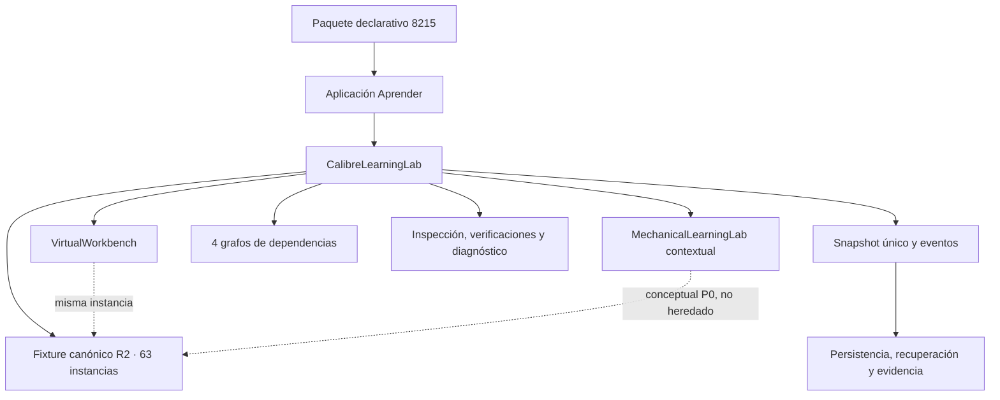
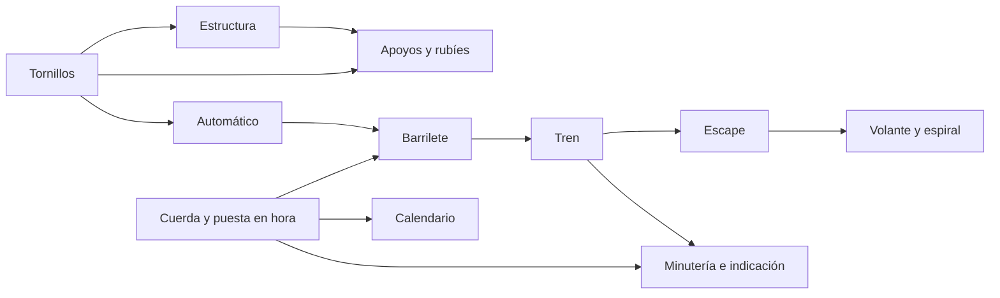
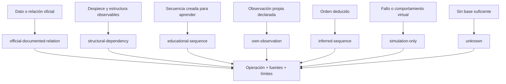
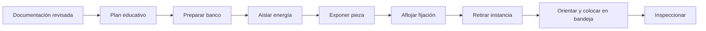
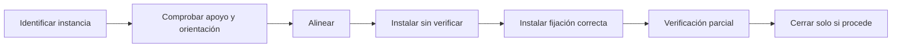
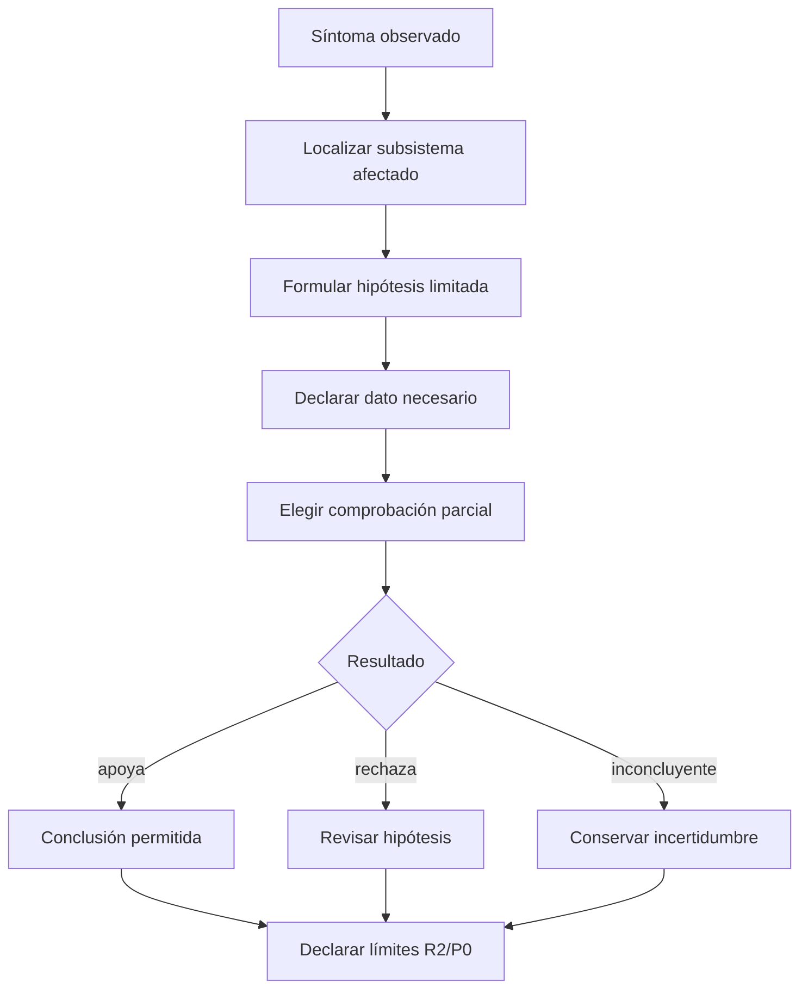
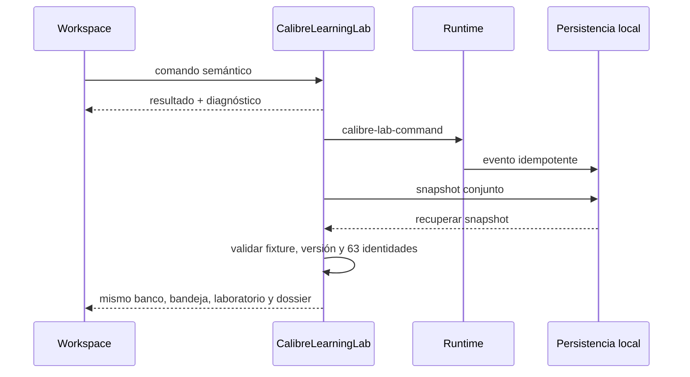
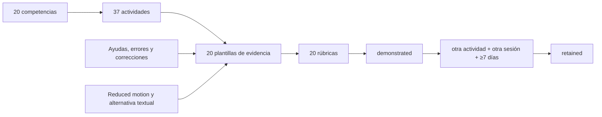

# Sistema 4F — MIYOTA 8215 completo

Estado técnico: terminado y verificado.  
Estado editorial: `in-review`.  
Paquete: `wplab.horology.miyota8215@0.1.0`.  
Ruta: **MIYOTA 8215: comprender, desmontar, montar y diagnosticar**.  
Fecha: 2026-07-27.

## 1. Resultado

Sistema 4F incorpora la primera especialización completa sobre un movimiento real dentro de Aprender. Reutiliza, sin duplicarlos:

- el ensamblaje canónico R2 del MIYOTA 8215 de Sistema 4B;
- el motor visual declarativo y reversible de Sistema 4C;
- el banco semántico, herramientas, bandejas y grafos de Sistema 4D;
- los laboratorios conceptuales mecánicos de Sistema 4E.

El resultado contiene 15 módulos, 15 lecciones, 37 actividades, 20 competencias, 20 plantillas de evidencia, 20 rúbricas, 56 entradas de glosario ES/EN, 15 recursos visuales y 12 fuentes registradas. El paquete es local, firmado por la confianza de la instalación y preparado para trabajar sin conexión después de instalarse.

La ruta cubre identificación, documentación, arquitectura, automático, cuerda y puesta en hora, calendario, barrilete, tren, escape y oscilador, planificación, desmontaje, inspección, montaje, comprobaciones parciales, diagnóstico conceptual y proyecto final. No introduce procedimientos oficiales inexistentes ni convierte la simulación en validación física.

## 2. Protección del estado aprobado

Antes del primer cambio de producción se verificaron Sistemas 0–4E, el kit de autoría, el blueprint editorial, los contratos de fixtures, selectores, geometría, viewport, procedencia, banco y laboratorios mecánicos.

Se creó el checkpoint externo:

`<external-checkpoints>/system4e-approved-20260727-src.zip`

- 937 archivos fuente;
- 46.378.529 bytes;
- SHA-256 `FD793E6AC170DC6B76A79026B1FBB1F1588CE46B5F9AA6A4513A825B2B891142`;
- sin dependencias, builds, sidecars generados, PDF, bases de datos ni datos personales.

El libro privado permanece fuera del repositorio. No se ejecutaron operaciones de staging, commit o mutación de historial. Se añadió `src-tauri/binaries/` a `.gitignore` al identificar el sidecar CAD generado.

## 3. Auditoría inicial y clasificación real

| Elemento | Cantidad |
|---|---:|
| Registros del ledger / definiciones | 56 |
| Instancias canónicas | 63 |
| Primitivas geométricas | 63 |
| Relaciones del fixture previo | 32 |
| Selectores del fixture previo | 16 |
| Registros R2 / R1 / R0 | 29 / 4 / 23 |
| Estados de banco manipulable / bloqueado / desconocido | 41 / 17 / 5 |
| Aptitud 4F lista / limitada / documental | 30 / 4 / 29 |

La clasificación de aptitud de 4F es deliberadamente más estricta que el estado interno del banco. Una envolvente, un marcador simbólico o una identidad documental pueden existir y seleccionarse sin ser una pieza individual apta para desmontaje. Por eso el nombre de una pieza no se usa como prueba de geometría utilizable.

El informe exhaustivo está en:

- `learning-content/miyota8215/generated/miyota8215-audit.md`;
- `learning-content/miyota8215/generated/miyota8215-audit.json`.

## 4. Arquitectura

`CalibreLearningLab` es la raíz de estado del calibre. Cuando una actividad necesita banco o laboratorio mecánico, la aplicación referencia las instancias que posee el laboratorio de calibre; no crea copias paralelas. El snapshot conserva:

- versión y fingerprint del fixture;
- modo guided, assisted o free;
- vista, cámara, subsistema e instancia seleccionados;
- documentación revisada y plan;
- las 63 identidades y sus estados de banco;
- bandejas, herramientas, orientaciones y tornillos;
- laboratorio contextual;
- inspecciones, defectos, comprobaciones, fallos e hipótesis;
- dossier de proyecto y eventos.

La recuperación rechaza snapshots de otro fixture, versión o conjunto de identidades.

## 5. Subsistemas y ensamblaje único

Los 12 subsistemas semánticos conservan sus instancias, relaciones, fuentes, operaciones, fidelidad y limitaciones. Automático, calendario o rotor se muestran, ocultan o aíslan como vistas del mismo ensamblaje; no generan modelos alternativos incoherentes.

Puentes, tornillos repetidos, rubíes y apoyos conservan identidad por instancia. Una referencia oficial compartida no colapsa las apariciones físicas. Las relaciones `supports`, `pivots-in`, `covers`, `retains`, `fastened-by`, `meshes-with`, `drives`, `winds`, `sets`, `locks`, `releases` e `impulses` permanecen consultables.

## 6. Autoridad de datos y operaciones

Se materializan 501 operaciones y 39 dependencias. Cada operación declara fase, acción, instancia o subsistema, autoridad, fuentes, herramientas, incompatibilidades, dependencias, riesgo educativo, alternativa accesible y limitaciones. El contador `publishedAsOfficial` es cero.

El manual de instrucciones no se interpreta como manual integral de servicio y el despiece no se convierte en una secuencia oficial. La matriz completa está en:

- `learning-content/miyota8215/generated/miyota8215-operation-matrix.md`;
- `learning-content/miyota8215/generated/miyota8215-operation-matrix.json`;
- `learning-content/miyota8215/dist/operation-authority-report.md`.

## 7. Grafos de desmontaje y montaje

Los grafos `disassembly`, `assembly`, `structure` y `function` son independientes. Solo sus aristas bloqueantes gobiernan una acción. La auditoría no detecta ciclos. El modo:

- `guided` muestra el siguiente paso y detiene incompatibilidades;
- `assisted` permite elección con advertencias y recuperación;
- `free` conserva límites estructurales, identidad y seguridad, pero no dicta secuencia.

Ningún modo premia velocidad. Una acción rechazada conserva el estado y emite diagnóstico.

## 8. Inspección y comprobaciones parciales

El sistema puede registrar inspección sin defecto o aplicar defectos educativos reversibles: suciedad, diente dañado simbólico, pivote fuera de apoyo, rueda sin libertad, tornillo incorrecto, pieza invertida, roce, muelle desplazado, apoyo de rubí ausente simbólico, deformación o corrosión simbólicas.

Las 12 comprobaciones parciales cubren continuidad funcional, alineación, apoyos, identidad de pieza y tornillo, orientación, ruta energética, calendario, tija, presencia del rotor y restauración del montaje. Cada resultado declara:

- qué comprueba;
- qué no comprueba;
- instancias afectadas;
- G/K/P y limitación;
- `passed`, `failed`, `not-supported` o `unknown`.

Una animación libre del tren no prueba libertad física; se devuelve `not-supported` salvo que un fallo simbólico permita rechazar el estado visual.

## 9. Diagnóstico conceptual

Hay 15 fallos reversibles: no inicia, no transmite, rotor bloqueado, automático desconectado, barrilete vacío, tren interrumpido, escape bloqueado, volante detenido, estado de tija incorrecto, calendario bloqueado, pieza ausente, tornillo incorrecto, puente sin asiento, pivote fuera de apoyo y agujas bloqueadas.

Todos se clasifican como `educational-simulation`. Una hipótesis debe nombrar síntoma, subsistema, dato requerido y comprobación. La conclusión prohibida común es afirmar una avería física confirmada a partir de la simulación.

## 10. Recuperación y estado reversible

Los eventos `calibre-lab-command` se persisten y solicitan checkpoint. Las acciones de banco en una actividad 8215 emiten tanto su evidencia de banco como el evento de calibre con autoridad. La recuperación restaura primero el snapshot conjunto y vuelve a enlazar las referencias del banco y el laboratorio mecánico.

La medición headless confirmó identidad del fingerprint, 63 instancias, igual número de eventos y el tornillo seleccionado todavía en su bandeja. Los tiempos y tamaño del snapshot se publican en:

- `learning-content/miyota8215/dist/performance.md`;
- `learning-content/miyota8215/dist/performance.json`.

Draw calls, materiales y memoria GPU se mantienen como no medidos en Node.

## 11. Contenido y progresión

| # | Módulo | Resultado principal |
|---:|---|---|
| 1 | Identificar el MIYOTA 8215 | Fabricante, calibre, familia, caras y fidelidad |
| 2 | Leer su documentación | Fuente, llamada, referencia, dato y límite |
| 3 | Arquitectura general | Capas, subsistemas y rutas |
| 4 | Sistema automático | Rotor, reversión y comparación conceptual |
| 5 | Cuerda y puesta en hora | Estados funcionales y transmisión |
| 6 | Calendario | Cadena y ciclo educativo sin ventana de servicio |
| 7 | Barrilete y energía | Almacenamiento y entrega normalizada |
| 8 | Tren | Identidad y continuidad sin dientes inventados |
| 9 | Escape y oscilador | Fases conceptuales y límites |
| 10 | Planificar el desmontaje | Autoridad, herramientas y dependencias |
| 11 | Desmontaje guiado | Operación segura con evidencia |
| 12 | Desmontaje asistido y libre | Decisión sin perder restricciones |
| 13 | Inspección | Hallazgo simbólico y clasificación |
| 14 | Montaje y verificaciones | Orden inverso razonado y pruebas parciales |
| 15 | Diagnóstico y proyecto | Hipótesis, límites y dossier completo |

Cada lección incluye propósito, objetivos, prerrequisitos, explicación, visual, interacciones, fuentes, claims, vocabulario, actividades, errores, feedback, evidencia, rúbrica, limitaciones, resumen y conexión siguiente. El paquete no contiene contenido de otros calibres.

El preview editorial expone también los contratos de calibre, fases, subsistemas, modos, laboratorios contextuales, autoridad, identidad y alternativas accesibles:

`learning-content/miyota8215/dist/preview.html`

## 12. Evaluación

Las competencias cubren conocimiento, procedimiento, razonamiento y artefacto. Las rúbricas consideran:

- identificación y procedencia;
- subsistema, pieza e instancia;
- herramienta, orientación, bandeja y estado;
- autoridad de la operación;
- calidad del plan y dependencia;
- observación, hipótesis y dato requerido;
- comprobación y conclusión permitida;
- correcciones, ayudas y límites.

`demonstrated` puede obtenerse en la actividad. `retained` no se concede en la misma ejecución: requiere evidencia posterior, otra actividad, otra sesión y un mínimo de siete días. Las adaptaciones accesibles no rebajan el criterio.

## 13. Accesibilidad y reduced motion

La interfaz ofrece controles semánticos sin arrastre, árbol por subsistema, identidad y estado de cada instancia, dependencias, acciones disponibles, filas de bandeja y tornillos, fallos, vistas discretas y alternativas textuales.

Reduced motion:

- desactiva cámara automática;
- usa estados discretos y arcos estáticos;
- numera la ruta de energía;
- permite recorrer manualmente las fases del escape;
- conserva exactamente la misma evidencia y evaluación.

Los paneles distinguen laboratorio de calibre, banco y laboratorio conceptual. El banco dejó de nombrarse de forma fija como “2035”.

## 14. Fuentes, licencias y funcionamiento sin conexión

El registro usa cinco fuentes oficiales MIYOTA 8215, seis referencias por capítulo al libro privado y una fuente original del Sistema 4F. El libro no se empaqueta, copia ni sirve. Las fuentes oficiales conservan URL, revisión, fecha de consulta y hash únicamente cuando existe copia local autorizada.

El paquete integrado contiene JSON declarativo, preview, informes y el archivo `.wplab-learning.zip`. Tras instalarse, la ejecución, estado, progreso, evidencias y recuperación son locales. Los enlaces externos son informativos y no bloquean una sesión instalada.

## 15. Informes generados

- `generated/miyota8215-audit.{md,json}`: ledger exhaustivo por instancia;
- `generated/miyota8215-operation-matrix.{md,json}`: operaciones, autoridad y dependencias;
- `dist/calibre-report.md`: contrato ejecutivo del laboratorio;
- `dist/operation-authority-report.md`: matriz publicable;
- `dist/visual-needs.{md,json}`: disponibilidad visual y carencias;
- `dist/performance.{md,json}`: tiempos headless y recuperación;
- `dist/preview.html`: revisión editorial;
- `dist/pack.json` y `.wplab-learning.zip`: artefactos ejecutables.

## 16. Pruebas

La cobertura específica comprueba:

- 56 definiciones, 63 instancias y tornillos repetidos sin colapso;
- procedencia, fidelidad y ausencia de dimensiones inventadas;
- cardinalidad, selectores y relaciones;
- cuatro grafos separados sin ciclos;
- autoridad de cada operación y cero procedimientos oficiales fingidos;
- desmontaje de un tornillo, orientación, bandeja y recuperación;
- modos guided, assisted y free;
- laboratorio contextual sin atribuir física conceptual al 8215;
- inspección, defectos, fallos, comprobaciones e hipótesis;
- snapshot conjunto e idempotencia de eventos;
- integración de aplicación y persistencia;
- reduced motion y alternativa textual;
- 15 módulos, 37 actividades, 20 competencias y 56 términos;
- dependencias de los paquetes 4B/4E y retención diferida;
- ausencia de otros calibres y no mutación de `WatchProject`;
- validación, lint, preview, pack, build y smokes de interfaz.

## 17. Deuda y límites explícitos

Permanece fuera del alcance:

- geometría R3/R4 o unidad física medida;
- perfiles de diente, conteos ausentes y cinemática validada del 8215;
- tolerancias, holguras, par, presión y fuerzas;
- lubricación, desgaste, choque y regulación;
- diagnóstico físico completo;
- procedimiento oficial integral de servicio;
- otros calibres;
- tutor, IA, OCR, visor PDF, nube y colaboración;
- instrumentación de draw calls, materiales y memoria GPU.

Estas carencias no se ocultan con animaciones ni estimaciones. Cada actividad y operación publica su alcance.

## 18. Criterios de aceptación

| Criterio | Estado |
|---|---|
| Paquete local `in-review` | Cumplido |
| 15 módulos y al menos 32 actividades | 15 / 37 |
| Al menos 20 competencias | 20 |
| Auditoría por pieza e instancia | Cumplida |
| Ensamblaje único 8215 | Cumplido |
| Desmontaje, montaje y bandejas reversibles | Cumplido |
| Inspección y diagnóstico limitado | Cumplido |
| Autoridad visible y no inventada | Cumplido |
| Persistencia y recuperación | Cumplido |
| Accesibilidad y reduced motion | Cumplido |
| No mutación de `WatchProject` | Cumplido |
| Informes y paquete generados | Cumplido |
| `npm run verify` | Cumplido |

Sistema 4F termina aquí. No se inicia el sistema siguiente.
