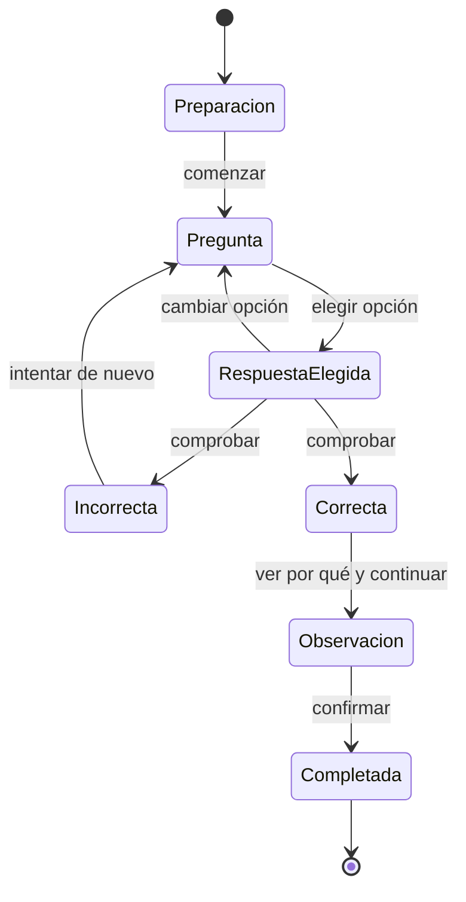

# Sistema 4UX.2 — Academia operativa, comprensible y animada

> Revisión posterior: la cadena mecánica conectada, el orden explicación–práctica y el registro oficial verificable de la versión `0.5.3` se documentan en `docs/APRENDER-SISTEMA-4UX-3.md`.

Estado: implementado como versión estable.  
Versión de aplicación: `0.5.2`.  
Fecha: 2026-07-28.  
Sistema 5A: no iniciado.

## 1. Resultado

Esta revisión convierte la Academia existente en una experiencia que guía, responde y muestra movimiento real. No añade una maqueta ni una interfaz paralela: corrige el producto de extremo a extremo sobre los contratos, sesiones, modelos y contenido ya aprobados en Sistemas 0–4F.

Los cambios principales son:

- flujo de respuesta explícito: elegir, comprobar, entender y continuar;
- feedback correcto e incorrecto visible y recuperable;
- paso actual, progreso y siguiente acción siempre legibles;
- animación educativa semántica de piezas reales del grafo visual;
- foco automático del mecanismo al iniciar la demostración;
- alternativa de movimiento reducido por estados discretos;
- lenguaje de usuario para fidelidad, modelos, fuentes, resultados y preparación;
- composición adaptable a escritorio, ventana estrecha, móvil y texto al 150 %;
- Atlas, Inicio, rutas, lecciones, resultados, progreso y fuentes sin vocabulario interno dominante;
- mantenimiento de procedencia, G/K/P, R0–R4 e identificadores en detalles técnicos;
- persistencia, restauración y compatibilidad con proyectos técnicos sin cambios de formato.

No se ha redactado ni decidido currículo nuevo. El contenido editorial externo permanece como fuente del curso.

## 2. Auditoría de los fallos comunicados

Se reprodujeron los problemas observados en las seis capturas entregadas:

1. columnas demasiado estrechas que partían palabras y convertían párrafos en líneas casi verticales;
2. números de rutas superpuestos a títulos;
3. escalas de texto aplicadas sobre paneles rígidos;
4. controles de reproducción que cambiaban estado interno sin producir un movimiento reconocible;
5. respuestas seleccionables sin confirmación, feedback ni acción siguiente clara;
6. términos como `fixture`, `selector`, `runtime`, `Retained`, G/K/P e identificadores expuestos como lenguaje principal;
7. visor dominado por caja y esfera, ocultando las piezas cuya función debía observarse;
8. estado final con sintaxis de reglas (`all; exists; minimum`) y nombres de competencias internos;
9. panel contextual abierto que podía cubrir el contenido al reducir la ventana;
10. un selector CSS demasiado amplio que hacía crecer el indicador de movimiento hasta ocupar todo el visor y aplicaba desenfoque sobre el modelo.

El nombre de una pieza o la existencia de un botón no se consideraron prueba de funcionamiento. Se validaron el cambio de estado, la respuesta visual, la persistencia y la restauración.

## 3. Flujo de práctica

La práctica guiada usa ahora el siguiente recorrido:

La interfaz muestra:

- “Tu turno” cuando debe actuar la persona;
- opción seleccionada y estado pulsado accesible;
- botón de comprobación desactivado hasta existir respuesta;
- explicación breve para acierto o error;
- reintento sin perder la sesión;
- selección automática de la pieza relacionada al avanzar;
- paso completado y paso actual;
- “Confirmar y completar” en el cierre;
- restauración del modelo antes de mostrar el resultado.

Un intento incorrecto se registra como parte del proceso, pero explorar el modelo no penaliza.

## 4. Movimiento educativo

Se añadió una capa cinemática de presentación separada de la simulación de ingeniería. Clasifica entidades por identidad semántica, no por color ni por posición accidental:

| Pieza o función | Movimiento educativo |
|---|---|
| ruedas, tren, barrilete y agujas | rotación continua coordinada |
| rueda de escape y rotor paso a paso | rotación por pasos |
| volante y espiral | oscilación |
| áncora | oscilación angular corta |
| rotor automático | oscilación amplia |
| bobina, cuarzo, circuito y muelle | pulso visual moderado |
| caja, esfera, platina y piezas estáticas | sin movimiento inventado |

La identidad visual completa no participa en la inferencia de movimiento. Esto evita que palabras presentes en el ID de una montura hagan girar por error todas sus piezas.

Al pulsar “Ver movimiento”:

- se ocultan temporalmente las envolventes grandes que cubren el mecanismo;
- el modelo original no se modifica;
- el indicador informa de la velocidad;
- “Pausar movimiento” conserva la vista enfocada;
- “Mostrar reloj completo” restaura envolventes, cámara y estado;
- velocidad y recorrido técnico quedan en controles avanzados;
- la animación se limita a valores angulares acotados para evitar deriva numérica.

La animación expresa K1/K2 educativa según el recurso. No convierte P0 en física validada y no simula lubricación, choque, desgaste, tolerancias ni marcha real.

## 5. Movimiento reducido

Cuando el perfil solicita movimiento reducido:

- no se inicia animación continua;
- el control principal pasa a ser “Mostrar siguiente estado”;
- el recorrido avanza mediante pasos discretos;
- las transiciones no esenciales quedan anuladas por CSS;
- la adaptación no cuenta como pista ni reduce la evaluación.

## 6. Lenguaje de interfaz

Se incorporó una capa central de lenguaje de producto. Conserva el dato técnico, pero presenta primero su significado:

| Interno | Presentación normal |
|---|---|
| fixture | modelo |
| selectors | grupos o piezas interactivas |
| G1/K2/P0 | forma aproximada, movimiento coordinado, sin física |
| R2 | ensamblaje estructural |
| envelope-only | forma general |
| structurally-modelled | estructura modelada |
| Retained | consolidada |
| keyless | puesta en hora |
| preflight | preparación |
| runtime | demostración o práctica |
| evidence record | resultado guardado |

La sintaxis determinista de evaluación, hashes, IDs canónicos y versiones sigue disponible en detalles diagnósticos. No se elimina trazabilidad.

También se humanizaron:

- títulos de competencias desde el contenido editorial instalado;
- estados de reconstrucción;
- relaciones funcionales del Atlas;
- autoridad, uso y capa de las fuentes;
- nombres de modelos conceptuales;
- explicación final y recomendaciones;
- preparación de una práctica y comprobaciones previas.

## 7. Composición y escalado

La composición deja de depender de tres o cuatro columnas fijas:

- las rutas usan una cuadrícula de ajuste automático y el número forma parte del flujo;
- la lección usa lectura y visual como áreas principales, con referencias en una fila independiente;
- consultas de contenedor colapsan el lector antes de que una columna quede ilegible;
- la práctica pasa de tres columnas a dos y después a una según espacio real;
- paneles contextuales se cierran al entrar en una ventana compacta y pueden abrirse como cajón;
- cabeceras, acciones y controles se envuelven sin solaparse;
- el dock de la actividad separa demostración, orientación y acciones;
- la navegación móvil es horizontal y conserva etiquetas;
- a 150 % se recomponen rutas, lecciones, paneles y workspace.

Se añadieron accesos rápidos de escala 100 %, 125 % y 150 %, además del control continuo existente.

## 8. Superficies revisadas

La mejora se aplicó a:

- Inicio;
- Mi aprendizaje;
- Explorar;
- ruta, módulo y lección;
- preparación y workspace;
- resultado;
- Taller;
- Atlas;
- Glosario;
- Fuentes;
- Progreso y Repaso;
- Preferencias;
- contexto lateral y navegación adaptable.

Atlas mantiene su propósito técnico, pero muestra por defecto nombres comprensibles. R, G/K/P e identificadores quedan en ayudas emergentes o detalles técnicos.

## 9. Persistencia y compatibilidad

No cambia:

- `WatchProject`;
- formato `.wplab`;
- esquema canónico v6;
- bases SQLite o IndexedDB existentes;
- IDs de rutas, lecciones, actividades, piezas, sesiones o evidencias;
- paquetes editoriales;
- contratos de los laboratorios 4D, 4E y 4F.

La capa de animación transforma únicamente grupos visuales en memoria. La selección continúa convirtiéndose a identidad canónica antes de ejecutar comandos.

El progreso de una pregunta ahora se proyecta al workspace mediante:

- evaluaciones normalizadas por pregunta;
- pasos completados;
- intentos por paso;
- estado de ejecución y checkpoint existentes.

## 10. Archivos principales

- `src/learning/ui/LearningActivityWorkspace.tsx`: flujo, feedback, siguiente acción y controles.
- `src/learning/ui/EducationalViewport.tsx`: aplicación de movimiento y foco visual.
- `src/learning/visual/educationalMotion.ts`: perfiles cinemáticos educativos.
- `src/learning/ui/learningUiLanguage.ts`: traducción de contratos técnicos a lenguaje de producto.
- `src/learning/application/service.ts`: proyección de evaluación y progreso.
- `src/learning/ui/AcademySurfaces.tsx`: rutas, lector, Atlas, fuentes, resultados y preferencias.
- `src/learning/ui/AcademyShell.tsx`: panel contextual adaptable.
- `src/learning/ui/learning.css`: workspace y controles.
- `src/learning/ui/academy-surfaces.css`: composición de Academia.

## 11. Pruebas

Se añadieron pruebas específicas para:

- perfiles de movimiento por rol semántico;
- transformaciones visibles y estables;
- ausencia de contaminación por IDs de montura;
- detección de caja y esfera como cubiertas de observación;
- disponibilidad de movimiento;
- lenguaje de fidelidad;
- estados de ejecución convertidos en una acción concreta;
- respuestas vacías o significativas;
- selección de la pieza que demuestra una respuesta;
- ocultación de sintaxis interna de reglas de evaluación.

Validación manual en navegador:

- preparación de práctica;
- respuesta incorrecta y reintento;
- respuesta correcta y avance;
- selección de tren en el modelo;
- reproducción, pausa y restauración;
- finalización y resultado;
- 1920 × 1080;
- 1280 × 720;
- 760 × 900;
- 430 × 900;
- texto al 150 %;
- movimiento reducido.

`npm run verify` valida lint, 70 archivos de prueba, 314 pruebas y build de producción.

## 12. Límites explícitos

- Las formas conceptuales siguen siendo simbólicas.
- Una animación educativa no es una validación cinemática ni física de ingeniería.
- La calidad geométrica de cada calibre sigue limitada por su ledger R0–R4.
- No se ha implementado tutor, IA, OCR, diagnóstico físico, lubricación ni Sistema 5A.
- Una publicación pública aún debería firmar el instalador con Authenticode para eliminar el aviso de editor desconocido de Windows.

## 13. Entrega

La versión estable de esta revisión es `0.5.2`.

El proceso de entrega genera:

- instalador NSIS de Windows x64;
- hash SHA-256;
- manifiesto de release;
- guía de instalación;
- aplicación, Academia offline y motor CAD incluidos.

El instalador se crea para el usuario actual y no requiere permisos de administrador. Solo la instalación automática de WebView2 puede necesitar conexión.
