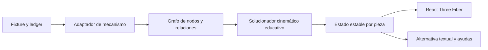
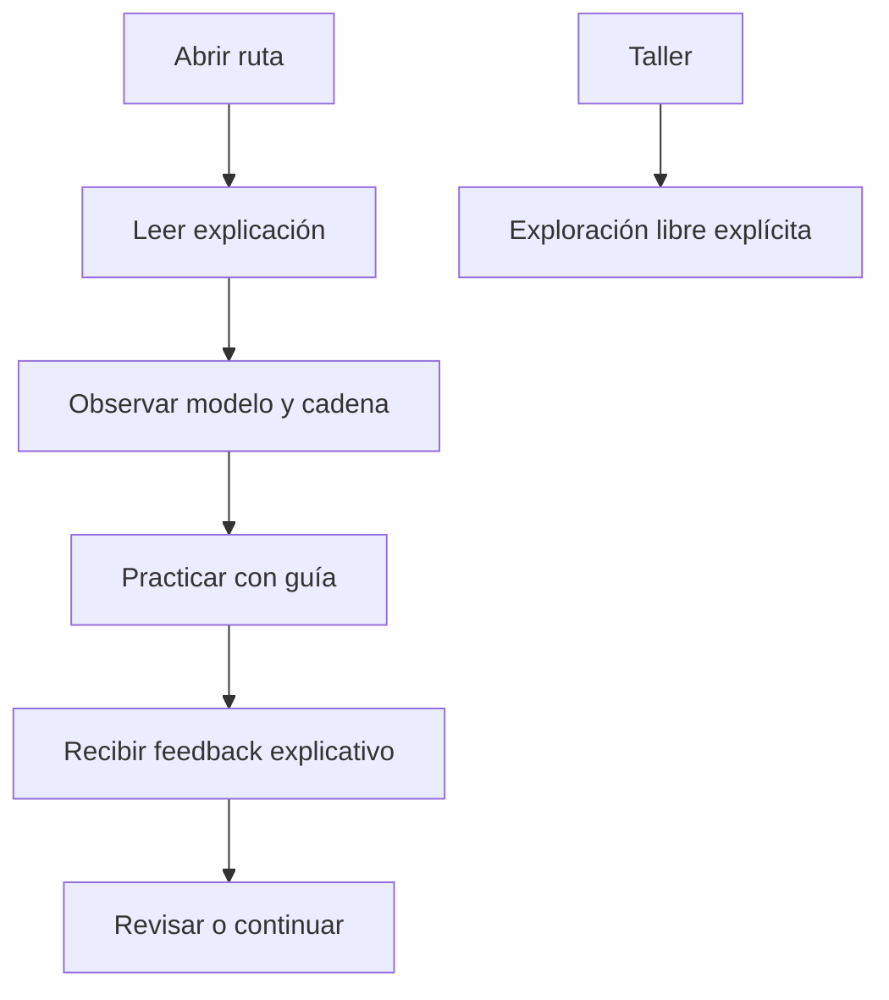

# Sistema 4UX.3 — Cadena mecánica visible, secuencia didáctica y fuentes verificables

Estado: implementado como versión estable.  
Versión de aplicación: `0.5.3`.  
Fecha: 2026-07-28.  
Sistema 5A: no iniciado.

## 1. Resultado

Esta revisión resuelve conjuntamente los dos problemas que permanecían después de 4UX.2:

1. las piezas podían moverse, pero la escena no demostraba con suficiente claridad que formasen un mecanismo conectado;
2. una actividad podía pedir reconocer una función antes de que la ruta hubiese presentado esa función.

La Academia incorpora ahora:

- un grafo cinemático educativo explícito, separado del render;
- ruedas y piñones con dientes, contacto y relación de giro;
- pares de un mismo árbol, acoplamientos, escape, áncora, volante y espiral;
- una cadena energética identificable desde el muelle real o la pila;
- propagación del movimiento solo a través de relaciones activas;
- interrupción aguas abajo cuando un contacto se separa o bloquea;
- barrilete descompuesto en tambor, muelle, árbol y tapa;
- una reconstrucción conceptual mecánica con 23 entidades seleccionables;
- visualización opcional de contactos y relaciones;
- explicación previa a la primera práctica evaluada;
- entrada libre al Taller claramente separada del itinerario guiado;
- un registro MIYOTA curado, verificable y con política de derechos conservadora.

No se ha declarado un gemelo exacto. El movimiento conceptual sigue siendo G1/K2/P0. En 2035 y 8215, los ajustes de contacto que no proceden de una cota oficial o medida son exclusivamente visuales y quedan registrados como estimados.

## 2. Arquitectura de movimiento

La animación ya no se decide en cada malla de Three.js. El estado mecánico vive en una capa independiente:

El grafo admite:

- `meshes-with`: engrane entre ruedas o piñones;
- `drives`: transmisión directa;
- `same-arbor`: dos piezas solidarias en un árbol;
- `locks`: bloqueo del escape;
- `releases`: liberación;
- `impulses`: impulso del escape al regulador;
- `winds`: carga del muelle.

Cada relación conserva:

- origen y destino;
- sentido de giro;
- relación de velocidades;
- estado de contacto;
- clase de procedencia del dato;
- limitaciones;
- estado activo, desconectado o bloqueado.

El solucionador produce resultados deterministas y serializables. El viewport recibe transformaciones resueltas; no contiene la verdad mecánica.

## 3. Contacto, transmisión y fallo

El estado de una relación puede ser:

- `confirmed`: contacto declarado y disponible;
- `separated`: los centros o radios visuales no representan contacto;
- `blocked`: la relación está detenida por la fase del escape;
- `unknown`: no existe evidencia suficiente para afirmar contacto.

Una fuente de movimiento solo activa piezas alcanzables mediante relaciones transmisoras. Una relación separada corta la cadena aguas abajo y genera un diagnóstico consultable.

En el visor:

- las relaciones activas aparecen en turquesa;
- una separación aparece en rojo;
- una relación desconocida aparece atenuada;
- los puntos de contacto se pueden mostrar u ocultar;
- el origen de la energía tiene una etiqueta propia;
- el panel de ayuda explica que una separación detiene las piezas posteriores.

Esta representación hace visible una relación funcional, pero no calcula elasticidad del diente, pérdidas, lubricación, deformación, tolerancia ni choque.

## 4. Movimiento mecánico conceptual V2

El ensamblaje conceptual se reconstruyó para evitar discos aislados. Contiene:

- caja y platina;
- esfera, aguja horaria y minutera;
- tambor del barrilete;
- muelle real alojado dentro del tambor;
- árbol y tapa seccionada;
- rueda y piñón de centro;
- tercera rueda y piñón;
- cuarta rueda y piñón;
- rueda y piñón de escape;
- áncora;
- volante;
- espiral;
- puesta en hora;
- minutería;
- indicador de salida.

Los recuentos conceptuales declarados son datos de simulación educativa, no datos MIYOTA. Permiten demostrar razones de giro coherentes:

| Conjunto | Dientes conceptuales |
|---|---:|
| Barrilete | 80 |
| Piñón de centro | 10 |
| Rueda de centro | 64 |
| Piñón de tercera | 8 |
| Tercera rueda | 60 |
| Piñón de cuarta | 10 |
| Cuarta rueda | 60 |
| Piñón de escape | 8 |
| Rueda de escape | 15 |

La geometría procedural diferencia rueda, piñón, rueda de escape, barrilete, tapa, muelle, espiral, volante, áncora y rubí. Los centros visuales del modelo conceptual se calcularon para que los círculos primitivos entren en contacto.

## 5. Escape educativo

El escape usa ocho fases discretas:

1. bloqueo izquierdo;
2. liberación izquierda;
3. impulso izquierdo;
4. vuelo hacia la derecha;
5. bloqueo derecho;
6. liberación derecha;
7. impulso derecho;
8. vuelo hacia la izquierda.

La rueda de escape avanza por pasos, el áncora alterna su ángulo y volante y espiral oscilan. La secuencia demuestra coordinación K2; no afirma dinámica P1/P2.

Con movimiento reducido, las fases se muestran como estados discretos. No se fuerza una animación continua.

## 6. 2035 y 8215

Los ensamblajes reales existentes se conectan al mismo contrato mecánico:

- MIYOTA 2035: cadena desde pila, control, bobina, rotor paso a paso, tren e indicación;
- MIYOTA 8215: cadena desde muelle y barrilete, tren, escape, regulación e indicación.

Cuando el fixture contiene identidad y relación pero no centros oficiales completos, la capa visual puede alinear centros estimados para demostrar el engrane. Esa operación:

- no modifica el ledger;
- no cambia una estimación a dato oficial;
- no altera `WatchProject`;
- añade el diagnóstico informativo `EV-GEAR-CONTACT-ALIGNED`;
- conserva una limitación por entidad;
- solo afecta a la composición educativa en memoria.

Esto permite una demostración coordinada sin presentar los modelos actuales como R4 ni como geometría de fabricación.

## 7. Secuencia de conocimiento

La ruta guiada ya no abre la práctica como primer contacto con el concepto. El contrato `AcademyNextLearningUnit` decide la siguiente unidad:

Reglas:

- una ruta nueva comienza por lección o bloque explicativo;
- una actividad evaluada se ofrece después de la explicación;
- una sesión ya iniciada se puede recuperar sin perder evidencia;
- Taller conserva acceso libre y no se hace pasar por secuencia recomendada;
- el primer paso de la actividad pide observar la ruta energética antes de responder;
- la pregunta, la selección esperada, el feedback y el objetivo usan el mismo subsistema;
- la primera cadena mecánica declarada es `mainspring → barrel → train → motion-works → indication`.

La validación editorial añade una regla semántica que detecta incoherencias entre pregunta, objetivo, selector y respuesta antes de empaquetar contenido.

## 8. Controles y lenguaje

El control principal usa estados y acciones comprensibles:

- `Poner en marcha`;
- `Pausar mecanismo`;
- `Mostrar contactos`;
- `Ocultar contactos`;
- `Mecanismo en marcha`;
- `Transmisión coordinada`;
- `Sigue la transmisión desde el punto de inicio`.

El panel contextual identifica la pieza que inicia la cadena. La lista accesible conserva selección, nombre, función, procedencia y visibilidad sin exigir interacción 3D.

## 9. Registro oficial MIYOTA

El registro `officialSources.ts` se elevó a esquema 2 y cubre únicamente 2035 y 8215. Para cada calibre fija:

- página oficial;
- especificación;
- plano;
- manual;
- lista de piezas o despiece;
- URL solicitada y URL final;
- fecha de consulta;
- MIME;
- tamaño;
- SHA-256;
- revisión publicada o ausencia explícita de revisión;
- hechos oficiales asociados;
- derechos y límites de almacenamiento.

El verificador:

- solo acepta el dominio oficial HTTPS;
- limita cada descarga a 30 MiB;
- no recorre el catálogo;
- permite filtrar calibre y tipo de documento;
- funciona con caché privada local para prueba sin conexión;
- bloquea cualquier deriva de URL, MIME, tamaño o hash;
- nunca actualiza automáticamente la línea base.

No se han incorporado PDF, imágenes ni CAD de MIYOTA al repositorio o instalador. El estado jurídico actual es:

- licencia desconocida;
- redistribución sujeta a revisión;
- almacenamiento en repositorio prohibido hasta autorización;
- caché solo privada y local.

La solicitud de CAD y licencia debe cubrir expresamente modificación, simplificación, uso comercial/educativo, almacenamiento offline y redistribución.

## 10. Compatibilidad y persistencia

No cambian:

- esquema canónico v6;
- `WatchProject`;
- formato `.wplab`;
- bases SQLite existentes;
- bases IndexedDB existentes;
- IDs de sesiones y evidencias;
- paquetes editoriales ya instalados;
- modelos de proyecto del Estudio.

El grafo, el solucionador y las transformaciones son derivados efímeros. Una restauración vuelve al estado visual inicial sin mutar el proyecto técnico.

## 11. Archivos principales

- `src/learning/visual/mechanismMotionGraph.ts`: contrato, solución, diagnóstico y serialización mecánica.
- `src/learning/visual/fixtureMechanismMotion.ts`: adaptación de fixtures y procedencia.
- `src/learning/visual/sceneGraph.ts`: alineación visual estimada y composición.
- `src/learning/ui/EducationalMechanismGeometry.tsx`: geometría procedural.
- `src/learning/ui/EducationalViewport.tsx`: render, relaciones, contactos y etiqueta de origen.
- `src/learning/ui/LearningActivityWorkspace.tsx`: controles y explicación contextual.
- `src/learning/technical/fixtures.ts`: ensamblaje conceptual V2 y metadatos de geometría.
- `src/learning/technical/reconstruction.ts`: perfiles visuales y recuentos.
- `src/learning/academy/academyCatalog.ts`: secuencia recomendada.
- `src/learning/content/authoringValidation.ts`: validación semántica.
- `src/learning/technical/officialSources.ts`: registro oficial curado.
- `scripts/verify-miyota-official-sources.ts`: verificación reproducible.
- `docs/FUENTES-MIYOTA.md`: política de fuentes, derechos y frontera R3/R4.

## 12. Verificación

La revisión incluye pruebas para:

- propagación de velocidades y sentidos;
- relaciones de dientes;
- piezas solidarias en un árbol;
- interrupción por contacto separado;
- ocho fases del escape;
- movimiento reducido;
- serialización y restauración;
- muelle dentro del barrilete;
- tapa y tambor como piezas independientes;
- ausencia de contactos separados en los cuatro fixtures del primer módulo;
- conservación de la clase `estimated`;
- entrada por explicación antes de práctica;
- recuperación de sesiones previas;
- acceso libre al Taller;
- coherencia pregunta–selector–respuesta;
- hashes y metadatos oficiales MIYOTA.

La validación manual se ejecutó en el navegador integrado a 1280 × 720:

1. abrir la primera lección;
2. confirmar que explica energía, regulación/control, transmisión, indicación y estructura;
3. preparar la práctica;
4. iniciar el workspace;
5. poner el mecanismo en marcha;
6. mostrar contactos;
7. seleccionar la rueda de centro;
8. confirmar el paso;
9. elegir `Transmisión`;
10. comprobar la respuesta y recibir feedback correcto.

Resultado automatizado final:

- `npm run verify`: correcto;
- ESLint: correcto;
- Vitest: 72 archivos y 331 pruebas correctas;
- TypeScript y build de producción: correctos;
- validación editorial: sin diagnósticos;
- lint editorial: sin diagnósticos;
- verificador MIYOTA online: 10 de 10 recursos sin deriva;
- verificador MIYOTA offline: 10 de 10 recursos sin deriva.

## 13. Límites y deuda honesta

La revisión no elimina estas fronteras:

- no existe CAD oficial autorizado de 2035 o 8215;
- no existe una unidad física medida R4;
- los dientes de los calibres reales no se presentan como perfiles de ingeniería;
- la alineación visual estimada no demuestra centros, tolerancias o engrane reales;
- no se simulan fricción, lubricación, desgaste, choque ni reserva de marcha;
- las vistas realistas R3 requieren activos autorizados o reconstrucción trazable adicional;
- un R4 exige fotografías, instrumentos, incertidumbre, operador y unidad identificada;
- la licencia de redistribución de documentos y activos MIYOTA sigue pendiente.

Por tanto, la aplicación ofrece ahora un mecanismo educativo conectado y explicable, no un simulador físico ni un gemelo de ingeniería.

## 14. Criterio de cierre

4UX.3 se considera cerrado cuando:

1. `npm run verify` pasa;
2. el registro MIYOTA pasa en modo offline con la caché verificada;
3. la validación y el lint editorial pasan;
4. el recorrido manual anterior funciona;
5. no se modifica un proyecto técnico durante la práctica;
6. toda estimación permanece identificada;
7. no se distribuye material MIYOTA sin licencia.

## 15. Instalador de referencia

Se generó el instalador completo de Windows x64:

- archivo: `release/WatchPrototypeLab-Instalador-Windows-x64-v0.5.3.exe`;
- tamaño: 108.213.932 bytes (103,2 MiB);
- SHA-256: `530307606a8ca509a3728534b9c991d2ef603ef8bf5a5e56cc18f7f59b6b4ba0`;
- instalación: usuario actual;
- idiomas: español e inglés;
- Academia offline: incluida;
- motor CAD: incluido;
- verificación previa: ejecutada, no omitida;
- firma Authenticode: no firmada.

`release/release-manifest.json`, el archivo `.sha256.txt` y `release/LEEME-INSTALACION.txt` acompañan al ejecutable. La ausencia de firma comercial implica que Windows SmartScreen puede mostrar “Editor desconocido”; el hash verifica integridad, pero no sustituye una firma de código.
