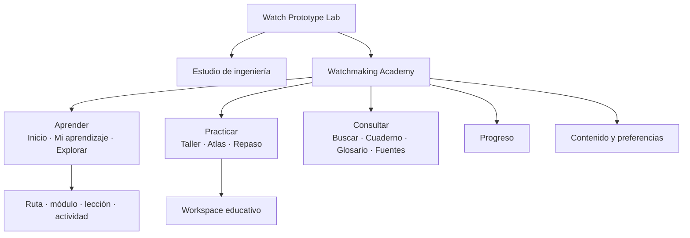
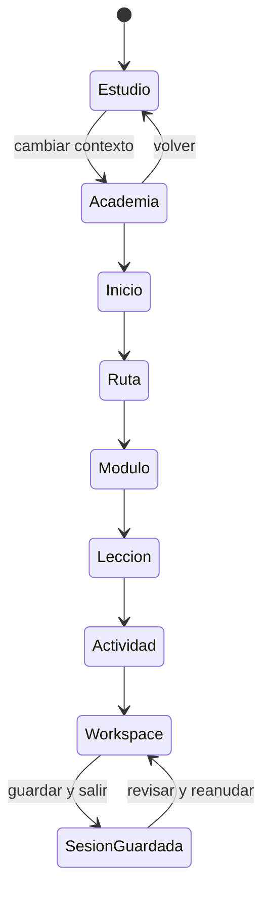
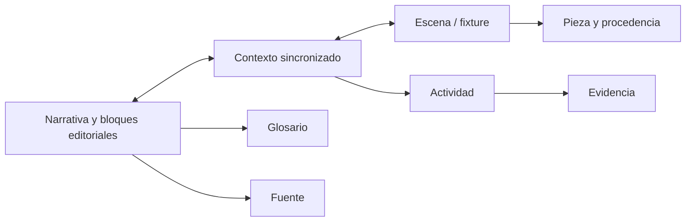
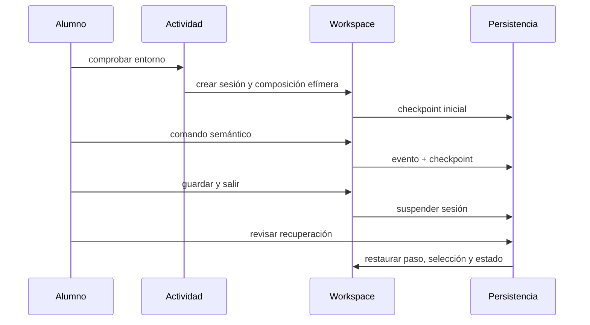
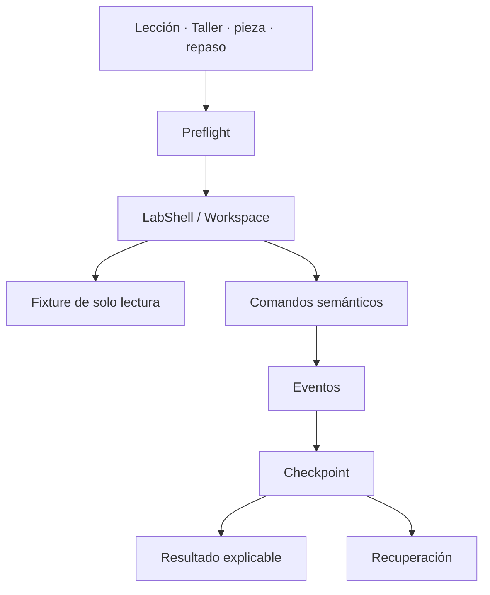
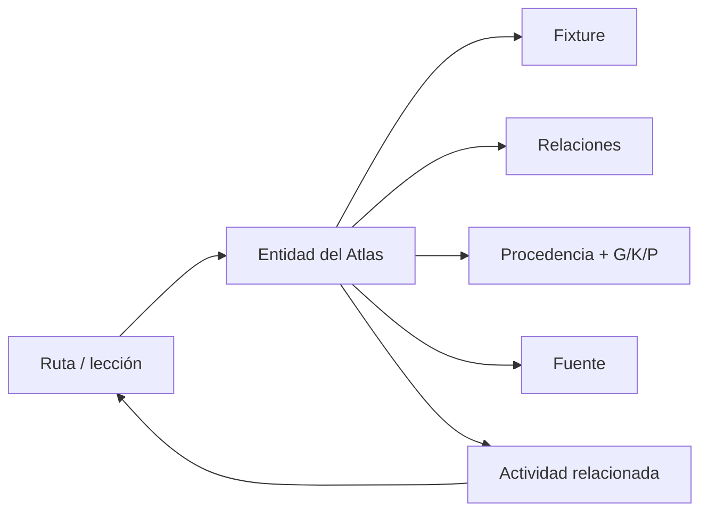
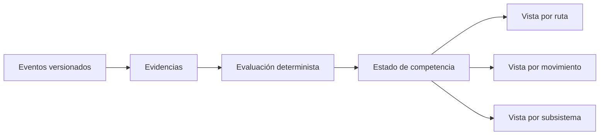
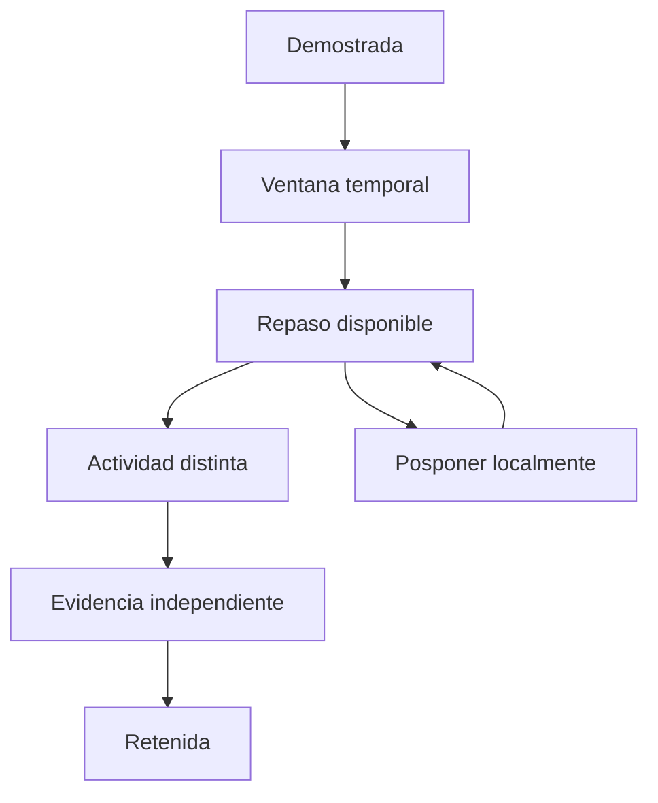
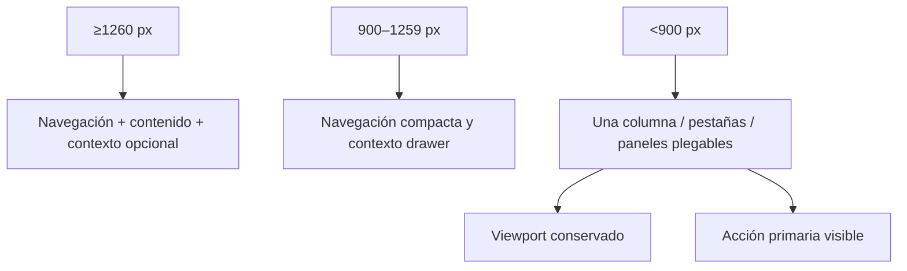
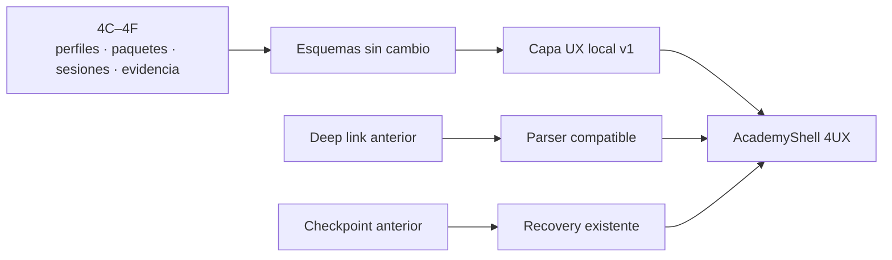

# Sistema 4UX — Watchmaking Academy

> Revisión posterior: la corrección operativa, responsive, de lenguaje y animación estable `0.5.2` se documenta en `docs/APRENDER-SISTEMA-4UX-2.md`.

Estado: implementado y verificado.  
Versión de aplicación: `0.5.0`.  
Fecha: 2026-07-27.  
Sistema 5A: no iniciado.

## 1. Resumen ejecutivo

Sistema 4UX convierte Aprender en un producto reconocible dentro de Watch Prototype Lab. La Academia ya no es una pestaña técnica: tiene shell, navegación, inicio, exploración curricular, lector, workspace, Taller, Atlas, búsqueda, Cuaderno, Progreso, Repaso, Resultados, onboarding y preferencias propias.

La implementación reutiliza el dominio aprobado de Sistemas 0–4F:

- cuatro rutas reales, 38 módulos, 43 lecciones y 96 actividades editoriales;
- cuatro fixtures educativos y los ledgers 2035/8215;
- sesiones, checkpoints, eventos, evidencias, evaluaciones y mastery;
- banco virtual, laboratorio mecánico y laboratorio de calibre;
- fuentes, glosario, procedencia, R0–R4 y G/K/P.

No se ha reescrito currículo, contenido técnico, fixtures ni `WatchProject`. Las nuevas notas, marcadores, capturas, preferencias UX y métricas agregadas son locales, versionadas y separadas por perfil.

## 2. Protección y estado inicial

Antes del primer cambio se comprobó el repositorio, `.gitignore`, documentación 0–4F, paquetes, fixtures y persistencia. Git no tiene commits y el staging permaneció vacío.

Checkpoint externo aprobado:

`<external-checkpoints>/system4f-approved-20260727-src.zip`

- 1.236 archivos;
- 46.807.931 bytes;
- SHA-256 `78BC002B356A18184ABC62E1A5A869188428B92FEEE981D9CB2CB209F526F92C`;
- sin `node_modules`, builds, binarios, PDF privado, bases de datos, sesiones ni proyectos personales.

## 3. Visión de producto

Academia se organiza alrededor de cinco verbos: continuar, comprender, practicar, consultar y revisar. La interfaz presenta primero la tarea y deja versiones, hashes e IDs en detalles técnicos opcionales.

Principios aplicados:

- el progreso procede de evidencia, no de una puntuación global;
- el 3D está unido a texto, pasos, selección y procedencia;
- toda acción visual crítica conserva alternativa semántica;
- Taller y Atlas derivan datos existentes y no duplican contenido;
- los límites R2/G/K/P permanecen visibles;
- la recuperación es explícita y nunca reanuda una sesión sin decisión del usuario;
- no existe telemetría remota.

## 4. Auditoría anterior

La auditoría completa está en `docs/academy-ux/UX-AUDIT.md`. Los problemas de mayor impacto eran:

- mezcla entre navegación de ingeniería y aprendizaje;
- demo contractual destacada sobre los cuatro cursos reales;
- lector inexistente y exceso de IDs;
- tres columnas rígidas y laboratorios superpuestos al viewport;
- ausencia de Taller, Atlas, búsqueda, Cuaderno, onboarding y cola de repaso;
- progreso correcto en dominio pero poco legible como aprendizaje;
- tipografía de 7–10 px en áreas del workspace;
- comportamiento estrecho comprimido;
- chunk educativo monolítico de 2,27 MB.

## 5. Tareas principales

Se modelaron veinte tareas, desde empezar desde cero hasta volver al Estudio. Sus entradas, interrupciones, recuperación, estados vacíos y alternativas accesibles se documentan en `docs/academy-ux/USER-FLOWS.md`.

Los recorridos prioritarios son:

1. empezar o continuar;
2. recorrer ruta, módulo y lección;
3. iniciar, guardar y recuperar una práctica;
4. consultar término, pieza, fuente o relación;
5. entender evidencia y revisar una competencia;
6. adaptar lectura e interacción;
7. regresar al proyecto técnico sin perder contexto.

## 6. Arquitectura de información

La navegación primaria contiene pocas entradas estables. Ruta, módulo, lección, actividad, resultado, pieza, término y fuente son destinos contextuales y no saturan el menú. La justificación completa está en `docs/academy-ux/INFORMATION-ARCHITECTURE.md`.

## 7. Navegación y AcademyShell

`AcademyShell` aporta:

- conmutador persistente Estudio/Academia;
- navegación agrupada y compactable;
- búsqueda educativa global;
- estado local/offline, perfil y preferencias;
- panel contextual adaptable;
- scroll recordado por superficie e ID;
- deep links compatibles;
- `main`, landmarks, salto a contenido y límites de error;
- carga diferida de mapa, superficies y workspace.

Las rutas históricas se conservan. Las nuevas superficies se añaden al parser sin cambiar IDs de contenido.

## 8. Portada y onboarding

Inicio consume catálogo, recomendaciones, sesiones, recovery y mastery reales. Prioriza:

- continuar una sesión o ruta;
- próximo paso con motivo, competencia y duración;
- repaso pendiente;
- rutas activas;
- acceso rápido a práctica;
- cuatro rutas reales para explorar.

El onboarding es opcional, retomable y local. Registra experiencia, desmontaje previo, conocimiento de cuarzo/mecánica, herramientas, objetivos, duración y necesidades de accesibilidad. Propone una ruta mediante reglas visibles; no crea perfil psicológico ni concede `retained`.

## 9. Explorador, rutas y módulos

Explorar parte del currículo y genera facetas desde los paquetes instalados. La vista de mapa heredada sigue disponible con su alternativa de lista. La portada de ruta muestra propósito, requisitos, modelos, laboratorios, fuentes, fidelidad, limitaciones, duración, progreso y una secuencia continua de módulos.

El MIYOTA 8215 se verificó con:

- 15 módulos;
- 15 lecciones;
- 37 prácticas;
- 736 minutos editoriales estimados;
- G2/K2/P0;
- fuentes oficiales y privadas diferenciadas.

Los módulos priorizan una sola acción principal y conectan conceptos, lecciones, actividades y competencias.

## 10. Lesson player

El lector admite `Lectura`, `Visual`, `Dividido`, `Enfoque` y `Textual`. El modo se conserva por perfil y puede cambiarse sin cambiar de lección.

El Markdown se presenta mediante un renderer restringido, sin HTML arbitrario. Claims, fuentes, vocabulario, fidelidad y limitaciones permanecen asociados a la lección. Notas y marcadores se guardan sin modificar el paquete.

## 11. Workspace, laboratorios y sesión

El workspace mantiene el viewport como área principal y coloca banco/laboratorios en flujo, no como overlays. Sus paneles pueden plegarse y ajustarse; la distribución se recuerda en `sessionStorage`.

Incluye:

- contexto de ruta, lección, objetivo y pasos;
- modos de lectura/visual/dividido/enfoque/textual;
- selección semántica sin arrastre;
- controles de viewport y timeline;
- banco, laboratorio mecánico y calibre lab existentes;
- pistas, preguntas, evidencias y fuentes;
- captura local del viewport;
- guardar y salir en cualquier momento.

La ficha de sesión humaniza actividad, estado, modelo y checkpoint. Paquete, fingerprint, runtime e IDs permanecen bajo “Diagnóstico técnico”.

## 12. Taller virtual

Taller deriva 86 actividades ejecutables asociadas a banco, laboratorio mecánico o calibre lab. Permite filtrar por herramienta/entorno, movimiento, tipo y estado. Cada entrada conserva ruta, actividad, competencia, duración, fidelidad y disponibilidad offline.

No crea copias de actividades ni un runtime alternativo.

## 13. Atlas

Atlas consulta los cuatro fixtures reales:

- cadena conceptual de cuarzo, 9 registros;
- MIYOTA 2035, 33 registros;
- movimiento mecánico conceptual, 14 registros;
- MIYOTA 8215, 56 registros y 63 instancias.

Muestra R0–R4, G/K/P, identidad oficial, estado de reconstrucción, procedencia, dimensiones oficiales/medidas/estimadas, relaciones, limitaciones, fuentes y actividades relacionadas.

No permite editar fixtures ni presenta R2 como gemelo exacto.

## 14. Glosario, fuentes, búsqueda y Cuaderno

Glosario reúne términos ES/EN, definición sencilla/técnica, sinónimos, términos desaconsejados, contexto y fuentes. Fuentes distingue autoridad, fabricante/autor, revisión, uso privado y URL disponible; nunca muestra rutas locales privadas.

La búsqueda local indexa rutas, módulos, lecciones, actividades, fixtures, piezas, términos, fuentes, notas, marcadores y capturas. Los recuentos se calculan sobre las coincidencias de la consulta. La búsqueda “áncora” devolvió 11 resultados reales: módulo, lección, cuatro piezas y entradas de glosario/fuentes relacionadas.

Cuaderno permite crear, editar, etiquetar, buscar, eliminar y exportar notas. Marcadores y capturas conservan contexto. Las capturas JPEG están limitadas y el almacén mantiene como máximo ocho por perfil.

## 15. Progreso, retención y resultados

Progreso no mezcla lectura y dominio. Se agrupa por ruta, competencia, movimiento, subsistema e historial. Usa estados derivados de evidencia: sin iniciar, en práctica, demostrada, retenida y revisión.

Repaso muestra competencia, evidencia previa, motivo, fecha y actividad propuesta. Posponer y reactivar son decisiones locales; las reglas de retención del dominio siguen siendo la autoridad.

Resultados separa actividad, evidencia, evaluación, mastery, pistas, adaptaciones, errores, fidelidad y limitaciones. No reduce una práctica compleja a correcto/incorrecto.

## 16. Sistema visual y diseño

La subidentidad combina grafito, acero, marfil técnico y acentos limitados de latón/rubí/turquesa. Existen temas sistema, oscuro y claro; densidad, ancho de lectura, interlineado y relación lectura/visual.

Los tokens y primitivas están documentados en `docs/academy-ux/DESIGN-SYSTEM.md`. Estados y fidelidad usan texto, forma y contorno además de color. Las preferencias UX están en un contrato local `v1`, normalizado defensivamente.

## 17. Accesibilidad

Medidas implementadas:

- landmarks, títulos, salto al contenido y foco visible;
- navegación y controles nativos de teclado;
- botones semánticos equivalentes a selección/drag;
- alternativa textual completa del viewport;
- texto ampliable, interlineado, ancho, contraste y etiquetas;
- reduced motion propagado al runtime;
- paneles que no bloquean la acción primaria;
- IDs técnicos ocultos por defecto;
- accesibilidad excluida de penalizaciones.

El smoke confirmó cambio a contraste alto, persistencia de reduced motion, modo textual y selección de una pieza sin arrastre. La auditoría completa y sus pendientes están en `docs/academy-ux/ACCESSIBILITY-AUDIT.md`.

## 18. Responsive y Desktop

La ventana mínima Tauri baja a 760 × 620. A 700 × 850 se comprobaron Inicio y lección sin tres columnas comprimidas. La política completa está en `docs/academy-ux/RESPONSIVE-BEHAVIOR.md`.

## 19. Rendimiento

| Medida | Antes | Después | Lectura |
|---|---:|---:|---|
| Vite build | 809 ms | 863 ms | +6,7 %, variación pequeña local |
| `LearningArea.js` | 2.266.120 B | 237.430 B | −89,5 % |
| `AcademyShell.js` | — | 12.830 B | carga separada |
| `AcademySurfaces.js` | — | 74.660 B | carga separada |
| Contenido integrado | incluido en LearningArea | 1.928.740 B | chunk propio, aún grande |

AcademyShell, superficies, mapa y workspace se cargan de forma diferida. Persisten tres chunks mayores de 500 kB: `integratedContent`, `ContactShadows` e `index`. La importación dinámica de `@tauri-apps/api/core` sigue siendo ineficaz por imports estáticos. Son warnings conocidos, no fallos de build.

Medidas completas: `docs/academy-ux/performance-before.json` y `performance-after.json`.

## 20. Migración y compatibilidad

No hay migración destructiva. IndexedDB y SQLite conservan esquemas. `.wplab` no incorpora progreso de Academia. Las sesiones siguen fijando paquete, versión y referencia. El estado UX local puede descartarse sin afectar evidencia ni contenido. Detalle: `docs/academy-ux/MIGRATION.md`.

## 21. Instrumentación de desarrollo

En desarrollo, `?academy-harness=1` monta una galería fuera de la navegación de producción. Expone estados vacío, activo, completado, bloqueado, error, offline, recuperado, incompatible, reduced motion, alto contraste, texto ampliado y ventana estrecha. Usa datos deterministas y no muta paquetes, fixtures ni progreso.

## 22. Validación

### Automatizada

- ESLint: correcto, sin warnings.
- TypeScript: correcto.
- Vitest: 67 archivos, 295 pruebas correctas.
- Rust: 7 pruebas correctas; SQLite, migración, constraints, rollback y backup real.
- CAD: 8 pruebas correctas.
- `npm run verify`: correcto.
- build de producción: correcto.

### Compatibilidad 4C–4F

Para `horology-foundations`, `quartz-miyota2035`, `mechanical-foundations` y `miyota8215`:

- `learning:validate`: 4/4 correctos;
- `learning:lint`: 4/4 sin diagnósticos;
- `learning:preview`: 4/4 generados;
- `learning:visual-report`: 4/4 generados;
- `learning:pack`: 4/4 generados.

`learning:fixture-report` compila cuatro fixtures, sin bloqueos visuales contractuales.

### Smoke Web real

Se ejecutó en la aplicación, no con mocks:

1. Inicio y las cuatro rutas.
2. Ruta 8215: 15 módulos y 37 prácticas.
3. Lección 8215 y sus cinco modos.
4. Atlas 8215: 56 registros, relaciones, fuentes y G2/K2/P0.
5. Taller: 86 actividades derivadas.
6. Búsqueda “áncora”: 11 coincidencias explicables.
7. Progreso: 35 evidencias activas y 5 competencias demostradas en el perfil de smoke.
8. Actividad real `Preparar el banco`: preflight, sesión, WebGL, modo textual, selección semántica, guardado y recuperación.
9. Ventana 700 × 850.
10. Temas, contraste y reduced motion.

Sobre la build de producción se abrieron además las cuatro rutas, una lección y el preflight de una actividad de cada paquete:

| Paquete | Ruta | Lección | Actividad/preflight |
|---|---|---|---|
| 4C | Orientación funcional relojera | Predicción de fallos | Predecir una interrupción |
| 4D | Del ISA 8172 al MIYOTA 2035 | Anatomía completa del MIYOTA 2035 | Clasificar subsistemas |
| 4E | Fundamentos del reloj mecánico | Carga automática y calendario básico | Seguir la carga automática |
| 4F | MIYOTA 8215 | Arquitectura general | Clasificar subsistemas |

Los cuatro preflights resolvieron paquete, dependencias y capacidades, y ofrecieron crear la sesión. El preview se ejecutó en el puerto aislado 4187 porque un service worker ajeno ocupaba el origen 4173 del navegador de QA; no se atribuyó esa colisión a la aplicación.

Los números de evidencia pertenecen exclusivamente al perfil local de smoke y no son resultados de usuarios reales.

### Smoke Desktop

Se lanzó `src-tauri/target/release/watch-prototype-lab.exe` de forma oculta, permaneció vivo durante 8 segundos y se cerró después del smoke. Esto prueba arranque del ejecutable, no una revisión visual Desktop completa.

## 23. Instalador

Se generó un NSIS x64:

`release/WatchPrototypeLab-Instalador-Windows-x64-v0.5.0.exe`

- 108.203.373 bytes (103,2 MB);
- SHA-256 `abe4dab3d1c7554c5fc9beb4fa7c822bbb9e8448b08db6b87af218a057a06f06`;
- instalación por usuario, español/inglés;
- Academy y motor CAD incluidos;
- contenido educativo utilizable offline;
- WebView2 se descarga solo si el equipo no lo tiene;
- firma: `NotSigned`.

El hash, manifiesto y guía están en `release/`. La ausencia de firma comercial puede activar SmartScreen y debe declararse al distribuir.

## 24. Capturas

Comparación y rutas de las capturas: `docs/academy-ux/BEFORE-AFTER.md`.

Evidencias posteriores principales:

- `after-home-desktop.png`;
- `after-route-8215-desktop.png`;
- `after-lesson-8215-desktop.png`;
- `after-workspace-2035-desktop.png`;
- `after-workshop-desktop.png`;
- `after-atlas-8215-desktop.png`;
- `after-progress-desktop.png`;
- `after-preferences-desktop.png`;
- `after-harness-desktop.png`;
- `after-home-narrow.png`;
- `after-lesson-8215-narrow.png`.

## 25. Limitaciones y deuda

- El contenido integrado sigue siendo un chunk grande; requiere particionado por paquete en un sistema posterior.
- `ContactShadows` y el chunk principal conservan deuda histórica.
- Three.js avisa de las deprecaciones `THREE.Clock` y `PCFSoftShadowMap`; el render funciona, pero conviene migrar a `THREE.Timer` y `PCFShadowMap`.
- Mapa curricular, contenido instalado, perfil, evidencias y algunas tablas mantienen componentes heredados dentro del nuevo shell. Son funcionales y conectados, pero no todos tienen el acabado visual de las superficies nuevas.
- El smoke de teclado se apoyó en controles semánticos y acciones directas; queda pendiente una auditoría humana completa con NVDA/JAWS y recorrido Tab continuo.
- No se ejecutó una instalación interactiva desde el NSIS en una máquina limpia; sí se verificó PE, hash, tamaño, manifiesto y arranque del ejecutable resultante.
- No hay firma Authenticode comercial.
- No se realizaron pruebas con usuarios; las puntuaciones son evaluación experta.
- La sesión de smoke no completó las 96 actividades ni un curso entero; validó el flujo real representativo y la compatibilidad de los cuatro paquetes.

## 26. Criterios de aceptación

Cumplidos:

- shell e identidad propios;
- conmutador Estudio/Academia;
- portada, onboarding, explorador, rutas, módulos y lector;
- workspace adaptable, Taller y Atlas reales;
- búsqueda, Cuaderno, glosario y fuentes;
- Progreso, Repaso y Resultados explicables;
- fuentes, procedencia y G/K/P visibles;
- modo enfoque, textual, reduced motion y ventana estrecha;
- recuperación de sesiones;
- cuatro paquetes validados y empaquetados;
- `npm run verify`, Rust y CAD correctos;
- Web y Desktop documentados honestamente;
- instalador 0.5.0 generado.

Quedan como deuda no bloqueante los puntos del apartado anterior. No invalidan el flujo principal, pero impiden afirmar conformidad WCAG formal o validación de distribución en máquina limpia.

## 27. Recomendación para Sistema 5A

Antes de ampliar contenido, Sistema 5A debería consumir estas superficies y contratos sin crear navegación, tutor o runtime paralelos. Sus nuevas entidades deben:

1. entrar en el catálogo declarativo existente;
2. aportar facetas para Explorar/Taller/Atlas;
3. declarar fuentes, procedencia y G/K/P;
4. emitir evidencia y evaluación mediante los motores actuales;
5. incluir alternativa textual y reduced motion;
6. mantener paquetes cargables por separado para poder dividir `integratedContent`.

Sistema 4UX se detiene aquí. No se ha iniciado Sistema 5A.
