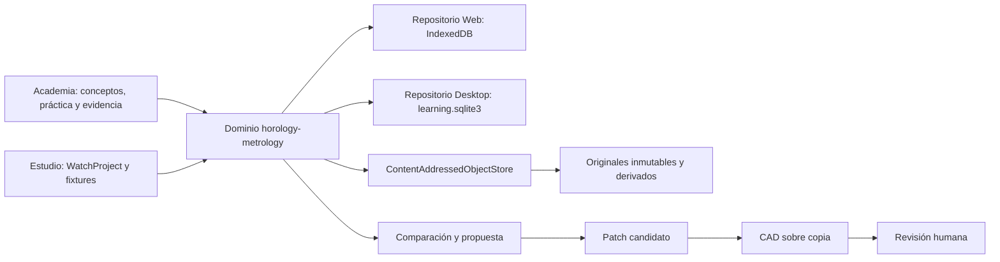

# Sistema 5A — Puente entre Academia, ingeniería y relojes físicos

## Resultado

Sistema 5A añade un registro metrológico local y multimarca a Watchmaking Academy sin crear otra Academia, otro runtime ni una tercera base SQLite. Una unidad física puede registrarse, descomponerse en componentes, fotografiarse, inspeccionarse, medirse, compararse y convertirse en una propuesta revisable. Ninguna medida modifica el canon, un fixture, un proyecto o CAD.

La entrega se divide en [5A1](APRENDER-SISTEMA-5A1.md), [5A2](APRENDER-SISTEMA-5A2.md) y [5A3](APRENDER-SISTEMA-5A3.md). Los contratos técnicos se describen en [dominio](METROLOGY-DOMAIN.md), [persistencia](METROLOGY-PERSISTENCE.md), [imágenes](METROLOGY-IMAGE-PIPELINE.md), [incertidumbre](METROLOGY-UNCERTAINTY.md) y [propuestas CAD](METROLOGY-CAD-PROPOSALS.md).

## Estado inicial respetado

- Academy 0.7, sus cuatro rutas, paquetes 4C–4F, progreso, retención, evidencias y compatibilidad histórica permanecen.
- `watchlab.sqlite3` conserva proyectos; `learning.sqlite3` incorpora metrología mediante la migración 2.
- MIYOTA 2035 y 8215 siguen siendo casos documentados, no el centro de la arquitectura.
- La fuente privada de teoría mecánica no se copia ni se usa como autoridad de MIYOTA.
- VBAUhrentechnik permanece como material legado no autoritativo; sus fórmulas bloqueadas no se rehabilitan.

## Arquitectura

## Curso y evaluación

`wplab.horology.inspection-metrology@0.1.0` contiene 14 módulos, 14 lecciones, 28 actividades, 28 escenas, 18 competencias, 28 plantillas de evidencia, 28 rúbricas y repaso a 1, 7 y 21 días. Sigue el ciclo recuperación → explicación → vocabulario → ejemplo → visualización → predicción → guía → independencia → causalidad → feedback → transferencia → retención. No concede `retained` dentro de la misma sesión.

Las actividades priorizan respuesta estructurada, coordenadas, secuencias, medición, interpretación y documentación. La evaluación registra método, instrumento, verificación, unidad, lecturas, serie, incertidumbre, hallazgo, confianza, comparación, propuesta, pistas y adaptación; no se limita a acertar un número.

## Autoridad y límites

Los datos específicos de un fabricante requieren fuente oficial registrada. BIPM VIM y GUM, y la guía de procesos de medición de NIST, sustentan el vocabulario general; el curso es una síntesis original. Una observación no es un diagnóstico, una verificación funcional no es una calibración acreditada, la incertidumbre implementada no afirma conformidad GUM completa y una diferencia no demuestra un defecto.

## Privacidad, offline y compatibilidad

Todo queda local y privado por defecto. Los originales no se incorporan a un dossier salvo selección explícita. El sistema funciona sin red; los enlaces externos son HTTPS, registrados y abiertos solo por acción del usuario. Los aliases históricos de la estación `metrology`/`cp-cpk` conducen a «Variación y capacidad de proceso». `.wplab`, sesiones 4C–4F y paquetes anteriores no cambian de formato.

## Gates

- 5A1: dominio, migración, registros, object store, importación, backup y recuperación.
- 5A2: curso, foto real, calibración 2D, herramientas, series, incertidumbre, hallazgos, teclado y reduced motion.
- 5A3: comparación neutral, propuesta, revisión, candidato CAD sobre copia, rollback, gates R2–R4 y dossier.
- Gate final: `npm run verify`, Rust, CAD, contenido, Web, Desktop instalado, migración y hashes del instalador.

## Validación final 0.8.0

- `npm run verify`: 84 archivos y 386 pruebas correctas; ESLint, TypeScript y build de producción correctos.
- Rust: 11 pruebas correctas, incluida una copia completa real de SQLite + object store, previsualización y verificación de objetos.
- CAD: 8 pruebas correctas.
- Contenido: 5 rutas, 52 módulos, 124 prácticas; el paquete 5A aporta 14 módulos y 28 prácticas.
- E2E Web real: unidad, instrumento, verificación, fotografía local, sesión, observación, hallazgo, hipótesis, serie de cuatro lecturas, incertidumbre, comparación, propuesta aprobada, dossier JSON/HTML, backup de metadatos y recuperación tras recarga.
- Desktop instalado: versión 0.8.0 registrada en Windows, Academia abierta con el perfil y progreso anteriores, 5 rutas/124 prácticas y backend `SQLite · aplicación de escritorio`.
- Instalador final: 108.740.375 bytes; PE válida; SHA-256 `a0e4dc34155cdc0a43d8e43e9ac19ddd3f35e16eb83add7ca005cce7e3b6eaba`; `verificationSkipped: false`; sidecar CAD y Academia offline declarados.

## Avisos no bloqueantes

- El instalador local no tiene firma Authenticode comercial (`NotSigned`); el hash verifica integridad, no identidad editorial.
- Vite conserva avisos por chunks históricos de contenido mayores de 500 kB. El nuevo contenido 5A se carga en su propio chunk; el aviso no afecta corrección ni offline.
- La automatización de Windows detectó una superficie auxiliar Tauri/WebView2 de 13×13 que impidió continuar los clics automáticos dentro de la estación instalada. El shell Desktop, SQLite, contenido y compatibilidad histórica sí se verificaron instalados; el recorrido completo de la estación se ejecutó en Web y los comandos nativos de persistencia/backup tienen pruebas Rust.

Sistema 5B no se ha iniciado.
