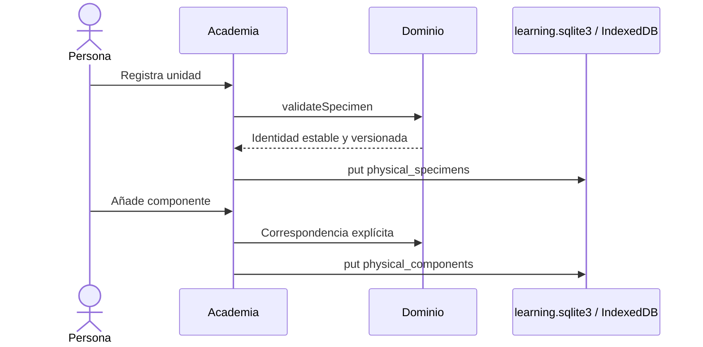

# Sistema 5A1 — Registro físico, instrumentos y activos

## Entregado

- `PhysicalSpecimen` multimarca con identidad estable, realidad física/sintética, procedencia, confianza, privacidad, revisión y vínculos versionados a fixture/proyecto.
- `PhysicalComponent` separado de la definición canónica; su correspondencia puede ser desconocida, posible, probable, confirmada o no mapeable.
- perfiles de instrumento y verificaciones con resolución separada de exactitud;
- fotografías originales, miniaturas y referencias por hash;
- repositorios granularizados Web/Desktop y migración única de `learning.sqlite3` de v1 a v2;
- backups de metadatos y completos, restauración previsualizada y GC controlada.

El espécimen educativo integrado es `simulation-only`, no oficial, no físico, no medido y no atribuido a ningún calibre real. No puede confundirse con una unidad de inventario.

La importación nativa no transporta la foto como `Vec<u8>` por IPC: el diálogo entrega una ruta y Rust lee por bloques. JPEG, PNG y WebP se detectan por contenido; HEIC no se promete. El original se confirma una sola vez y las transformaciones de visualización no lo modifican.

Los comandos nativos son granulares para `put/get/list`, importación, cancelación, referencias, GC y backup. Las consultas están paginadas y usan índices por perfil, espécimen, propietario, estado y fecha.

## Gate 5A1

Cumplido. Rust pasa 11/11 pruebas, incluida la migración aditiva v2 y el backup completo verificado de SQLite + objetos. La aplicación 0.8.0 instalada recupera el perfil y el progreso existentes mediante `learning.sqlite3`.
