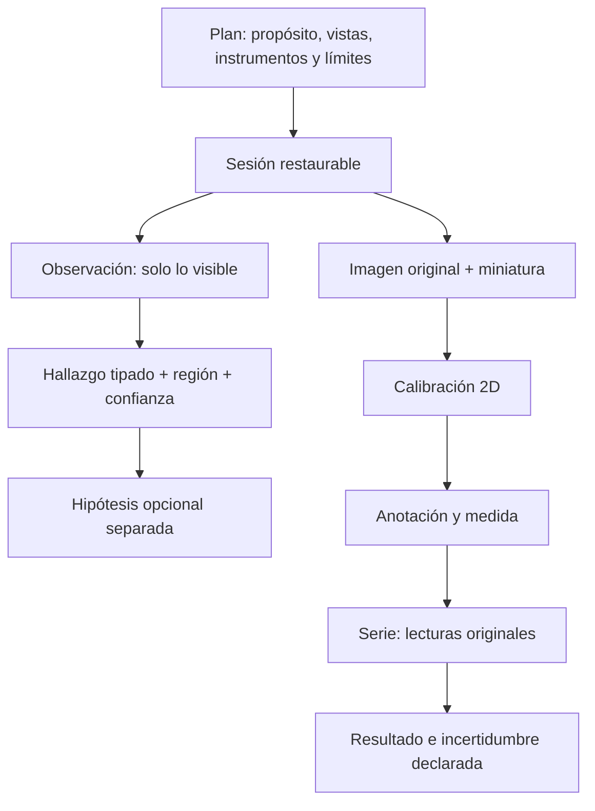

# Sistema 5A2 — Inspección, fotografía y metrología

## Ruta formativa

Los catorce módulos son: observar antes de medir; luz, aumento y postura; unidades, escala y resolución; precisión, exactitud, repetibilidad e incertidumbre; instrumentos; verificación y calibración; unidad física; fotografía técnica; medición sobre imagen; medición física; desgaste y daños; comparación; mejora del modelo; proyecto final.

## Flujo operativo

Las herramientas 2D resuelven distancia, radio/diámetro, círculo por tres puntos, ángulo, distancia entre centros, área aproximada, dientes y anotación. Sin calibración producen píxeles, nunca una longitud física. Una sola imagen no permite medir profundidad. Plano, perspectiva, confianza, resolución efectiva, hipótesis y limitaciones se conservan.

Las series guardan cada lectura y su orden. Un valor atípico nunca desaparece: descartarlo exige motivo. Se calculan media, mínimo, máximo, rango y desviación estándar muestral, y se conserva la razón del valor adoptado.

La taxonomía cubre contaminación, superficie, geometría, apoyos, elementos flexibles y montaje con todos los tipos requeridos. El validador impide combinar tipo y categoría incompatibles. Las acciones son no prescriptivas.

## Accesibilidad

La medición dispone de entrada por coordenadas, ajuste fino de teclado, tabla textual de anotaciones, zoom, codificación no basada solo en color, resúmenes accesibles y reduced motion. Las gráficas requieren tabla equivalente por contrato de sesión.

## Gate 5A2

Cumplido. El paquete valida sin diagnósticos. El E2E Web importó una imagen local real, conservó original y miniatura, registró observación/hallazgo/hipótesis y resolvió una serie de cuatro lecturas con verificación e incertidumbre. La suite completa pasa 386/386 pruebas.
