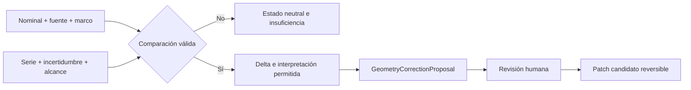
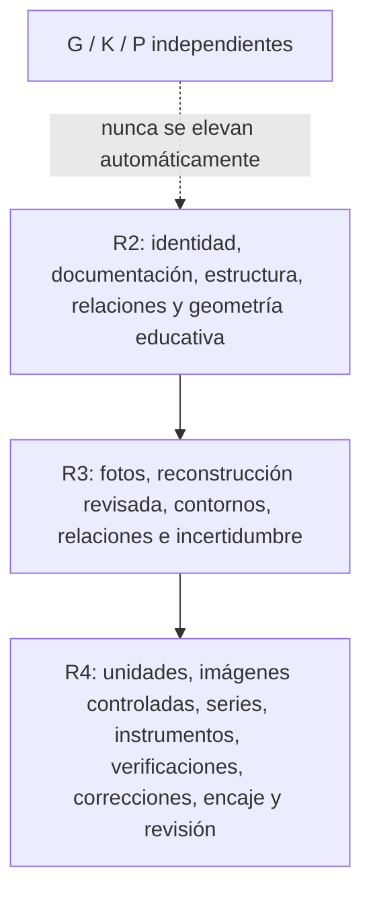

# Sistema 5A3 — Nominal frente a medido y evolución de modelos

## Comparación

La comparación reúne nominal y fuente, revisión, fixture, nivel R, G/K/P, serie, incertidumbre, delta absoluto/porcentual, tolerancia conocida y marco de referencia. Puede resultar `compatible-with-nominal`, `within-declared-uncertainty`, `apparent-discrepancy`, `comparison-invalid`, `tolerance-unknown`, `nominal-missing`, `measurement-insufficient` o `different-reference-frame`.

## Propuesta y CAD

Una propuesta conserva fixture y versión, entidad, parámetro, valores, mediciones, imágenes, comparaciones, alcance, dependencias, limitaciones, revisor, decisión y versión candidata. Aprobarla crea un patch candidato; no edita el fixture ni el CAD. El bridge clona el proyecto, valida unidades/referencias, ejecuta CAD sobre la copia, conserva fingerprint del original y proporciona rollback.

## Gates R2–R4

R4 no significa tolerancias industriales, gemelo físico completo ni física validada. Mejorar G no modifica K o P.

## Dossier

El dossier JSON/HTML contiene identidad segura para exportación, sesiones, observaciones, hallazgos, instrumentos, verificaciones, series, incertidumbre, comparaciones, propuestas, objetos seleccionados y limitaciones. Originales privados son opt-in. PDF no se implementa.

## Gate 5A3

Cumplido. El E2E creó una comparación compatible con nominal, una propuesta y un patch candidato aprobado sin mutar el canon; exportó dossier JSON/HTML y recuperó los registros tras recarga. Copia, rollback y gates R2–R4 están cubiertos por pruebas automatizadas; las cifras de release figuran en el documento principal.
