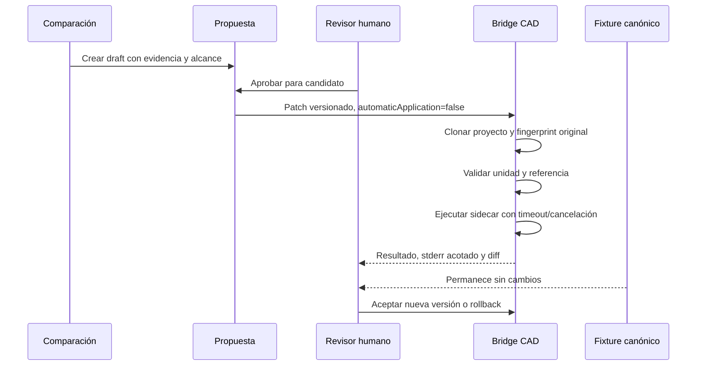

# Propuestas geométricas y CAD candidato

Estados: `draft`, `needs-more-evidence`, `ready-for-review`, `approved`, `rejected`, `superseded`, `implemented` y `validated`. Solo una transición válida y revisada puede crear candidato. El sidecar captura stderr en un buffer de 16 KiB, limita líneas, vence a 120 s, permite cancelar y reiniciar un proceso colgado.

La previsualización puede superponer nominal, medido y contorno candidato, pero no convierte el delta visual en prueba de encaje. La aceptación crea una nueva versión; nunca reescribe la anterior. El rollback usa la copia canónica anterior y su fingerprint.
