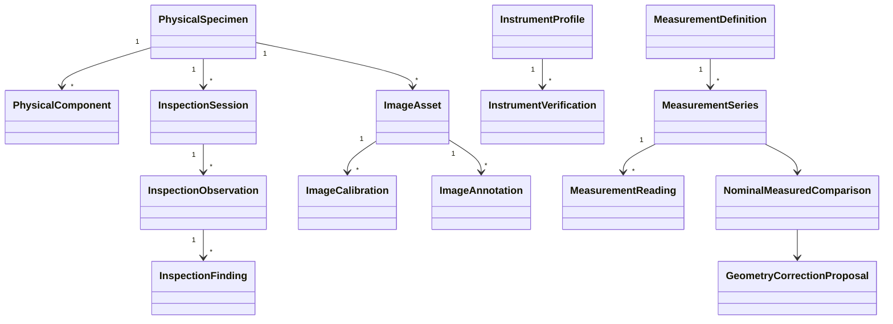

# Dominio de metrología relojera

El dominio vive en `src/core/horology-metrology` y no depende de React. Usa entidades con `schemaVersion`, ID estable, `recordVersion`, fechas y perfil. `EngineeringQuantity` expresa un valor tipado; `MeasurementDefinition`, `MeasurementReading` y `MeasurementSeries` expresan el proceso físico.

Reglas invariantes: instancia física ≠ definición canónica; observación ≠ hipótesis; resolución ≠ exactitud; nominal ≠ medido; diferencia ≠ defecto; propuesta ≠ canon; R ≠ G/K/P. Los comandos semánticos validan entradas y los eventos conservan hechos inmutables. La serialización canónica ordena claves para fingerprints reproducibles.
