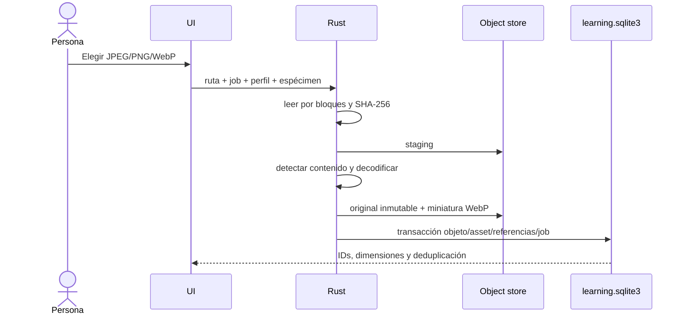

# Pipeline de imágenes metrológicas

El límite es 250 MB. La extensión no determina el formato. Cancelación limpia staging; corrupción produce job `failed`; cancelación produce `cancelled`. El ID de imagen incluye perfil, unidad y hash. El blob se deduplica por SHA; las referencias expresan propiedad y uso.

Rotar, invertir, contraste, brillo, zoom, pan y anotación son operaciones no destructivas. Los originales no se rotan, recortan, anotan ni recomprimen. La miniatura se carga antes que el original. HEIC, profundidad monocular, fotogrametría y reconocimiento automático quedan fuera.
