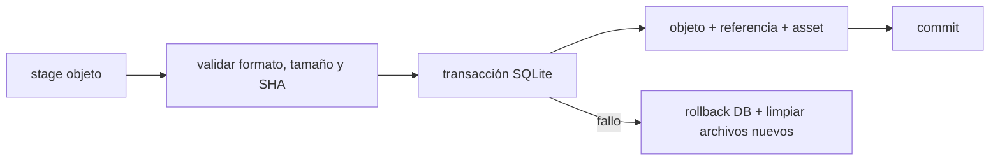
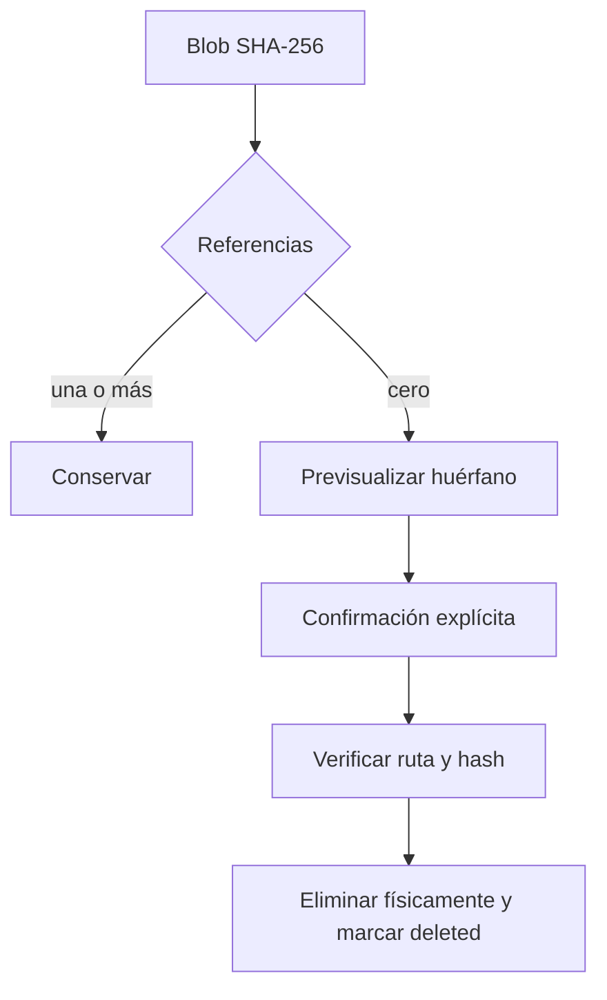
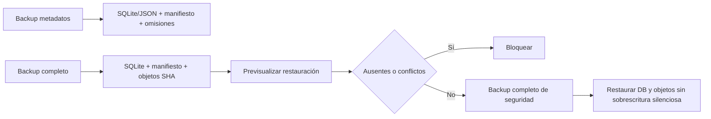

# Persistencia metrológica

## Bases y migración

No existe una tercera SQLite. Desktop usa la migración 2, transaccional y con checksum, sobre `learning.sqlite3`; rechaza versiones futuras y crea backup previo. Web usa stores nuevos dentro del contrato IndexedDB learning. Las tablas mínimas del encargo, incluido `inspection_plans`, están presentes.

## Object store y GC

## Backup y recuperación

Un backup de metadatos declara cada objeto omitido. El completo copia y verifica objetos. Restaurar exige el hash exacto del manifiesto previsualizado; un blob distinto en destino bloquea la operación. Staging abandonado se limpia al arrancar.
