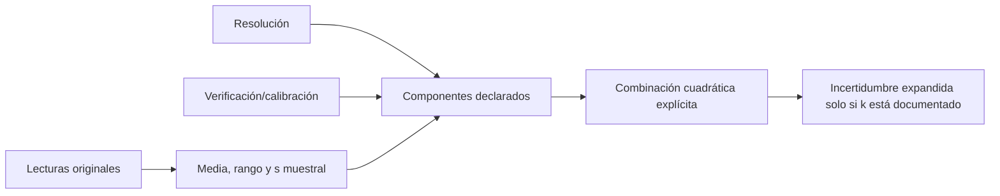
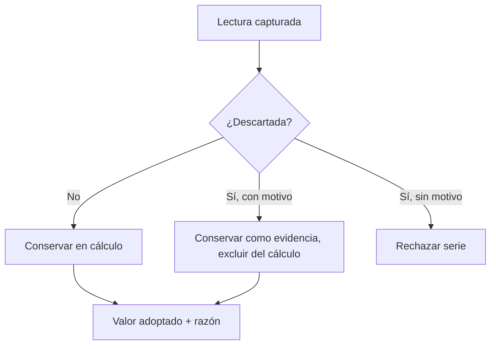

# Incertidumbre y series

El sistema diferencia resolución, exactitud, precisión, repetibilidad, error, dispersión, incertidumbre y tolerancia. La resolución aporta una componente rectangular `resolución/√12`; la repetición y la calibración se incorporan solo si existen. Cada resultado conserva fórmula, entradas, unidades, redondeo, supuestos y límites.

No se afirma conformidad formal con GUM/ISO: falta un presupuesto validado para cada mensurando, correlaciones, grados efectivos de libertad y trazabilidad acreditada. `gumCompliant` permanece `false`. La tolerancia pertenece al diseño o fuente nominal y nunca se deriva de la incertidumbre.

