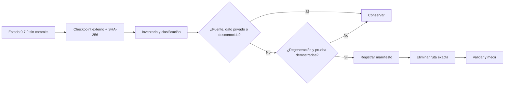

# Limpieza técnica previa a Watchmaking Academy 0.8

## Estado de protección

El repositorio no tiene todavía ningún commit (`No commits yet on master`). Git no puede utilizarse como mecanismo de restauración. Antes de la primera modificación se creó y verificó un checkpoint externo del estado fuente no ignorado:

- archivo: `<external-checkpoints>/WatchPrototypeLab-0.7.0-pre5A-20260802-112047.zip`;
- 1.436 entradas;
- 49.684.715 bytes;
- SHA-256: `48BC27F6CE34D491C9C0DCC34E7C14470DF60C9278129063ABEB8C98A9B917E3`;
- comprobación: el ZIP pudo enumerarse completo y conserva los archivos fuente reales registrados por `git ls-files --others --exclude-standard`.

El ZIP antiguo `<external-archives>/Relojes.zip`, fechado el 23 de junio, se declaró insuficiente por ser anterior al estado 0.7.0 de finales de julio. No se modificó.

## Baseline anterior a la limpieza

- `npm run verify`: correcto.
- Vitest: 78 archivos, 361 pruebas correctas.
- TypeScript, ESLint y Vite: correctos.
- Rust: 7 pruebas correctas.
- Versión Web/Rust/Tauri: 0.7.0 coherente.
- Persistencia nativa: `watchlab.sqlite3` y `learning.sqlite3`; no se creará una tercera base.

El build informa de un import dinámico de Tauri ineficaz y chunks de 3,7 MB y 931 kB. Son incidencias de arquitectura/empaquetado, no razones para borrar fuente.

## Regla operativa

1. Inventariar y clasificar.
2. Conservar lo desconocido y todo dato de usuario.
3. Mantener `release/` y el sidecar empaquetado.
4. Eliminar solo salidas ignoradas con comando de regeneración conocido.
5. Registrar cada eliminación en `docs/cleanup/DELETION-MANIFEST.md`.
6. Ejecutar las validaciones indicadas tras cada lote.
7. Repetir inventario y reporte de tamaños al finalizar 5A.

## Áreas protegidas

- `.git/` y sus checkpoints internos;
- `release/` y todos los instaladores previos;
- `src-tauri/binaries/` mientras sea entrada del bundle;
- `node_modules/` y `.venv-cad/` como entornos de desarrollo vigentes;
- cualquier SQLite, `.wplab`, perfil, sesión, evidencia, foto o medición;
- checkpoints externos, secretos, libros, PDFs, ZIP y fuentes privadas;
- contenido declarativo y documentación de Sistemas 0–4.

## Auditorías relacionadas

- `docs/cleanup/FILE-INVENTORY.md` y `.json`;
- `docs/cleanup/DEPENDENCY-AUDIT.md`;
- `docs/cleanup/BINARY-AUDIT.md`;
- `docs/cleanup/CONTENT-AUDIT.md`;
- `docs/cleanup/DELETION-PLAN.md`;
- `docs/cleanup/DELETION-MANIFEST.md`.

## Mermaid — protección y limpieza

Este documento se creó antes de la primera eliminación. No autoriza borrados adicionales fuera de las rutas exactas del plan.

## Cierre tras Sistema 5A

- La primera limpieza retiró 15.409 archivos y 17.074.905.665 bytes de salidas regenerables.
- Tras las dos construcciones estrictas de 0.8.0, `cargo clean` retiró 9.314 entradas/8,3 GiB y después 3.971 entradas/2,4 GiB de `src-tauri/target`.
- El inventario final registra 1.725 archivos fuente no ignorados y 7 manifiestos de contenido.
- Se conservan el checkpoint externo, todas las bases/datos privados, el sidecar CAD y los instaladores 0.7.0/0.8.0 con hashes verificados.
- Los instaladores 0.4–0.6 quedaron inventariados para retirada, pero el entorno bloqueó el borrado de `release/`; siguen presentes y no se intentó eludir la protección.
- Las puertas finales fueron `npm run verify` (386/386), Rust (11/11), CAD (8/8), Web E2E e instalación Desktop 0.8.0.
